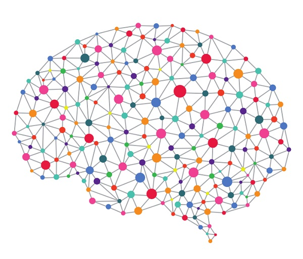

<h2> 16 Important Data Science Papers: </h2>

<ul>

<li><b><a target="_blank" href="https://github.com/manjunath5496/Data-Science-Study-Materials/blob/master/pg(1).pdf" style="text-decoration:none;">Top 10 algorithms in data mining</a></b></li>     
     
  <li><b><a target="_blank" href="https://github.com/manjunath5496/Data-Science-Study-Materials/blob/master/pg(2).pdf" style="text-decoration:none;">MapReduce: Simplified Data Processing on Large Clusters</a></b></li>

  <li><b><a target="_blank" href="https://github.com/manjunath5496/Data-Science-Study-Materials/blob/master/pg(3).pdf" style="text-decoration:none;">The Google File System</a></b></li>   
  
<li><b><a target="_blank" href="https://github.com/manjunath5496/Data-Science-Study-Materials/blob/master/pg(4).pdf" style="text-decoration:none;">Bigtable: A Distributed Storage System for Structured Data</a></b></li>   
   
 <li><b><a target="_blank" href="https://github.com/manjunath5496/Data-Science-Study-Materials/blob/master/pg(5).pdf" style="text-decoration:none;">The PageRank Citation Ranking: Bringing Order to the Web</a></b></li>     
     
  <li><b><a target="_blank" href="https://github.com/manjunath5496/Data-Science-Study-Materials/blob/master/pg(6).pdf" style="text-decoration:none;">Dynamo: Amazon's Highly Available Key-value Store</a></b></li>

  <li><b><a target="_blank" href="https://github.com/manjunath5496/Data-Science-Study-Materials/blob/master/pg(7).pdf" style="text-decoration:none;">A Few Useful Things to Know about Machine Learning</a></b></li>   
  
  <li><b><a target="_blank" href="https://github.com/manjunath5496/Data-Science-Study-Materials/blob/master/pg(8).pdf" style="text-decoration:none;">Random Forests</a></b></li>
  
 <li><b><a target="_blank" href="https://github.com/manjunath5496/Data-Science-Study-Materials/blob/master/pg(31).pdf" style="text-decoration:none;">Spanner: Google's Globally Distributed Database</a></b></li>     
     
  <li><b><a target="_blank" href="https://github.com/manjunath5496/Data-Science-Study-Materials/blob/master/pg(32).pdf" style="text-decoration:none;">Pasting Small Votes for Classification in Large Databases and On-Line</a></b></li>

  <li><b><a target="_blank" href="https://github.com/manjunath5496/Data-Science-Study-Materials/blob/master/pg(33).pdf" style="text-decoration:none;">Map-Reduce for Machine Learning on Multicore</a></b></li>   
  
  <li><b><a target="_blank" href="https://github.com/manjunath5496/Data-Science-Study-Materials/blob/master/pg(34).pdf" style="text-decoration:none;">Megastore: Providing Scalable, Highly Available Storage for Interactive Services</a></b></li>  
  
 
 <li><b><a target="_blank" href="https://github.com/manjunath5496/Data-Science-Study-Materials/blob/master/pg(35).pdf" style="text-decoration:none;">F1: A Distributed SQL Database That Scales</a></b></li>     
     
  <li><b><a target="_blank" href="https://github.com/manjunath5496/Data-Science-Study-Materials/blob/master/pg(36).pdf" style="text-decoration:none;">A Relational Model of Data for Large Shared Data Banks</a></b></li>

  <li><b><a target="_blank" href="https://github.com/manjunath5496/Data-Science-Study-Materials/blob/master/pg(37).pdf" style="text-decoration:none;">Recursive Deep Models for Semantic Compositionality Over a Sentiment Treebank</a></b></li>   
  
  <li><b><a target="_blank" href="https://github.com/manjunath5496/Data-Science-Study-Materials/blob/master/pg(38).pdf" style="text-decoration:none;">A New Approach to Linear Filtering and Prediction Problems</a></b></li>  
      

</ul>

 

<h2> Machine Learning Formulas: </h2>

<ul>
 <li><b><a target="_blank" href="https://github.com/manjunath5496/Data-Science-Study-Materials/blob/master/pg(83).pdf" style="text-decoration:none;">140 Machine Learning Formulas</a></b></li>     
     
</ul>     
 

<h2> Best Reference Books - Database Concepts and System: </h2>

<ul>

<li><b><a target="_blank" href="https://github.com/manjunath5496/Data-Science-Study-Materials/blob/master/pg(110).pdf" style="text-decoration:none;">A Relational Model of Data for Large Shared Data Banks 
</a></b></li> 
<li><b><a target="_blank" href="https://github.com/manjunath5496/Data-Science-Study-Materials/blob/master/pg(111).pdf" style="text-decoration:none;">Codd's 12 Rules</a></b></li>
<li><b><a target="_blank" href="https://github.com/manjunath5496/Data-Science-Study-Materials/blob/master/pg(112).rar" style="text-decoration:none;">Relational Model for Database Management - Version 2 </a></b></li>

<li><b><a target="_blank" href="https://github.com/manjunath5496/Data-Science-Study-Materials/blob/master/pg(113).pdf" style="text-decoration:none;">An Introduction to Database Systems
</a></b></li> 
<li><b><a target="_blank" href="https://github.com/manjunath5496/Data-Science-Study-Materials/blob/master/pg(114).pdf" style="text-decoration:none;">An Introduction to Relational Database Theory</a></b></li>
<li><b><a target="_blank" href="https://github.com/manjunath5496/Data-Science-Study-Materials/blob/master/pg(115).pdf" style="text-decoration:none;">Database Management Systems Solutions Manual </a></b></li>

<li><b><a target="_blank" href="https://github.com/manjunath5496/Data-Science-Study-Materials/blob/master/pg(116).pdf" style="text-decoration:none;">Beginning Database Design
</a></b></li> 
<li><b><a target="_blank" href="https://github.com/manjunath5496/Data-Science-Study-Materials/blob/master/pg(117).pdf" style="text-decoration:none;">Time and Relational Theory: Temporal Databases in the Relational Model and SQL</a></b></li>
<li><b><a target="_blank" href="https://github.com/manjunath5496/Data-Science-Study-Materials/blob/master/pg(118).pdf" style="text-decoration:none;">Database System Concepts </a></b></li>

<li><b><a target="_blank" href="https://github.com/manjunath5496/Data-Science-Study-Materials/blob/master/pg(119).pdf" style="text-decoration:none;">Database Modeling and Design
</a></b></li> 
<li><b><a target="_blank" href="https://github.com/manjunath5496/Data-Science-Study-Materials/blob/master/pg(120).pdf" style="text-decoration:none;">Databases types and the relational model: The third manifesto</a></b></li>
<li><b><a target="_blank" href="https://github.com/manjunath5496/Data-Science-Study-Materials/blob/master/pg(121).pdf" style="text-decoration:none;">Foundations of Databases </a></b></li>

<li><b><a target="_blank" href="https://github.com/manjunath5496/Data-Science-Study-Materials/blob/master/pg(122).pdf" style="text-decoration:none;">Schaum's Outline of Fundamentals of Relational Databases
</a></b></li> 
<li><b><a target="_blank" href="https://github.com/manjunath5496/Data-Science-Study-Materials/blob/master/pg(123).pdf" style="text-decoration:none;">Fundamentals of Relational Database Management Systems</a></b></li>
<li><b><a target="_blank" href="https://github.com/manjunath5496/Data-Science-Study-Materials/blob/master/pg(124).pdf" style="text-decoration:none;">A First Course in Database Systems </a></b></li>
<li><b><a target="_blank" href="https://github.com/manjunath5496/Data-Science-Study-Materials/blob/master/pg(125).pdf" style="text-decoration:none;">SQL Clearly Explained</a></b></li>
<li><b><a target="_blank" href="https://github.com/manjunath5496/Data-Science-Study-Materials/blob/master/pg(126).pdf" style="text-decoration:none;">SQL and Relational Theory </a></b></li>
<li><b><a target="_blank" href="https://github.com/manjunath5496/Data-Science-Study-Materials/blob/master/pg(127).pdf" style="text-decoration:none;">Architecture of a Database System</a></b></li>

</ul>

 

<h2> Top 9 Data Science Algorithms: </h2>

<ul>

<li><b><a target="_blank" href="https://github.com/manjunath5496/Data-Science-Study-Materials/blob/master/pg(39).pdf" style="text-decoration:none;">Apriori algorithm</a></b></li>     
     
  <li><b><a target="_blank" href="https://github.com/manjunath5496/Data-Science-Study-Materials/blob/master/pg(40).pdf" style="text-decoration:none;">Artificial Neural Networks</a></b></li>

  <li><b><a target="_blank" href="https://github.com/manjunath5496/Data-Science-Study-Materials/blob/master/pg(41).pdf" style="text-decoration:none;">Decision Trees</a></b></li>   
  
<li><b><a target="_blank" href="https://github.com/manjunath5496/Data-Science-Study-Materials/blob/master/pg(42).pdf" style="text-decoration:none;">The k-means clustering algorithm</a></b></li>   
   
 <li><b><a target="_blank" href="https://github.com/manjunath5496/Data-Science-Study-Materials/blob/master/pg(43).pdf" style="text-decoration:none;">Linear Regression</a></b></li>     
     
  <li><b><a target="_blank" href="https://github.com/manjunath5496/Data-Science-Study-Materials/blob/master/pg(44).pdf" style="text-decoration:none;">Logistic Regression </a></b></li>

  <li><b><a target="_blank" href="https://github.com/manjunath5496/Data-Science-Study-Materials/blob/master/pg(45).pdf" style="text-decoration:none;">Principal components analysis</a></b></li>   
  
  <li><b><a target="_blank" href="https://github.com/manjunath5496/Data-Science-Study-Materials/blob/master/pg(46).pdf" style="text-decoration:none;">Recurrent Neural Networks</a></b></li>
  
 <li><b><a target="_blank" href="https://github.com/manjunath5496/Data-Science-Study-Materials/blob/master/pg(47).pdf" style="text-decoration:none;">Support Vector Machines</a></b></li>     
     

</ul>

 
<h2> Top 11 Data Structure Books: </h2>

<ul>

<li><b><a target="_blank" href="https://github.com/manjunath5496/Data-Science-Study-Materials/blob/master/pg(91).pdf" style="text-decoration:none;">Data Structures and Algorithms for Big Databases</a></b></li>     
     
  <li><b><a target="_blank" href="https://github.com/manjunath5496/Data-Science-Study-Materials/blob/master/pg(92).pdf" style="text-decoration:none;">Advanced Data Structures</a></b></li>

  <li><b><a target="_blank" href="https://github.com/manjunath5496/Data-Science-Study-Materials/blob/master/pg(93).pdf" style="text-decoration:none;">The Tomes of Delphi Algorithms and Data Structures</a></b></li>   
  
<li><b><a target="_blank" href="https://github.com/manjunath5496/Data-Science-Study-Materials/blob/master/pg(94).pdf" style="text-decoration:none;">Compressed Data Structures for Strings: On Searching and Extracting Strings from Compressed Textual Data</a></b></li>   
   
 <li><b><a target="_blank" href="https://github.com/manjunath5496/Data-Science-Study-Materials/blob/master/pg(95).pdf" style="text-decoration:none;">Problem Solving with Data Structures: A Multimedia Approach</a></b></li>     
     
  <li><b><a target="_blank" href="https://github.com/manjunath5496/Data-Science-Study-Materials/blob/master/pg(96).pdf" style="text-decoration:none;">Data Structures and Algorithms for Game Developers  </a></b></li>

  <li><b><a target="_blank" href="https://github.com/manjunath5496/Data-Science-Study-Materials/blob/master/pg(97).pdf" style="text-decoration:none;">Data Structures Demystified </a></b></li>   
  
  <li><b><a target="_blank" href="https://github.com/manjunath5496/Data-Science-Study-Materials/blob/master/pg(98).pdf" style="text-decoration:none;">Data Structures & Algorithms</a></b></li>
  
 <li><b><a target="_blank" href="https://github.com/manjunath5496/Data-Science-Study-Materials/blob/master/pg(99).pdf" style="text-decoration:none;">Fundamentals of Data Structures</a></b></li>     
     
  
  <li><b><a target="_blank" href="https://github.com/manjunath5496/Data-Science-Study-Materials/blob/master/pg(100).pdf" style="text-decoration:none;">Genetic Programming: Theory and Practice II</a></b></li>
  
 <li><b><a target="_blank" href="https://github.com/manjunath5496/Data-Science-Study-Materials/blob/master/pg(101).pdf" style="text-decoration:none;">Sams Teach Yourself Data Structures and Algorithms in 24 Hours</a></b></li>  
      
 <li><b><a target="_blank" href="https://github.com/manjunath5496/Data-Science-Study-Materials/blob/master/pg(102).PDF" style="text-decoration:none;">Genetic Algorithms + Data Structures = Evolution Programs</a></b></li> 
</ul>

 
<h2> Books and articles about Flowcharts: </h2>

<ul>

<li><b><a target="_blank" href="https://github.com/manjunath5496/Data-Science-Study-Materials/blob/master/pg(103).pdf" style="text-decoration:none;">Introduction To Flowcharting</a></b></li>     
     
  <li><b><a target="_blank" href="https://github.com/manjunath5496/Data-Science-Study-Materials/blob/master/pg(104).pdf" style="text-decoration:none;">The Multiple Meanings of a Flowchart</a></b></li>

  <li><b><a target="_blank" href="https://github.com/manjunath5496/Data-Science-Study-Materials/blob/master/pg(105).pdf" style="text-decoration:none;">Understanding Algorithms and flowcharts</a></b></li>   
  
  <li><b><a target="_blank" href="https://github.com/manjunath5496/Data-Science-Study-Materials/blob/master/pg(106).pdf" style="text-decoration:none;">Flowchart</a></b></li> 
  
   <li><b><a target="_blank" href="https://github.com/manjunath5496/Data-Science-Study-Materials/blob/master/pg(107).pdf" style="text-decoration:none;">Flowcharting techniques</a></b></li>   
  
  <li><b><a target="_blank" href="https://github.com/manjunath5496/Data-Science-Study-Materials/blob/master/pg(108).pdf" style="text-decoration:none;">Standard ECMA-4: Flow Charts</a></b></li>  
  
  <li><b><a target="_blank" href="https://github.com/manjunath5496/Data-Science-Study-Materials/blob/master/pg(109).pdf" style="text-decoration:none;">Process Flow Documentation: A Flowchart Guide For Micro & Small Business</a></b></li>   
  
  </ul>

 
<h2> Lecture Notes: </h2>

<ul>
<li>Introduction, linear classification, perceptron update rule (<a href="https://github.com/manjunath5496/Data-Science-Study-Materials/blob/master/lec1.pdf">PDF</a>)</li>
<li>Perceptron convergence, generalization (<a href="https://github.com/manjunath5496/Data-Science-Study-Materials/blob/master/lec2.pdf">PDF</a>)</li>
<li>Maximum margin classification (<a href="https://github.com/manjunath5496/Data-Science-Study-Materials/blob/master/lec3.pdf">PDF</a>)</li>
<li>Classification errors, regularization, logistic regression (<a href="https://github.com/manjunath5496/Data-Science-Study-Materials/blob/master/lec4.pdf">PDF</a>)</li>
<li>Linear regression, estimator bias and variance, active learning (<a href="https://github.com/manjunath5496/Data-Science-Study-Materials/blob/master/lec5.pdf">PDF</a>)</li>
<li>Active learning (cont.), non-linear predictions, kernals (<a href="https://github.com/manjunath5496/Data-Science-Study-Materials/blob/master/lec6.pdf">PDF</a>)</li>
<li>Kernal regression, kernels (<a href="https://github.com/manjunath5496/Data-Science-Study-Materials/blob/master/lec7.pdf">PDF</a>)</li>
<li>Support vector machine (SVM) and kernels, kernel optimization (<a href="https://github.com/manjunath5496/Data-Science-Study-Materials/blob/master/lec8.pdf">PDF</a>)</li>
<li>Model selection (<a href="https://github.com/manjunath5496/Data-Science-Study-Materials/blob/master/lec9.pdf">PDF</a>)</li>
<li>Model selection criteria (<a href="https://github.com/manjunath5496/Data-Science-Study-Materials/blob/master/lec10.pdf">PDF</a>)</li>
<li>Description length, feature selection (<a href="https://github.com/manjunath5496/Data-Science-Study-Materials/blob/master/lec11.pdf">PDF</a>)</li>
<li>Combining classifiers, boosting (<a href="https://github.com/manjunath5496/Data-Science-Study-Materials/blob/master/lec12.pdf">PDF</a>)</li>
<li>Boosting, margin, and complexity (<a href="https://github.com/manjunath5496/Data-Science-Study-Materials/blob/master/lec13.pdf">PDF</a>)</li>
<li>Margin and generalization, mixture models (<a href="https://github.com/manjunath5496/Data-Science-Study-Materials/blob/master/lec14.pdf">PDF</a>)</li>
<li>Mixtures and the expectation maximization (EM) algorithm (<a href="https://github.com/manjunath5496/Data-Science-Study-Materials/blob/master/lec15.pdf">PDF</a>)</li>
<li>EM, regularization, clustering (<a href="https://github.com/manjunath5496/Data-Science-Study-Materials/blob/master/lec16.pdf">PDF</a>)</li>
<li>Clustering (<a href="https://github.com/manjunath5496/Data-Science-Study-Materials/blob/master/lec17.pdf">PDF</a>)</li>
<li>Spectral clustering, Markov models (<a href="https://github.com/manjunath5496/Data-Science-Study-Materials/blob/master/lec18.pdf">PDF</a>)</li>
<li>Hidden Markov models (HMMs) (<a href="https://github.com/manjunath5496/Data-Science-Study-Materials/blob/master/lec19.pdf">PDF</a>)</li>
<li>HMMs (cont.) (<a href="https://github.com/manjunath5496/Data-Science-Study-Materials/blob/master/lec20.pdf">PDF</a>)</li>
<li>Bayesian networks (<a href="https://github.com/manjunath5496/Data-Science-Study-Materials/blob/master/lec21.pdf">PDF</a>)</li>
<li>Learning Bayesian networks (<a href="https://github.com/manjunath5496/Data-Science-Study-Materials/blob/master/lec22.pdf">PDF</a>)</li>
<li>Probabilistic inference - Guest lecture on collaborative filtering (<a href="https://github.com/manjunath5496/Data-Science-Study-Materials/blob/master/lec23.pdf">PDF</a>)</li>
</ul>

 

<h2> Books: </h2>

<ul>
<li><b><a target="_blank" href="https://github.com/manjunath5496/Data-Science-Study-Materials/blob/master/dsi(1).pdf" style="text-decoration:none;">Hands-On Machine Learning with Scikit-Learn and TensorFlow</a></b></li>
   <li><b><a target="_blank" href="https://github.com/manjunath5496/Data-Science-Study-Materials/blob/master/pg(82).pdf" style="text-decoration:none;">Unstoppable Confidence: How to Use the Power of NLP to Be More Dynamic and Successful</a></b></li>  
        
<li><b><a target="_blank" href="https://github.com/manjunath5496/Data-Science-Study-Materials/blob/master/dsi(2).pdf" style="text-decoration:none;">Python for Finance</a></b></li>
                                <li><b><a target="_blank" href="https://github.com/manjunath5496/Data-Science-Study-Materials/blob/master/dsi(3).pdf" style="text-decoration:none;">Mining the Social Web</a></b></li>
 <li><b><a target="_blank" href="https://github.com/manjunath5496/Data-Science-Study-Materials/blob/master/dsi(4).pdf" style="text-decoration:none;">Deep Learning with Keras </a></b></li>                              
<li><b><a target="_blank" href="https://github.com/manjunath5496/Data-Science-Study-Materials/blob/master/dsi(5).pdf" style="text-decoration:none;">Agile Data Science </a></b></li>
                                
 <li><b><a target="_blank" href="https://github.com/manjunath5496/Data-Science-Study-Materials/blob/master/dsi(6).pdf" style="text-decoration:none;">Practical Statistics for Data Scientists</a></b></li>
                          
<li><b><a target="_blank" href="https://github.com/manjunath5496/Data-Science-Study-Materials/blob/master/dsi(7).pdf" style="text-decoration:none;">Python for Data Analysis</a></b></li>
                                <li><b><a target="_blank" href="https://github.com/manjunath5496/Data-Science-Study-Materials/blob/master/dsi(8).pdf" style="text-decoration:none;">Python: Deeper Insights into Machine Learning</a></b></li>
                                <li><b><a target="_blank" href="https://github.com/manjunath5496/Data-Science-Study-Materials/blob/master/dsi(9).pdf" style="text-decoration:none;">Bayesian Reasoning and Machine Learning</a></b></li>
                                
<li><b><a target="_blank" href="https://github.com/manjunath5496/Data-Science-Study-Materials/blob/master/dsi(10).pdf" style="text-decoration:none;">Applied Predictive Modeling</a></b></li>

<li><b><a target="_blank" href="https://github.com/manjunath5496/Data-Science-Study-Materials/blob/master/dsi(11).pdf" style="text-decoration:none;">Machine Learning in Python </a></b></li>
                                <li><b><a target="_blank" href="https://github.com/manjunath5496/Data-Science-Study-Materials/blob/master/dsi(12).pdf" style="text-decoration:none;">Machine Learning for the Web</a></b></li>
                               
<li><b><a target="_blank" href="https://github.com/manjunath5496/Data-Science-Study-Materials/blob/master/dsi(13).pdf" style="text-decoration:none;">The Elements of Statistical Learning</a></b></li>
                                <li><b><a target="_blank" href="https://github.com/manjunath5496/Data-Science-Study-Materials/blob/master/dsi(14).pdf" style="text-decoration:none;">Learning TensorFlow: A Guide to Building Deep Learning Systems</a></b></li>
                                <li><b><a target="_blank" href="https://github.com/manjunath5496/Data-Science-Study-Materials/blob/master/dsi(15).pdf" style="text-decoration:none;">Machine Learning for OpenCV</a></b></li>
 <li><b><a target="_blank" href="https://github.com/manjunath5496/Data-Science-Study-Materials/blob/master/dsi(16).pdf" style="text-decoration:none;">Principles of Data Science</a></b></li>                              
<li><b><a target="_blank" href="https://github.com/manjunath5496/Data-Science-Study-Materials/blob/master/dsi(17).pdf" style="text-decoration:none;">Hands-On Data Science and Python Machine Learning </a></b></li>
                                
 <li><b><a target="_blank" href="https://github.com/manjunath5496/Data-Science-Study-Materials/blob/master/dsi(18).pdf" style="text-decoration:none;">R Programming for Data Science</a></b></li>
                          
<li><b><a target="_blank" href="https://github.com/manjunath5496/Data-Science-Study-Materials/blob/master/dsi(19).pdf" style="text-decoration:none;">Machine Learning Algorithms</a></b></li>
                                <li><b><a target="_blank" href="https://github.com/manjunath5496/Data-Science-Study-Materials/blob/master/dsi(20).pdf" style="text-decoration:none;">Exploratory Data Analysis with R</a></b></li>
                                <li><b><a target="_blank" href="https://github.com/manjunath5496/Data-Science-Study-Materials/blob/master/dsi(21).pdf" style="text-decoration:none;">Reinforcement Learning: An Introduction</a></b></li>
                                
<li><b><a target="_blank" href="https://github.com/manjunath5496/Data-Science-Study-Materials/blob/master/dsi(22).pdf" style="text-decoration:none;">Information Science and Statistics</a></b></li>

<li><b><a target="_blank" href="https://github.com/manjunath5496/Data-Science-Study-Materials/blob/master/dsi(24).pdf" style="text-decoration:none;">An Introduction to Statistical Learning: with Applications in R </a></b></li>
                                <li><b><a target="_blank" href="https://github.com/manjunath5496/Data-Science-Study-Materials/blob/master/dsi(25).pdf" style="text-decoration:none;">Machine Learning in Action</a></b></li>
                               
<li><b><a target="_blank" href="https://github.com/manjunath5496/Data-Science-Study-Materials/blob/master/dsi(26).pdf" style="text-decoration:none;">Mastering Machine Learning with scikit-learn</a></b></li>
                                <li><b><a target="_blank" href="https://github.com/manjunath5496/Data-Science-Study-Materials/blob/master/dsi(27).pdf" style="text-decoration:none;">Building Machine Learning Systems with Python</a></b></li>
                                <li><b><a target="_blank" href="https://github.com/manjunath5496/Data-Science-Study-Materials/blob/master/dsi(28).pdf" style="text-decoration:none;">The Art of Data Science: A Guide for Anyone Who Works with Data</a></b></li>
 <li><b><a target="_blank" href="https://github.com/manjunath5496/Data-Science-Study-Materials/blob/master/dsi(29).pdf" style="text-decoration:none;">Deep Learning with TensorFlow </a></b></li>                              
<li><b><a target="_blank" href="https://github.com/manjunath5496/Data-Science-Study-Materials/blob/master/dsi(30).pdf" style="text-decoration:none;">Natural Language Processing with Python </a></b></li>
                                
 <li><b><a target="_blank" href="https://github.com/manjunath5496/Data-Science-Study-Materials/blob/master/dsi(31).pdf" style="text-decoration:none;">Python Data Science Essentials</a></b></li>
                          
<li><b><a target="_blank" href="https://github.com/manjunath5496/Data-Science-Study-Materials/blob/master/dsi(32).pdf" style="text-decoration:none;">Getting Started with TensorFlow</a></b></li>
                                <li><b><a target="_blank" href="https://github.com/manjunath5496/Data-Science-Study-Materials/blob/master/dsi(33).pdf" style="text-decoration:none;">R in a Nutshell</a></b></li>
                                <li><b><a target="_blank" href="https://github.com/manjunath5496/Data-Science-Study-Materials/blob/master/dsi(34).pdf" style="text-decoration:none;">Financial Signal Processing and Machine Learning </a></b></li>
                                
<li><b><a target="_blank" href="https://github.com/manjunath5496/Data-Science-Study-Materials/blob/master/dsi(35).pdf" style="text-decoration:none;">Programming Collective Intelligence</a></b></li>

<li><b><a target="_blank" href="https://github.com/manjunath5496/Data-Science-Study-Materials/blob/master/dsi(36).pdf" style="text-decoration:none;">Financial Risk Forecasting: The Theory and Practice of Forecasting Market Risk, with Implementation in R and Matlab </a></b></li>
                                <li><b><a target="_blank" href="https://github.com/manjunath5496/Data-Science-Study-Materials/blob/master/dsi(37).pdf" style="text-decoration:none;">Advanced Machine Learning with Python</a></b></li>
                               
<li><b><a target="_blank" href="https://github.com/manjunath5496/Data-Science-Study-Materials/blob/master/dsi(38).pdf" style="text-decoration:none;">Mining of Massive Datasets</a></b></li>
                                <li><b><a target="_blank" href="https://github.com/manjunath5496/Data-Science-Study-Materials/blob/master/dsi(39).pdf" style="text-decoration:none;">Forecasting: Principles and Practice</a></b></li>
                                <li><b><a target="_blank" href="https://github.com/manjunath5496/Data-Science-Study-Materials/blob/master/dsi(40).pdf" style="text-decoration:none;">Think Bayes: Bayesian Statistics Made Simple</a></b></li>
 <li><b><a target="_blank" href="https://github.com/manjunath5496/Data-Science-Study-Materials/blob/master/dsi(41).pdf" style="text-decoration:none;">Think Stats: Exploratory Data Analysis in Python </a></b></li>                              
<li><b><a target="_blank" href="https://github.com/manjunath5496/Data-Science-Study-Materials/blob/master/dsi(42).pdf" style="text-decoration:none;">The Elements of Data Analytic Style: A guide for people who want to analyze data </a></b></li>
                                
 <li><b><a target="_blank" href="https://github.com/manjunath5496/Data-Science-Study-Materials/blob/master/dsi(43).pdf" style="text-decoration:none;">Think Python: How to Think Like a Computer Scientist</a></b></li>
                          
<li><b><a target="_blank" href="https://github.com/manjunath5496/Data-Science-Study-Materials/blob/master/dsi(45).pdf" style="text-decoration:none;">Improving Processes With Statistical Models</a></b></li>
                                <li><b><a target="_blank" href="https://github.com/manjunath5496/Data-Science-Study-Materials/blob/master/dsi(46).pdf" style="text-decoration:none;">Interactive Data Visualization: The Age of "Look but don't Touch" is Over </a></b></li>
                                <li><b><a target="_blank" href="https://github.com/manjunath5496/Data-Science-Study-Materials/blob/master/dsi(47).pdf" style="text-decoration:none;">knitr Graphics Manual</a></b></li>
                                
<li><b><a target="_blank" href="https://github.com/manjunath5496/Data-Science-Study-Materials/blob/master/dsi(48).pdf" style="text-decoration:none;">knitr: A General-Purpose Tool for Dynamic Report Generation in R</a></b></li>

<li><b><a target="_blank" href="https://github.com/manjunath5496/Data-Science-Study-Materials/blob/master/dsi(49).pdf" style="text-decoration:none;">Learning from Solution Paths: An Approach to the Credit Assignment Problem </a></b></li>
                                <li><b><a target="_blank" href="https://github.com/manjunath5496/Data-Science-Study-Materials/blob/master/dsi(50).pdf" style="text-decoration:none;">Metrics That Matter: Creating custom analytics that quantify user behaviors and drive business practices</a></b></li>
                               
<li><b><a target="_blank" href="https://github.com/manjunath5496/Data-Science-Study-Materials/blob/master/dsi(51).pdf" style="text-decoration:none;">Big data: The next frontier for innovation, competition, and productivity</a></b></li>
                                <li><b><a target="_blank" href="https://github.com/manjunath5496/Data-Science-Study-Materials/blob/master/dsi(52).pdf" style="text-decoration:none;">Rise of the Machines</a></b></li>
                                <li><b><a target="_blank" href="https://github.com/manjunath5496/Data-Science-Study-Materials/blob/master/dsi(53).pdf" style="text-decoration:none;">Selecting a Visual Analytics Application</a></b></li>
 <li><b><a target="_blank" href="https://github.com/manjunath5496/Data-Science-Study-Materials/blob/master/dsi(54).pdf" style="text-decoration:none;">The Power of R and Visual Analytics </a></b></li>                              
<li><b><a target="_blank" href="https://github.com/manjunath5496/Data-Science-Study-Materials/blob/master/dsi(55).pdf" style="text-decoration:none;">Tidy Data </a></b></li>
                                
 <li><b><a target="_blank" href="https://github.com/manjunath5496/Data-Science-Study-Materials/blob/master/dsi(56).pdf" style="text-decoration:none;">Understanding Machine Learning: From Theory to Algorithms</a></b></li>
                          
<li><b><a target="_blank" href="https://github.com/manjunath5496/Data-Science-Study-Materials/blob/master/dsi(57).pdf" style="text-decoration:none;">Visual Analysis Best Practices: Simple Techniques for Making Every Data Visualization Useful and Beautiful</a></b></li>
                                <li><b><a target="_blank" href="https://github.com/manjunath5496/Data-Science-Study-Materials/blob/master/dsi(58).pdf" style="text-decoration:none;">Visualizing Complex Data with Embedded Plots</a></b></li>
                                <li><b><a target="_blank" href="https://github.com/manjunath5496/Data-Science-Study-Materials/blob/master/dsi(59).pdf" style="text-decoration:none;">Which chart or graph is right for you?</a></b></li>
                                
<li><b><a target="_blank" href="https://github.com/manjunath5496/Data-Science-Study-Materials/blob/master/dsi(60).pdf" style="text-decoration:none;">5 best practices for telling great stories with data and why it will make you a better analyst</a></b></li>

<li><b><a target="_blank" href="https://github.com/manjunath5496/Data-Science-Study-Materials/blob/master/dsi(61).pdf" style="text-decoration:none;">The Field Guide to Data Science </a></b></li>
                                <li><b><a target="_blank" href="https://github.com/manjunath5496/Data-Science-Study-Materials/blob/master/dsi(62).pdf" style="text-decoration:none;">A Course in Machine Learning</a></b></li>
                               
<li><b><a target="_blank" href="https://github.com/manjunath5496/Data-Science-Study-Materials/blob/master/dsi(63).pdf" style="text-decoration:none;">An Interactive Framework for Data Cleaning</a></b></li>
                                <li><b><a target="_blank" href="https://github.com/manjunath5496/Data-Science-Study-Materials/blob/master/dsi(64).pdf" style="text-decoration:none;">Analyzing the Analyzers: An Introspective Survey of Data Scientists and Their Work</a></b></li>
                                <li><b><a target="_blank" href="https://github.com/manjunath5496/Data-Science-Study-Materials/blob/master/dsi(65).pdf" style="text-decoration:none;">Consistency Tradeoffs in Modern Distributed Database System Design</a></b></li>
                           
<li><b><a target="_blank" href="https://github.com/manjunath5496/Data-Science-Study-Materials/blob/master/dsi(68).pdf" style="text-decoration:none;">Introduction to Machine Learning with Python </a></b></li>
                                
 <li><b><a target="_blank" href="https://github.com/manjunath5496/Data-Science-Study-Materials/blob/master/dsi(69).pdf" style="text-decoration:none;">Mastering Predictive Analytics with R</a></b></li>
                          
<li><b><a target="_blank" href="https://github.com/manjunath5496/Data-Science-Study-Materials/blob/master/dsi(70).pdf" style="text-decoration:none;">Doing Data Science</a></b></li>
                                <li><b><a target="_blank" href="https://github.com/manjunath5496/Data-Science-Study-Materials/blob/master/dsi(71).pdf" style="text-decoration:none;">Linear Algebra Review and Reference</a></b></li>
                                <li><b><a target="_blank" href="https://github.com/manjunath5496/Data-Science-Study-Materials/blob/master/dsi(72).pdf" style="text-decoration:none;">Artificial Intelligence: A Modern Approach</a></b></li>
                                
<li><b><a target="_blank" href="https://github.com/manjunath5496/Data-Science-Study-Materials/blob/master/dsi(73).pdf" style="text-decoration:none;">Encyclopedia of Machine Learning and Data Mining</a></b></li>

<li><b><a target="_blank" href="https://github.com/manjunath5496/Data-Science-Study-Materials/blob/master/dsi(74).pdf" style="text-decoration:none;">Python Machine Learning Blueprints </a></b></li>
                                <li><b><a target="_blank" href="https://github.com/manjunath5496/Data-Science-Study-Materials/blob/master/dsi(75).pdf" style="text-decoration:none;">Machine Learning</a></b></li>
                               

<li><b><a target="_blank" href="https://github.com/manjunath5496/Data-Science-Study-Materials/blob/master/dsi(76).rar" style="text-decoration:none;">Statistical Techniques in Business and Economics </a></b></li>
                                <li><b><a target="_blank" href="https://github.com/manjunath5496/Data-Science-Study-Materials/blob/master/dsi(77).pdf" style="text-decoration:none;">Categorical Data Analysis</a></b></li>

<li><b><a target="_blank" href="https://github.com/manjunath5496/Data-Science-Study-Materials/blob/master/dsi(78).pdf" style="text-decoration:none;">Thoughtful Machine Learning with Python</a></b></li>
                                <li><b><a target="_blank" href="https://github.com/manjunath5496/Data-Science-Study-Materials/blob/master/dsi(79).pdf" style="text-decoration:none;">Deep Learning: A Practitioner's Approach</a></b></li>
                                
<li><b><a target="_blank" href="https://github.com/manjunath5496/Data-Science-Study-Materials/blob/master/dsi(80).pdf" style="text-decoration:none;">Data Science with Java</a></b></li>

<li><b><a target="_blank" href="https://github.com/manjunath5496/Data-Science-Study-Materials/blob/master/dsi(81).pdf" style="text-decoration:none;">Python Data Science Handbook: Essential Tools for Working with Data </a></b></li>
                                <li><b><a target="_blank" href="https://github.com/manjunath5496/Data-Science-Study-Materials/blob/master/dsi(82).pdf" style="text-decoration:none;">R Deep Learning Essentials</a></b></li>
                               

<li><b><a target="_blank" href="https://github.com/manjunath5496/Data-Science-Study-Materials/blob/master/dsi(83).pdf" style="text-decoration:none;">Storytelling with Data: A Data Visualization Guide for Business Professionals </a></b></li>
                                <li><b><a target="_blank" href="https://github.com/manjunath5496/Data-Science-Study-Materials/blob/master/dsi(23).pdf" style="text-decoration:none;">Data Science from Scratch</a></b></li>

  <li><b><a target="_blank" href="https://github.com/manjunath5496/Data-Science-Study-Materials/blob/master/dsi(44).pdf" style="text-decoration:none;">Data Science For Dummies</a></b></li>

   <li><b><a target="_blank" href="https://github.com/manjunath5496/Data-Science-Study-Materials/blob/master/dsi(66).pdf" style="text-decoration:none;">Practical Python AI Projects</a></b></li>

  <li><b><a target="_blank" href="https://github.com/manjunath5496/Data-Science-Study-Materials/blob/master/dsi(67).pdf" style="text-decoration:none;">Fundamentals of Deep Learning</a></b></li>

 <li><b><a target="_blank" href="https://github.com/manjunath5496/Data-Science-Study-Materials/blob/master/dsi(84).pdf" style="text-decoration:none;">Pattern Recognition and Machine Learning</a></b></li>

  <li><b><a target="_blank" href="https://github.com/manjunath5496/Data-Science-Study-Materials/blob/master/dsi(85).pdf" style="text-decoration:none;">Building Data Science Teams</a></b></li>

   <li><b><a target="_blank" href="https://github.com/manjunath5496/Data-Science-Study-Materials/blob/master/dsi(86).pdf" style="text-decoration:none;">naked statistics: Stripping the Dread from the Data</a></b></li>

  <li><b><a target="_blank" href="https://github.com/manjunath5496/Data-Science-Study-Materials/blob/master/dsi(87).pdf" style="text-decoration:none;">Data Jujitsu</a></b></li>
   <li><b><a target="_blank" href="https://github.com/manjunath5496/Data-Science-Study-Materials/blob/master/dsi(88).pdf" style="text-decoration:none;">Computer Age Statistical Inference: Algorithms, Evidence, and Data Science</a></b></li>

   <li><b><a target="_blank" href="https://github.com/manjunath5496/Data-Science-Study-Materials/blob/master/dsi(89).pdf" style="text-decoration:none;">Modeling with Data</a></b></li>

  <li><b><a target="_blank" href="https://github.com/manjunath5496/Data-Science-Study-Materials/blob/master/dsi(90).pdf" style="text-decoration:none;">Data Mining and Analysis: Fundamental Concepts and Algorithms</a></b></li>  
  
  
<li><b><a target="_blank" href="https://github.com/manjunath5496/Data-Science-Study-Materials/blob/master/dsi(91).pdf" style="text-decoration:none;">A Brief Introduction to Machine Learning for Engineers</a></b></li>
                                <li><b><a target="_blank" href="https://github.com/manjunath5496/Data-Science-Study-Materials/blob/master/dsi(92).pdf" style="text-decoration:none;">Types of Machine Learning Algorithms</a></b></li>
                               
 <li><b><a target="_blank" href="https://github.com/manjunath5496/Data-Science-Study-Materials/blob/master/dsi(94).pdf" style="text-decoration:none;">Machine Learning: Basic Concepts </a></b></li>                              
<li><b><a target="_blank" href="https://github.com/manjunath5496/Data-Science-Study-Materials/blob/master/dsi(95).pdf" style="text-decoration:none;">Deep Learning Tutorial </a></b></li>
                                
 <li><b><a target="_blank" href="https://github.com/manjunath5496/Data-Science-Study-Materials/blob/master/dsi(96).pdf" style="text-decoration:none;">Machine Learning Algorithms: A Review</a></b></li>
                          
<li><b><a target="_blank" href="https://github.com/manjunath5496/Data-Science-Study-Materials/blob/master/dsi(97).pdf" style="text-decoration:none;">Machine Learning Tutorial</a></b></li>
                                <li><b><a target="_blank" href="https://github.com/manjunath5496/Data-Science-Study-Materials/blob/master/dsi(98).pdf" style="text-decoration:none;">Demystifying Machine Learning</a></b></li>
                                <li><b><a target="_blank" href="https://github.com/manjunath5496/Data-Science-Study-Materials/blob/master/dsi(99).pdf" style="text-decoration:none;">A Brief Introduction to Neural Networks</a></b></li>
                                
<li><b><a target="_blank" href="https://github.com/manjunath5496/Data-Science-Study-Materials/blob/master/dsi(100).pdf" style="text-decoration:none;">Machine Learning Algorithms for Classification</a></b></li>

<li><b><a target="_blank" href="https://github.com/manjunath5496/Data-Science-Study-Materials/blob/master/dsi(101).pdf" style="text-decoration:none;">Machine Learning For Dummies </a></b></li>
                                <li><b><a target="_blank" href="https://github.com/manjunath5496/Data-Science-Study-Materials/blob/master/dsi(102).pdf" style="text-decoration:none;">Introduction to Probability (LECTURE NOTES)</a></b></li>
                               
<li><b><a target="_blank" href="https://github.com/manjunath5496/Data-Science-Study-Materials/blob/master/dsi(103).pdf" style="text-decoration:none;">The Master Algorithm</a></b></li>
                                <li><b><a target="_blank" href="https://github.com/manjunath5496/Data-Science-Study-Materials/blob/master/dsi(104).pdf" style="text-decoration:none;">An Introduction to Probability Theory and its Applications</a></b></li>
                                <li><b><a target="_blank" href="https://github.com/manjunath5496/Data-Science-Study-Materials/blob/master/dsi(105).pdf" style="text-decoration:none;">Foundations of Statistical Natural Language Processing</a></b></li>
 <li><b><a target="_blank" href="https://github.com/manjunath5496/Data-Science-Study-Materials/blob/master/dsi(106).pdf" style="text-decoration:none;">A general reinforcement learning algorithm that masters chess, shogi, and Go through self-play</a></b></li>                              
<li><b><a target="_blank" href="https://github.com/manjunath5496/Data-Science-Study-Materials/blob/master/dsi(107).pdf" style="text-decoration:none;">A Polynomial-time Nash Equilibrium Algorithm for Repeated Games </a></b></li>
                                
 <li><b><a target="_blank" href="https://github.com/manjunath5496/Data-Science-Study-Materials/blob/master/dsi(108).pdf" style="text-decoration:none;">Algorithms for Reinforcement Learning</a></b></li>
                          
<li><b><a target="_blank" href="https://github.com/manjunath5496/Data-Science-Study-Materials/blob/master/dsi(109).pdf" style="text-decoration:none;">An Analysis of Temporal-Difference Learning with Function Approximation</a></b></li>
                                <li><b><a target="_blank" href="https://github.com/manjunath5496/Data-Science-Study-Materials/blob/master/dsi(110).pdf" style="text-decoration:none;">Between MDPs and semi-MDPs: A framework for temporal abstraction in reinforcement learning</a></b></li>
                                <li><b><a target="_blank" href="https://github.com/manjunath5496/Data-Science-Study-Materials/blob/master/dsi(111).pdf" style="text-decoration:none;">Building Machines that Learn and Think for Themselves: Commentary on Lake, Ullman, Tenenbaum, and Gershman, Behavioral and Brain Sciences, 2017</a></b></li>
                                
<li><b><a target="_blank" href="https://github.com/manjunath5496/Data-Science-Study-Materials/blob/master/dsi(112).pdf" style="text-decoration:none;">Computational Learning Theory </a></b></li>

<li><b><a target="_blank" href="https://github.com/manjunath5496/Data-Science-Study-Materials/blob/master/dsi(113).pdf" style="text-decoration:none;">Curiosity-driven Exploration by Self-supervised Prediction </a></b></li>
                                <li><b><a target="_blank" href="https://github.com/manjunath5496/Data-Science-Study-Materials/blob/master/dsi(114).pdf" style="text-decoration:none;">Curious model-building control systems</a></b></li>
                               
<li><b><a target="_blank" href="https://github.com/manjunath5496/Data-Science-Study-Materials/blob/master/dsi(115).pdf" style="text-decoration:none;">Deep Learning for Reward Design to Improve Monte Carlo Tree Search in ATARI Games</a></b></li>
                                <li><b><a target="_blank" href="https://github.com/manjunath5496/Data-Science-Study-Materials/blob/master/dsi(116).pdf" style="text-decoration:none;">Deep Recurrent Q-Learning for Partially Observable MDPs</a></b></li>
                                <li><b><a target="_blank" href="https://github.com/manjunath5496/Data-Science-Study-Materials/blob/master/dsi(117).pdf" style="text-decoration:none;">DeepMDP: Learning Continuous Latent Space Models
for Representation Learning</a></b></li>
 <li><b><a target="_blank" href="https://github.com/manjunath5496/Data-Science-Study-Materials/blob/master/dsi(118).pdf" style="text-decoration:none;">DeepMimic: Example-Guided Deep Reinforcement Learning
of Physics-Based Character Skills </a></b></li>                              
<li><b><a target="_blank" href="https://github.com/manjunath5496/Data-Science-Study-Materials/blob/master/dsi(119).pdf" style="text-decoration:none;">A survey of dimension reduction techniques </a></b></li>
                                
 <li><b><a target="_blank" href="https://github.com/manjunath5496/Data-Science-Study-Materials/blob/master/dsi(120).pdf" style="text-decoration:none;">Efficiency and Computational Limitations of Learning Algorithms</a></b></li>
                          
<li><b><a target="_blank" href="https://github.com/manjunath5496/Data-Science-Study-Materials/blob/master/dsi(121).pdf" style="text-decoration:none;">Episodic Curiosity through Reachability</a></b></li>
                                <li><b><a target="_blank" href="https://github.com/manjunath5496/Data-Science-Study-Materials/blob/master/dsi(122).pdf" style="text-decoration:none;">10703 Deep Reinforcement Learning and Control</a></b></li>
                                <li><b><a target="_blank" href="https://github.com/manjunath5496/Data-Science-Study-Materials/blob/master/dsi(123).pdf" style="text-decoration:none;">Friend-or-Foe Q-learning in General-Sum Games </a></b></li>
                                
<li><b><a target="_blank" href="https://github.com/manjunath5496/Data-Science-Study-Materials/blob/master/dsi(124).pdf" style="text-decoration:none;">Gaussian Processes for Machine Learning</a></b></li>

<li><b><a target="_blank" href="https://github.com/manjunath5496/Data-Science-Study-Materials/blob/master/dsi(125).pdf" style="text-decoration:none;">An introduction to information theory and entropy </a></b></li>
                                <li><b><a target="_blank" href="https://github.com/manjunath5496/Data-Science-Study-Materials/blob/master/dsi(126).pdf" style="text-decoration:none;">Independent Component Analysis: Algorithms and Applications</a></b></li>
                               
<li><b><a target="_blank" href="https://github.com/manjunath5496/Data-Science-Study-Materials/blob/master/dsi(127).pdf" style="text-decoration:none;">Making RL practical</a></b></li>
                                <li><b><a target="_blank" href="https://github.com/manjunath5496/Data-Science-Study-Materials/blob/master/dsi(128).pdf" style="text-decoration:none;">Markov games as a framework for multi-agent reinforcement learning</a></b></li>
                                <li><b><a target="_blank" href="https://github.com/manjunath5496/Data-Science-Study-Materials/blob/master/dsi(129).pdf" style="text-decoration:none;">Mastering Chess and Shogi by Self-Play with a
General Reinforcement Learning Algorithm</a></b></li>
 <li><b><a target="_blank" href="https://github.com/manjunath5496/Data-Science-Study-Materials/blob/master/dsi(130).pdf" style="text-decoration:none;">Mastering the Game of Go without Human Knowledge </a></b></li>                              
<li><b><a target="_blank" href="https://github.com/manjunath5496/Data-Science-Study-Materials/blob/master/dsi(131).pdf" style="text-decoration:none;">Monte-Carlo Tree Search: A New Framework for Game AI </a></b></li>
                                
 <li><b><a target="_blank" href="https://github.com/manjunath5496/Data-Science-Study-Materials/blob/master/dsi(132).pdf" style="text-decoration:none;">Near-Optimal Reinforcement Learning in Polynomial Time</a></b></li>
                          
<li><b><a target="_blank" href="https://github.com/manjunath5496/Data-Science-Study-Materials/blob/master/dsi(133).pdf" style="text-decoration:none;">Nonlinear Principal Component Analysis Using
Autoassociative Neural Networks</a></b></li>
                                <li><b><a target="_blank" href="https://github.com/manjunath5496/Data-Science-Study-Materials/blob/master/dsi(134).pdf" style="text-decoration:none;">Non-zero-sum Game Theory, Auctions and Negotiation </a></b></li>
                                <li><b><a target="_blank" href="https://github.com/manjunath5496/Data-Science-Study-Materials/blob/master/dsi(135).pdf" style="text-decoration:none;">PEGASUS: A policy search method for large MDPs and POMDPs</a></b></li>
                                
<li><b><a target="_blank" href="https://github.com/manjunath5496/Data-Science-Study-Materials/blob/master/dsi(136).pdf" style="text-decoration:none;">Playing Atari with Deep Reinforcement Learning</a></b></li>

<li><b><a target="_blank" href="https://github.com/manjunath5496/Data-Science-Study-Materials/blob/master/dsi(137).pdf" style="text-decoration:none;">Policy Gradient Methods for Reinforcement Learning with Function Approximation </a></b></li>
                                <li><b><a target="_blank" href="https://github.com/manjunath5496/Data-Science-Study-Materials/blob/master/dsi(138).pdf" style="text-decoration:none;">Prefrontal cortex as a meta-reinforcement learning system</a></b></li>
                               
<li><b><a target="_blank" href="https://github.com/manjunath5496/Data-Science-Study-Materials/blob/master/dsi(139).pdf" style="text-decoration:none;">Probability for Statistics and Machine Learning</a></b></li>
                                <li><b><a target="_blank" href="https://github.com/manjunath5496/Data-Science-Study-Materials/blob/master/dsi(140).pdf" style="text-decoration:none;">Proximal Policy Optimization Algorithms</a></b></li>
                                <li><b><a target="_blank" href="https://github.com/manjunath5496/Data-Science-Study-Materials/blob/master/dsi(141).pdf" style="text-decoration:none;">Regularization Paths for Generalized Linear Models via Coordinate Descent</a></b></li>
 <li><b><a target="_blank" href="https://github.com/manjunath5496/Data-Science-Study-Materials/blob/master/dsi(142).pdf" style="text-decoration:none;">Reinforcement Learning: A Tutorial Survey and Recent Advances </a></b></li>                              
<li><b><a target="_blank" href="https://github.com/manjunath5496/Data-Science-Study-Materials/blob/master/dsi(143).pdf" style="text-decoration:none;">Reinforcement Learning: An Introduction </a></b></li>
                                
 <li><b><a target="_blank" href="https://github.com/manjunath5496/Data-Science-Study-Materials/blob/master/dsi(144).pdf" style="text-decoration:none;">Reinforcement Learning: A Survey</a></b></li>
                          
<li><b><a target="_blank" href="https://github.com/manjunath5496/Data-Science-Study-Materials/blob/master/dsi(145).pdf" style="text-decoration:none;">Reinforcement Learning</a></b></li>
                                <li><b><a target="_blank" href="https://github.com/manjunath5496/Data-Science-Study-Materials/blob/master/dsi(146).pdf" style="text-decoration:none;">Reinforcement Learning for Long-Run Average Cost</a></b></li>
                                <li><b><a target="_blank" href="https://github.com/manjunath5496/Data-Science-Study-Materials/blob/master/dsi(147).pdf" style="text-decoration:none;">Solving Stochastic Games</a></b></li>
                                
<li><b><a target="_blank" href="https://github.com/manjunath5496/Data-Science-Study-Materials/blob/master/dsi(148).pdf" style="text-decoration:none;">Statistical Modeling: The Two Cultures</a></b></li>

<li><b><a target="_blank" href="https://github.com/manjunath5496/Data-Science-Study-Materials/blob/master/dsi(149).pdf" style="text-decoration:none;">Introduction to Game Theory: Stochastic Games </a></b></li>
                                <li><b><a target="_blank" href="https://github.com/manjunath5496/Data-Science-Study-Materials/blob/master/dsi(150).pdf" style="text-decoration:none;">Survey on Independent Component Analysis</a></b></li>
                               
<li><b><a target="_blank" href="https://github.com/manjunath5496/Data-Science-Study-Materials/blob/master/dsi(151).pdf" style="text-decoration:none;">Toward an AI Physicist for Unsupervised Learning</a></b></li>
                                <li><b><a target="_blank" href="https://github.com/manjunath5496/Data-Science-Study-Materials/blob/master/dsi(152).pdf" style="text-decoration:none;">Xception: Deep Learning with Depthwise Separable Convolutions</a></b></li>
                                <li><b><a target="_blank" href="https://github.com/manjunath5496/Data-Science-Study-Materials/blob/master/dsi(153).pdf" style="text-decoration:none;">Games with Hidden Information</a></b></li>
                           
<li><b><a target="_blank" href="https://github.com/manjunath5496/Data-Science-Study-Materials/blob/master/dsi(154).pdf" style="text-decoration:none;">Dynamic Routing Between Capsules </a></b></li>
                                
 <li><b><a target="_blank" href="https://github.com/manjunath5496/Data-Science-Study-Materials/blob/master/dsi(155).pdf" style="text-decoration:none;">Efficient BackProp</a></b></li>
                          
<li><b><a target="_blank" href="https://github.com/manjunath5496/Data-Science-Study-Materials/blob/master/dsi(156).pdf" style="text-decoration:none;">EfficientNet: Rethinking Model Scaling for Convolutional Neural Networks</a></b></li>
                                <li><b><a target="_blank" href="https://github.com/manjunath5496/Data-Science-Study-Materials/blob/master/dsi(157).pdf" style="text-decoration:none;">End-To-End Memory Networks</a></b></li>
                                <li><b><a target="_blank" href="https://github.com/manjunath5496/Data-Science-Study-Materials/blob/master/dsi(158).pdf" style="text-decoration:none;">Evaluation of Pooling Operations in Convolutional Architectures for Object Recognition</a></b></li>
                                
<li><b><a target="_blank" href="https://github.com/manjunath5496/Data-Science-Study-Materials/blob/master/dsi(159).pdf" style="text-decoration:none;">Exploring galaxy evolution with generative models</a></b></li>

<li><b><a target="_blank" href="https://github.com/manjunath5496/Data-Science-Study-Materials/blob/master/dsi(160).pdf" style="text-decoration:none;">Faster R-CNN: Towards Real-Time Object Detection with Region Proposal Networks </a></b></li>
                                <li><b><a target="_blank" href="https://github.com/manjunath5496/Data-Science-Study-Materials/blob/master/dsi(161).pdf" style="text-decoration:none;">FixingWeight Decay Regularization in Adam</a></b></li>
                               

<li><b><a target="_blank" href="https://github.com/manjunath5496/Data-Science-Study-Materials/blob/master/dsi(162).pdf" style="text-decoration:none;">FractalNet: Ultra-Deep Neural Networks without Residuals</a></b></li>
                                <li><b><a target="_blank" href="https://github.com/manjunath5496/Data-Science-Study-Materials/blob/master/dsi(163).pdf" style="text-decoration:none;">Generative Adversarial Nets</a></b></li>

<li><b><a target="_blank" href="https://github.com/manjunath5496/Data-Science-Study-Materials/blob/master/dsi(165).pdf" style="text-decoration:none;">Geometric deep learning: going beyond Euclidean data</a></b></li>
                                <li><b><a target="_blank" href="https://github.com/manjunath5496/Data-Science-Study-Materials/blob/master/dsi(166).pdf" style="text-decoration:none;">Going deeper with convolutions</a></b></li>
                                
<li><b><a target="_blank" href="https://github.com/manjunath5496/Data-Science-Study-Materials/blob/master/dsi(167).pdf" style="text-decoration:none;">Gradient-Based Learning Applied to Document Recognition</a></b></li>

<li><b><a target="_blank" href="https://github.com/manjunath5496/Data-Science-Study-Materials/blob/master/dsi(168).pdf" style="text-decoration:none;">Deep Residual Learning for Image Recognition </a></b></li>
                                <li><b><a target="_blank" href="https://github.com/manjunath5496/Data-Science-Study-Materials/blob/master/dsi(169).pdf" style="text-decoration:none;">"Neural" Computation of Decisions in Optimization Problems</a></b></li>
                               

<li><b><a target="_blank" href="https://github.com/manjunath5496/Data-Science-Study-Materials/blob/master/dsi(170).pdf" style="text-decoration:none;">How transferable are features in deep neural networks? </a></b></li>
                                <li><b><a target="_blank" href="https://github.com/manjunath5496/Data-Science-Study-Materials/blob/master/dsi(171).pdf" style="text-decoration:none;">ImageNet Classification with Deep Convolutional Neural Networks</a></b></li>

  <li><b><a target="_blank" href="https://github.com/manjunath5496/Data-Science-Study-Materials/blob/master/dsi(172).pdf" style="text-decoration:none;">Learning long-term dependencies with gradient descent is difficult</a></b></li>

   <li><b><a target="_blank" href="https://github.com/manjunath5496/Data-Science-Study-Materials/blob/master/dsi(173).pdf" style="text-decoration:none;">Learning to Predict the Cosmological Structure
Formation</a></b></li>

  <li><b><a target="_blank" href="https://github.com/manjunath5496/Data-Science-Study-Materials/blob/master/dsi(174).pdf" style="text-decoration:none;">Long short-term memory</a></b></li>

 <li><b><a target="_blank" href="https://github.com/manjunath5496/Data-Science-Study-Materials/blob/master/dsi(175).pdf" style="text-decoration:none;">Mastering the game of Go with deep neural networks and tree search</a></b></li>

  <li><b><a target="_blank" href="https://github.com/manjunath5496/Data-Science-Study-Materials/blob/master/dsi(176).pdf" style="text-decoration:none;">Mathematics of Deep Learning</a></b></li>

   <li><b><a target="_blank" href="https://github.com/manjunath5496/Data-Science-Study-Materials/blob/master/dsi(177).pdf" style="text-decoration:none;">Maxout Networks</a></b></li>

  <li><b><a target="_blank" href="https://github.com/manjunath5496/Data-Science-Study-Materials/blob/master/dsi(178).pdf" style="text-decoration:none;">Mixed precision training</a></b></li>
   <li><b><a target="_blank" href="https://github.com/manjunath5496/Data-Science-Study-Materials/blob/master/dsi(179).pdf" style="text-decoration:none;">MorphNet: Fast & Simple Resource-Constrained Structure Learning of Deep
Networks</a></b></li>

   <li><b><a target="_blank" href="https://github.com/manjunath5496/Data-Science-Study-Materials/blob/master/dsi(180).pdf" style="text-decoration:none;">Network In Network</a></b></li>

  <li><b><a target="_blank" href="https://github.com/manjunath5496/Data-Science-Study-Materials/blob/master/dsi(181).pdf" style="text-decoration:none;">Neural Architecture Search with Reinforcement Learning</a></b></li>     
  
  
 <li><b><a target="_blank" href="https://github.com/manjunath5496/Data-Science-Study-Materials/blob/master/dsi(182).pdf" style="text-decoration:none;">Neural Arithmetic Logic Units</a></b></li>

<li><b><a target="_blank" href="https://github.com/manjunath5496/Data-Science-Study-Materials/blob/master/dsi(183).pdf" style="text-decoration:none;">Neural Machine Translation by Jointly Learning to Align and Translate </a></b></li>
                                <li><b><a target="_blank" href="https://github.com/manjunath5496/Data-Science-Study-Materials/blob/master/dsi(184).pdf" style="text-decoration:none;">Neural Networks for Optimal Approximation of Smooth and Analytic Functions</a></b></li>
                               
<li><b><a target="_blank" href="https://github.com/manjunath5496/Data-Science-Study-Materials/blob/master/dsi(185).pdf" style="text-decoration:none;">Neural Ordinary Differential Equations</a></b></li>
                                <li><b><a target="_blank" href="https://github.com/manjunath5496/Data-Science-Study-Materials/blob/master/dsi(186).pdf" style="text-decoration:none;">Neuro-Dynamic Programming: An Overview</a></b></li>
                                <li><b><a target="_blank" href="https://github.com/manjunath5496/Data-Science-Study-Materials/blob/master/dsi(187).pdf" style="text-decoration:none;">Number detectors spontaneously emerge in a deep
neural network designed for visual object recognition</a></b></li>
                           
<li><b><a target="_blank" href="https://github.com/manjunath5496/Data-Science-Study-Materials/blob/master/dsi(188).pdf" style="text-decoration:none;">On the difficulty of training recurrent neural networks </a></b></li>
                                
 <li><b><a target="_blank" href="https://github.com/manjunath5496/Data-Science-Study-Materials/blob/master/dsi(189).pdf" style="text-decoration:none;">Piecewise Linear Multilayer Perceptrons and Dropout</a></b></li>
                          
<li><b><a target="_blank" href="https://github.com/manjunath5496/Data-Science-Study-Materials/blob/master/dsi(190).pdf" style="text-decoration:none;">Practical Recommendations for Gradient-Based Training of Deep
Architectures</a></b></li>
                                <li><b><a target="_blank" href="https://github.com/manjunath5496/Data-Science-Study-Materials/blob/master/dsi(191).pdf" style="text-decoration:none;">QuCumber: wavefunction reconstruction with neural
networks</a></b></li>
                                <li><b><a target="_blank" href="https://github.com/manjunath5496/Data-Science-Study-Materials/blob/master/dsi(192).pdf" style="text-decoration:none;">Rectified Linear Units Improve Restricted Boltzmann Machines</a></b></li>
                                
<li><b><a target="_blank" href="https://github.com/manjunath5496/Data-Science-Study-Materials/blob/master/dsi(193).pdf" style="text-decoration:none;">Representation Learning: A Review and New Perspectives</a></b></li>

<li><b><a target="_blank" href="https://github.com/manjunath5496/Data-Science-Study-Materials/blob/master/dsi(194).pdf" style="text-decoration:none;">Revisiting Unreasonable Effectiveness of Data in Deep Learning Era </a></b></li>
                                <li><b><a target="_blank" href="https://github.com/manjunath5496/Data-Science-Study-Materials/blob/master/dsi(195).pdf" style="text-decoration:none;">SegNet: A Deep Convolutional Encoder-Decoder Architecture for Image
Segmentation</a></b></li>
                               

<li><b><a target="_blank" href="https://github.com/manjunath5496/Data-Science-Study-Materials/blob/master/dsi(196).pdf" style="text-decoration:none;">Session-based Recommendations with Recurrent Neural Networks </a></b></li>
                                <li><b><a target="_blank" href="https://github.com/manjunath5496/Data-Science-Study-Materials/blob/master/dsi(197).pdf" style="text-decoration:none;"> SqueezeNet: AlexNet-level accuracy with 50x fewer parameters and <0.5MB model size</a></b></li>

<li><b><a target="_blank" href="https://github.com/manjunath5496/Data-Science-Study-Materials/blob/master/dsi(198).pdf" style="text-decoration:none;">SGDR: Stochastic Gradient Descent with Warm Restarts</a></b></li>
                                <li><b><a target="_blank" href="https://github.com/manjunath5496/Data-Science-Study-Materials/blob/master/dsi(199).pdf" style="text-decoration:none;">Tackling Climate Change with Machine Learning</a></b></li>
                                
<li><b><a target="_blank" href="https://github.com/manjunath5496/Data-Science-Study-Materials/blob/master/dsi(200).pdf" style="text-decoration:none;">The Matrix Calculus You Need For Deep Learning</a></b></li>

<li><b><a target="_blank" href="https://github.com/manjunath5496/Data-Science-Study-Materials/blob/master/dsi(81).pdf" style="text-decoration:none;">Python Data Science Handbook: Essential Tools for Working with Data </a></b></li>
                                <li><b><a target="_blank" href="https://github.com/manjunath5496/Data-Science-Study-Materials/blob/master/dsi(82).pdf" style="text-decoration:none;">R Deep Learning Essentials</a></b></li>
                               

<li><b><a target="_blank" href="https://github.com/manjunath5496/Data-Science-Study-Materials/blob/master/dsi(83).pdf" style="text-decoration:none;">Storytelling with Data: A Data Visualization Guide for Business Professionals </a></b></li>
                                <li><b><a target="_blank" href="https://github.com/manjunath5496/Data-Science-Study-Materials/blob/master/dsi(23).pdf" style="text-decoration:none;">Data Science from Scratch</a></b></li>

  <li><b><a target="_blank" href="https://github.com/manjunath5496/Data-Science-Study-Materials/blob/master/dsi(44).pdf" style="text-decoration:none;">Data Science For Dummies</a></b></li>

   <li><b><a target="_blank" href="https://github.com/manjunath5496/Data-Science-Study-Materials/blob/master/dsi(66).pdf" style="text-decoration:none;">Practical Python AI Projects</a></b></li>

  <li><b><a target="_blank" href="https://github.com/manjunath5496/Data-Science-Study-Materials/blob/master/dsi(67).pdf" style="text-decoration:none;">Fundamentals of Deep Learning</a></b></li>

 <li><b><a target="_blank" href="https://github.com/manjunath5496/Data-Science-Study-Materials/blob/master/dsi(84).pdf" style="text-decoration:none;">Pattern Recognition and Machine Learning</a></b></li>

  <li><b><a target="_blank" href="https://github.com/manjunath5496/Data-Science-Study-Materials/blob/master/dsi(85).pdf" style="text-decoration:none;">Building Data Science Teams</a></b></li>

   <li><b><a target="_blank" href="https://github.com/manjunath5496/Data-Science-Study-Materials/blob/master/dsi(86).pdf" style="text-decoration:none;">naked statistics: Stripping the Dread from the Data</a></b></li>

  <li><b><a target="_blank" href="https://github.com/manjunath5496/Data-Science-Study-Materials/blob/master/dsi(87).pdf" style="text-decoration:none;">Data Jujitsu</a></b></li>
   <li><b><a target="_blank" href="https://github.com/manjunath5496/Data-Science-Study-Materials/blob/master/dsi(88).pdf" style="text-decoration:none;">Computer Age Statistical Inference: Algorithms, Evidence, and Data Science</a></b></li>

   <li><b><a target="_blank" href="https://github.com/manjunath5496/Data-Science-Study-Materials/blob/master/dsi(89).pdf" style="text-decoration:none;">Modeling with Data</a></b></li>

  <li><b><a target="_blank" href="https://github.com/manjunath5496/Data-Science-Study-Materials/blob/master/dsi(90).pdf" style="text-decoration:none;">Data Mining and Analysis: Fundamental Concepts and Algorithms</a></b></li>  
  
  
<li><b><a target="_blank" href="https://github.com/manjunath5496/Data-Science-Study-Materials/blob/master/dsi(91).pdf" style="text-decoration:none;">A Brief Introduction to Machine Learning for Engineers</a></b></li>
                                <li><b><a target="_blank" href="https://github.com/manjunath5496/Data-Science-Study-Materials/blob/master/dsi(92).pdf" style="text-decoration:none;">Types of Machine Learning Algorithms</a></b></li>
                               
 <li><b><a target="_blank" href="https://github.com/manjunath5496/Data-Science-Study-Materials/blob/master/dsi(94).pdf" style="text-decoration:none;">Machine Learning: Basic Concepts </a></b></li>                              
<li><b><a target="_blank" href="https://github.com/manjunath5496/Data-Science-Study-Materials/blob/master/dsi(95).pdf" style="text-decoration:none;">Deep Learning Tutorial </a></b></li>
                                
 <li><b><a target="_blank" href="https://github.com/manjunath5496/Data-Science-Study-Materials/blob/master/dsi(96).pdf" style="text-decoration:none;">Machine Learning Algorithms: A Review</a></b></li>
                          
<li><b><a target="_blank" href="https://github.com/manjunath5496/Data-Science-Study-Materials/blob/master/dsi(97).pdf" style="text-decoration:none;">Machine Learning Tutorial</a></b></li>
                                <li><b><a target="_blank" href="https://github.com/manjunath5496/Data-Science-Study-Materials/blob/master/dsi(98).pdf" style="text-decoration:none;">Demystifying Machine Learning</a></b></li>
                                <li><b><a target="_blank" href="https://github.com/manjunath5496/Data-Science-Study-Materials/blob/master/dsi(99).pdf" style="text-decoration:none;">A Brief Introduction to Neural Networks</a></b></li>
                                
<li><b><a target="_blank" href="https://github.com/manjunath5496/Data-Science-Study-Materials/blob/master/dsi(100).pdf" style="text-decoration:none;">Machine Learning Algorithms for Classification</a></b></li>

<li><b><a target="_blank" href="https://github.com/manjunath5496/Data-Science-Study-Materials/blob/master/dsi(101).pdf" style="text-decoration:none;">Machine Learning For Dummies </a></b></li>
                                <li><b><a target="_blank" href="https://github.com/manjunath5496/Data-Science-Study-Materials/blob/master/dsi(102).pdf" style="text-decoration:none;">Introduction to Probability (LECTURE NOTES)</a></b></li>
                               
<li><b><a target="_blank" href="https://github.com/manjunath5496/Data-Science-Study-Materials/blob/master/dsi(103).pdf" style="text-decoration:none;">The Master Algorithm</a></b></li>
                                <li><b><a target="_blank" href="https://github.com/manjunath5496/Data-Science-Study-Materials/blob/master/dsi(104).pdf" style="text-decoration:none;">An Introduction to Probability Theory and its Applications</a></b></li>
                                <li><b><a target="_blank" href="https://github.com/manjunath5496/Data-Science-Study-Materials/blob/master/dsi(105).pdf" style="text-decoration:none;">Foundations of Statistical Natural Language Processing</a></b></li>
 <li><b><a target="_blank" href="https://github.com/manjunath5496/Data-Science-Study-Materials/blob/master/dsi(106).pdf" style="text-decoration:none;">A general reinforcement learning algorithm that masters chess, shogi, and Go through self-play</a></b></li>                              
<li><b><a target="_blank" href="https://github.com/manjunath5496/Data-Science-Study-Materials/blob/master/dsi(107).pdf" style="text-decoration:none;">A Polynomial-time Nash Equilibrium Algorithm for Repeated Games </a></b></li>
                                
 <li><b><a target="_blank" href="https://github.com/manjunath5496/Data-Science-Study-Materials/blob/master/dsi(108).pdf" style="text-decoration:none;">Algorithms for Reinforcement Learning</a></b></li>
                          
<li><b><a target="_blank" href="https://github.com/manjunath5496/Data-Science-Study-Materials/blob/master/dsi(109).pdf" style="text-decoration:none;">An Analysis of Temporal-Difference Learning with Function Approximation</a></b></li>
                                <li><b><a target="_blank" href="https://github.com/manjunath5496/Data-Science-Study-Materials/blob/master/dsi(110).pdf" style="text-decoration:none;">Between MDPs and semi-MDPs: A framework for temporal abstraction in reinforcement learning</a></b></li>
                                <li><b><a target="_blank" href="https://github.com/manjunath5496/Data-Science-Study-Materials/blob/master/dsi(111).pdf" style="text-decoration:none;">Building Machines that Learn and Think for Themselves: Commentary on Lake, Ullman, Tenenbaum, and Gershman, Behavioral and Brain Sciences, 2017</a></b></li>
                                
<li><b><a target="_blank" href="https://github.com/manjunath5496/Data-Science-Study-Materials/blob/master/dsi(112).pdf" style="text-decoration:none;">Computational Learning Theory </a></b></li>

<li><b><a target="_blank" href="https://github.com/manjunath5496/Data-Science-Study-Materials/blob/master/dsi(113).pdf" style="text-decoration:none;">Curiosity-driven Exploration by Self-supervised Prediction </a></b></li>
                                <li><b><a target="_blank" href="https://github.com/manjunath5496/Data-Science-Study-Materials/blob/master/dsi(114).pdf" style="text-decoration:none;">Curious model-building control systems</a></b></li>
                               
<li><b><a target="_blank" href="https://github.com/manjunath5496/Data-Science-Study-Materials/blob/master/dsi(115).pdf" style="text-decoration:none;">Deep Learning for Reward Design to Improve Monte Carlo Tree Search in ATARI Games</a></b></li>
                                <li><b><a target="_blank" href="https://github.com/manjunath5496/Data-Science-Study-Materials/blob/master/dsi(116).pdf" style="text-decoration:none;">Deep Recurrent Q-Learning for Partially Observable MDPs</a></b></li>
                                <li><b><a target="_blank" href="https://github.com/manjunath5496/Data-Science-Study-Materials/blob/master/dsi(117).pdf" style="text-decoration:none;">DeepMDP: Learning Continuous Latent Space Models
for Representation Learning</a></b></li>
 <li><b><a target="_blank" href="https://github.com/manjunath5496/Data-Science-Study-Materials/blob/master/dsi(118).pdf" style="text-decoration:none;">DeepMimic: Example-Guided Deep Reinforcement Learning
of Physics-Based Character Skills </a></b></li>                              
<li><b><a target="_blank" href="https://github.com/manjunath5496/Data-Science-Study-Materials/blob/master/dsi(119).pdf" style="text-decoration:none;">A survey of dimension reduction techniques </a></b></li>
                                
 <li><b><a target="_blank" href="https://github.com/manjunath5496/Data-Science-Study-Materials/blob/master/dsi(120).pdf" style="text-decoration:none;">Efficiency and Computational Limitations of Learning Algorithms</a></b></li>
                          
<li><b><a target="_blank" href="https://github.com/manjunath5496/Data-Science-Study-Materials/blob/master/dsi(121).pdf" style="text-decoration:none;">Episodic Curiosity through Reachability</a></b></li>
                                <li><b><a target="_blank" href="https://github.com/manjunath5496/Data-Science-Study-Materials/blob/master/dsi(122).pdf" style="text-decoration:none;">10703 Deep Reinforcement Learning and Control</a></b></li>
                                <li><b><a target="_blank" href="https://github.com/manjunath5496/Data-Science-Study-Materials/blob/master/dsi(123).pdf" style="text-decoration:none;">Friend-or-Foe Q-learning in General-Sum Games </a></b></li>
                                
<li><b><a target="_blank" href="https://github.com/manjunath5496/Data-Science-Study-Materials/blob/master/dsi(124).pdf" style="text-decoration:none;">Gaussian Processes for Machine Learning</a></b></li>

<li><b><a target="_blank" href="https://github.com/manjunath5496/Data-Science-Study-Materials/blob/master/dsi(125).pdf" style="text-decoration:none;">An introduction to information theory and entropy </a></b></li>
                                <li><b><a target="_blank" href="https://github.com/manjunath5496/Data-Science-Study-Materials/blob/master/dsi(126).pdf" style="text-decoration:none;">Independent Component Analysis: Algorithms and Applications</a></b></li>
                               
<li><b><a target="_blank" href="https://github.com/manjunath5496/Data-Science-Study-Materials/blob/master/dsi(127).pdf" style="text-decoration:none;">Making RL practical</a></b></li>
                                <li><b><a target="_blank" href="https://github.com/manjunath5496/Data-Science-Study-Materials/blob/master/dsi(128).pdf" style="text-decoration:none;">Markov games as a framework for multi-agent reinforcement learning</a></b></li>
                                <li><b><a target="_blank" href="https://github.com/manjunath5496/Data-Science-Study-Materials/blob/master/dsi(129).pdf" style="text-decoration:none;">Mastering Chess and Shogi by Self-Play with a
General Reinforcement Learning Algorithm</a></b></li>
 <li><b><a target="_blank" href="https://github.com/manjunath5496/Data-Science-Study-Materials/blob/master/dsi(130).pdf" style="text-decoration:none;">Mastering the Game of Go without Human Knowledge </a></b></li>                              
<li><b><a target="_blank" href="https://github.com/manjunath5496/Data-Science-Study-Materials/blob/master/dsi(131).pdf" style="text-decoration:none;">Monte-Carlo Tree Search: A New Framework for Game AI </a></b></li>
                                
 <li><b><a target="_blank" href="https://github.com/manjunath5496/Data-Science-Study-Materials/blob/master/dsi(132).pdf" style="text-decoration:none;">Near-Optimal Reinforcement Learning in Polynomial Time</a></b></li>
                          
<li><b><a target="_blank" href="https://github.com/manjunath5496/Data-Science-Study-Materials/blob/master/dsi(133).pdf" style="text-decoration:none;">Nonlinear Principal Component Analysis Using
Autoassociative Neural Networks</a></b></li>
                                <li><b><a target="_blank" href="https://github.com/manjunath5496/Data-Science-Study-Materials/blob/master/dsi(134).pdf" style="text-decoration:none;">Non-zero-sum Game Theory, Auctions and Negotiation </a></b></li>
                                <li><b><a target="_blank" href="https://github.com/manjunath5496/Data-Science-Study-Materials/blob/master/dsi(135).pdf" style="text-decoration:none;">PEGASUS: A policy search method for large MDPs and POMDPs</a></b></li>
                                
<li><b><a target="_blank" href="https://github.com/manjunath5496/Data-Science-Study-Materials/blob/master/dsi(136).pdf" style="text-decoration:none;">Playing Atari with Deep Reinforcement Learning</a></b></li>

<li><b><a target="_blank" href="https://github.com/manjunath5496/Data-Science-Study-Materials/blob/master/dsi(137).pdf" style="text-decoration:none;">Policy Gradient Methods for Reinforcement Learning with Function Approximation </a></b></li>
                                <li><b><a target="_blank" href="https://github.com/manjunath5496/Data-Science-Study-Materials/blob/master/dsi(138).pdf" style="text-decoration:none;">Prefrontal cortex as a meta-reinforcement learning system</a></b></li>
                               
<li><b><a target="_blank" href="https://github.com/manjunath5496/Data-Science-Study-Materials/blob/master/dsi(139).pdf" style="text-decoration:none;">Probability for Statistics and Machine Learning</a></b></li>
                                <li><b><a target="_blank" href="https://github.com/manjunath5496/Data-Science-Study-Materials/blob/master/dsi(140).pdf" style="text-decoration:none;">Proximal Policy Optimization Algorithms</a></b></li>
                                <li><b><a target="_blank" href="https://github.com/manjunath5496/Data-Science-Study-Materials/blob/master/dsi(141).pdf" style="text-decoration:none;">Regularization Paths for Generalized Linear Models via Coordinate Descent</a></b></li>
 <li><b><a target="_blank" href="https://github.com/manjunath5496/Data-Science-Study-Materials/blob/master/dsi(142).pdf" style="text-decoration:none;">Reinforcement Learning: A Tutorial Survey and Recent Advances </a></b></li>                              
<li><b><a target="_blank" href="https://github.com/manjunath5496/Data-Science-Study-Materials/blob/master/dsi(143).pdf" style="text-decoration:none;">Reinforcement Learning: An Introduction </a></b></li>
                                
 <li><b><a target="_blank" href="https://github.com/manjunath5496/Data-Science-Study-Materials/blob/master/dsi(144).pdf" style="text-decoration:none;">Reinforcement Learning: A Survey</a></b></li>
                          
<li><b><a target="_blank" href="https://github.com/manjunath5496/Data-Science-Study-Materials/blob/master/dsi(145).pdf" style="text-decoration:none;">Reinforcement Learning</a></b></li>
                                <li><b><a target="_blank" href="https://github.com/manjunath5496/Data-Science-Study-Materials/blob/master/dsi(146).pdf" style="text-decoration:none;">Reinforcement Learning for Long-Run Average Cost</a></b></li>
                                <li><b><a target="_blank" href="https://github.com/manjunath5496/Data-Science-Study-Materials/blob/master/dsi(147).pdf" style="text-decoration:none;">Solving Stochastic Games</a></b></li>
                                
<li><b><a target="_blank" href="https://github.com/manjunath5496/Data-Science-Study-Materials/blob/master/dsi(148).pdf" style="text-decoration:none;">Statistical Modeling: The Two Cultures</a></b></li>

<li><b><a target="_blank" href="https://github.com/manjunath5496/Data-Science-Study-Materials/blob/master/dsi(149).pdf" style="text-decoration:none;">Introduction to Game Theory: Stochastic Games </a></b></li>
                                <li><b><a target="_blank" href="https://github.com/manjunath5496/Data-Science-Study-Materials/blob/master/dsi(150).pdf" style="text-decoration:none;">Survey on Independent Component Analysis</a></b></li>
                               
<li><b><a target="_blank" href="https://github.com/manjunath5496/Data-Science-Study-Materials/blob/master/dsi(151).pdf" style="text-decoration:none;">Toward an AI Physicist for Unsupervised Learning</a></b></li>
                                <li><b><a target="_blank" href="https://github.com/manjunath5496/Data-Science-Study-Materials/blob/master/dsi(152).pdf" style="text-decoration:none;">Xception: Deep Learning with Depthwise Separable Convolutions</a></b></li>
                                <li><b><a target="_blank" href="https://github.com/manjunath5496/Data-Science-Study-Materials/blob/master/dsi(153).pdf" style="text-decoration:none;">Games with Hidden Information</a></b></li>
                           
<li><b><a target="_blank" href="https://github.com/manjunath5496/Data-Science-Study-Materials/blob/master/dsi(154).pdf" style="text-decoration:none;">Dynamic Routing Between Capsules </a></b></li>
                                
 <li><b><a target="_blank" href="https://github.com/manjunath5496/Data-Science-Study-Materials/blob/master/dsi(155).pdf" style="text-decoration:none;">Efficient BackProp</a></b></li>
                          
<li><b><a target="_blank" href="https://github.com/manjunath5496/Data-Science-Study-Materials/blob/master/dsi(156).pdf" style="text-decoration:none;">EfficientNet: Rethinking Model Scaling for Convolutional Neural Networks</a></b></li>
                                <li><b><a target="_blank" href="https://github.com/manjunath5496/Data-Science-Study-Materials/blob/master/dsi(157).pdf" style="text-decoration:none;">End-To-End Memory Networks</a></b></li>
                                <li><b><a target="_blank" href="https://github.com/manjunath5496/Data-Science-Study-Materials/blob/master/dsi(158).pdf" style="text-decoration:none;">Evaluation of Pooling Operations in Convolutional Architectures for Object Recognition</a></b></li>
                                
<li><b><a target="_blank" href="https://github.com/manjunath5496/Data-Science-Study-Materials/blob/master/dsi(159).pdf" style="text-decoration:none;">Exploring galaxy evolution with generative models</a></b></li>

<li><b><a target="_blank" href="https://github.com/manjunath5496/Data-Science-Study-Materials/blob/master/dsi(160).pdf" style="text-decoration:none;">Faster R-CNN: Towards Real-Time Object Detection with Region Proposal Networks </a></b></li>
                                <li><b><a target="_blank" href="https://github.com/manjunath5496/Data-Science-Study-Materials/blob/master/dsi(161).pdf" style="text-decoration:none;">FixingWeight Decay Regularization in Adam</a></b></li>
                               

<li><b><a target="_blank" href="https://github.com/manjunath5496/Data-Science-Study-Materials/blob/master/dsi(162).pdf" style="text-decoration:none;">FractalNet: Ultra-Deep Neural Networks without Residuals</a></b></li>
                                <li><b><a target="_blank" href="https://github.com/manjunath5496/Data-Science-Study-Materials/blob/master/dsi(163).pdf" style="text-decoration:none;">Generative Adversarial Nets</a></b></li>

<li><b><a target="_blank" href="https://github.com/manjunath5496/Data-Science-Study-Materials/blob/master/dsi(165).pdf" style="text-decoration:none;">Geometric deep learning: going beyond Euclidean data</a></b></li>
                                <li><b><a target="_blank" href="https://github.com/manjunath5496/Data-Science-Study-Materials/blob/master/dsi(166).pdf" style="text-decoration:none;">Going deeper with convolutions</a></b></li>
                                
<li><b><a target="_blank" href="https://github.com/manjunath5496/Data-Science-Study-Materials/blob/master/dsi(167).pdf" style="text-decoration:none;">Gradient-Based Learning Applied to Document Recognition</a></b></li>

<li><b><a target="_blank" href="https://github.com/manjunath5496/Data-Science-Study-Materials/blob/master/dsi(168).pdf" style="text-decoration:none;">Deep Residual Learning for Image Recognition </a></b></li>
                                <li><b><a target="_blank" href="https://github.com/manjunath5496/Data-Science-Study-Materials/blob/master/dsi(169).pdf" style="text-decoration:none;">"Neural" Computation of Decisions in Optimization Problems</a></b></li>
                               

<li><b><a target="_blank" href="https://github.com/manjunath5496/Data-Science-Study-Materials/blob/master/dsi(170).pdf" style="text-decoration:none;">How transferable are features in deep neural networks? </a></b></li>
                                <li><b><a target="_blank" href="https://github.com/manjunath5496/Data-Science-Study-Materials/blob/master/dsi(171).pdf" style="text-decoration:none;">ImageNet Classification with Deep Convolutional Neural Networks</a></b></li>

  <li><b><a target="_blank" href="https://github.com/manjunath5496/Data-Science-Study-Materials/blob/master/dsi(172).pdf" style="text-decoration:none;">Learning long-term dependencies with gradient descent is difficult</a></b></li>

   <li><b><a target="_blank" href="https://github.com/manjunath5496/Data-Science-Study-Materials/blob/master/dsi(173).pdf" style="text-decoration:none;">Learning to Predict the Cosmological Structure
Formation</a></b></li>

  <li><b><a target="_blank" href="https://github.com/manjunath5496/Data-Science-Study-Materials/blob/master/dsi(174).pdf" style="text-decoration:none;">Long short-term memory</a></b></li>

 <li><b><a target="_blank" href="https://github.com/manjunath5496/Data-Science-Study-Materials/blob/master/dsi(175).pdf" style="text-decoration:none;">Mastering the game of Go with deep neural networks and tree search</a></b></li>

  <li><b><a target="_blank" href="https://github.com/manjunath5496/Data-Science-Study-Materials/blob/master/dsi(176).pdf" style="text-decoration:none;">Mathematics of Deep Learning</a></b></li>

   <li><b><a target="_blank" href="https://github.com/manjunath5496/Data-Science-Study-Materials/blob/master/dsi(177).pdf" style="text-decoration:none;">Maxout Networks</a></b></li>

  <li><b><a target="_blank" href="https://github.com/manjunath5496/Data-Science-Study-Materials/blob/master/dsi(178).pdf" style="text-decoration:none;">Mixed precision training</a></b></li>
   <li><b><a target="_blank" href="https://github.com/manjunath5496/Data-Science-Study-Materials/blob/master/dsi(179).pdf" style="text-decoration:none;">MorphNet: Fast & Simple Resource-Constrained Structure Learning of Deep
Networks</a></b></li>

   <li><b><a target="_blank" href="https://github.com/manjunath5496/Data-Science-Study-Materials/blob/master/dsi(180).pdf" style="text-decoration:none;">Network In Network</a></b></li>

  <li><b><a target="_blank" href="https://github.com/manjunath5496/Data-Science-Study-Materials/blob/master/dsi(181).pdf" style="text-decoration:none;">Neural Architecture Search with Reinforcement Learning</a></b></li>     
  
  <li><b><a target="_blank" href="https://github.com/manjunath5496/Data-Science-Study-Materials/blob/master/dsi(182).pdf" style="text-decoration:none;">Neural Arithmetic Logic Units</a></b></li>

  <li><b><a target="_blank" href="https://github.com/manjunath5496/Data-Science-Study-Materials/blob/master/dsi(183).pdf" style="text-decoration:none;">Neural Machine Translation by Jointly Learning to Align and Translate</a></b></li>     
  
<li><b><a target="_blank" href="https://github.com/manjunath5496/Data-Science-Study-Materials/blob/master/dsi(184).pdf" style="text-decoration:none;">Neural Networks for Optimal Approximation of Smooth and Analytic Functions</a></b></li>

  <li><b><a target="_blank" href="https://github.com/manjunath5496/Data-Science-Study-Materials/blob/master/dsi(185).pdf" style="text-decoration:none;">Neural Ordinary Differential Equations</a></b></li>     
  
  <li><b><a target="_blank" href="https://github.com/manjunath5496/Data-Science-Study-Materials/blob/master/dsi(186).pdf" style="text-decoration:none;">Neuro-Dynamic Programming: An Overview</a></b></li>

  <li><b><a target="_blank" href="https://github.com/manjunath5496/Data-Science-Study-Materials/blob/master/dsi(187).pdf" style="text-decoration:none;">Number detectors spontaneously emerge in a deep
neural network designed for visual object recognition</a></b></li>     
     
  <li><b><a target="_blank" href="https://github.com/manjunath5496/Data-Science-Study-Materials/blob/master/dsi(188).pdf" style="text-decoration:none;">On the difficulty of training Recurrent Neural Networks</a></b></li>

  <li><b><a target="_blank" href="https://github.com/manjunath5496/Data-Science-Study-Materials/blob/master/dsi(189).pdf" style="text-decoration:none;">Piecewise Linear Multilayer Perceptrons and Dropout</a></b></li>     
         
   <li><b><a target="_blank" href="https://github.com/manjunath5496/Data-Science-Study-Materials/blob/master/dsi(190).pdf" style="text-decoration:none;">Practical Recommendations for Gradient-Based Training of Deep
Architectures</a></b></li>

  <li><b><a target="_blank" href="https://github.com/manjunath5496/Data-Science-Study-Materials/blob/master/dsi(191).pdf" style="text-decoration:none;">QuCumber: wavefunction reconstruction with neural networks</a></b></li>     
     
  <li><b><a target="_blank" href="https://github.com/manjunath5496/Data-Science-Study-Materials/blob/master/dsi(192).pdf" style="text-decoration:none;">Rectified Linear Units Improve Restricted Boltzmann Machines</a></b></li>

  <li><b><a target="_blank" href="https://github.com/manjunath5496/Data-Science-Study-Materials/blob/master/dsi(193).pdf" style="text-decoration:none;">Representation Learning: A Review and New Perspectives</a></b></li>   
  
  
  
 <li><b><a target="_blank" href="https://github.com/manjunath5496/Data-Science-Study-Materials/blob/master/dsi(194).pdf" style="text-decoration:none;">Revisiting Unreasonable Effectiveness of Data in Deep Learning Era</a></b></li>     
  
<li><b><a target="_blank" href="https://github.com/manjunath5496/Data-Science-Study-Materials/blob/master/dsi(195).pdf" style="text-decoration:none;">SegNet: A Deep Convolutional Encoder-Decoder Architecture for Image
Segmentation</a></b></li>

  <li><b><a target="_blank" href="https://github.com/manjunath5496/Data-Science-Study-Materials/blob/master/dsi(196).pdf" style="text-decoration:none;">Session-based Recommendations with Recurrent Neural Networks</a></b></li>     
  
  <li><b><a target="_blank" href="https://github.com/manjunath5496/Data-Science-Study-Materials/blob/master/dsi(197).pdf" style="text-decoration:none;">SqueezeNet: AlexNet-level accuracy with 50x fewer parameters and <0.5MB model size</a></b></li>

  <li><b><a target="_blank" href="https://github.com/manjunath5496/Data-Science-Study-Materials/blob/master/dsi(198).pdf" style="text-decoration:none;">SGDR: Stochastic Gradient Descent with Warm Restarts</a></b></li>     
     
  <li><b><a target="_blank" href="https://github.com/manjunath5496/Data-Science-Study-Materials/blob/master/dsi(199).pdf" style="text-decoration:none;">Tackling Climate Change with Machine Learning</a></b></li>

  <li><b><a target="_blank" href="https://github.com/manjunath5496/Data-Science-Study-Materials/blob/master/dsi(200).pdf" style="text-decoration:none;">The Matrix Calculus You Need For Deep Learning</a></b></li>     
         
   <li><b><a target="_blank" href="https://github.com/manjunath5496/Data-Science-Study-Materials/blob/master/dsi(201).pdf" style="text-decoration:none;">The power of deeper networks for expressing natural functions</a></b></li>

  <li><b><a target="_blank" href="https://github.com/manjunath5496/Data-Science-Study-Materials/blob/master/dsi(202).pdf" style="text-decoration:none;">TossingBot: Learning to Throw Arbitrary Objects
with Residual Physics</a></b></li>     
     
  <li><b><a target="_blank" href="https://github.com/manjunath5496/Data-Science-Study-Materials/blob/master/dsi(203).pdf" style="text-decoration:none;">Uncovering and Mitigating Algorithmic Bias through Learned Latent Structure</a></b></li>

  <li><b><a target="_blank" href="https://github.com/manjunath5496/Data-Science-Study-Materials/blob/master/dsi(204).pdf" style="text-decoration:none;">Understanding Convolutional Neural Networks with A
Mathematical Model</a></b></li>   
  
  
  <li><b><a target="_blank" href="https://github.com/manjunath5496/Data-Science-Study-Materials/blob/master/dsi(205).pdf" style="text-decoration:none;">Understanding deep learning requires rethinking generalization</a></b></li>

<li><b><a target="_blank" href="https://github.com/manjunath5496/Data-Science-Study-Materials/blob/master/dsi(206).pdf" style="text-decoration:none;">Understanding the difficulty of training deep feedforward neural networks </a></b></li>
                                <li><b><a target="_blank" href="https://github.com/manjunath5496/Data-Science-Study-Materials/blob/master/dsi(207).pdf" style="text-decoration:none;">Universal Approximation Bounds for Superpositions of a Sigmoidal Function</a></b></li>
                               

<li><b><a target="_blank" href="https://github.com/manjunath5496/Data-Science-Study-Materials/blob/master/dsi(208).pdf" style="text-decoration:none;">Universal Approximation using Radial-Basis-Function
Networks</a></b></li>
                                <li><b><a target="_blank" href="https://github.com/manjunath5496/Data-Science-Study-Materials/blob/master/dsi(209).pdf" style="text-decoration:none;">Unsupervised learning by competing hidden units</a></b></li>

<li><b><a target="_blank" href="https://github.com/manjunath5496/Data-Science-Study-Materials/blob/master/dsi(210).pdf" style="text-decoration:none;">Unsupervised word embeddings capture latent knowledge from materials science literature</a></b></li>
                                <li><b><a target="_blank" href="https://github.com/manjunath5496/Data-Science-Study-Materials/blob/master/dsi(211).pdf" style="text-decoration:none;">Very Deep Convolutional Networks for Large-Scale Image Recognition</a></b></li>
                                
<li><b><a target="_blank" href="https://github.com/manjunath5496/Data-Science-Study-Materials/blob/master/dsi(212).pdf" style="text-decoration:none;">Visualizing and Understanding Recurrent Networks</a></b></li>

<li><b><a target="_blank" href="https://github.com/manjunath5496/Data-Science-Study-Materials/blob/master/dsi(213).pdf" style="text-decoration:none;">Why does deep and cheap learning work so well? </a></b></li>
                                <li><b><a target="_blank" href="https://github.com/manjunath5496/Data-Science-Study-Materials/blob/master/dsi(214).pdf" style="text-decoration:none;">You Only Look Once: Unified, Real-Time Object Detection</a></b></li>
                               

<li><b><a target="_blank" href="https://github.com/manjunath5496/Data-Science-Study-Materials/blob/master/dsi(215).pdf" style="text-decoration:none;">A Closer Look at Memorization in Deep Networks </a></b></li>
                                <li><b><a target="_blank" href="https://github.com/manjunath5496/Data-Science-Study-Materials/blob/master/dsi(216).pdf" style="text-decoration:none;">A disciplined approach to neural network hyper-parameters: Part 1 -- learning rate, batch size, momentum, and weight decay</a></b></li>

  <li><b><a target="_blank" href="https://github.com/manjunath5496/Data-Science-Study-Materials/blob/master/dsi(217).pdf" style="text-decoration:none;">A fast learning algorithm for deep belief nets</a></b></li>

   <li><b><a target="_blank" href="https://github.com/manjunath5496/Data-Science-Study-Materials/blob/master/dsi(218).pdf" style="text-decoration:none;">A Neural Probabilistic Language Model</a></b></li>

  <li><b><a target="_blank" href="https://github.com/manjunath5496/Data-Science-Study-Materials/blob/master/dsi(219).pdf" style="text-decoration:none;">Regularized Evolution for Image Classifier Architecture Search</a></b></li>

 <li><b><a target="_blank" href="https://github.com/manjunath5496/Data-Science-Study-Materials/blob/master/dsi(220).pdf" style="text-decoration:none;">An exact mapping between the Variational Renormalization Group and Deep Learning</a></b></li>

  <li><b><a target="_blank" href="https://github.com/manjunath5496/Data-Science-Study-Materials/blob/master/dsi(221).pdf" style="text-decoration:none;">Automatic Differentiation in Machine Learning: a Survey</a></b></li>

   <li><b><a target="_blank" href="https://github.com/manjunath5496/Data-Science-Study-Materials/blob/master/dsi(222).pdf" style="text-decoration:none;">Batch Normalization: Accelerating Deep Network Training by
Reducing Internal Covariate Shift</a></b></li>

  <li><b><a target="_blank" href="https://github.com/manjunath5496/Data-Science-Study-Materials/blob/master/dsi(223).pdf" style="text-decoration:none;">Benchmarking Neural Network Robustness to Common Corruptions and Perturbations</a></b></li>
   <li><b><a target="_blank" href="https://github.com/manjunath5496/Data-Science-Study-Materials/blob/master/dsi(224).pdf" style="text-decoration:none;">Dive into Deep Learning</a></b></li>

   <li><b><a target="_blank" href="https://github.com/manjunath5496/Data-Science-Study-Materials/blob/master/dsi(225).pdf" style="text-decoration:none;">Deep Boltzmann Machines</a></b></li>

  <li><b><a target="_blank" href="https://github.com/manjunath5496/Data-Science-Study-Materials/blob/master/dsi(226).pdf" style="text-decoration:none;">Deep Sparse Rectifier Neural Networks</a></b></li>     
  
  <li><b><a target="_blank" href="https://github.com/manjunath5496/Data-Science-Study-Materials/blob/master/dsi(227).pdf" style="text-decoration:none;">Deep, Skinny Neural Networks are not Universal
Approximators</a></b></li>

  <li><b><a target="_blank" href="https://github.com/manjunath5496/Data-Science-Study-Materials/blob/master/dsi(228).pdf" style="text-decoration:none;">Delving Deep into Rectifiers:
Surpassing Human-Level Performance on ImageNet Classification</a></b></li>     
  
<li><b><a target="_blank" href="https://github.com/manjunath5496/Data-Science-Study-Materials/blob/master/dsi(229).pdf" style="text-decoration:none;">Discovering physical concepts with neural networks</a></b></li>

  <li><b><a target="_blank" href="https://github.com/manjunath5496/Data-Science-Study-Materials/blob/master/dsi(230).pdf" style="text-decoration:none;">Do Neural Networks Show Gestalt Phenomena? An Exploration of the Law of Closure</a></b></li>     
  
  <li><b><a target="_blank" href="https://github.com/manjunath5496/Data-Science-Study-Materials/blob/master/dsi(231).pdf" style="text-decoration:none;">Don't Decay the Learning Rate, Increase the Batch Size</a></b></li>

  <li><b><a target="_blank" href="https://github.com/manjunath5496/Data-Science-Study-Materials/blob/master/dsi(232).pdf" style="text-decoration:none;">Dropout: A Simple Way to Prevent Neural Networks from Overfitting</a></b></li>     
     
  <li><b><a target="_blank" href="https://github.com/manjunath5496/Data-Science-Study-Materials/blob/master/dsi(233).pdf" style="text-decoration:none;">Eyeriss v2: A Flexible and High-Performance
Accelerator for Emerging Deep Neural Networks</a></b></li>

  <li><b><a target="_blank" href="https://github.com/manjunath5496/Data-Science-Study-Materials/blob/master/dsi(234).pdf" style="text-decoration:none;">Faster Neural Network Training with Data Echoing</a></b></li>     
         
   <li><b><a target="_blank" href="https://github.com/manjunath5496/Data-Science-Study-Materials/blob/master/dsi(235).pdf" style="text-decoration:none;">Recent progress in analog memory-based accelerators for deep learning</a></b></li>

  <li><b><a target="_blank" href="https://github.com/manjunath5496/Data-Science-Study-Materials/blob/master/dsi(236).pdf" style="text-decoration:none;">Rethinking floating point for deep learning</a></b></li>     
     
  <li><b><a target="_blank" href="https://github.com/manjunath5496/Data-Science-Study-Materials/blob/master/dsi(237).pdf" style="text-decoration:none;">An Analysis of Deep Neural Network Models for Practical Applications</a></b></li>

  <li><b><a target="_blank" href="https://github.com/manjunath5496/Data-Science-Study-Materials/blob/master/dsi(238).pdf" style="text-decoration:none;">Benchmarking TPU, GPU, and CPU Platforms for Deep Learning</a></b></li>     
 <li><b><a target="_blank" href="https://github.com/manjunath5496/Data-Science-Study-Materials/blob/master/dsi(239).pdf" style="text-decoration:none;">Fair is Better than Sensational: Man is to Doctor asWoman is to Doctor</a></b></li>     
  
<li><b><a target="_blank" href="https://github.com/manjunath5496/Data-Science-Study-Materials/blob/master/dsi(240).pdf" style="text-decoration:none;">The Measure and Mismeasure of Fairness: A Critical Review of Fair Machine Learning</a></b></li>

  <li><b><a target="_blank" href="https://github.com/manjunath5496/Data-Science-Study-Materials/blob/master/dsi(241).pdf" style="text-decoration:none;">For valid generalization, the size of the weights is more important than the size of the network</a></b></li>     
  
  <li><b><a target="_blank" href="https://github.com/manjunath5496/Data-Science-Study-Materials/blob/master/dsi(242).pdf" style="text-decoration:none;">Interpretable Machine Learning</a></b></li>

  <li><b><a target="_blank" href="https://github.com/manjunath5496/Data-Science-Study-Materials/blob/master/dsi(243).pdf" style="text-decoration:none;">Multi-Agent Reinforcement Learning: a critical survey</a></b></li>     
     
  <li><b><a target="_blank" href="https://github.com/manjunath5496/Data-Science-Study-Materials/blob/master/dsi(244).pdf" style="text-decoration:none;">Machine learning at the energy and intensity frontiers of particle physics</a></b></li>

  <li><b><a target="_blank" href="https://github.com/manjunath5496/Data-Science-Study-Materials/blob/master/dsi(245).pdf" style="text-decoration:none;">Please Stop Explaining Black Box Models for High-Stakes Decisions</a></b></li>     
         
   <li><b><a target="_blank" href="https://github.com/manjunath5496/Data-Science-Study-Materials/blob/master/dsi(246).pdf" style="text-decoration:none;">Regression Error Characteristic Curves</a></b></li>

  <li><b><a target="_blank" href="https://github.com/manjunath5496/Data-Science-Study-Materials/blob/master/dsi(247).pdf" style="text-decoration:none;">Restructuring Sparse High Dimensional Data for
Effective Retrieval</a></b></li>     
     
  <li><b><a target="_blank" href="https://github.com/manjunath5496/Data-Science-Study-Materials/blob/master/dsi(248).pdf" style="text-decoration:none;">Support-Vector Networks</a></b></li>

  <li><b><a target="_blank" href="https://github.com/manjunath5496/Data-Science-Study-Materials/blob/master/dsi(249).pdf" style="text-decoration:none;">The Optimality of Naive Bayes</a></b></li>   
  
<li><b><a target="_blank" href="https://github.com/manjunath5496/Data-Science-Study-Materials/blob/master/dsi(250).pdf" style="text-decoration:none;">The Riemannian Geometry of Deep Generative Models</a></b></li>    
  
  
  
 <li><b><a target="_blank" href="https://github.com/manjunath5496/Data-Science-Study-Materials/blob/master/dsi(251).pdf" style="text-decoration:none;">Theoretical Impediments to Machine Learning</a></b></li>     
  
<li><b><a target="_blank" href="https://github.com/manjunath5496/Data-Science-Study-Materials/blob/master/dsi(252).pdf" style="text-decoration:none;">TherML: Thermodynamics of Machine Learning</a></b></li>

  <li><b><a target="_blank" href="https://github.com/manjunath5496/Data-Science-Study-Materials/blob/master/dsi(253).pdf" style="text-decoration:none;">Top 10 algorithms in data mining</a></b></li>     
  
  <li><b><a target="_blank" href="https://github.com/manjunath5496/Data-Science-Study-Materials/blob/master/dsi(254).pdf" style="text-decoration:none;">CS260: Machine Learning Theory, Lecture 13: Weak vs. Strong Learning and the Adaboost Algorithm</a></b></li>

  <li><b><a target="_blank" href="https://github.com/manjunath5496/Data-Science-Study-Materials/blob/master/dsi(255).pdf" style="text-decoration:none;">A Decision-Theoretic Generalization of On-Line Learning and an Application to Boosting</a></b></li>     
     
  <li><b><a target="_blank" href="https://github.com/manjunath5496/Data-Science-Study-Materials/blob/master/dsi(256).pdf" style="text-decoration:none;">A Few Useful Things to Know about Machine Learning</a></b></li>

  <li><b><a target="_blank" href="https://github.com/manjunath5496/Data-Science-Study-Materials/blob/master/dsi(257).pdf" style="text-decoration:none;">A Survey of Collaborative Filtering Techniques</a></b></li>     
         
   <li><b><a target="_blank" href="https://github.com/manjunath5496/Data-Science-Study-Materials/blob/master/dsi(258).pdf" style="text-decoration:none;">A survey of cross-validation procedures for model selection</a></b></li>

  <li><b><a target="_blank" href="https://github.com/manjunath5496/Data-Science-Study-Materials/blob/master/dsi(259).pdf" style="text-decoration:none;">Accelerated Gradient Descent Escapes Saddle Points Faster than Gradient Descent</a></b></li>     
     
  <li><b><a target="_blank" href="https://github.com/manjunath5496/Data-Science-Study-Materials/blob/master/dsi(260).pdf" style="text-decoration:none;">AdaBoost</a></b></li>

  <li><b><a target="_blank" href="https://github.com/manjunath5496/Data-Science-Study-Materials/blob/master/dsi(261).pdf" style="text-decoration:none;">An Efficient Approach for Assessing Hyperparameter Importance</a></b></li>   
  
<li><b><a target="_blank" href="https://github.com/manjunath5496/Data-Science-Study-Materials/blob/master/dsi(262).pdf" style="text-decoration:none;">An Impossibility Theorem for Clustering</a></b></li>     
  
  <li><b><a target="_blank" href="https://github.com/manjunath5496/Data-Science-Study-Materials/blob/master/dsi(263).pdf" style="text-decoration:none;">An Interactive Machine Learning Framework</a></b></li>     
     
  <li><b><a target="_blank" href="https://github.com/manjunath5496/Data-Science-Study-Materials/blob/master/dsi(265).pdf" style="text-decoration:none;">Boosting the margin: A new explanation for the effectiveness of voting methods</a></b></li>

  <li><b><a target="_blank" href="https://github.com/manjunath5496/Data-Science-Study-Materials/blob/master/dsi(267).pdf" style="text-decoration:none;">Data Science: Theories, Models, Algorithms, and Analytics</a></b></li>   
  
<li><b><a target="_blank" href="https://github.com/manjunath5496/Data-Science-Study-Materials/blob/master/dsi(268).pdf" style="text-decoration:none;">The Data Science Design Manual</a></b></li>   
  
   <li><b><a target="_blank" href="https://github.com/manjunath5496/Data-Science-Study-Materials/blob/master/dsi(93).pdf" style="text-decoration:none;">Data Mining: Concepts and Techniques</a></b></li>     
     
  <li><b><a target="_blank" href="https://github.com/manjunath5496/Data-Science-Study-Materials/blob/master/dsi(164).pdf" style="text-decoration:none;">Data Mining: Practical Machine Learning Tools and Techniques</a></b></li>

  <li><b><a target="_blank" href="https://github.com/manjunath5496/Data-Science-Study-Materials/blob/master/dsi(264).pdf" style="text-decoration:none;">Ensemble Methods in Data Mining: Improving Accuracy Through Combining Predictions</a></b></li>   
  
<li><b><a target="_blank" href="https://github.com/manjunath5496/Data-Science-Study-Materials/blob/master/dsi(266).pdf" style="text-decoration:none;">Evaluating Learning Algorithms: A Classification Perspective</a></b></li>   
  
<li><b><a target="_blank" href="https://github.com/manjunath5496/Data-Science-Study-Materials/blob/master/dsi(269).pdf" style="text-decoration:none;">Machine Learning for Hackers</a></b></li>     
     
  <li><b><a target="_blank" href="https://github.com/manjunath5496/Data-Science-Study-Materials/blob/master/dsi(270).pdf" style="text-decoration:none;">Real-World Machine Learning</a></b></li>

  <li><b><a target="_blank" href="https://github.com/manjunath5496/Data-Science-Study-Materials/blob/master/dsi(271).pdf" style="text-decoration:none;">Machine Learning: An Algorithmic Perspective</a></b></li>   
  
<li><b><a target="_blank" href="https://github.com/manjunath5496/Data-Science-Study-Materials/blob/master/dsi(272).pdf" style="text-decoration:none;">Data Mining Algorithms: Explained Using R</a></b></li>   
   
 <li><b><a target="_blank" href="https://github.com/manjunath5496/Data-Science-Study-Materials/blob/master/dsi(273).pdf" style="text-decoration:none;">Large Scale Machine Learning with Python</a></b></li>     
     
  <li><b><a target="_blank" href="https://github.com/manjunath5496/Data-Science-Study-Materials/blob/master/dsi(274).pdf" style="text-decoration:none;">Learning to Rank for Information Retrieval and Natural Language Processing</a></b></li>

  <li><b><a target="_blank" href="https://github.com/manjunath5496/Data-Science-Study-Materials/blob/master/dsi(275).pdf" style="text-decoration:none;">An Introduction to Pattern Recognition: A MATLAB Approach</a></b></li>   
  
<li><b><a target="_blank" href="https://github.com/manjunath5496/Data-Science-Study-Materials/blob/master/dsi(276).pdf" style="text-decoration:none;">Data Mining and Machine Learning in Cybersecurity</a></b></li>   
   
 <li><b><a target="_blank" href="https://github.com/manjunath5496/Data-Science-Study-Materials/blob/master/dsi(277).pdf" style="text-decoration:none;">Machine Learning Refined</a></b></li>

  <li><b><a target="_blank" href="https://github.com/manjunath5496/Data-Science-Study-Materials/blob/master/dsi(278).pdf" style="text-decoration:none;">Machine Learning for Health Informatics</a></b></li>   

<li><b><a target="_blank" href="https://github.com/manjunath5496/Data-Science-Study-Materials/blob/master/pg(48).pdf" style="text-decoration:none;">Cluster Analysis: Basic Concepts and Algorithms</a></b></li>   
   
 <li><b><a target="_blank" href="https://github.com/manjunath5496/Data-Science-Study-Materials/blob/master/pg(49).pdf" style="text-decoration:none;">Clustering — Unsupervised Learning</a></b></li>

  <li><b><a target="_blank" href="https://github.com/manjunath5496/Data-Science-Study-Materials/blob/master/pg(50).pdf" style="text-decoration:none;">Supervised and Unsupervised Learning</a></b></li> 
  
<li><b><a target="_blank" href="https://github.com/manjunath5496/Data-Science-Study-Materials/blob/master/pg(84).pdf" style="text-decoration:none;">Rules of Machine Learning: Best Practices for ML Engineering</a></b></li>   
   
 <li><b><a target="_blank" href="https://github.com/manjunath5496/Data-Science-Study-Materials/blob/master/pg(85).pdf" style="text-decoration:none;">BRIEF NOTES ON STATISTICS: Introduction – why, what and how?</a></b></li>

  <li><b><a target="_blank" href="https://github.com/manjunath5496/Data-Science-Study-Materials/blob/master/pg(86).pdf" style="text-decoration:none;">Brief notes on statistics: Practical aspects of using statistics in research</a></b></li>      
  
 <li><b><a target="_blank" href="https://github.com/manjunath5496/Data-Science-Study-Materials/blob/master/pg(87).pdf" style="text-decoration:none;">Brief notes on statistics: Part 1 - Histograms, averages, measures of spread, probability and the normal distribution</a></b></li>   
   
 <li><b><a target="_blank" href="https://github.com/manjunath5496/Data-Science-Study-Materials/blob/master/pg(88).pdf" style="text-decoration:none;">Brief notes on statistics: Part 2 - Scatter diagrams, correlation (Kendall's and Pearson's) and regression</a></b></li>

  <li><b><a target="_blank" href="https://github.com/manjunath5496/Data-Science-Study-Materials/blob/master/pg(89).pdf" style="text-decoration:none;">Brief notes on statistics: Part 3 - Null hypothesis significance tests and confidence intervals</a></b></li>      
   
 <li><b><a target="_blank" href="https://github.com/manjunath5496/Data-Science-Study-Materials/blob/master/pg(90).pdf" style="text-decoration:none;">Brief notes on statistics: Part 4 - More on regression: multiple
regression, p values, confidence intervals, etc</a></b></li>  
  
  
 
</ul>

 

<h2> 22 Algorithms Books Every Programmer Should Read: </h2>

<ul>

<li><b><a target="_blank" href="https://github.com/manjunath5496/Data-Science-Study-Materials/blob/master/pg(9).pdf" style="text-decoration:none;">Computer Algorithms</a></b></li>     
     
  <li><b><a target="_blank" href="https://github.com/manjunath5496/Data-Science-Study-Materials/blob/master/pg(10).pdf" style="text-decoration:none;">The Algorithm Design Manual</a></b></li>

  <li><b><a target="_blank" href="https://github.com/manjunath5496/Data-Science-Study-Materials/blob/master/pg(11).pdf" style="text-decoration:none;">Algorithms: Robert Sedgewick</a></b></li>   
  
<li><b><a target="_blank" href="https://github.com/manjunath5496/Data-Science-Study-Materials/blob/master/pg(12).pdf" style="text-decoration:none;">Introduction To Algorithms: A Creative Approach</a></b></li>   
   
 <li><b><a target="_blank" href="https://github.com/manjunath5496/Data-Science-Study-Materials/blob/master/pg(13).pdf" style="text-decoration:none;">Elementary Algorithms</a></b></li>     
     
  <li><b><a target="_blank" href="https://github.com/manjunath5496/Data-Science-Study-Materials/blob/master/pg(14).pdf" style="text-decoration:none;">Algorithm Design</a></b></li>

  <li><b><a target="_blank" href="https://github.com/manjunath5496/Data-Science-Study-Materials/blob/master/pg(15).pdf" style="text-decoration:none;">Introduction to Algorithms</a></b></li>   
  
<li><b><a target="_blank" href="https://github.com/manjunath5496/Data-Science-Study-Materials/blob/master/pg(16).pdf" style="text-decoration:none;">Algorithms: S. Dasgupta</a></b></li>   
   
 <li><b><a target="_blank" href="https://github.com/manjunath5496/Data-Science-Study-Materials/blob/master/pg(17).pdf" style="text-decoration:none;">Mathematics for Computer Science</a></b></li>

  <li><b><a target="_blank" href="https://github.com/manjunath5496/Data-Science-Study-Materials/blob/master/pg(18).pdf" style="text-decoration:none;">Algorithms and Data Structures</a></b></li>
  
  <li><b><a target="_blank" href="https://github.com/manjunath5496/Data-Science-Study-Materials/blob/master/pg(19).pdf" style="text-decoration:none;">Essential Algorithms: A Practical Approach to Computer Algorithms</a></b></li>     
     
  <li><b><a target="_blank" href="https://github.com/manjunath5496/Data-Science-Study-Materials/blob/master/pg(20).pdf" style="text-decoration:none;">Algorithms in a Nutshell</a></b></li>

  <li><b><a target="_blank" href="https://github.com/manjunath5496/Data-Science-Study-Materials/blob/master/pg(21).pdf" style="text-decoration:none;">grokking algorithms</a></b></li>   
  
<li><b><a target="_blank" href="https://github.com/manjunath5496/Data-Science-Study-Materials/blob/master/pg(22).pdf" style="text-decoration:none;">Hacker's Delight</a></b></li>   
   
 <li><b><a target="_blank" href="https://github.com/manjunath5496/Data-Science-Study-Materials/blob/master/pg(23).pdf" style="text-decoration:none;">Algorithms to Live By</a></b></li>

 <li><b><a target="_blank" href="https://github.com/manjunath5496/Data-Science-Study-Materials/blob/master/pg(24).pdf" style="text-decoration:none;">Design and Analysis of Algorithms </a></b></li>

  <li><b><a target="_blank" href="https://github.com/manjunath5496/Data-Science-Study-Materials/blob/master/pg(25).pdf" style="text-decoration:none;">Principles of Algorithmic Problem Solving</a></b></li>   
  
<li><b><a target="_blank" href="https://github.com/manjunath5496/Data-Science-Study-Materials/blob/master/pg(26).pdf" style="text-decoration:none;">Problems on Algorithms</a></b></li>   
   
 <li><b><a target="_blank" href="https://github.com/manjunath5496/Data-Science-Study-Materials/blob/master/pg(27).pdf" style="text-decoration:none;">How to Think About Algorithms </a></b></li>
 
<li><b><a target="_blank" href="https://github.com/manjunath5496/Data-Science-Study-Materials/blob/master/pg(28).pdf" style="text-decoration:none;">Programming Challenges: The Programming Contest Training Manual</a></b></li>   
   
 <li><b><a target="_blank" href="https://github.com/manjunath5496/Data-Science-Study-Materials/blob/master/pg(29).pdf" style="text-decoration:none;">Automate This: How Algorithms Took Over Our Markets, Our Jobs, and the World </a></b></li> 
 
  <li><b><a target="_blank" href="https://github.com/manjunath5496/Data-Science-Study-Materials/blob/master/pg(30).pdf" style="text-decoration:none;">The Art of Computer Programming: Volume 1: Fundamental Algorithms </a></b></li>
  
</ul>

 

<h2> Assignments: </h2>

<ul>
  <li><b><a target="_blank" href="https://github.com/manjunath5496/Data-Science-Study-Materials/blob/master/hw1.rar" style="text-decoration:none;">Problem set 1 with solution</a></b></li>
  
 <li><b><a target="_blank" href="https://github.com/manjunath5496/Data-Science-Study-Materials/blob/master/hw2.rar" style="text-decoration:none;">Problem set 2 with solution</a></b></li>     
     
  <li><b><a target="_blank" href="https://github.com/manjunath5496/Data-Science-Study-Materials/blob/master/hw3.rar" style="text-decoration:none;">Problem set 3 with solution</a></b></li>
  
   <li><b><a target="_blank" href="https://github.com/manjunath5496/Data-Science-Study-Materials/blob/master/hw4.rar" style="text-decoration:none;">Problem set 4 with solution</a></b></li>
  
 <li><b><a target="_blank" href="https://github.com/manjunath5496/Data-Science-Study-Materials/blob/master/hw5.rar" style="text-decoration:none;">Problem set 5 with solution</a></b></li>     
    
</ul>

 

<h2> Bayes' Theorem – The Forecasting Pillar of Data Science: </h2>

<ul>

<li><b><a target="_blank" href="https://github.com/manjunath5496/Data-Science-Study-Materials/blob/master/pg(51).pdf" style="text-decoration:none;">Bayes' Theorem</a></b></li>     
     
  <li><b><a target="_blank" href="https://github.com/manjunath5496/Data-Science-Study-Materials/blob/master/pg(52).pdf" style="text-decoration:none;">Bayes' Theorem in the 21st Century</a></b></li>

  <li><b><a target="_blank" href="https://github.com/manjunath5496/Data-Science-Study-Materials/blob/master/pg(53).pdf" style="text-decoration:none;">Bayesian Modelling</a></b></li>   
  
<li><b><a target="_blank" href="https://github.com/manjunath5496/Data-Science-Study-Materials/blob/master/pg(54).pdf" style="text-decoration:none;">Bayesian Reasoning and Machine Learning</a></b></li>   
   
 
  
  
</ul>

 

<h2> Essential Math for Data Science: </h2>

<ul>

<li><b><a target="_blank" href="https://github.com/manjunath5496/Data-Science-Study-Materials/blob/master/pg(82).pdf" style="text-decoration:none;">A Beginner's Guide to the Mathematics of Neural Networks</a></b></li>     
     
  <li><b><a target="_blank" href="https://github.com/manjunath5496/Data-Science-Study-Materials/blob/master/pg(83).pdf" style="text-decoration:none;">Advanced Engineering Mathematics</a></b></li>

  <li><b><a target="_blank" href="https://github.com/manjunath5496/Data-Science-Study-Materials/blob/master/pg(84).pdf" style="text-decoration:none;">An Introduction to Statistical Learning with Applications in R</a></b></li>   
  
<li><b><a target="_blank" href="https://github.com/manjunath5496/Data-Science-Study-Materials/blob/master/pg(85).pdf" style="text-decoration:none;">Bayesian Statistics</a></b></li>   
   
<li><b><a target="_blank" href="https://github.com/manjunath5496/Data-Science-Study-Materials/blob/master/pg(86).pdf" style="text-decoration:none;">Probability and Statistics Cookbook </a></b></li>     
     
  <li><b><a target="_blank" href="https://github.com/manjunath5496/Data-Science-Study-Materials/blob/master/pg(87).pdf" style="text-decoration:none;">Discovering Statistics Using R </a></b></li>

  <li><b><a target="_blank" href="https://github.com/manjunath5496/Data-Science-Study-Materials/blob/master/pg(88).pdf" style="text-decoration:none;">The Elements of Statistical Learning</a></b></li>   
  
<li><b><a target="_blank" href="https://github.com/manjunath5496/Data-Science-Study-Materials/blob/master/pg(89).pdf" style="text-decoration:none;">Matrix Computations </a></b></li> 

<li><b><a target="_blank" href="https://github.com/manjunath5496/Data-Science-Study-Materials/blob/master/pg(90).pdf" style="text-decoration:none;">A Probabilistic Theory of Pattern Recognition</a></b></li>     
     
  <li><b><a target="_blank" href="https://github.com/manjunath5496/Data-Science-Study-Materials/blob/master/pg(91).pdf" style="text-decoration:none;">Probability Cheatsheet</a></b></li>

  <li><b><a target="_blank" href="https://github.com/manjunath5496/Data-Science-Study-Materials/blob/master/pg(92).pdf" style="text-decoration:none;">From Algorithms to Z-Scores: Probabilistic and Statistical Modeling in
Computer Science</a></b></li>   
  
<li><b><a target="_blank" href="https://github.com/manjunath5496/Data-Science-Study-Materials/blob/master/pg(93).pdf" style="text-decoration:none;">Think Stats: Probability and Statistics for Programmers</a></b></li>   
   
<li><b><a target="_blank" href="https://github.com/manjunath5496/Data-Science-Study-Materials/blob/master/pg(94).pdf" style="text-decoration:none;">Introduction to Applied Linear Algebra </a></b></li>     
     

</ul>

 

<h2> Data Science Case Studies: </h2>

<ul>

<li><b><a target="_blank" href="https://github.com/manjunath5496/Data-Science-Study-Materials/blob/master/pg(55).pdf" style="text-decoration:none;">Big Data and Data Science: Case Studies</a></b></li>     
     
  <li><b><a target="_blank" href="https://github.com/manjunath5496/Data-Science-Study-Materials/blob/master/pg(56).pdf" style="text-decoration:none;">Big Data Case Study Collection: 7 Amazing Companies That Really Get Big Data</a></b></li>

  <li><b><a target="_blank" href="https://github.com/manjunath5496/Data-Science-Study-Materials/blob/master/pg(57).pdf" style="text-decoration:none;">Data Science Applications and Use Cases</a></b></li>   
  
<li><b><a target="_blank" href="https://github.com/manjunath5496/Data-Science-Study-Materials/blob/master/pg(58).pdf" style="text-decoration:none;">Towards Simulation-Data Science – a Case Study on Material Failures</a></b></li>   
   
  <li><b><a target="_blank" href="https://github.com/manjunath5496/Data-Science-Study-Materials/blob/master/pg(59).pdf" style="text-decoration:none;">Top Five High-Impact Use Cases for Big Data Analytics</a></b></li>   
  
<li><b><a target="_blank" href="https://github.com/manjunath5496/Data-Science-Study-Materials/blob/master/pg(60).pdf" style="text-decoration:none;">The Importance of Big Data Analytics in Business: A Case
Study</a></b></li> 

<li><b><a target="_blank" href="https://github.com/manjunath5496/Data-Science-Study-Materials/blob/master/pg(61).pdf" style="text-decoration:none;">Big Data Analytics for Smart Manufacturing: Case Studies in Semiconductor Manufacturing</a></b></li>     
     
  <li><b><a target="_blank" href="https://github.com/manjunath5496/Data-Science-Study-Materials/blob/master/pg(62).pdf" style="text-decoration:none;">Decision Support with Big Data: A Case Study in the Hospitality Industry</a></b></li>

  <li><b><a target="_blank" href="https://github.com/manjunath5496/Data-Science-Study-Materials/blob/master/pg(63).pdf" style="text-decoration:none;">Insight and Action Analytics: Three Case Studies to Consider</a></b></li>   
  
<li><b><a target="_blank" href="https://github.com/manjunath5496/Data-Science-Study-Materials/blob/master/pg(64).pdf" style="text-decoration:none;">Fundamentals of Machine Learning for Predictive Data Analytics: Algorithms, Worked Examples, and Case Studies</a></b></li>   
   
  <li><b><a target="_blank" href="https://github.com/manjunath5496/Data-Science-Study-Materials/blob/master/pg(65).pdf" style="text-decoration:none;">A Systematic Approach for Business Data Analytics with a Real Case Study</a></b></li>   
  
<li><b><a target="_blank" href="https://github.com/manjunath5496/Data-Science-Study-Materials/blob/master/pg(66).pdf" style="text-decoration:none;">Conceptualizing Big Data: Analysis of Case Studies</a></b></li>   

  <li><b><a target="_blank" href="https://github.com/manjunath5496/Data-Science-Study-Materials/blob/master/pg(67).pdf" style="text-decoration:none;">Predictive Analytics: Case Studies in Life and Annuities</a></b></li>   
  
<li><b><a target="_blank" href="https://github.com/manjunath5496/Data-Science-Study-Materials/blob/master/pg(68).pdf" style="text-decoration:none;">Case study: the implementation of a data-driven industrial analytics methodology and platform for smart manufacturing</a></b></li>   
   
  <li><b><a target="_blank" href="https://github.com/manjunath5496/Data-Science-Study-Materials/blob/master/pg(69).pdf" style="text-decoration:none;">Creating A Minor In Applied Data Science</a></b></li>   
  
<li><b><a target="_blank" href="https://github.com/manjunath5496/Data-Science-Study-Materials/blob/master/pg(70).pdf" style="text-decoration:none;">Predictive Analytics: A Case Study in Machine-Learning and Claims Databases</a></b></li>

  <li><b><a target="_blank" href="https://github.com/manjunath5496/Data-Science-Study-Materials/blob/master/pg(71).pdf" style="text-decoration:none;">Data Mining Case Studies</a></b></li>   
  
<li><b><a target="_blank" href="https://github.com/manjunath5496/Data-Science-Study-Materials/blob/master/pg(72).pdf" style="text-decoration:none;">R and Data Mining: Examples and Case Studies</a></b></li> 
  
</ul>

 

<h2> Data Science Tutorials for Beginners: </h2>

  <ul>
  <li><b><a target="_blank" href="https://github.com/manjunath5496/Data-Science-Study-Materials/blob/master/tul(1).pdf" style="text-decoration:none;">A Tutorial on Machine Learning and Data Science Tools with Python</a></b></li>   
  
<li><b><a target="_blank" href="https://github.com/manjunath5496/Data-Science-Study-Materials/blob/master/tul(2).pdf" style="text-decoration:none;">Data Science Tutorial</a></b></li> 

 <li><b><a target="_blank" href="https://github.com/manjunath5496/Data-Science-Study-Materials/blob/master/tul(3).pdf" style="text-decoration:none;">Big Data Analytics Tutorial </a></b></li>   
  
<li><b><a target="_blank" href="https://github.com/manjunath5496/Data-Science-Study-Materials/blob/master/tul(4).pdf" style="text-decoration:none;">Machine Learning Tutorial</a></b></li> 

  <li><b><a target="_blank" href="https://github.com/manjunath5496/Data-Science-Study-Materials/blob/master/tul(5).pdf" style="text-decoration:none;">Deep Learning Tutorial </a></b></li>   
  
<li><b><a target="_blank" href="https://github.com/manjunath5496/Data-Science-Study-Materials/blob/master/tul(6).pdf" style="text-decoration:none;">Data Mining Tutorial</a></b></li> 

<li><b><a target="_blank" href="https://github.com/manjunath5496/Data-Science-Study-Materials/blob/master/tul(7).pdf" style="text-decoration:none;">The Field Guide to Data Science</a></b></li> 

  <li><b><a target="_blank" href="https://github.com/manjunath5496/Data-Science-Study-Materials/blob/master/tul(8).pdf" style="text-decoration:none;">Agile Data Science Tutorial </a></b></li>   
  
<li><b><a target="_blank" href="https://github.com/manjunath5496/Data-Science-Study-Materials/blob/master/tul(9).pdf" style="text-decoration:none;">Beginner's Guide to Data Science</a></b></li> 

  
<li><b><a target="_blank" href="https://github.com/manjunath5496/Data-Science-Study-Materials/blob/master/tul(10).pdf" style="text-decoration:none;">Tutorial on Natural Language Processing</a></b></li> 

<li><b><a target="_blank" href="https://github.com/manjunath5496/Data-Science-Study-Materials/blob/master/tul(11).pdf" style="text-decoration:none;">Natural Language Processing: A Tutorial</a></b></li> 

  <li><b><a target="_blank" href="https://github.com/manjunath5496/Data-Science-Study-Materials/blob/master/tul(12).pdf" style="text-decoration:none;">Artificial Neural Networks Tutorial </a></b></li>   
  
<li><b><a target="_blank" href="https://github.com/manjunath5496/Data-Science-Study-Materials/blob/master/tul(13).pdf" style="text-decoration:none;">Machine Learning in Computer Vision</a></b></li>

<li><b><a target="_blank" href="https://github.com/manjunath5496/Data-Science-Study-Materials/blob/master/tul(14).pdf" style="text-decoration:none;">The Fundamentals of Machine Vision</a></b></li>

</ul>

 

<h2> Lecture Notes by <a title=" Chinese-American computer scientist " href="https://en.wikipedia.org/wiki/Andrew_Ng" target="_blank">Andrew Ng</a>: </h2>

  <ul>
  <li><b><a target="_blank" href="https://github.com/manjunath5496/Data-Science-Study-Materials/blob/master/ngl(1).pdf" style="text-decoration:none;">01 and 02: Introduction, Regression Analysis and Gradient Descent</a></b></li>   
  
<li><b><a target="_blank" href="https://github.com/manjunath5496/Data-Science-Study-Materials/blob/master/ngl(2).pdf" style="text-decoration:none;">03: Linear Algebra - review</a></b></li> 

 <li><b><a target="_blank" href="https://github.com/manjunath5496/Data-Science-Study-Materials/blob/master/ngl(3).pdf" style="text-decoration:none;">04: Linear Regression with Multiple Variables </a></b></li> 
 
  <li><b><a target="_blank" href="https://github.com/manjunath5496/Data-Science-Study-Materials/blob/master/ngl(3a).pdf" style="text-decoration:none;">05: Octave </a></b></li>   
  
<li><b><a target="_blank" href="https://github.com/manjunath5496/Data-Science-Study-Materials/blob/master/ngl(4).pdf" style="text-decoration:none;">06: Logistic Regression</a></b></li> 

  <li><b><a target="_blank" href="https://github.com/manjunath5496/Data-Science-Study-Materials/blob/master/ngl(5).pdf" style="text-decoration:none;">07: Regularization </a></b></li>   
  
<li><b><a target="_blank" href="https://github.com/manjunath5496/Data-Science-Study-Materials/blob/master/ngl(6).pdf" style="text-decoration:none;">08: Neural Networks - Representation</a></b></li> 

<li><b><a target="_blank" href="https://github.com/manjunath5496/Data-Science-Study-Materials/blob/master/ngl(7).pdf" style="text-decoration:none;">09: Neural Networks - Learning</a></b></li> 

  <li><b><a target="_blank" href="https://github.com/manjunath5496/Data-Science-Study-Materials/blob/master/ngl(8).pdf" style="text-decoration:none;">10: Advice for applying machine learning techniques </a></b></li>   
  
<li><b><a target="_blank" href="https://github.com/manjunath5496/Data-Science-Study-Materials/blob/master/ngl(9).pdf" style="text-decoration:none;">11: Machine Learning System Design</a></b></li> 

  
<li><b><a target="_blank" href="https://github.com/manjunath5496/Data-Science-Study-Materials/blob/master/ngl(10).pdf" style="text-decoration:none;">12: Support Vector Machines</a></b></li> 

<li><b><a target="_blank" href="https://github.com/manjunath5496/Data-Science-Study-Materials/blob/master/ngl(11).pdf" style="text-decoration:none;">13: Clustering</a></b></li> 

  <li><b><a target="_blank" href="https://github.com/manjunath5496/Data-Science-Study-Materials/blob/master/ngl(12).pdf" style="text-decoration:none;">14: Dimensionality Reduction</a></b></li>   
  
<li><b><a target="_blank" href="https://github.com/manjunath5496/Data-Science-Study-Materials/blob/master/ngl(13).pdf" style="text-decoration:none;">15: Anomaly Detection</a></b></li>

<li><b><a target="_blank" href="https://github.com/manjunath5496/Data-Science-Study-Materials/blob/master/ngl(14).pdf" style="text-decoration:none;">16: Recommender Systems</a></b></li>

  
<li><b><a target="_blank" href="https://github.com/manjunath5496/Data-Science-Study-Materials/blob/master/ngl(15).pdf" style="text-decoration:none;">17: Large Scale Machine Learning</a></b></li>

<li><b><a target="_blank" href="https://github.com/manjunath5496/Data-Science-Study-Materials/blob/master/ngl(16).pdf" style="text-decoration:none;">18: Application Example - Photo OCR</a></b></li>

<li><b><a target="_blank" href="https://github.com/manjunath5496/Data-Science-Study-Materials/blob/master/ngl(17).pdf" style="text-decoration:none;">Understanding Andrew Ng's Machine Learning Course – Notes and codes</a></b></li>

</ul>

 
<h2> 50 selected papers in Data Mining and Machine Learning: </h2>
<h1><strong>General </strong></h1>

<a target="_blank" href="https://github.com/manjunath5496/50-selected-papers-in-Data-Mining-and-Machine-Learning/blob/master/data-mining-and-statistics-friedman.pdf">Data Mining and Statistics: What&rsquo;s the Connection?</a>

<a target="_blank" href="https://github.com/manjunath5496/50-selected-papers-in-Data-Mining-and-Machine-Learning/blob/master/data-mining-and-statistics-hand.pdf">Data Mining: Statistics and More?</a>, D. Hand, American Statistician, 52(2):112-118.

<a target="_blank" href="https://github.com/manjunath5496/50-selected-papers-in-Data-Mining-and-Machine-Learning/blob/master/data-mining-chapter-2010.pdf">Data Mining</a>, G. Weiss and B. Davison, in Handbook of Technology Management, John Wiley and Sons, expected 2010.

<a target="_blank" href="https://github.com/manjunath5496/50-selected-papers-in-Data-Mining-and-Machine-Learning/blob/master/from_data_mining_to_kdd.pdf">From Data Mining to Knowledge Discovery in Databases</a>, U. Fayyad, G. Piatesky-Shapiro &amp; P. Smyth, AI Magazine, 17(3):37-54, Fall 1996.

<a target="_blank" href="https://github.com/manjunath5496/50-selected-papers-in-Data-Mining-and-Machine-Learning/blob/master/mining-business-databases.pdf">Mining Business Databases</a>, Communications of the ACM, 39(11): 42-48.

<a target="_blank" href="https://github.com/manjunath5496/50-selected-papers-in-Data-Mining-and-Machine-Learning/blob/master/top10-dm-problems.pdf">10 Challenging Problems in Data Mining Research</a>, Q. Yiang and X. Wu, International Journal of Information Technology &amp; Decision Making, Vol. 5, No. 4, 2006, 597-604.

 

<h1><strong>General Data Mining Methods and Algorithms</strong></h1>

<a target="_blank" href="https://github.com/manjunath5496/50-selected-papers-in-Data-Mining-and-Machine-Learning/blob/master/top10-dm-algorithms.pdf">Top 10 Algorithms in Data Mining</a>, X. Wu, V. Kumar, J.R. Quinlan, J. Ghosh, Q. Yang, H. motoda, G.J. MClachlan, A. Ng, B. Liu, P.S. Yu, Z. Zhou, M. Steinbach, D. J. Hand, D. Steinberg, Knowl Inf Syst (2008) 141-37.

<a target="_blank" href="https://github.com/manjunath5496/50-selected-papers-in-Data-Mining-and-Machine-Learning/blob/master/quinlan86.pdf">Induction of Decision Trees</a>, R. Quinlan, Machine Learning, 1(1):81-106, 1986.

 
<h1><strong>Web and Link Mining</strong></h1>

<a target="_blank" href="https://github.com/manjunath5496/50-selected-papers-in-Data-Mining-and-Machine-Learning/blob/master/classic-pagerank-paper.pdf">The Pagerank Citation Ranking: Bringing Order to the Web</a>, L. Page, S. Brin, R. Motwani, T. Winograd, Technical Report, Stanford University, 1999.

<a target="_blank" href="https://github.com/manjunath5496/50-selected-papers-in-Data-Mining-and-Machine-Learning/blob/master/structure-complex-networks.pdf">The Structure and Function of Complex Networks</a>, M. E. J. Newman, SIAM Review, 2003, 45, 167-256.

<a target="_blank" href="https://github.com/manjunath5496/50-selected-papers-in-Data-Mining-and-Machine-Learning/blob/master/link-mining-overview.pdf">Link Mining: A New Data Mining Challenge</a>, L. Getoor, SIGKDD Explorations, 2003, 5(1), 84-89.

<a target="_blank" href="https://github.com/manjunath5496/50-selected-papers-in-Data-Mining-and-Machine-Learning/blob/master/link-mining-survey.pdf">Link Mining: A Survey</a>, L. Getoor, SIGKDD Explorations, 2005, 7(2), 3-12.

<a target="_blank" href="https://github.com/manjunath5496/50-selected-papers-in-Data-Mining-and-Machine-Learning/blob/master/SemiSupervised-Learning.pdf">Semi-supervised Learning</a>

<a target="_blank" href="https://github.com/manjunath5496/50-selected-papers-in-Data-Mining-and-Machine-Learning/blob/master/ssl_survey.pdf">Semi-Supervised Learning Literature Survey</a>, X. Zhu, Computer Sciences TR 1530, University of Wisconsin &mdash; Madison.

<a target="_blank" href="https://github.com/manjunath5496/50-selected-papers-in-Data-Mining-and-Machine-Learning/blob/master/semi-supervised-learning-review-seeger.pdf">Learning with Labeled and Unlabeled Data</a>, M. Seeger, University of Edinburgh (unpublished), 2002.

<a target="_blank" href="https://github.com/manjunath5496/50-selected-papers-in-Data-Mining-and-Machine-Learning/blob/master/person-identification-semi-supervised.pdf">Person Identification in Webcam Images: An Application of Semi-Supervised Learning</a>, M. Balcan, A. Blum, P. Choi, J. lafferty, B. Pantano, M. Rwebangira, X. Zhu,&nbsp;Proceedings of the 22nd ICML Workshop on Learning with Partially Classified Training Data, 2005.

<a target="_blank" href="https://github.com/manjunath5496/50-selected-papers-in-Data-Mining-and-Machine-Learning/blob/master/semi-supervised-empirical-study-chawla-jair.pdf">Learning from Labeled and Unlabeled Data: An Empirical Study across Techniques and Domains</a>, N. Chawla, G. Karakoulas,&nbsp;Journal of Artificial Intelligence Research, 23:331-366, 2005.

<a target="_blank" href="https://github.com/manjunath5496/50-selected-papers-in-Data-Mining-and-Machine-Learning/blob/master/emcat-mlj99.pdf">Text Classification from Labeled and Unlabeled Documents using EM</a>, K. Nigam, A. McCallum, S. Thrun, T. Mitchell,&nbsp;Machine Learning, 39, 103-134, 2000.

<a target="_blank" href="https://github.com/manjunath5496/50-selected-papers-in-Data-Mining-and-Machine-Learning/blob/master/self-taught-learning-icml07.pdf">Self-taught Learning: Transfer Learning from Unlabeled Data</a>, R. Raina, A. Battle, H. Lee, B. Packer, A. Ng, in&nbsp;Proceedings of the 24th International Conference on Machine Learning, 2007.

<a target="_blank" href="https://github.com/manjunath5496/50-selected-papers-in-Data-Mining-and-Machine-Learning/blob/master/jcgs-ftf.pdf">An iterative algorithm for extending learners to a semisupervised setting</a>, M. Culp, G. Michailidis, 2007 Joint Statistical Meetings (JSM), 2007

<a target="_blank" href="https://github.com/manjunath5496/50-selected-papers-in-Data-Mining-and-Machine-Learning/blob/master/get-another-label-provost-kdd08.pdf">Get Another Label? Improving Data Quality and Data Mining Using Multiple, Noisy Labelers</a>, V. Sheng, F. Provost, P. Ipeirotis, in&nbsp;Proceedings of the 14th ACM SIGKDD International Conference on Knowledge Discovery and Data Mining, 2008.

<a target="_blank" href="https://github.com/manjunath5496/50-selected-papers-in-Data-Mining-and-Machine-Learning/blob/master/logistic-regression-partial-labels.pdf">Logistic Regression for Partial Labels</a>, in&nbsp;9th International Conference on Information Processing and Management of Uncertainty in Knowledge-Based Systems, Volume III, pp. 1935-1941, 2002.

<a target="_blank" href="https://github.com/manjunath5496/50-selected-papers-in-Data-Mining-and-Machine-Learning/blob/master/kdd440-nguyen.pdf">Classification with Partial labels</a>, N. Nguyen, R. Caruana, in&nbsp;Proceedings of the 14th ACM SIGKDD International Conference on Knowledge Discovery and Data Mining, 2008.

<a target="_blank" href="https://github.com/manjunath5496/50-selected-papers-in-Data-Mining-and-Machine-Learning/blob/master/decision-trees-partially-classified-data.pdf">Induction of Decision Trees from Partially Classified Data Using Belief Functions</a>, M. Bjanger, Norweigen University of Science and Technology, 2000.

<a target="_blank" href="https://github.com/manjunath5496/50-selected-papers-in-Data-Mining-and-Machine-Learning/blob/master/WS94-03-010.pdf">Knowledge Discovery in Large Image Databases: Dealing with Uncertainties in Ground Truth</a>, P. Smyth, M. Burl, U. Fayyad, P. Perona, KDD Workshop 1994, AAAI Technical Report WS-94-03, pp. 109-120, 1994.

 

<h1><strong>Active Learning</strong></h1>

<a target="_blank" href="https://github.com/manjunath5496/50-selected-papers-in-Data-Mining-and-Machine-Learning/blob/master/cohn94.pdf">Improving Generalization with Active Learning</a>, D Cohn, L. Atlas, and R. Ladner, Machine Learning 15(2), 201-221, May 1994.

<a target="_blank" href="https://github.com/manjunath5496/50-selected-papers-in-Data-Mining-and-Machine-Learning/blob/master/zheng02.pdf">On Active Learning for Data Acquisition</a>, Z. Zheng and B. Padmanabhan, In Proc. of IEEE Intl. Conf. on Data Mining, 2002.

<a target="_blank" href="https://github.com/manjunath5496/50-selected-papers-in-Data-Mining-and-Machine-Learning/blob/master/saar04.pdf">Active Sampling for Class Probability Estimation and Ranking</a>, M. Saar-Tsechansky and F. Provost, Machine Learning 54:2 2004, 153-178.

<a target="_blank" href="https://github.com/manjunath5496/50-selected-papers-in-Data-Mining-and-Machine-Learning/blob/master/meek02.pdf">The Learning-Curve Sampling Method Applied to Model-Based Clustering</a>, C. Meek, B. Thiesson, and D. Heckerman, Journal of Machine Learning Research 2:397-418, 2002.

<a target="_blank" href="https://github.com/manjunath5496/50-selected-papers-in-Data-Mining-and-Machine-Learning/blob/master/veeramachaneni03.pdf">Active Sampling for Feature Selection</a>, S. Veeramachaneni and P. Avesani, Third IEEE Conference on Data Mining, 2003.

<a target="_blank" href="https://github.com/manjunath5496/50-selected-papers-in-Data-Mining-and-Machine-Learning/blob/master/lewis94.pdf">Heterogeneous Uncertainty Sampling for Supervised Learning</a>, D. Lewis and J. Catlett, In Proceedings of the 11th International Conference on Machine Learning, 148-156, 1994.

<a target="_blank" href="https://github.com/manjunath5496/50-selected-papers-in-Data-Mining-and-Machine-Learning/blob/master/weiss03a.pdf">Learning When Training Data are Costly: The Effect of Class Distribution on Tree Induction</a>, G. Weiss and F. Provost, Journal of Artificial Intelligence Research, 19:315-354, 2003.

<a target="_blank" href="https://github.com/manjunath5496/50-selected-papers-in-Data-Mining-and-Machine-Learning/blob/master/active-learning-adaptive-sampling.pdf">Active Learning using Adaptive Resampling</a>, KDD 2000, 91-98.

 

<h1><strong>Cost-Sensitive Learning</strong></h1>

<a target="_blank" href="https://github.com/manjunath5496/50-selected-papers-in-Data-Mining-and-Machine-Learning/blob/master/turney2000.pdf">Types of Cost in Inductive Concept Learning</a>, P. Turney, In Proceedings Workshop on Cost-Sensitive Learning at the Seventeenth International Conference on Machine Learning.

<a target="_blank" href="https://github.com/manjunath5496/50-selected-papers-in-Data-Mining-and-Machine-Learning/blob/master/chan98.pdf">Toward Scalable Learning with Non-Uniform Class and Cost Distributions: A Case Study in Credit Card Fraud Detection</a>, P. Chan and S. Stolfo, KDD 1998.

 

<h1><strong>Papers</strong></h1>

<a target="_blank" href="https://github.com/manjunath5496/50-selected-papers-in-Data-Mining-and-Machine-Learning/blob/master/maloof-icml03-wids.pdf">Learning when Data Sets are Imbalanced and When Costs are Unequal and Unknown</a>, M. Maloof, in&nbsp;ICML Workshop on Learning from Imbalanced Datasets II, 2003.

<a target="_blank" href="https://github.com/manjunath5496/50-selected-papers-in-Data-Mining-and-Machine-Learning/blob/master/Juszczak.pdf">Uncertainty Sampling Methods for One-class Classifiers</a>, P. Juszcak and R. Duin, in&nbsp;ICML Workshop on Learning from Imbalanced Datasets II, 2003.

<a target="_blank" href="https://github.com/manjunath5496/50-selected-papers-in-Data-Mining-and-Machine-Learning/blob/master/drummondc.pdf">C4.5, Class Imbalance, and Cost Sensitivity: Why Under-Sampling beats Over-Sampling</a>, C. Drummond and R. Holte, in&nbsp;ICML Workshop onLearning from Imbalanced Datasets II, 2003.

<a target="_blank" href="https://github.com/manjunath5496/50-selected-papers-in-Data-Mining-and-Machine-Learning/blob/master/chawla.pdf">C4.5 and Imbalanced Data sets: Investigating the effect of sampling method, probabilistic estimate, and decision tree structure</a>, N. Chawla, in&nbsp;ICML Workshop on Learning from Imbalanced Datasets II, 2003.

<a target="_blank" href="https://github.com/manjunath5496/50-selected-papers-in-Data-Mining-and-Machine-Learning/blob/master/UBDM-Chawla-6.pdf">Wrapper-based Computation and Evaluation of Sampling Methods for Imbalanced Datasets</a>, N. Chawla, L. Hall, and A. Joshi, in&nbsp;Proceedings of the 1st International Workshop on Utility-based Data Mining, 24-33, 2005.

<a target="_blank" href="https://github.com/manjunath5496/50-selected-papers-in-Data-Mining-and-Machine-Learning/blob/master/precision-ecml04-ColorTR-final.pdf">Learning from Little: Comparison of Classifiers Given Little of Classifiers given Little Training</a>, G. Forman and I. Cohen, in&nbsp;8th European Conference on Principles and Practice of Knowledge Discovery in Databases, 161-172, 2004.

<a target="_blank" href="https://github.com/manjunath5496/50-selected-papers-in-Data-Mining-and-Machine-Learning/blob/master/multiple-resampling-method.pdf">A Multiple Resampling Method for Learning from Imbalanced Data Sets</a>, A. Estabrooks, T. Jo, and N. Japkowicz, in&nbsp;Computational Intelligence, 20(1), 2004.

<a target="_blank" href="https://github.com/manjunath5496/50-selected-papers-in-Data-Mining-and-Machine-Learning/blob/master/batista.pdf">A Study of the Behavior of Several Methods for Balancing Machine Learning Training Data</a>, G. Batista, R. Prati, and M. Monard,&nbsp;SIGKDD Explorations, 6(1):20-29, 2004.

<a target="_blank" href="https://github.com/manjunath5496/50-selected-papers-in-Data-Mining-and-Machine-Learning/blob/master/jo.pdf">Class Imbalance versus Small Disjuncts</a>, T. Jo and N. Japkowicz,&nbsp;SIGKDD Explorations, 6(1): 40-49, 2004.

<a target="_blank" href="https://github.com/manjunath5496/50-selected-papers-in-Data-Mining-and-Machine-Learning/blob/master/raskutti.pdf">Extreme Re-balancing for SVMs: a Case Study</a>, B. Raskutti and A. Kowalczyk,&nbsp;SIGKDD Explorations, 6(1):60-69, 2004.

<a target="_blank" href="https://github.com/manjunath5496/50-selected-papers-in-Data-Mining-and-Machine-Learning/blob/master/c_martin.pdf">Generative Oversampling for Mining Imbalanced Datasets</a>, A. Liu, J. Ghosh, and C. Martin, Third International Conference on Data Mining (DMIN-07), 66-72.

<a target="_blank" href="https://github.com/manjunath5496/50-selected-papers-in-Data-Mining-and-Machine-Learning/blob/master/turing.pdf">Computing Machinery and Intelligence</a>

<a target="_blank" href="https://github.com/manjunath5496/50-selected-papers-in-Data-Mining-and-Machine-Learning/blob/master/new-japkowicz.pdf">Class Imbalances: Are we Focusing on the Right Issue?</a>, N. Japkowicz, in&nbsp;ICML Workshop on Learning from Imbalanced Datasets II, 2003.

 

<h1><strong>Recommender Systems</strong></h1>

<a target="_blank" href="https://github.com/manjunath5496/50-selected-papers-in-Data-Mining-and-Machine-Learning/blob/master/odonovan-05.pdf">Trust No One: Evaluating Trust-based Filtering for Recommenders</a>, J. O&rsquo;Donovan and B. Smyth, In Proceedings of the 19th International Joint Conference on Artificial Intelligence (IJCAI-05), 2005, 1663-1665.

<a target="_blank" href="https://github.com/manjunath5496/50-selected-papers-in-Data-Mining-and-Machine-Learning/blob/master/odonovan-0556.pdf">Trust in Recommender Systems</a>, J. O&rsquo;Donovan and B. Symyth, In Proceedings of the 10th International Conference on Intelligent User Interfaces (IUI-05), 2005, 167-174.

 
<h2> 10 Cutting Edge Research-Papers In Computer Vision and Image Generation: </h2>

<ul>
 <li><b><a target="_blank" href="https://github.com/manjunath5496/10-Cutting-Edge-Research-Papers-In-Computer-Vision-and-Image-Generation/blob/master/igr(1).pdf" style="text-decoration:none;">Spherical CNNs</a></b></li>
  
<li><b><a target="_blank" href="https://github.com/manjunath5496/10-Cutting-Edge-Research-Papers-In-Computer-Vision-and-Image-Generation/blob/master/igr(2).pdf" style="text-decoration:none;">Adversarial Examples that Fool both Computer Vision and Time-Limited Humans</a></b></li>  
  
<li><b><a target="_blank" href="https://github.com/manjunath5496/10-Cutting-Edge-Research-Papers-In-Computer-Vision-and-Image-Generation/blob/master/igr(3).pdf" style="text-decoration:none;">Group Normalization</a></b></li>

 
<li><b><a target="_blank" href="https://github.com/manjunath5496/10-Cutting-Edge-Research-Papers-In-Computer-Vision-and-Image-Generation/blob/master/igr(4).pdf" style="text-decoration:none;">A Closed-form Solution to Photorealistic Image Stylization</a></b></li>
                               
  <li><b><a target="_blank" href="https://github.com/manjunath5496/10-Cutting-Edge-Research-Papers-In-Computer-Vision-and-Image-Generation/blob/master/igr(5).pdf" style="text-decoration:none;"> Taskonomy: Disentangling Task Transfer Learning </a></b></li>   

 <li><b><a target="_blank" href="https://github.com/manjunath5496/10-Cutting-Edge-Research-Papers-In-Computer-Vision-and-Image-Generation/blob/master/igr(6).pdf" style="text-decoration:none;">GANimation: Anatomically-aware Facial Animation from a Single Image</a></b></li>
                <li><b><a target="_blank" href="https://github.com/manjunath5496/10-Cutting-Edge-Research-Papers-In-Computer-Vision-and-Image-Generation/blob/master/igr(7).pdf" style="text-decoration:none;">Self-Attention Generative Adversarial Networks</a></b></li>  
<li><b><a target="_blank" href="https://github.com/manjunath5496/10-Cutting-Edge-Research-Papers-In-Computer-Vision-and-Image-Generation/blob/master/igr(8).pdf" style="text-decoration:none;">Video-to-Video Synthesis</a></b></li>  
  
<li><b><a target="_blank" href="https://github.com/manjunath5496/10-Cutting-Edge-Research-Papers-In-Computer-Vision-and-Image-Generation/blob/master/igr(9).pdf" style="text-decoration:none;">Everybody Dance Now</a></b></li>

 
<li><b><a target="_blank" href="https://github.com/manjunath5496/10-Cutting-Edge-Research-Papers-In-Computer-Vision-and-Image-Generation/blob/master/igr(10).pdf" style="text-decoration:none;">Large Scale GAN Training for High Fidelity Natural Image Synthesis</a></b></li>
</ul>
 

<h2> 21 hottest research papers on Computer Vision and Machine Learning: </h2>
  
<ul>
 <li><b><a target="_blank" href="https://github.com/manjunath5496/21-hottest-research-papers-on-Computer-Vision-and-Machine-Learning/blob/master/hmp(1).pdf" style="text-decoration:none;">HD-CNN: Hierarchical Deep Convolutional Neural Network for Large Scale
Visual Recognition</a></b></li>
  
<li><b><a target="_blank" href="https://github.com/manjunath5496/21-hottest-research-papers-on-Computer-Vision-and-Machine-Learning/blob/master/hmp(2).pdf" style="text-decoration:none;">Predicting Depth, Surface Normals and Semantic Labels
with a Common Multi-Scale Convolutional Architecture</a></b></li>  
  
<li><b><a target="_blank" href="https://github.com/manjunath5496/21-hottest-research-papers-on-Computer-Vision-and-Machine-Learning/blob/master/hmp(3).pdf" style="text-decoration:none;">High-for-Low and Low-for-High: Efficient Boundary Detection from Deep Object Features and its Applications to High-Level Vision</a></b></li>

 
<li><b><a target="_blank" href="https://github.com/manjunath5496/21-hottest-research-papers-on-Computer-Vision-and-Machine-Learning/blob/master/hmp(4).pdf" style="text-decoration:none;">Dense Optical Flow Prediction from a Static Image</a></b></li>
                               
  <li><b><a target="_blank" href="https://github.com/manjunath5496/21-hottest-research-papers-on-Computer-Vision-and-Machine-Learning/blob/master/hmp(5).pdf" style="text-decoration:none;"> Ask Your Neurons: A Neural-based Approach to Answering Questions about Images </a></b></li>   

 <li><b><a target="_blank" href="https://github.com/manjunath5496/21-hottest-research-papers-on-Computer-Vision-and-Machine-Learning/blob/master/hmp(6).pdf" style="text-decoration:none;">Learning to See by Moving</a></b></li>
                <li><b><a target="_blank" href="https://github.com/manjunath5496/21-hottest-research-papers-on-Computer-Vision-and-Machine-Learning/blob/master/hmp(7).pdf" style="text-decoration:none;">Unsupervised Visual Representation Learning by Context Prediction</a></b></li>  
<li><b><a target="_blank" href="https://github.com/manjunath5496/21-hottest-research-papers-on-Computer-Vision-and-Machine-Learning/blob/master/hmp(8).pdf" style="text-decoration:none;">PoseNet: A Convolutional Network for Real-Time 6-DOF Camera Relocalization</a></b></li>  
  
<li><b><a target="_blank" href="https://github.com/manjunath5496/21-hottest-research-papers-on-Computer-Vision-and-Machine-Learning/blob/master/hmp(9).pdf" style="text-decoration:none;">Aligning Books and Movies: Towards Story-like Visual Explanations by
Watching Movies and Reading Books</a></b></li>

 
<li><b><a target="_blank" href="https://github.com/manjunath5496/21-hottest-research-papers-on-Computer-Vision-and-Machine-Learning/blob/master/hmp(10).pdf" style="text-decoration:none;">Deep Networks for Image Super-Resolution with Sparse Prior</a></b></li>

 <li><b><a target="_blank" href="https://github.com/manjunath5496/21-hottest-research-papers-on-Computer-Vision-and-Machine-Learning/blob/master/hmp(11).pdf" style="text-decoration:none;">A Deep Visual Correspondence Embedding Model for Stereo Matching Costs</a></b></li>
  
<li><b><a target="_blank" href="https://github.com/manjunath5496/21-hottest-research-papers-on-Computer-Vision-and-Machine-Learning/blob/master/hmp(12).pdf" style="text-decoration:none;">Conditional Random Fields as Recurrent Neural Networks</a></b></li>  
  
<li><b><a target="_blank" href="https://github.com/manjunath5496/21-hottest-research-papers-on-Computer-Vision-and-Machine-Learning/blob/master/hmp(13).pdf" style="text-decoration:none;">Local Convolutional Features with Unsupervised Training for Image Retrieval</a></b></li>

 
<li><b><a target="_blank" href="https://github.com/manjunath5496/21-hottest-research-papers-on-Computer-Vision-and-Machine-Learning/blob/master/hmp(14).pdf" style="text-decoration:none;">FlowNet: Learning Optical Flow with Convolutional Networks</a></b></li>
                               
  <li><b><a target="_blank" href="https://github.com/manjunath5496/21-hottest-research-papers-on-Computer-Vision-and-Machine-Learning/blob/master/hmp(15).pdf" style="text-decoration:none;"> Active Object Localization with Deep Reinforcement Learning</a></b></li>   

 <li><b><a target="_blank" href="https://github.com/manjunath5496/21-hottest-research-papers-on-Computer-Vision-and-Machine-Learning/blob/master/hmp(16).pdf" style="text-decoration:none;">Deep Neural Decision Forests</a></b></li>
                <li><b><a target="_blank" href="https://github.com/manjunath5496/21-hottest-research-papers-on-Computer-Vision-and-Machine-Learning/blob/master/hmp(17).pdf" style="text-decoration:none;">Im2Calories: towards an automated mobile vision food diary</a></b></li>  
<li><b><a target="_blank" href="https://github.com/manjunath5496/21-hottest-research-papers-on-Computer-Vision-and-Machine-Learning/blob/master/hmp(18).pdf" style="text-decoration:none;">DeepBox: Learning Objectness with Convolutional Networks</a></b></li>  
  
<li><b><a target="_blank" href="https://github.com/manjunath5496/21-hottest-research-papers-on-Computer-Vision-and-Machine-Learning/blob/master/hmp(19).pdf" style="text-decoration:none;">Flowing ConvNets for Human Pose Estimation in Videos</a></b></li>

 
<li><b><a target="_blank" href="https://github.com/manjunath5496/21-hottest-research-papers-on-Computer-Vision-and-Machine-Learning/blob/master/hmp(20).pdf" style="text-decoration:none;">Understanding deep features with computer-generated imagery</a></b>
</li>

<li><b><a target="_blank" href="https://github.com/manjunath5496/21-hottest-research-papers-on-Computer-Vision-and-Machine-Learning/blob/master/hmp(21).pdf" style="text-decoration:none;">Visual Tracking with Fully Convolutional Networks</a></b>
</li>

</ul>
 

<h2> 10 Important AI Research Papers:</h2>

<ul>
 <li><b><a target="_blank" href="https://github.com/manjunath5496/10-Important-AI-Research-Papers/blob/master/arf(1).pdf" style="text-decoration:none;">A Computational Approach to Edge Detection</a></b></li>
  
<li><b><a target="_blank" href="https://github.com/manjunath5496/10-Important-AI-Research-Papers/blob/master/arf(2).pdf" style="text-decoration:none;">A Proposal for the Dartmouth Summer Research Project on Artificial Intelligence</a></b></li>

<li><b><a target="_blank" href="https://github.com/manjunath5496/10-Important-AI-Research-Papers/blob/master/arf(3).pdf" style="text-decoration:none;">A Threshold Selection Method from Gray-Level Histograms</a></b></li>
  
<li><b><a target="_blank" href="https://github.com/manjunath5496/10-Important-AI-Research-Papers/blob/master/arf(4).pdf" style="text-decoration:none;">Deep Residual Learning for Image Recognition</a></b></li>
                               
  <li><b><a target="_blank" href="https://github.com/manjunath5496/10-Important-AI-Research-Papers/blob/master/arf(5).pdf" style="text-decoration:none;"> Distinctive Image Features from Scale-Invariant Keypoints </a></b></li>   

 <li><b><a target="_blank" href="https://github.com/manjunath5496/10-Important-AI-Research-Papers/blob/master/arf(6).pdf" style="text-decoration:none;">Batch Normalization: Accelerating Deep Network Training by Reducing
Internal Covariate Shift</a></b></li>
                <li><b><a target="_blank" href="https://github.com/manjunath5496/10-Important-AI-Research-Papers/blob/master/arf(7).pdf" style="text-decoration:none;">Large-scale Video Classification with Convolutional Neural Networks</a></b></li>  
<li><b><a target="_blank" href="https://github.com/manjunath5496/10-Important-AI-Research-Papers/blob/master/arf(8).pdf" style="text-decoration:none;">Probabilistic Reasoning in Intelligent Systems: Networks of Plausible Inference</a></b></li>  
  
<li><b><a target="_blank" href="https://github.com/manjunath5496/10-Important-AI-Research-Papers/blob/master/arf(9).pdf" style="text-decoration:none;">Dropout: A Simple Way to Prevent Neural Networks from
Overfitting</a></b></li>

 
<li><b><a target="_blank" href="https://github.com/manjunath5496/10-Important-AI-Research-Papers/blob/master/arf(10).pdf" style="text-decoration:none;">Induction of Decision Trees</a></b></li>
</ul>

 

<h2>6 Top NLP Papers: </h2>
<ul>
 <li><b><a target="_blank" href="https://github.com/manjunath5496/6-Top-NLP-Papers/blob/master/tlp(1).pdf" style="text-decoration:none;">Transferable Multi-Domain State Generator for Task-Oriented Dialogue Systems</a></b></li>
  
<li><b><a target="_blank" href="https://github.com/manjunath5496/6-Top-NLP-Papers/blob/master/tlp(2).pdf" style="text-decoration:none;">Emotion-Cause Pair Extraction: A New Task to Emotion Analysis in Texts</a></b></li>

<li><b><a target="_blank" href="https://github.com/manjunath5496/6-Top-NLP-Papers/blob/master/tlp(3).pdf" style="text-decoration:none;">Bridging the Gap between Training and Inference for Neural Machine Translation</a></b></li>
  
<li><b><a target="_blank" href="https://github.com/manjunath5496/6-Top-NLP-Papers/blob/master/tlp(4).pdf" style="text-decoration:none;"> Zero-shotWord Sense Disambiguation using Sense Definition Embeddings</a></b></li>
                               
  <li><b><a target="_blank" href="https://github.com/manjunath5496/6-Top-NLP-Papers/blob/master/tlp(5).pdf" style="text-decoration:none;"> We need to talk about standard splits </a></b></li>   

 <li><b><a target="_blank" href="https://github.com/manjunath5496/6-Top-NLP-Papers/blob/master/tlp(6).pdf" style="text-decoration:none;">A Simple Theoretical Model of Importance for Summarization</a></b></li>

                

</ul>

 

<h2>The 18 Best Books About AI: </h2>

<ul>
 <li><b><a target="_blank" href="https://github.com/manjunath5496/The-18-Best-Books-About-AI/blob/master/ai(1).pdf" style="text-decoration:none;">Affective Computing: Focus on Emotion Expression, Synthesis and Recognition</a></b></li>
  
<li><b><a target="_blank" href="https://github.com/manjunath5496/The-18-Best-Books-About-AI/blob/master/ai(2).pdf" style="text-decoration:none;">Common LISP: A Gentle Introduction to Symbolic Computation</a></b></li>

<li><b><a target="_blank" href="https://github.com/manjunath5496/The-18-Best-Books-About-AI/blob/master/ai(3).pdf" style="text-decoration:none;">Planning Algorithms</a></b></li>
  
<li><b><a target="_blank" href="https://github.com/manjunath5496/The-18-Best-Books-About-AI/blob/master/ai(4).pdf" style="text-decoration:none;"> Artificial Intelligence: Foundations of Computational Agents</a></b></li>
                               
  <li><b><a target="_blank" href="https://github.com/manjunath5496/The-18-Best-Books-About-AI/blob/master/ai(5).pdf" style="text-decoration:none;"> A Course in Machine Learning </a></b></li>   

<li><b><a target="_blank" href="https://github.com/manjunath5496/The-18-Best-Books-About-AI/blob/master/ai(6).pdf" style="text-decoration:none;">Clever Algorithms: Nature-Inspired Programming Recipes</a></b></li>
  
<li><b><a target="_blank" href="https://github.com/manjunath5496/The-18-Best-Books-About-AI/blob/master/ai(7).pdf" style="text-decoration:none;">Deep Learning with R</a></b></li>

<li><b><a target="_blank" href="https://github.com/manjunath5496/The-18-Best-Books-About-AI/blob/master/ai(8).pdf" style="text-decoration:none;">Essentials of Metaheuristics</a></b></li>
  
<li><b><a target="_blank" href="https://github.com/manjunath5496/The-18-Best-Books-About-AI/blob/master/ai(9).pdf" style="text-decoration:none;"> From Bricks to Brains: The Embodied Cognitive Science of LEGO Robots </a></b></li>
                               
<li><b><a target="_blank" href="https://github.com/manjunath5496/The-18-Best-Books-About-AI/blob/master/ai(10).pdf" style="text-decoration:none;">Logic For Computer Science: Foundations of Automatic Theorem Proving </a></b></li>
  
<li><b><a target="_blank" href="https://github.com/manjunath5496/The-18-Best-Books-About-AI/blob/master/ai(11).pdf" style="text-decoration:none;">Life 3.0: Being Human in the Age of Artificial Intelligence </a></b></li>
                               
  <li><b><a target="_blank" href="https://github.com/manjunath5496/The-18-Best-Books-About-AI/blob/master/ai(12).pdf" style="text-decoration:none;"> Our Final Invention: Artificial Intelligence and the End of the Human Era</a></b></li>   

<li><b><a target="_blank" href="https://github.com/manjunath5496/The-18-Best-Books-About-AI/blob/master/ai(13).rar" style="text-decoration:none;">Artificial Intelligence: A Modern Approach </a></b></li>
  
<li><b><a target="_blank" href="https://github.com/manjunath5496/The-18-Best-Books-About-AI/blob/master/ai(14).rar" style="text-decoration:none;">Python Machine Learning</a></b></li>

<li><b><a target="_blank" href="https://github.com/manjunath5496/The-18-Best-Books-About-AI/blob/master/ai(15).pdf" style="text-decoration:none;">The Quest for Artificial Intelligence: A History of Ideas and Achievements</a></b></li>
  
<li><b><a target="_blank" href="https://github.com/manjunath5496/The-18-Best-Books-About-AI/blob/master/ai(16).pdf" style="text-decoration:none;"> Simply Logical: Intelligent Reasoning by Example</a></b></li>

   <li><b><a target="_blank" href="https://github.com/manjunath5496/The-18-Best-Books-About-AI/blob/master/ai(17).pdf" style="text-decoration:none;"> Superintelligence</a></b></li>   

<li><b><a target="_blank" href="https://github.com/manjunath5496/The-18-Best-Books-About-AI/blob/master/ai(18).pdf" style="text-decoration:none;">Virtual Reality for Human Computer Interaction</a></b></li>
  

</ul>
 
<h2>Top 30 most influential papers in the world of big data: </h2>

  <ul>
 <li><b><a target="_blank" href="https://github.com/manjunath5496/Top-30-most-influential-papers-in-the-world-of-big-data/blob/master/bdd(1).pdf" style="text-decoration:none;">Dremel: Interactive Analysis of WebScale Datasets</a></b></li>
  
<li><b><a target="_blank" href="https://github.com/manjunath5496/Top-30-most-influential-papers-in-the-world-of-big-data/blob/master/bdd(2).pdf" style="text-decoration:none;">Large-scale Incremental Processing Using Distributed Transactions and Notifications</a></b></li>

<li><b><a target="_blank" href="https://github.com/manjunath5496/Top-30-most-influential-papers-in-the-world-of-big-data/blob/master/bdd(3).pdf" style="text-decoration:none;">Availability in Globally Distributed Storage Systems</a></b></li>
  
<li><b><a target="_blank" href="https://github.com/manjunath5496/Top-30-most-influential-papers-in-the-world-of-big-data/blob/master/bdd(4).pdf" style="text-decoration:none;">Scientific Data Management in the Coming Decade</a></b></li>
                               
  <li><b><a target="_blank" href="https://github.com/manjunath5496/Top-30-most-influential-papers-in-the-world-of-big-data/blob/master/bdd(5).pdf" style="text-decoration:none;"> What Next? A Dozen Information-Technology Research Goals </a></b></li>  
    <li><b><a target="_blank" href="https://github.com/manjunath5496/Top-30-most-influential-papers-in-the-world-of-big-data/blob/master/bdd(6).pdf" style="text-decoration:none;"> Volley: Automated Data Placement for Geo-Distributed Cloud Services </a></b></li> 

<li><b><a target="_blank" href="https://github.com/manjunath5496/Top-30-most-influential-papers-in-the-world-of-big-data/blob/master/bdd(7).pdf" style="text-decoration:none;">Dynamo: Amazon's Highly Available Key-value Store</a></b></li>

<li><b><a target="_blank" href="https://github.com/manjunath5496/Top-30-most-influential-papers-in-the-world-of-big-data/blob/master/bdd(8).pdf" style="text-decoration:none;">Bigtable: A Distributed Storage System for Structured Data</a></b></li>
  
<li><b><a target="_blank" href="https://github.com/manjunath5496/Top-30-most-influential-papers-in-the-world-of-big-data/blob/master/bdd(9).pdf" style="text-decoration:none;">The Collective: A Cache-Based System Management Architecture</a></b></li>
                               
<li><b><a target="_blank" href="https://github.com/manjunath5496/Top-30-most-influential-papers-in-the-world-of-big-data/blob/master/bdd(10).pdf" style="text-decoration:none;">Cloud Storage for Cloud Computing</a></b></li>
  
<li><b><a target="_blank" href="https://github.com/manjunath5496/Top-30-most-influential-papers-in-the-world-of-big-data/blob/master/bdd(11).pdf" style="text-decoration:none;">Data-Intensive Supercomputing: The case for DISC</a></b></li>
                               
  <li><b><a target="_blank" href="https://github.com/manjunath5496/Top-30-most-influential-papers-in-the-world-of-big-data/blob/master/bdd(12).pdf" style="text-decoration:none;"> MapReduce Online</a></b></li>   

<li><b><a target="_blank" href="https://github.com/manjunath5496/Top-30-most-influential-papers-in-the-world-of-big-data/blob/master/bdd(13).pdf" style="text-decoration:none;">Frustratingly Easy Domain Adaptation</a></b></li>
                               
  <li><b><a target="_blank" href="https://github.com/manjunath5496/Top-30-most-influential-papers-in-the-world-of-big-data/blob/master/bdd(14).pdf" style="text-decoration:none;"> The Google File System</a></b></li>  
  
  <li><b><a target="_blank" href="https://github.com/manjunath5496/Top-30-most-influential-papers-in-the-world-of-big-data/blob/master/bdd(15).PDF" style="text-decoration:none;">Cassandra - A Decentralized Structured Storage System</a></b></li>
                               
  <li><b><a target="_blank" href="https://github.com/manjunath5496/Top-30-most-influential-papers-in-the-world-of-big-data/blob/master/bdd(16).pdf" style="text-decoration:none;">MapReduce: Simplified Data Processing on Large Clusters</a></b></li> 
  
  <li><b><a target="_blank" href="https://github.com/manjunath5496/Top-30-most-influential-papers-in-the-world-of-big-data/blob/master/bdd(17).pdf" style="text-decoration:none;"> NoSQL Databases</a></b></li>   
  
   <li><b><a target="_blank" href="https://github.com/manjunath5496/Top-30-most-influential-papers-in-the-world-of-big-data/blob/master/bdd(18).pdf" style="text-decoration:none;"> Chord: A Scalable Peer-to-peer Lookup Protocol for Internet Applications</a></b></li>   
   
<li><b><a target="_blank" href="https://github.com/manjunath5496/Top-30-most-influential-papers-in-the-world-of-big-data/blob/master/bdd(19).pdf" style="text-decoration:none;">Parallax: Virtual Disks for Virtual Machines</a></b></li> 
  
  <li><b><a target="_blank" href="https://github.com/manjunath5496/Top-30-most-influential-papers-in-the-world-of-big-data/blob/master/bdd(20).pdf" style="text-decoration:none;"> Pastry: Scalable, decentralized object location and routing for large-scale peer-to-peer systems</a></b></li>   
  
   <li><b><a target="_blank" href="https://github.com/manjunath5496/Top-30-most-influential-papers-in-the-world-of-big-data/blob/master/bdd(21).pdf" style="text-decoration:none;"> Large-scale Incremental Processing Using Distributed Transactions and Notifications</a></b></li>   
   
   <li><b><a target="_blank" href="https://github.com/manjunath5496/Top-30-most-influential-papers-in-the-world-of-big-data/blob/master/bdd(22).pdf" style="text-decoration:none;"> Interpreting the Data: Parallel Analysis with Sawzall</a></b></li>   
  
   <li><b><a target="_blank" href="https://github.com/manjunath5496/Top-30-most-influential-papers-in-the-world-of-big-data/blob/master/bdd(23).pdf" style="text-decoration:none;"> Spanner: Google's Globally-Distributed Database</a></b></li>   
    
<li><b><a target="_blank" href="https://github.com/manjunath5496/Top-30-most-influential-papers-in-the-world-of-big-data/blob/master/bdd(24).pdf" style="text-decoration:none;"> RCFile: A Fast and Space-efficient Data Placement Structure in MapReduce-based Warehouse Systems</a></b></li>   
  
   <li><b><a target="_blank" href="https://github.com/manjunath5496/Top-30-most-influential-papers-in-the-world-of-big-data/blob/master/bdd(25).pdf" style="text-decoration:none;"> What is Data Science? </a></b></li> 
  
   <li><b><a target="_blank" href="https://github.com/manjunath5496/Top-30-most-influential-papers-in-the-world-of-big-data/blob/master/bdd(26).pdf" style="text-decoration:none;"> The Dangers of Replication and a Solution</a></b></li>   
    
<li><b><a target="_blank" href="https://github.com/manjunath5496/Top-30-most-influential-papers-in-the-world-of-big-data/blob/master/bdd(27).pdf" style="text-decoration:none;"> Data clustering: 50 years beyond K-means</a></b></li>   
  
   <li><b><a target="_blank" href="https://github.com/manjunath5496/Top-30-most-influential-papers-in-the-world-of-big-data/blob/master/bdd(28).pdf" style="text-decoration:none;">Q-Clouds: Managing Performance Interference Effects for QoS-Aware Clouds</a></b></li> 
  <li><b><a target="_blank" href="https://github.com/manjunath5496/Top-30-most-influential-papers-in-the-world-of-big-data/blob/master/bdd(29).pdf" style="text-decoration:none;">Lithium: Virtual Machine Storage for the Cloud</a></b></li>    
    <li><b><a target="_blank" href="https://github.com/manjunath5496/Top-30-most-influential-papers-in-the-world-of-big-data/blob/master/bdd(30).pdf" style="text-decoration:none;">Bayesian Semi-supervised Learning with Graph Gaussian Processes</a></b></li>

</ul>

 
<h2>Top Papers on Clustering Algorithms: </h2>
   

 <ul>
  
 <li><b><a target="_blank" href="https://github.com/manjunath5496/Top-Papers-on-Clustering-Algorithms/blob/master/cal(1).pdf" style="text-decoration:none;">SLINK: An optimally efficient algorithm for the single-link cluster method</a></b></li>
  
<li><b><a target="_blank" href="https://github.com/manjunath5496/Top-Papers-on-Clustering-Algorithms/blob/master/cal(2).pdf" style="text-decoration:none;">An efficient algorithm for a complete link method</a></b></li>

<li><b><a target="_blank" href="https://github.com/manjunath5496/Top-Papers-on-Clustering-Algorithms/blob/master/cal(3).pdf" style="text-decoration:none;">Robust Hierarchical Clustering</a></b></li>
  
<li><b><a target="_blank" href="https://github.com/manjunath5496/Top-Papers-on-Clustering-Algorithms/blob/master/cal(4).pdf" style="text-decoration:none;">Optimal Implementations of UPGMA and Other Common Clustering Algorithms</a></b></li>
                               
  <li><b><a target="_blank" href="https://github.com/manjunath5496/Top-Papers-on-Clustering-Algorithms/blob/master/cal(5).pdf" style="text-decoration:none;">An Efficient k-Means Clustering Algorithm: Analysis and Implementation</a></b></li>  
     <li><b><a target="_blank" href="https://github.com/manjunath5496/Top-Papers-on-Clustering-Algorithms/blob/master/cal(6).pdf" style="text-decoration:none;">A Density-Based Algorithm for Discovering Clusters in Large Spatial Databases with Noise</a></b></li>  
  
<li><b><a target="_blank" href="https://github.com/manjunath5496/Top-Papers-on-Clustering-Algorithms/blob/master/cal(7).pdf" style="text-decoration:none;">BIRCH: An Efficient Data Clustering Method for Very Large Databases</a></b></li>
<li><b><a target="_blank" href="https://github.com/manjunath5496/Top-Papers-on-Clustering-Algorithms/blob/master/cal(8).pdf" style="text-decoration:none;">CLARANS: A method for clustering objects for spatial data mining</a></b></li>
  
<li><b><a target="_blank" href="https://github.com/manjunath5496/Top-Papers-on-Clustering-Algorithms/blob/master/cal(9).pdf" style="text-decoration:none;">FCM: The Fuzzy C-Means Clustering Algorithm</a></b></li>

<li><b><a target="_blank" href="https://github.com/manjunath5496/Top-Papers-on-Clustering-Algorithms/blob/master/cal(10).pdf" style="text-decoration:none;">The Expectation Maximization Algorithm</a></b></li>
  
<li><b><a target="_blank" href="https://github.com/manjunath5496/Top-Papers-on-Clustering-Algorithms/blob/master/cal(11).pdf" style="text-decoration:none;"> The EM Algorithm</a></b></li>

 <li><b><a target="_blank" href="https://github.com/manjunath5496/Top-Papers-on-Clustering-Algorithms/blob/master/cal(12).pdf" style="text-decoration:none;"> CURE: An Efficient Clustering Algorithm for Large Databases</a></b></li> 
 
  <li><b><a target="_blank" href="https://github.com/manjunath5496/Top-Papers-on-Clustering-Algorithms/blob/master/cal(13).pdf" style="text-decoration:none;">  A K-Means Clustering Algorithm</a></b></li>  
  
  <li><b><a target="_blank" href="https://github.com/manjunath5496/Top-Papers-on-Clustering-Algorithms/blob/master/cal(14).pdf" style="text-decoration:none;">  Algorithms for hierarchical clustering: An overview</a></b></li>   
  
<li><b><a target="_blank" href="https://github.com/manjunath5496/Top-Papers-on-Clustering-Algorithms/blob/master/cal(15).pdf" style="text-decoration:none;"> Optimal algorithms for complete linkage clustering in d dimensions</a></b></li> 

</ul>

 
<h2> 5 Latest Research Papers On ML You Must Read: </h2>

<ul>

<li><b><a target="_blank" href="https://github.com/manjunath5496/Data-Science-Study-Materials/blob/master/mld(1).pdf" style="text-decoration:none;">Cricket Analytics and Predictor</a></b></li>     
     
  <li><b><a target="_blank" href="https://github.com/manjunath5496/Data-Science-Study-Materials/blob/master/mld(2).pdf" style="text-decoration:none;">Real Time Sleep / Drowsiness Detection</a></b></li>

  <li><b><a target="_blank" href="https://github.com/manjunath5496/Data-Science-Study-Materials/blob/master/mld(3).pdf" style="text-decoration:none;">A Study of Various Text Augmentation Techniques for Relation Classification in Free Text</a></b></li>   
  
<li><b><a target="_blank" href="https://github.com/manjunath5496/Data-Science-Study-Materials/blob/master/mld(4).pdf" style="text-decoration:none;">Smart Health Monitoring and Management Using Internet of Things, Artificial Intelligence with Cloud Based Processing</a></b></li>   
   
 <li><b><a target="_blank" href="https://github.com/manjunath5496/Data-Science-Study-Materials/blob/master/mld(5).pdf" style="text-decoration:none;">Internet of Things with BIG DATA Analytics &minus; A Survey</a></b></li>     
     
 
  
</ul>

 
<h2>Readings in Databases: </h2>
   
<ul>

<li><b><a target="_blank" href="https://github.com/manjunath5496/Data-Science-Study-Materials/blob/master/mdl(1).pdf" style="text-decoration:none;">The Five-Minute Rule Ten Years Later, and Other Computer Storage Rules of Thumb</a></b></li>     
     
  <li><b><a target="_blank" href="https://github.com/manjunath5496/Data-Science-Study-Materials/blob/master/mdl(2).pdf" style="text-decoration:none;">AlphaSort: A Cache-Sensitive Parallel External Sort</a></b></li>

  <li><b><a target="_blank" href="https://github.com/manjunath5496/Data-Science-Study-Materials/blob/master/mdl(3).pdf" style="text-decoration:none;">ARIES: A Transaction Recovery Method Supporting Fine-Granularity Locking and Partial Rollbacks Using Write-Ahead Logging </a></b></li>   
  
<li><b><a target="_blank" href="https://github.com/manjunath5496/Data-Science-Study-Materials/blob/master/mdl(4).pdf" style="text-decoration:none;">Bigtable: A Distributed Storage System for Structured Data</a></b></li>   
   
 <li><b><a target="_blank" href="https://github.com/manjunath5496/Data-Science-Study-Materials/blob/master/mdl(5).pdf" style="text-decoration:none;">Efficient Locking for Concurrent Operations on B-Trees</a></b></li>     
     
 <li><b><a target="_blank" href="https://github.com/manjunath5496/Data-Science-Study-Materials/blob/master/mdl(6).pdf" style="text-decoration:none;">CAP Twelve Years Later: How the "Rules" Have Changed</a></b></li>     
     
  <li><b><a target="_blank" href="https://github.com/manjunath5496/Data-Science-Study-Materials/blob/master/mdl(7).pdf" style="text-decoration:none;">Chord: A Scalable Peertopeer Lookup Service for Internet Applications</a></b></li>

  <li><b><a target="_blank" href="https://github.com/manjunath5496/Data-Science-Study-Materials/blob/master/mdl(8).pdf" style="text-decoration:none;">A View of Cloud Computing</a></b></li>   
  
<li><b><a target="_blank" href="https://github.com/manjunath5496/Data-Science-Study-Materials/blob/master/mdl(9).pdf" style="text-decoration:none;">Relational Model of Data for Large Shared Data Banks</a></b></li>   
   
 <li><b><a target="_blank" href="https://github.com/manjunath5496/Data-Science-Study-Materials/blob/master/mdl(10).pdf" style="text-decoration:none;">Column-Stores vs. RowStores: How Different Are They Really?</a></b></li>     
     
 <li><b><a target="_blank" href="https://github.com/manjunath5496/Data-Science-Study-Materials/blob/master/mdl(11).pdf" style="text-decoration:none;">C-Store: A Column-oriented DBMS</a></b></li>     
     
  <li><b><a target="_blank" href="https://github.com/manjunath5496/Data-Science-Study-Materials/blob/master/mdl(12).pdf" style="text-decoration:none;">The Datacenter as a Computer: An Introduction to the Design of Warehouse-Scale Machines</a></b></li>

  <li><b><a target="_blank" href="https://github.com/manjunath5496/Data-Science-Study-Materials/blob/master/mdl(13).pdf" style="text-decoration:none;">Dremel: Interactive Analysis of WebScale Datasets </a></b></li>   
  
<li><b><a target="_blank" href="https://github.com/manjunath5496/Data-Science-Study-Materials/blob/master/mdl(14).pdf" style="text-decoration:none;">Dynamo: Amazon's Highly Available Key-value Store</a></b></li>   
   
 <li><b><a target="_blank" href="https://github.com/manjunath5496/Data-Science-Study-Materials/blob/master/mdl(15).pdf" style="text-decoration:none;">Eddies: Continuously Adaptive Query Processing</a></b></li>     
     
 <li><b><a target="_blank" href="https://github.com/manjunath5496/Data-Science-Study-Materials/blob/master/mdl(16).pdf" style="text-decoration:none;">Architecture of a Database System</a></b></li>     
     
  <li><b><a target="_blank" href="https://github.com/manjunath5496/Data-Science-Study-Materials/blob/master/mdl(17).pdf" style="text-decoration:none;">The Google File System</a></b></li>

  <li><b><a target="_blank" href="https://github.com/manjunath5496/Data-Science-Study-Materials/blob/master/mdl(18).pdf" style="text-decoration:none;">What Goes Around Comes Around</a></b></li>   
  
<li><b><a target="_blank" href="https://github.com/manjunath5496/Data-Science-Study-Materials/blob/master/mdl(19).pdf" style="text-decoration:none;">MapReduce: Simplified Data Processing on Large Clusters</a></b></li>   
   
 <li><b><a target="_blank" href="https://github.com/manjunath5496/Data-Science-Study-Materials/blob/master/mdl(20).pdf" style="text-decoration:none;">On Optimistic Methods for Concurrency Control</a></b></li>     
     
  
  <li><b><a target="_blank" href="https://github.com/manjunath5496/Data-Science-Study-Materials/blob/master/mdl(21).pdf" style="text-decoration:none;">Patience is a Virtue: Revisiting Merge and Sort on Modern Processors</a></b></li>   
  
<li><b><a target="_blank" href="https://github.com/manjunath5496/Data-Science-Study-Materials/blob/master/mdl(22).pdf" style="text-decoration:none;">Paxos Made Simple</a></b></li>   
   
 <li><b><a target="_blank" href="https://github.com/manjunath5496/Data-Science-Study-Materials/blob/master/mdl(23).pdf" style="text-decoration:none;">In Search of an Understandable Consensus Algorithm (Extended Version)</a></b></li>     
  
 <li><b><a target="_blank" href="https://github.com/manjunath5496/Data-Science-Study-Materials/blob/master/mdl(24).pdf" style="text-decoration:none;">The R*-tree: An Efficient and Robust Access Method for Points and Rectangles+</a></b></li>   
   
 <li><b><a target="_blank" href="https://github.com/manjunath5496/Data-Science-Study-Materials/blob/master/mdl(25).pdf" style="text-decoration:none;">Shark: SQL and Rich Analytics at Scale</a></b></li>     
     
  
  <li><b><a target="_blank" href="https://github.com/manjunath5496/Data-Science-Study-Materials/blob/master/mdl(26).pdf" style="text-decoration:none;">Resilient Distributed Datasets: A Fault-Tolerant Abstraction for In-Memory Cluster Computing</a></b></li>   
  
<li><b><a target="_blank" href="https://github.com/manjunath5496/Data-Science-Study-Materials/blob/master/mdl(27).pdf" style="text-decoration:none;">A History and Evaluation of System R</a></b></li>   
   
 <li><b><a target="_blank" href="https://github.com/manjunath5496/Data-Science-Study-Materials/blob/master/mdl(28).pdf" style="text-decoration:none;">Access Path Selection in a Relational Database Management System</a></b></li> 
  
   <li><b><a target="_blank" href="https://github.com/manjunath5496/Data-Science-Study-Materials/blob/master/mdl(29).pdf" style="text-decoration:none;">Reflections on Trusting Trust</a></b></li>   
  
<li><b><a target="_blank" href="https://github.com/manjunath5496/Data-Science-Study-Materials/blob/master/mdl(30).pdf" style="text-decoration:none;">Improved Query Performance with Variant Indexes</a></b></li>   
   
 <li><b><a target="_blank" href="https://github.com/manjunath5496/Data-Science-Study-Materials/blob/master/mdl(31).pdf" style="text-decoration:none;">The Vertica Analytic Database: C-Store 7 Years Later</a></b></li>  
  
  
  
  
  
</ul>
 
<h2>The 5 Best Data Science Books for Non-Techies: </h2>

<ul>
  
 <li><b><a target="_blank" href="https://github.com/manjunath5496/The-5-Best-Data-Science-Books-for-Non-Techies/blob/master/ntch(1).pdf" style="text-decoration:none;">Data Science for Business: What You Need to Know about Data Mining and Data-Analytic Thinking</a></b></li>
  
<li><b><a target="_blank" href="https://github.com/manjunath5496/The-5-Best-Data-Science-Books-for-Non-Techies/blob/master/ntch(2).pdf" style="text-decoration:none;">The Analytics Revolution: How to Improve Your Business By Making Analytics Operational In The Big Data Era</a></b></li>

<li><b><a target="_blank" href="https://github.com/manjunath5496/The-5-Best-Data-Science-Books-for-Non-Techies/blob/master/ntch(3).pdf" style="text-decoration:none;">Executive Data Science: A Guide to Training and Managing the Best Data Scientists</a></b></li>                         
  <li><b><a target="_blank" href="https://github.com/manjunath5496/The-5-Best-Data-Science-Books-for-Non-Techies/blob/master/ntch(4).pdf" style="text-decoration:none;">Predictive Analytics: The Power to Predict Who Will Click, Buy, Lie, or Die</a></b></li>  
     <li><b><a target="_blank" href="https://github.com/manjunath5496/The-5-Best-Data-Science-Books-for-Non-Techies/blob/master/ntch(5).pdf" style="text-decoration:none;">The Big Data-Driven Business: How to Use Big Data to Win Customers, Beat Competitors, and Boost Profits</a></b></li>  
                       

</ul>

 
<h2>Five Must-Read Statistics Books to Become a Successful Data Analyst: </h2>

<ul>
  
 <li><b><a target="_blank" href="https://github.com/manjunath5496/Five-Must-Read-Statistics-Books-to-Become-a-Successful-Data-Analyst/blob/master/ats(1).pdf" style="text-decoration:none;">naked statistics: Stripping the Dread from the Data</a></b></li>
  
<li><b><a target="_blank" href="https://github.com/manjunath5496/Five-Must-Read-Statistics-Books-to-Become-a-Successful-Data-Analyst/blob/master/ats(2).pdf" style="text-decoration:none;">The Signal and the Noise: Why So Many Predictions Fail &minus; but Some Don't</a></b></li>

<li><b><a target="_blank" href="https://github.com/manjunath5496/Five-Must-Read-Statistics-Books-to-Become-a-Successful-Data-Analyst/blob/master/ats(3).pdf" style="text-decoration:none;">All of Statistics: A Concise Course in Statistical Inference</a></b></li>                         
  <li><b><a target="_blank" href="https://github.com/manjunath5496/Five-Must-Read-Statistics-Books-to-Become-a-Successful-Data-Analyst/blob/master/ats(4).pdf" style="text-decoration:none;">Statistics in Plain English</a></b></li>  
     <li><b><a target="_blank" href="https://github.com/manjunath5496/Five-Must-Read-Statistics-Books-to-Become-a-Successful-Data-Analyst/blob/master/ats(5).pdf" style="text-decoration:none;">Practical Statistics for Data Scientists: 50 Essential Concepts</a></b></li>  
                       

</ul>

 
<h2>Deep Learning Papers: </h2>

<ul>
  
 <li><b><a target="_blank" href="https://github.com/manjunath5496/Deep-Learning-Papers/blob/master/dep(1).pdf" style="text-decoration:none;">DeepLab: Semantic Image Segmentation with Deep Convolutional Nets, Atrous Convolution, and Fully Connected CRFs</a></b></li>
  
<li><b><a target="_blank" href="https://github.com/manjunath5496/Deep-Learning-Papers/blob/master/dep(2).pdf" style="text-decoration:none;">Baby Talk: Understanding and Generating Image Descriptions</a></b></li>

<li><b><a target="_blank" href="https://github.com/manjunath5496/Deep-Learning-Papers/blob/master/dep(3).pdf" style="text-decoration:none;">Perceptual Losses for Real-Time Style Transfer and Super-Resolution</a></b></li>                         
  <li><b><a target="_blank" href="https://github.com/manjunath5496/Deep-Learning-Papers/blob/master/dep(4).pdf" style="text-decoration:none;">Show, Attend and Tell: Neural Image Caption Generation with Visual Attention</a></b></li>  
     <li><b><a target="_blank" href="https://github.com/manjunath5496/Deep-Learning-Papers/blob/master/dep(5).pdf" style="text-decoration:none;">Colorful Image Colorization</a></b></li>  
   <li><b><a target="_blank" href="https://github.com/manjunath5496/Deep-Learning-Papers/blob/master/dep(6).pdf" style="text-decoration:none;">Modeling and Propagating CNNs in a Tree Structure for Visual Tracking</a></b></li>  
                                             

 <li><b><a target="_blank" href="https://github.com/manjunath5496/Deep-Learning-Papers/blob/master/dep(7).pdf" style="text-decoration:none;">Deep Fragment Embeddings for Bidirectional Image Sentence Mapping</a></b></li>
  
<li><b><a target="_blank" href="https://github.com/manjunath5496/Deep-Learning-Papers/blob/master/dep(8).pdf" style="text-decoration:none;">Unsupervised Representation Learning with Deep Convolutional Generative Adversarial Networks</a></b></li>

<li><b><a target="_blank" href="https://github.com/manjunath5496/Deep-Learning-Papers/blob/master/dep(9).pdf" style="text-decoration:none;">Supersizing Self-supervision: Learning to Grasp from 50K Tries and 700 Robot Hours</a></b></li>                         
  <li><b><a target="_blank" href="https://github.com/manjunath5496/Deep-Learning-Papers/blob/master/dep(10).pdf" style="text-decoration:none;">Faster R-CNN: Towards Real-Time Object Detection with Region Proposal Networks</a></b></li>  
     <li><b><a target="_blank" href="https://github.com/manjunath5496/Deep-Learning-Papers/blob/master/dep(11).pdf" style="text-decoration:none;">Generative Visual Manipulation on the Natural Image Manifold</a></b></li>  
   <li><b><a target="_blank" href="https://github.com/manjunath5496/Deep-Learning-Papers/blob/master/dep(12).pdf" style="text-decoration:none;">Learning Hand-Eye Coordination for Robotic Grasping with Deep Learning and Large-Scale Data Collection</a></b></li>  
                                             
<li><b><a target="_blank" href="https://github.com/manjunath5496/Deep-Learning-Papers/blob/master/dep(13).pdf" style="text-decoration:none;">Controlling Perceptual Factors in Neural Style Transfer</a></b></li>                         
  <li><b><a target="_blank" href="https://github.com/manjunath5496/Deep-Learning-Papers/blob/master/dep(14).pdf" style="text-decoration:none;">A Neural Algorithm of Artistic Style</a></b></li>  
     <li><b><a target="_blank" href="https://github.com/manjunath5496/Deep-Learning-Papers/blob/master/dep(15).pdf" style="text-decoration:none;">Instance-sensitive Fully Convolutional Networks</a></b></li>  
   <li><b><a target="_blank" href="https://github.com/manjunath5496/Deep-Learning-Papers/blob/master/dep(16).pdf" style="text-decoration:none;">End-to-End Training of Deep Visuomotor Policies</a></b></li>  
                                             
  <li><b><a target="_blank" href="https://github.com/manjunath5496/Deep-Learning-Papers/blob/master/dep(17).pdf" style="text-decoration:none;">Decoupled Neural Interfaces using Synthetic Gradients</a></b></li>  
     <li><b><a target="_blank" href="https://github.com/manjunath5496/Deep-Learning-Papers/blob/master/dep(18).pdf" style="text-decoration:none;">Low-shot Visual Recognition by Shrinking and Hallucinating Features</a></b></li>  
   <li><b><a target="_blank" href="https://github.com/manjunath5496/Deep-Learning-Papers/blob/master/dep(19).pdf" style="text-decoration:none;">You Only Look Once: Unified, Real-Time Object Detection</a></b></li>  

  
  <li><b><a target="_blank" href="https://github.com/manjunath5496/Deep-Learning-Papers/blob/master/dep(20).pdf" style="text-decoration:none;">Deep Visual-Semantic Alignments for Generating Image Descriptions</a></b></li>  
     <li><b><a target="_blank" href="https://github.com/manjunath5496/Deep-Learning-Papers/blob/master/dep(21).pdf" style="text-decoration:none;">Learning to Navigate in Complex Environments </a></b></li>  
   <li><b><a target="_blank" href="https://github.com/manjunath5496/Deep-Learning-Papers/blob/master/dep(22).pdf" style="text-decoration:none;">Human-level control through deep reinforcement learning</a></b></li>  

  <li><b><a target="_blank" href="https://github.com/manjunath5496/Deep-Learning-Papers/blob/master/dep(23).pdf" style="text-decoration:none;">Learning a Recurrent Visual Representation for Image Caption Generation</a></b></li>  
     <li><b><a target="_blank" href="https://github.com/manjunath5496/Deep-Learning-Papers/blob/master/dep(24).pdf" style="text-decoration:none;">Collective Robot Reinforcement Learning with Distributed Asynchronous Guided Policy Search</a></b></li>  
   <li><b><a target="_blank" href="https://github.com/manjunath5496/Deep-Learning-Papers/blob/master/dep(25).pdf" style="text-decoration:none;">Progressive Neural Networks</a></b></li>  

  
  <li><b><a target="_blank" href="https://github.com/manjunath5496/Deep-Learning-Papers/blob/master/dep(26).pdf" style="text-decoration:none;">Spatial Pyramid Pooling in Deep Convolutional Networks for Visual Recognition</a></b></li>  
     <li><b><a target="_blank" href="https://github.com/manjunath5496/Deep-Learning-Papers/blob/master/dep(27).pdf" style="text-decoration:none;">Instance-aware Semantic Segmentation via Multi-task Network Cascades</a></b></li>  
   <li><b><a target="_blank" href="https://github.com/manjunath5496/Deep-Learning-Papers/blob/master/dep(28).pdf" style="text-decoration:none;">Auto-Encoding Variational Bayes</a></b></li>  

   
 <li><b><a target="_blank" href="https://github.com/manjunath5496/Deep-Learning-Papers/blob/master/dep(29).pdf" style="text-decoration:none;">Conditional Image Generation with PixelCNN Decoders</a></b></li>
  
<li><b><a target="_blank" href="https://github.com/manjunath5496/Deep-Learning-Papers/blob/master/dep(30).pdf" style="text-decoration:none;">Evolving Large-Scale Neural Networks for Vision-Based Reinforcement Learning</a></b></li>

<li><b><a target="_blank" href="https://github.com/manjunath5496/Deep-Learning-Papers/blob/master/dep(31).pdf" style="text-decoration:none;">Generating Sequences With Recurrent Neural Networks</a></b></li>                         
  <li><b><a target="_blank" href="https://github.com/manjunath5496/Deep-Learning-Papers/blob/master/dep(32).pdf" style="text-decoration:none;">Target-driven Visual Navigation in Indoor Scenes using Deep Reinforcement Learning</a></b></li>  
     <li><b><a target="_blank" href="https://github.com/manjunath5496/Deep-Learning-Papers/blob/master/dep(33).pdf" style="text-decoration:none;">From Captions to Visual Concepts and Back</a></b></li>  
   <li><b><a target="_blank" href="https://github.com/manjunath5496/Deep-Learning-Papers/blob/master/dep(34).pdf" style="text-decoration:none;">Building High-level Features Using Large Scale Unsupervised Learning</a></b></li>  
                                             

 <li><b><a target="_blank" href="https://github.com/manjunath5496/Deep-Learning-Papers/blob/master/dep(35).pdf" style="text-decoration:none;">Pixel Recurrent Neural Networks</a></b></li>
  
<li><b><a target="_blank" href="https://github.com/manjunath5496/Deep-Learning-Papers/blob/master/dep(36).pdf" style="text-decoration:none;">Matching Networks for One Shot Learning</a></b></li>

<li><b><a target="_blank" href="https://github.com/manjunath5496/Deep-Learning-Papers/blob/master/dep(37).pdf" style="text-decoration:none;">Dropout: A Simple Way to Prevent Neural Networks from Overfitting</a></b></li>                         
  <li><b><a target="_blank" href="https://github.com/manjunath5496/Deep-Learning-Papers/blob/master/dep(38).pdf" style="text-decoration:none;">Fully Convolutional Networks for Semantic Segmentation</a></b></li>  
     <li><b><a target="_blank" href="https://github.com/manjunath5496/Deep-Learning-Papers/blob/master/dep(39).pdf" style="text-decoration:none;">Long-term Recurrent Convolutional Networks for Visual Recognition and Description</a></b></li>  
   <li><b><a target="_blank" href="https://github.com/manjunath5496/Deep-Learning-Papers/blob/master/dep(40).pdf" style="text-decoration:none;">Learning to learn by gradient descent by gradient descent</a></b></li>  
                                             
<li><b><a target="_blank" href="https://github.com/manjunath5496/Deep-Learning-Papers/blob/master/dep(41).pdf" style="text-decoration:none;">Semantic Style Transfer and Turning Two-Bit Doodles into Fine Artwork</a></b></li>                         
  <li><b><a target="_blank" href="https://github.com/manjunath5496/Deep-Learning-Papers/blob/master/dep(42).pdf" style="text-decoration:none;">SSD: Single Shot MultiBox Detector</a></b></li>  
     <li><b><a target="_blank" href="https://github.com/manjunath5496/Deep-Learning-Papers/blob/master/dep(43).pdf" style="text-decoration:none;">Learning to Segment Object Candidates</a></b></li>  
   <li><b><a target="_blank" href="https://github.com/manjunath5496/Deep-Learning-Papers/blob/master/dep(44).pdf" style="text-decoration:none;">Deep Captioning with Multimodal Recurrent Neural Networks (m-RNN)</a></b></li>  
                                             
  <li><b><a target="_blank" href="https://github.com/manjunath5496/Deep-Learning-Papers/blob/master/dep(45).pdf" style="text-decoration:none;">Deep Reinforcement Learning for Robotic Manipulation with Asynchronous Off-Policy Updates</a></b></li>  
     <li><b><a target="_blank" href="https://github.com/manjunath5496/Deep-Learning-Papers/blob/master/dep(46).pdf" style="text-decoration:none;">Learning to Track at 100 FPS with Deep Regression Networks</a></b></li>  
   <li><b><a target="_blank" href="https://github.com/manjunath5496/Deep-Learning-Papers/blob/master/dep(47).pdf" style="text-decoration:none;">Asynchronous Methods for Deep Reinforcement Learning</a></b></li>  

  
  <li><b><a target="_blank" href="https://github.com/manjunath5496/Deep-Learning-Papers/blob/master/dep(48).pdf" style="text-decoration:none;">One-shot Learning with Memory-Augmented Neural Networks</a></b></li>  
     <li><b><a target="_blank" href="https://github.com/manjunath5496/Deep-Learning-Papers/blob/master/dep(49).pdf" style="text-decoration:none;">Transferring Rich Feature Hierarchies for Robust Visual Tracking </a></b></li>  
   <li><b><a target="_blank" href="https://github.com/manjunath5496/Deep-Learning-Papers/blob/master/dep(50).pdf" style="text-decoration:none;">Deep learning</a></b></li>  

  <li><b><a target="_blank" href="https://github.com/manjunath5496/Deep-Learning-Papers/blob/master/dep(51).pdf" style="text-decoration:none;">Rich feature hierarchies for accurate object detection and semantic segmentation</a></b></li>  
     <li><b><a target="_blank" href="https://github.com/manjunath5496/Deep-Learning-Papers/blob/master/dep(52).pdf" style="text-decoration:none;">Beyond Correlation Filters: Learning Continuous Convolution Operators for Visual Tracking</a></b></li>  
   <li><b><a target="_blank" href="https://github.com/manjunath5496/Deep-Learning-Papers/blob/master/dep(53).pdf" style="text-decoration:none;">Fully-Convolutional Siamese Networks for Object Tracking</a></b></li>  

  
  <li><b><a target="_blank" href="https://github.com/manjunath5496/Deep-Learning-Papers/blob/master/dep(54).pdf" style="text-decoration:none;">DRAW: A Recurrent Neural Network For Image Generation</a></b></li>  
     <li><b><a target="_blank" href="https://github.com/manjunath5496/Deep-Learning-Papers/blob/master/dep(55).pdf" style="text-decoration:none;">Learning a Deep Compact Image Representation for Visual Tracking</a></b></li>  
   <li><b><a target="_blank" href="https://github.com/manjunath5496/Deep-Learning-Papers/blob/master/dep(56).pdf" style="text-decoration:none;">Human-level concept learning through probabilistic program induction</a></b></li>  

  <li><b><a target="_blank" href="https://github.com/manjunath5496/Deep-Learning-Papers/blob/master/dep(57).pdf" style="text-decoration:none;">Continuous Deep Q-Learning with Model-based Acceleration</a></b></li>
  
<li><b><a target="_blank" href="https://github.com/manjunath5496/Deep-Learning-Papers/blob/master/dep(58).pdf" style="text-decoration:none;">Google's Neural Machine Translation System: Bridging the Gap between Human and Machine Translation</a></b></li>

<li><b><a target="_blank" href="https://github.com/manjunath5496/Deep-Learning-Papers/blob/master/dep(59).pdf" style="text-decoration:none;">Improving neural networks by preventing co-adaptation of feature detectors</a></b></li>                         
  <li><b><a target="_blank" href="https://github.com/manjunath5496/Deep-Learning-Papers/blob/master/dep(60).pdf" style="text-decoration:none;">Siamese Neural Networks for One-Shot Image Recognition</a></b></li>  
     <li><b><a target="_blank" href="https://github.com/manjunath5496/Deep-Learning-Papers/blob/master/dep(61).pdf" style="text-decoration:none;">ImageNet Classification with Deep Convolutional Neural Networks</a></b></li>  
   <li><b><a target="_blank" href="https://github.com/manjunath5496/Deep-Learning-Papers/blob/master/dep(62).pdf" style="text-decoration:none;">Neural Turing Machines</a></b></li>  
                                             

 <li><b><a target="_blank" href="https://github.com/manjunath5496/Deep-Learning-Papers/blob/master/dep(63).pdf" style="text-decoration:none;">Going Deeper with Convolutions</a></b></li>
  
<li><b><a target="_blank" href="https://github.com/manjunath5496/Deep-Learning-Papers/blob/master/dep(64).pdf" style="text-decoration:none;">Deep Neural Networks for Object Detection</a></b></li>

<li><b><a target="_blank" href="https://github.com/manjunath5496/Deep-Learning-Papers/blob/master/dep(65).pdf" style="text-decoration:none;">Learning Phrase Representations using RNN Encoder–Decoder for Statistical Machine Translation</a></b></li>                         
  <li><b><a target="_blank" href="https://github.com/manjunath5496/Deep-Learning-Papers/blob/master/dep(66).pdf" style="text-decoration:none;">Sim-to-Real Robot Learning from Pixels with Progressive Nets</a></b></li>  
     <li><b><a target="_blank" href="https://github.com/manjunath5496/Deep-Learning-Papers/blob/master/dep(67).pdf" style="text-decoration:none;">Deep Compression: Compressing Deep Neural Networks with Pruning, Trained Quantization and Huffman Coding</a></b></li>  
   <li><b><a target="_blank" href="https://github.com/manjunath5496/Deep-Learning-Papers/blob/master/dep(68).pdf" style="text-decoration:none;">Visual Tracking with Fully Convolutional Networks</a></b></li>  
                                             
<li><b><a target="_blank" href="https://github.com/manjunath5496/Deep-Learning-Papers/blob/master/dep(69).pdf" style="text-decoration:none;">Trust Region Policy Optimization</a></b></li>                         
  <li><b><a target="_blank" href="https://github.com/manjunath5496/Deep-Learning-Papers/blob/master/dep(70).pdf" style="text-decoration:none;">SqueezeNet: AlexNet-level accuracy with 50x fewer parameters and <0.5MB model size</a></b></li>  
     <li><b><a target="_blank" href="https://github.com/manjunath5496/Deep-Learning-Papers/blob/master/dep(71).pdf" style="text-decoration:none;">Deep Speech 2: End-to-End Speech Recognition in English and Mandarin</a></b></li>  
   <li><b><a target="_blank" href="https://github.com/manjunath5496/Deep-Learning-Papers/blob/master/dep(72).pdf" style="text-decoration:none;">Deep Residual Learning for Image Recognition</a></b></li>  
                                             
  <li><b><a target="_blank" href="https://github.com/manjunath5496/Deep-Learning-Papers/blob/master/dep(73).pdf" style="text-decoration:none;">A Fast Learning Algorithm for Deep Belief Nets</a></b></li>  
     <li><b><a target="_blank" href="https://github.com/manjunath5496/Deep-Learning-Papers/blob/master/dep(74).pdf" style="text-decoration:none;">Policy Distillation</a></b></li>  
   <li><b><a target="_blank" href="https://github.com/manjunath5496/Deep-Learning-Papers/blob/master/dep(75).pdf" style="text-decoration:none;">Dueling Network Architectures for Deep Reinforcement Learning</a></b></li>  

  
  <li><b><a target="_blank" href="https://github.com/manjunath5496/Deep-Learning-Papers/blob/master/dep(76).pdf" style="text-decoration:none;">A Character-Level Decoder without Explicit Segmentation for Neural Machine Translation</a></b></li>  
     <li><b><a target="_blank" href="https://github.com/manjunath5496/Deep-Learning-Papers/blob/master/dep(77).pdf" style="text-decoration:none;">Show and Tell: A Neural Image Caption Generator </a></b></li>  
   <li><b><a target="_blank" href="https://github.com/manjunath5496/Deep-Learning-Papers/blob/master/dep(78).pdf" style="text-decoration:none;">Continuous control with deep reinforcement learning</a></b></li>  

  <li><b><a target="_blank" href="https://github.com/manjunath5496/Deep-Learning-Papers/blob/master/dep(79).pdf" style="text-decoration:none;">Deep Neural Networks for Acoustic Modeling in Speech Recognition</a></b></li>  
     <li><b><a target="_blank" href="https://github.com/manjunath5496/Deep-Learning-Papers/blob/master/dep(80).pdf" style="text-decoration:none;">Layer Normalization</a></b></li>  
   <li><b><a target="_blank" href="https://github.com/manjunath5496/Deep-Learning-Papers/blob/master/dep(81).pdf" style="text-decoration:none;">Adam: A Method for Stochastic Optimization</a></b></li>  

  
  <li><b><a target="_blank" href="https://github.com/manjunath5496/Deep-Learning-Papers/blob/master/dep(82).pdf" style="text-decoration:none;">Actor-Mimic: Deep Multitask and Transfer Reinforcement Learning</a></b></li>  
     <li><b><a target="_blank" href="https://github.com/manjunath5496/Deep-Learning-Papers/blob/master/dep(83).pdf" style="text-decoration:none;">End-To-End Memory Networks</a></b></li>  
   <li><b><a target="_blank" href="https://github.com/manjunath5496/Deep-Learning-Papers/blob/master/dep(84).pdf" style="text-decoration:none;">Generative Adversarial Nets</a></b></li>  

   
 <li><b><a target="_blank" href="https://github.com/manjunath5496/Deep-Learning-Papers/blob/master/dep(85).pdf" style="text-decoration:none;">On the importance of initialization and momentum in deep learning</a></b></li>
  
<li><b><a target="_blank" href="https://github.com/manjunath5496/Deep-Learning-Papers/blob/master/dep(86).pdf" style="text-decoration:none;">Playing Atari with Deep Reinforcement Learning</a></b></li>

<li><b><a target="_blank" href="https://github.com/manjunath5496/Deep-Learning-Papers/blob/master/dep(87).pdf" style="text-decoration:none;">Fully Character-Level Neural Machine Translation without Explicit Segmentation</a></b></li>                         
  <li><b><a target="_blank" href="https://github.com/manjunath5496/Deep-Learning-Papers/blob/master/dep(88).pdf" style="text-decoration:none;">Pointer Networks</a></b></li>  
     <li><b><a target="_blank" href="https://github.com/manjunath5496/Deep-Learning-Papers/blob/master/dep(89).pdf" style="text-decoration:none;">Speech Recognition with Deep Recurrent Neural Networks</a></b></li>  
   <li><b><a target="_blank" href="https://github.com/manjunath5496/Deep-Learning-Papers/blob/master/dep(90).pdf" style="text-decoration:none;">Neural Machine Translation by Jointly Learning to Align and Translate</a></b></li>  
                                             

 <li><b><a target="_blank" href="https://github.com/manjunath5496/Deep-Learning-Papers/blob/master/dep(91).pdf" style="text-decoration:none;">Towards End-to-End Speech Recognition with Recurrent Neural Networks</a></b></li>
  
<li><b><a target="_blank" href="https://github.com/manjunath5496/Deep-Learning-Papers/blob/master/dep(92).pdf" style="text-decoration:none;">Every Picture Tells a Story: Generating Sentences from Images</a></b></li>

<li><b><a target="_blank" href="https://github.com/manjunath5496/Deep-Learning-Papers/blob/master/dep(93).pdf" style="text-decoration:none;">Deep Learning of Representations for Unsupervised and Transfer Learning</a></b></li>                         
  <li><b><a target="_blank" href="https://github.com/manjunath5496/Deep-Learning-Papers/blob/master/dep(94).pdf" style="text-decoration:none;">Joint Learning of Words and Meaning Representations for Open-Text Semantic Parsing</a></b></li>  
     <li><b><a target="_blank" href="https://github.com/manjunath5496/Deep-Learning-Papers/blob/master/dep(95).pdf" style="text-decoration:none;">Reducing the Dimensionality of Data with Neural Networks</a></b></li>  
   <li><b><a target="_blank" href="https://github.com/manjunath5496/Deep-Learning-Papers/blob/master/dep(96).pdf" style="text-decoration:none;">Fast and Accurate Recurrent Neural Network Acoustic Models for Speech Recognition</a></b></li>  
                                             
<li><b><a target="_blank" href="https://github.com/manjunath5496/Deep-Learning-Papers/blob/master/dep(97).pdf" style="text-decoration:none;">Achieving Human Parity in Conversational Speech Recognition</a></b></li>                         
  <li><b><a target="_blank" href="https://github.com/manjunath5496/Deep-Learning-Papers/blob/master/dep(98).pdf" style="text-decoration:none;">Effective Approaches to Attention-based Neural Machine Translation</a></b></li>  
     <li><b><a target="_blank" href="https://github.com/manjunath5496/Deep-Learning-Papers/blob/master/dep(99).pdf" style="text-decoration:none;">Memory Networks</a></b></li>  
   <li><b><a target="_blank" href="https://github.com/manjunath5496/Deep-Learning-Papers/blob/master/dep(100).pdf" style="text-decoration:none;">Very Deep Convolutional Networks for Large-Scale Image Recognition</a></b></li>  
                                             
  <li><b><a target="_blank" href="https://github.com/manjunath5496/Deep-Learning-Papers/blob/master/dep(101).pdf" style="text-decoration:none;">Reinforcement Learning Neural Turing Machines</a></b></li>  
     <li><b><a target="_blank" href="https://github.com/manjunath5496/Deep-Learning-Papers/blob/master/dep(102).pdf" style="text-decoration:none;">Neural Machine Translation of Rare Words with Subword Units</a></b></li>  
   <li><b><a target="_blank" href="https://github.com/manjunath5496/Deep-Learning-Papers/blob/master/dep(103).pdf" style="text-decoration:none;">Batch Normalization: Accelerating Deep Network Training by Reducing Internal Covariate Shift</a></b></li>  

  
  <li><b><a target="_blank" href="https://github.com/manjunath5496/Deep-Learning-Papers/blob/master/dep(104).pdf" style="text-decoration:none;">Sequence to Sequence Learning with Neural Networks</a></b></li>  
     <li><b><a target="_blank" href="https://github.com/manjunath5496/Deep-Learning-Papers/blob/master/dep(105).pdf" style="text-decoration:none;">Addressing the Rare Word Problem in Neural Machine Translation </a></b></li>  
   <li><b><a target="_blank" href="https://github.com/manjunath5496/Deep-Learning-Papers/blob/master/dep(106).pdf" style="text-decoration:none;">Sequence to Sequence Learning with Neural Networks</a></b></li>  

  <li><b><a target="_blank" href="https://github.com/manjunath5496/Deep-Learning-Papers/blob/master/dep(107).pdf" style="text-decoration:none;">Distributed Representations ofWords and Phrases and their Compositionality</a></b></li>  
     <li><b><a target="_blank" href="https://github.com/manjunath5496/Deep-Learning-Papers/blob/master/dep(108).pdf" style="text-decoration:none;">Distilling the Knowledge in a Neural Network</a></b></li>  
   <li><b><a target="_blank" href="https://github.com/manjunath5496/Deep-Learning-Papers/blob/master/dep(109).pdf" style="text-decoration:none;">A Neural Conversational Model</a></b></li>  

  
  <li><b><a target="_blank" href="https://github.com/manjunath5496/Deep-Learning-Papers/blob/master/dep(110).pdf" style="text-decoration:none;">A Learned Representation For Artistic Style</a></b></li>  
  

</ul>

 
<h2>Research Papers on Programming Languages: </h2>

<ul>
  
 <li><b><a target="_blank" href="https://github.com/manjunath5496/Research-Papers-on-Programming-Languages/blob/master/kpl(1).pdf" style="text-decoration:none;">Linear Logic</a></b></li>
  
<li><b><a target="_blank" href="https://github.com/manjunath5496/Research-Papers-on-Programming-Languages/blob/master/kpl(2).pdf" style="text-decoration:none;">Gradual Typing for Functional Languages</a></b></li>

<li><b><a target="_blank" href="https://github.com/manjunath5496/Research-Papers-on-Programming-Languages/blob/master/kpl(3).pdf" style="text-decoration:none;"> Soft Typing </a></b></li>                         
  <li><b><a target="_blank" href="https://github.com/manjunath5496/Research-Papers-on-Programming-Languages/blob/master/kpl(4).pdf" style="text-decoration:none;">Linear Types Can Change The World!</a></b></li>  
     <li><b><a target="_blank" href="https://github.com/manjunath5496/Research-Papers-on-Programming-Languages/blob/master/kpl(5).pdf" style="text-decoration:none;">Separation Logic and Abstraction</a></b></li>  
   <li><b><a target="_blank" href="https://github.com/manjunath5496/Research-Papers-on-Programming-Languages/blob/master/kpl(6).pdf" style="text-decoration:none;">Separation Logic, Abstraction and Inheritance</a></b></li>  
                                             

 <li><b><a target="_blank" href="https://github.com/manjunath5496/Research-Papers-on-Programming-Languages/blob/master/kpl(7).pdf" style="text-decoration:none;">An Object-Oriented Effects System</a></b></li>
  
<li><b><a target="_blank" href="https://github.com/manjunath5496/Research-Papers-on-Programming-Languages/blob/master/kpl(8).pdf" style="text-decoration:none;">A Type System for Borrowing Permissions</a></b></li>

<li><b><a target="_blank" href="https://github.com/manjunath5496/Research-Papers-on-Programming-Languages/blob/master/kpl(9).pdf" style="text-decoration:none;">A Certified Type-Preserving Compiler from Lambda Calculus to Assembly Language</a></b></li>                         
  <li><b><a target="_blank" href="https://github.com/manjunath5496/Research-Papers-on-Programming-Languages/blob/master/kpl(10).pdf" style="text-decoration:none;">Promises: Limited Specifications for Analysis and Manipulation</a></b></li>  
     <li><b><a target="_blank" href="https://github.com/manjunath5496/Research-Papers-on-Programming-Languages/blob/master/kpl(11).pdf" style="text-decoration:none;">Gradual Typing for Objects</a></b></li>  
   <li><b><a target="_blank" href="https://github.com/manjunath5496/Research-Papers-on-Programming-Languages/blob/master/kpl(12).pdf" style="text-decoration:none;">Capabilities for Uniqueness and Borrowing</a></b></li>  
                                             
<li><b><a target="_blank" href="https://github.com/manjunath5496/Research-Papers-on-Programming-Languages/blob/master/kpl(13).pdf" style="text-decoration:none;">A Verified Compiler for an Impure Functional Language</a></b></li>                         
  <li><b><a target="_blank" href="https://github.com/manjunath5496/Research-Papers-on-Programming-Languages/blob/master/kpl(14).pdf" style="text-decoration:none;">Data groups: Specifying the modification of extended state</a></b></li>  
     <li><b><a target="_blank" href="https://github.com/manjunath5496/Research-Papers-on-Programming-Languages/blob/master/kpl(15).pdf" style="text-decoration:none;"> Separation and Information Hiding</a></b></li>  
   <li><b><a target="_blank" href="https://github.com/manjunath5496/Research-Papers-on-Programming-Languages/blob/master/kpl(16).pdf" style="text-decoration:none;">Separation Logic: A Logic for SharedMutable Data Structures</a></b></li>  
                                             
  <li><b><a target="_blank" href="https://github.com/manjunath5496/Research-Papers-on-Programming-Languages/blob/master/kpl(17).pdf" style="text-decoration:none;">Modular Typestate Checking of Aliased Objects </a></b></li>  
    

</ul>
 

<h2>Numenta Research Papers:  </h2>

<ul>
  
 <li><b><a target="_blank" href="https://github.com/manjunath5496/Numenta-Research-Papers/blob/master/ment(1).pdf" style="text-decoration:none;"> Evaluating Real-time Anomaly Detection Algorithms – the Numenta Anomaly Benchmark</a></b></li>
  
<li><b><a target="_blank" href="https://github.com/manjunath5496/Numenta-Research-Papers/blob/master/ment(2).pdf" style="text-decoration:none;">Why Neurons Have Thousands of Synapses, A Theory of Sequence Memory in Neocortex</a></b></li>

<li><b><a target="_blank" href="https://github.com/manjunath5496/Numenta-Research-Papers/blob/master/ment(3).pdf" style="text-decoration:none;">How Can We Be So Dense? The Benefits of Using Highly Sparse Representations</a></b></li>                         
  <li><b><a target="_blank" href="https://github.com/manjunath5496/Numenta-Research-Papers/blob/master/ment(4).pdf" style="text-decoration:none;">A Theory of How Columns in the Neocortex Enable Learning the Structure of the World</a></b></li>  
     <li><b><a target="_blank" href="https://github.com/manjunath5496/Numenta-Research-Papers/blob/master/ment(5).pdf" style="text-decoration:none;">Unsupervised real-time anomaly detection for streaming data</a></b></li>  
   <li><b><a target="_blank" href="https://github.com/manjunath5496/Numenta-Research-Papers/blob/master/ment(6).pdf" style="text-decoration:none;">Locations in the Neocortex: A Theory of Sensorimotor Object Recognition Using Cortical Grid Cells</a></b></li>  
                                             

 <li><b><a target="_blank" href="https://github.com/manjunath5496/Numenta-Research-Papers/blob/master/ment(7).pdf" style="text-decoration:none;">The HTM Spatial Pooler — A Neocortical Algorithm for Online Sparse Distributed Coding</a></b></li>
 </ul>

 

<h2>Awesome Machine Learning Papers:  </h2>

<ul>
  
 <li><b><a target="_blank" href="https://github.com/manjunath5496/Awesome-Machine-Learning-Papers/blob/master/awe(1).pdf" style="text-decoration:none;"> Binarized Neural Networks: Training Neural Networks withWeights and Activations Constrained to +1 or -1</a></b></li>
  
<li><b><a target="_blank" href="https://github.com/manjunath5496/Awesome-Machine-Learning-Papers/blob/master/awe(2).pdf" style="text-decoration:none;">Value Iteration Networks</a></b></li>

<li><b><a target="_blank" href="https://github.com/manjunath5496/Awesome-Machine-Learning-Papers/blob/master/awe(3).pdf" style="text-decoration:none;">Unsupervised Domain Adaptation with Residual Transfer Networks</a></b></li>                         
  <li><b><a target="_blank" href="https://github.com/manjunath5496/Awesome-Machine-Learning-Papers/blob/master/awe(4).pdf" style="text-decoration:none;">Weight Normalization: A Simple Reparameterization to Accelerate Training of Deep Neural Networks</a></b></li>  
     <li><b><a target="_blank" href="https://github.com/manjunath5496/Awesome-Machine-Learning-Papers/blob/master/awe(5).pdf" style="text-decoration:none;">Composing graphical models with neural networks for structured representations and fast inference</a></b></li>  
   <li><b><a target="_blank" href="https://github.com/manjunath5496/Awesome-Machine-Learning-Papers/blob/master/awe(6).pdf" style="text-decoration:none;">Supervised Learning With Quantum-Inspired Tensor Networks</a></b></li>  
                                             

 <li><b><a target="_blank" href="https://github.com/manjunath5496/Awesome-Machine-Learning-Papers/blob/master/awe(7).pdf" style="text-decoration:none;">Fast ε-free Inference of Simulation Models with Bayesian Conditional Density Estimation</a></b></li>
 
 
<li><b><a target="_blank" href="https://github.com/manjunath5496/Awesome-Machine-Learning-Papers/blob/master/awe(8).pdf" style="text-decoration:none;"> R-FCN: Object Detection via Region-based Fully Convolutional Networks</a></b></li>
  
<li><b><a target="_blank" href="https://github.com/manjunath5496/Awesome-Machine-Learning-Papers/blob/master/awe(9).pdf" style="text-decoration:none;">Unsupervised Learning for Physical Interaction through Video Prediction</a></b></li>

<li><b><a target="_blank" href="https://github.com/manjunath5496/Awesome-Machine-Learning-Papers/blob/master/awe(10).pdf" style="text-decoration:none;">Data Programming: Creating Large Training Sets, Quickly</a></b></li>                         
  <li><b><a target="_blank" href="https://github.com/manjunath5496/Awesome-Machine-Learning-Papers/blob/master/awe(11).pdf" style="text-decoration:none;">Convolutional Neural Fabrics</a></b></li>  
     <li><b><a target="_blank" href="https://github.com/manjunath5496/Awesome-Machine-Learning-Papers/blob/master/awe(12).pdf" style="text-decoration:none;">Generative Adversarial Imitation Learning</a></b></li>  
   <li><b><a target="_blank" href="https://github.com/manjunath5496/Awesome-Machine-Learning-Papers/blob/master/awe(13).pdf" style="text-decoration:none;">Learning to learn by gradient descent by gradient descent</a></b></li>  
                                             

 <li><b><a target="_blank" href="https://github.com/manjunath5496/Awesome-Machine-Learning-Papers/blob/master/awe(14).pdf" style="text-decoration:none;">Convolutional Neural Networks on Graphs with Fast Localized Spectral Filtering</a></b></li>
 
  <li><b><a target="_blank" href="https://github.com/manjunath5496/Awesome-Machine-Learning-Papers/blob/master/awe(15).pdf" style="text-decoration:none;">Using Fast Weights to Attend to the Recent Past</a></b></li>                         
  <li><b><a target="_blank" href="https://github.com/manjunath5496/Awesome-Machine-Learning-Papers/blob/master/awe(16).pdf" style="text-decoration:none;">Phased LSTM: Accelerating Recurrent Network Training for Long or Event-based Sequences</a></b></li>  
     <li><b><a target="_blank" href="https://github.com/manjunath5496/Awesome-Machine-Learning-Papers/blob/master/awe(17).pdf" style="text-decoration:none;">Full-Capacity Unitary Recurrent Neural Networks</a></b></li>  
   <li><b><a target="_blank" href="https://github.com/manjunath5496/Awesome-Machine-Learning-Papers/blob/master/awe(18).pdf" style="text-decoration:none;">Stochastic Variational Deep Kernel Learning</a></b></li>  
                                             

 <li><b><a target="_blank" href="https://github.com/manjunath5496/Awesome-Machine-Learning-Papers/blob/master/awe(19).pdf" style="text-decoration:none;">PVANet: Lightweight Deep Neural Networks for Real-time Object Detection</a></b></li>
 
  
   <li><b><a target="_blank" href="https://github.com/manjunath5496/Awesome-Machine-Learning-Papers/blob/master/awe(20).pdf" style="text-decoration:none;">Interpretable Distribution Features with Maximum Testing Power</a></b></li>  
   <li><b><a target="_blank" href="https://github.com/manjunath5496/Awesome-Machine-Learning-Papers/blob/master/awe(21).pdf" style="text-decoration:none;">Fast and Provably Good Seedings for k-Means</a></b></li>  
                                             

 <li><b><a target="_blank" href="https://github.com/manjunath5496/Awesome-Machine-Learning-Papers/blob/master/awe(22).pdf" style="text-decoration:none;">Adversarial Multiclass Classification: A Risk Minimization Perspective</a></b></li>
 
  <li><b><a target="_blank" href="https://github.com/manjunath5496/Awesome-Machine-Learning-Papers/blob/master/awe(23).pdf" style="text-decoration:none;">Bayesian Optimization for Probabilistic Programs</a></b></li>
 
 
 </ul>

 

<h2> 3D Detection Papers: </h2>

The papers in this list are about <strong>Autonomous Vehicles 3D Detection and&nbsp; Semantic Segmentation</strong> especially those using point clouds and in deep learning methods.

<ul>
  
 <li><b><a target="_blank" href="https://github.com/manjunath5496/3D-Detection-Papers/blob/master/3dm(1).pdf" style="text-decoration:none;"> FusionNet: 3D Object Classification Using Multiple Data Representations</a></b></li>
  
<li><b><a target="_blank" href="https://github.com/manjunath5496/3D-Detection-Papers/blob/master/3dm(2).pdf" style="text-decoration:none;">Vehicle Detection from 3D Lidar Using Fully Convolutional Network</a></b></li>

<li><b><a target="_blank" href="https://github.com/manjunath5496/3D-Detection-Papers/blob/master/3dm(3).pdf" style="text-decoration:none;">Multi-View 3D Object Detection Network for Autonomous Driving</a></b></li>                         
  <li><b><a target="_blank" href="https://github.com/manjunath5496/3D-Detection-Papers/blob/master/3dm(4).pdf" style="text-decoration:none;">PointNet: Deep Learning on Point Sets for 3D Classification and Segmentation</a></b></li>  
     <li><b><a target="_blank" href="https://github.com/manjunath5496/3D-Detection-Papers/blob/master/3dm(5).pdf" style="text-decoration:none;">PointNet++: Deep Hierarchical Feature Learning on Point Sets in a Metric Space</a></b></li>  
   <li><b><a target="_blank" href="https://github.com/manjunath5496/3D-Detection-Papers/blob/master/3dm(6).pdf" style="text-decoration:none;">VoxelNet: End-to-End Learning for Point Cloud Based 3D Object Detection</a></b></li>  
                                             

 <li><b><a target="_blank" href="https://github.com/manjunath5496/3D-Detection-Papers/blob/master/3dm(7).pdf" style="text-decoration:none;">Frustum PointNets for 3D Object Detection from RGB-D Data</a></b></li>
 
 
<li><b><a target="_blank" href="https://github.com/manjunath5496/3D-Detection-Papers/blob/master/3dm(8).pdf" style="text-decoration:none;"> PointFusion: Deep Sensor Fusion for 3D Bounding Box Estimation</a></b></li>
  
<li><b><a target="_blank" href="https://github.com/manjunath5496/3D-Detection-Papers/blob/master/3dm(9).pdf" style="text-decoration:none;">Joint 3D Proposal Generation and Object Detection from View Aggregation</a></b></li>

<li><b><a target="_blank" href="https://github.com/manjunath5496/3D-Detection-Papers/blob/master/3dm(10).pdf" style="text-decoration:none;">Recurrent Slice Networks for 3D Segmentation of Point Clouds</a></b></li>                         
  <li><b><a target="_blank" href="https://github.com/manjunath5496/3D-Detection-Papers/blob/master/3dm(11).pdf" style="text-decoration:none;">A General Pipeline for 3D Detection of Vehicles</a></b></li>  
     <li><b><a target="_blank" href="https://github.com/manjunath5496/3D-Detection-Papers/blob/master/3dm(12).pdf" style="text-decoration:none;">PointSIFT: A SIFT-like Network Module for 3D Point Cloud Semantic Segmentation</a></b></li>  
   <li><b><a target="_blank" href="https://github.com/manjunath5496/3D-Detection-Papers/blob/master/3dm(13).pdf" style="text-decoration:none;">RoarNet: A Robust 3D Object Detection based on RegiOn Approximation Refinement</a></b></li>  
                                             

 <li><b><a target="_blank" href="https://github.com/manjunath5496/3D-Detection-Papers/blob/master/3dm(14).pdf" style="text-decoration:none;">PointRCNN: 3D Object Proposal Generation and Detection from Point Cloud</a></b></li>
 
  <li><b><a target="_blank" href="https://github.com/manjunath5496/3D-Detection-Papers/blob/master/3dm(15).pdf" style="text-decoration:none;">IPOD: Intensive Point-based Object Detector for Point Cloud</a></b></li>                         
  <li><b><a target="_blank" href="https://github.com/manjunath5496/3D-Detection-Papers/blob/master/3dm(16).pdf" style="text-decoration:none;">PointPillars: Fast Encoders for Object Detection from Point Clouds</a></b></li>  
     <li><b><a target="_blank" href="https://github.com/manjunath5496/3D-Detection-Papers/blob/master/3dm(17).pdf" style="text-decoration:none;">Three-dimensional Backbone Network for 3D Object Detection in Traffic Scenes</a></b></li>  
   <li><b><a target="_blank" href="https://github.com/manjunath5496/3D-Detection-Papers/blob/master/3dm(18).pdf" style="text-decoration:none;">PIXOR: Real-time 3D Object Detection from Point Clouds</a></b></li>  
                                             

 <li><b><a target="_blank" href="https://github.com/manjunath5496/3D-Detection-Papers/blob/master/3dm(19).pdf" style="text-decoration:none;">Generalized Intersection over Union: A Metric and A Loss for Bounding Box Regression</a></b></li>
 
  
   <li><b><a target="_blank" href="https://github.com/manjunath5496/3D-Detection-Papers/blob/master/3dm(20).pdf" style="text-decoration:none;">Frustum ConvNet: Sliding Frustums to Aggregate Local Point-Wise Features for Amodal 3D Object Detection</a></b></li>  
   <li><b><a target="_blank" href="https://github.com/manjunath5496/3D-Detection-Papers/blob/master/3dm(21).pdf" style="text-decoration:none;">Part-A2 Net: 3D Part-Aware and Aggregation Neural Network for Object Detection from Point Cloud</a></b></li>  
                                             

 <li><b><a target="_blank" href="https://github.com/manjunath5496/3D-Detection-Papers/blob/master/3dm(22).pdf" style="text-decoration:none;">Voxel-FPN: multi-scale voxel feature aggregation in 3D object detection from point clouds</a></b></li>
 
  <li><b><a target="_blank" href="https://github.com/manjunath5496/3D-Detection-Papers/blob/master/3dm(23).pdf" style="text-decoration:none;">STD: Sparse-to-Dense 3D Object Detector for Point Cloud</a></b></li>
 
 

 <li><b><a target="_blank" href="https://github.com/manjunath5496/3D-Detection-Papers/blob/master/3dm(24).pdf" style="text-decoration:none;">Fast Point R-CNN</a></b></li>
 
  <li><b><a target="_blank" href="https://github.com/manjunath5496/3D-Detection-Papers/blob/master/3dm(25).pdf" style="text-decoration:none;">MLOD: A multi-view 3D object detection based on robust feature fusion method</a></b></li>                         
  <li><b><a target="_blank" href="https://github.com/manjunath5496/3D-Detection-Papers/blob/master/3dm(26).pdf" style="text-decoration:none;">Patch Refinement - Localized 3D Object Detection</a></b></li>  
     <li><b><a target="_blank" href="https://github.com/manjunath5496/3D-Detection-Papers/blob/master/3dm(27).pdf" style="text-decoration:none;">PI-RCNN: An Efficient Multi-sensor 3D Object Detector with Point-based Attentive Cont-conv Fusion Module</a></b></li>  
   <li><b><a target="_blank" href="https://github.com/manjunath5496/3D-Detection-Papers/blob/master/3dm(28).pdf" style="text-decoration:none;">SCNet: Subdivision Coding Network for Object Detection Based on 3D Point Cloud</a></b></li>  
                                             

 <li><b><a target="_blank" href="https://github.com/manjunath5496/3D-Detection-Papers/blob/master/3dm(29).pdf" style="text-decoration:none;">Sliding Shapes for 3D Object Detection in Depth Images</a></b></li>
 
  
   <li><b><a target="_blank" href="https://github.com/manjunath5496/3D-Detection-Papers/blob/master/3dm(30).pdf" style="text-decoration:none;">VoxNet: A 3D Convolutional Neural Network for Real-Time Object Recognition</a></b></li>  
   <li><b><a target="_blank" href="https://github.com/manjunath5496/3D-Detection-Papers/blob/master/3dm(31).pdf" style="text-decoration:none;">3d fully convolutional network for vehicle detection in point cloud</a></b></li>  
                                             

 <li><b><a target="_blank" href="https://github.com/manjunath5496/3D-Detection-Papers/blob/master/3dm(32).pdf" style="text-decoration:none;">Voting for Voting in Online Point Cloud Object Detection</a></b></li>
 
  <li><b><a target="_blank" href="https://github.com/manjunath5496/3D-Detection-Papers/blob/master/3dm(33).pdf" style="text-decoration:none;">Vote3Deep: Fast Object Detection in 3D Point Clouds Using Efficient Convolutional Neural Networks</a></b></li>
 
   <li><b><a target="_blank" href="https://github.com/manjunath5496/3D-Detection-Papers/blob/master/3dm(34).pdf" style="text-decoration:none;">OctNet: Learning Deep 3D Representations at High Resolutions</a></b></li>  
   <li><b><a target="_blank" href="https://github.com/manjunath5496/3D-Detection-Papers/blob/master/3dm(35).pdf" style="text-decoration:none;">Deep Sliding Shapes for Amodal 3D Object Detection in RGB-D Images</a></b></li>  
                                             

 <li><b><a target="_blank" href="https://github.com/manjunath5496/3D-Detection-Papers/blob/master/3dm(36).pdf" style="text-decoration:none;">SECOND: Sparsely Embedded Convolutional Detection</a></b></li>
 
  <li><b><a target="_blank" href="https://github.com/manjunath5496/3D-Detection-Papers/blob/master/3dm(37).pdf" style="text-decoration:none;">Multiview Random Forest of Local Experts Combining RGB and LIDAR data for Pedestrian Detection</a></b></li>
 
  <li><b><a target="_blank" href="https://github.com/manjunath5496/3D-Detection-Papers/blob/master/3dm(38).pdf" style="text-decoration:none;">Multi-Task Multi-Sensor Fusion for 3D Object Detection</a></b></li>
 
  <li><b><a target="_blank" href="https://github.com/manjunath5496/3D-Detection-Papers/blob/master/3dm(39).pdf" style="text-decoration:none;">Deep Continuous Fusion for Multi-Sensor 3D Object Detection</a></b></li>
 
   <li><b><a target="_blank" href="https://github.com/manjunath5496/3D-Detection-Papers/blob/master/3dm(40).pdf" style="text-decoration:none;">Pedestrian detection combining RGB and dense LIDAR data</a></b></li>  
   <li><b><a target="_blank" href="https://github.com/manjunath5496/3D-Detection-Papers/blob/master/3dm(41).pdf" style="text-decoration:none;">Volumetric and Multi-View CNNs for Object Classification on 3D Data</a></b></li>  
                                             

 <li><b><a target="_blank" href="https://github.com/manjunath5496/3D-Detection-Papers/blob/master/3dm(42).pdf" style="text-decoration:none;">PointRCNN: 3D Object Proposal Generation and Detection from Point Cloud</a></b></li>
 
  <li><b><a target="_blank" href="https://github.com/manjunath5496/3D-Detection-Papers/blob/master/3dm(43).pdf" style="text-decoration:none;">3D-Assisted Feature Synthesis for Novel Views of an Object</a></b></li>
 
  <li><b><a target="_blank" href="https://github.com/manjunath5496/3D-Detection-Papers/blob/master/3dm(44).pdf" style="text-decoration:none;">Multi-view Convolutional Neural Networks for 3D Shape Recognition</a></b></li>
 

 </ul>

 

<h2>Ten Trending Academic Papers on the Future of Computer Vision: </h2>

<ul>
  
 <li><b><a target="_blank" href="https://github.com/manjunath5496/Ten-Trending-Academic-Papers-on-the-Future-of-Computer-Vision/blob/master/tta(1).pdf" style="text-decoration:none;">Learning Individual Styles of Conversational Gesture</a></b></li>
  
<li><b><a target="_blank" href="https://github.com/manjunath5496/Ten-Trending-Academic-Papers-on-the-Future-of-Computer-Vision/blob/master/tta(2).pdf" style="text-decoration:none;">Textured Neural Avatars</a></b></li>

<li><b><a target="_blank" href="https://github.com/manjunath5496/Ten-Trending-Academic-Papers-on-the-Future-of-Computer-Vision/blob/master/tta(3).pdf" style="text-decoration:none;">DSFD: Dual Shot Face Detector</a></b></li>                         
  <li><b><a target="_blank" href="https://github.com/manjunath5496/Ten-Trending-Academic-Papers-on-the-Future-of-Computer-Vision/blob/master/tta(4).pdf" style="text-decoration:none;">GANFIT: Generative Adversarial Network Fitting for High Fidelity 3D Face Reconstruction</a></b></li>  
     <li><b><a target="_blank" href="https://github.com/manjunath5496/Ten-Trending-Academic-Papers-on-the-Future-of-Computer-Vision/blob/master/tta(5).pdf" style="text-decoration:none;">DeepFashion2: A Versatile Benchmark for Detection, Pose Estimation,
Segmentation and Re-Identification of Clothing Images</a></b></li>  
   <li><b><a target="_blank" href="https://github.com/manjunath5496/Ten-Trending-Academic-Papers-on-the-Future-of-Computer-Vision/blob/master/tta(6).pdf" style="text-decoration:none;">Inverse Cooking: Recipe Generation from Food Images</a></b></li>  
                                             

 <li><b><a target="_blank" href="https://github.com/manjunath5496/Ten-Trending-Academic-Papers-on-the-Future-of-Computer-Vision/blob/master/tta(7).pdf" style="text-decoration:none;">ArcFace: Additive Angular Margin Loss for Deep Face Recognition</a></b></li>
 
 
<li><b><a target="_blank" href="https://github.com/manjunath5496/Ten-Trending-Academic-Papers-on-the-Future-of-Computer-Vision/blob/master/tta(8).pdf" style="text-decoration:none;"> Fast Online Object Tracking and Segmentation: A Unifying Approach</a></b></li>
  
<li><b><a target="_blank" href="https://github.com/manjunath5496/Ten-Trending-Academic-Papers-on-the-Future-of-Computer-Vision/blob/master/tta(9).pdf" style="text-decoration:none;"> Revealing Scenes by Inverting Structure from Motion Reconstructions</a></b></li>

<li><b><a target="_blank" href="https://github.com/manjunath5496/Ten-Trending-Academic-Papers-on-the-Future-of-Computer-Vision/blob/master/tta(10).pdf" style="text-decoration:none;">Semantic Image Synthesis with Spatially-Adaptive Normalization</a></b></li>  

</ul>
 
<h2>Must-Read Papers on GANs: </h2>

<strong><a href="https://en.wikipedia.org/wiki/Generative_adversarial_network" target="_blank">Generative Adversarial Network</a>s</strong> are one of the most interesting and popular applications of<strong> <a href="https://en.wikipedia.org/wiki/Deep_learning" target="_blank">Deep Learning</a></strong>. Here are the list of 10 papers on <strong>GANs</strong> that will give you a great introduction to GAN as well as a foundation for understanding the state-of-the-art.&nbsp;

<ul>
  
 <li><b><a target="_blank" href="https://github.com/manjunath5496/Must-Read-Papers-on-GANs/blob/master/ttb(1).pdf" style="text-decoration:none;">Generative Adversarial Nets</a></b></li>
  
<li><b><a target="_blank" href="https://github.com/manjunath5496/Must-Read-Papers-on-GANs/blob/master/ttb(2).pdf" style="text-decoration:none;">Conditional Generative Adversarial Nets</a></b></li>

<li><b><a target="_blank" href="https://github.com/manjunath5496/Must-Read-Papers-on-GANs/blob/master/ttb(3).pdf" style="text-decoration:none;">Unsupervised Representation Learning with Deep Convolutional Generative Adversarial Networks </a></b></li>                         
  <li><b><a target="_blank" href="https://github.com/manjunath5496/Must-Read-Papers-on-GANs/blob/master/ttb(4).pdf" style="text-decoration:none;">Improved Techniques for Training GANs</a></b></li>  
     <li><b><a target="_blank" href="https://github.com/manjunath5496/Must-Read-Papers-on-GANs/blob/master/ttb(5).pdf" style="text-decoration:none;">Image-to-Image Translation with Conditional Adversarial Networks</a></b></li>  
   <li><b><a target="_blank" href="https://github.com/manjunath5496/Must-Read-Papers-on-GANs/blob/master/ttb(6).pdf" style="text-decoration:none;">StackGAN: Text to Photo-realistic Image Synthesis with Stacked Generative Adversarial Networks</a></b></li>  
                                             

 <li><b><a target="_blank" href="https://github.com/manjunath5496/Must-Read-Papers-on-GANs/blob/master/ttb(7).pdf" style="text-decoration:none;">Unpaired Image-to-Image Translation using Cycle-Consistent Adversarial Networks</a></b></li>
 
 
<li><b><a target="_blank" href="https://github.com/manjunath5496/Must-Read-Papers-on-GANs/blob/master/ttb(8).pdf" style="text-decoration:none;"> Progressive Growing of GANs for Improved Quality, Stability, and Variation</a></b></li>
  
<li><b><a target="_blank" href="https://github.com/manjunath5496/Must-Read-Papers-on-GANs/blob/master/ttb(9).pdf" style="text-decoration:none;"> Large Scale GAN Training for High Fidelity Natural Image Synthesis</a></b></li>

<li><b><a target="_blank" href="https://github.com/manjunath5496/Must-Read-Papers-on-GANs/blob/master/ttb(10).pdf" style="text-decoration:none;">A Style-Based Generator Architecture for Generative Adversarial Networks</a></b></li>  

</ul>

 

<h2>5 Must-read Papers on Product Categorization for Data Scientists: </h2>

<ul>
  
 <li><b><a target="_blank" href="https://github.com/manjunath5496/5-Must-read-Papers-on-Product-Categorization-for-Data-Scientists/blob/master/dsp(1).pdf" style="text-decoration:none;">Don't Classify, Translate: Multi-Level E-Commerce Product Categorization Via Machine Translation</a></b></li>
  
<li><b><a target="_blank" href="https://github.com/manjunath5496/5-Must-read-Papers-on-Product-Categorization-for-Data-Scientists/blob/master/dsp(2).pdf" style="text-decoration:none;">Large-Scale Categorization of Japanese Product Titles Using Neural Attention Models</a></b></li>

<li><b><a target="_blank" href="https://github.com/manjunath5496/5-Must-read-Papers-on-Product-Categorization-for-Data-Scientists/blob/master/dsp(3).pdf" style="text-decoration:none;"> Atlas: A Dataset and Benchmark for E-commerce Clothing Product Categorization </a></b></li>                         
  <li><b><a target="_blank" href="https://github.com/manjunath5496/5-Must-read-Papers-on-Product-Categorization-for-Data-Scientists/blob/master/dsp(4).pdf" style="text-decoration:none;">Large Scale Product Categorization using Structured and Unstructured Attributes</a></b></li>  
     <li><b><a target="_blank" href="https://github.com/manjunath5496/5-Must-read-Papers-on-Product-Categorization-for-Data-Scientists/blob/master/dsp(5).pdf" style="text-decoration:none;">Multi-Label Product Categorization Using Multi-Modal Fusion Models</a></b></li>  
   

</ul>

 
<h2>Must read research papers on Data Structures: </h2>

<ul>
  
 <li><b><a target="_blank" href="https://github.com/manjunath5496/Must-read-research-papers-on-Data-Structures/blob/master/stru(1).pdf" style="text-decoration:none;">Making data structures persistent (1986)</a></b></li>
  
<li><b><a target="_blank" href="https://github.com/manjunath5496/Must-read-research-papers-on-Data-Structures/blob/master/stru(2).pdf" style="text-decoration:none;">Fractional cascading: A data structuring technique (1986)</a></b></li>

<li><b><a target="_blank" href="https://github.com/manjunath5496/Must-read-research-papers-on-Data-Structures/blob/master/stru(3).pdf" style="text-decoration:none;"> Ordered Hash Table (1973)</a></b></li>                         
  <li><b><a target="_blank" href="https://github.com/manjunath5496/Must-read-research-papers-on-Data-Structures/blob/master/stru(4).pdf" style="text-decoration:none;">Randomized Search Trees (1989)</a></b></li>  
     <li><b><a target="_blank" href="https://github.com/manjunath5496/Must-read-research-papers-on-Data-Structures/blob/master/stru(5).pdf" style="text-decoration:none;">EERTREE: An Efficient Data Structure for Processing Palindromes in Strings (2015)</a></b></li>  
   

</ul>
 
<h2>Key Papers in Deep RL: </h2>

 

<h2>Model-Free RL: </h2>

 <strong>Deep Q-Learning </strong> 

<ul>
  
 <li><b><a target="_blank" href="https://github.com/manjunath5496/Key-Papers-in-Deep-RL/blob/master/plk(1).pdf" style="text-decoration:none;">Playing Atari with Deep Reinforcement Learning</a></b></li>
  
<li><b><a target="_blank" href="https://github.com/manjunath5496/Key-Papers-in-Deep-RL/blob/master/plk(2).pdf" style="text-decoration:none;">Deep Recurrent Q-Learning for Partially Observable MDPs</a></b></li>

<li><b><a target="_blank" href="https://github.com/manjunath5496/Key-Papers-in-Deep-RL/blob/master/plk(3).pdf" style="text-decoration:none;"> Dueling Network Architectures for Deep Reinforcement Learning</a></b></li>                         
  <li><b><a target="_blank" href="https://github.com/manjunath5496/Key-Papers-in-Deep-RL/blob/master/plk(4).pdf" style="text-decoration:none;">Deep Reinforcement Learning with Double Q-learning</a></b></li>  
<li><b><a target="_blank" href="https://github.com/manjunath5496/Key-Papers-in-Deep-RL/blob/master/plk(5).pdf" style="text-decoration:none;">Prioritized Experience Replay</a></b></li>  
 <li><b><a target="_blank" href="https://github.com/manjunath5496/Key-Papers-in-Deep-RL/blob/master/plk(6).pdf" style="text-decoration:none;">Rainbow: Combining Improvements in Deep Reinforcement Learning</a></b></li>    

</ul>
 

 <strong>Policy Gradients </strong> 

<ul>
  
 <li><b><a target="_blank" href="https://github.com/manjunath5496/Key-Papers-in-Deep-RL/blob/master/plk(7).pdf" style="text-decoration:none;">Asynchronous Methods for Deep Reinforcement Learning</a></b></li>
  
<li><b><a target="_blank" href="https://github.com/manjunath5496/Key-Papers-in-Deep-RL/blob/master/plk(8).pdf" style="text-decoration:none;">Trust Region Policy Optimization</a></b></li>

<li><b><a target="_blank" href="https://github.com/manjunath5496/Key-Papers-in-Deep-RL/blob/master/plk(9).pdf" style="text-decoration:none;"> High-Dimensional Continuous Control Using Generalized Advantage Estimation</a></b></li>                         
  <li><b><a target="_blank" href="https://github.com/manjunath5496/Key-Papers-in-Deep-RL/blob/master/plk(10).pdf" style="text-decoration:none;">Emergence of Locomotion Behaviours in Rich Environments</a></b></li>  
<li><b><a target="_blank" href="https://github.com/manjunath5496/Key-Papers-in-Deep-RL/blob/master/plk(11).pdf" style="text-decoration:none;">Scalable trust-region method for deep reinforcement learning using Kronecker-factored approximation</a></b></li>  
 <li><b><a target="_blank" href="https://github.com/manjunath5496/Key-Papers-in-Deep-RL/blob/master/plk(12).pdf" style="text-decoration:none;">Sample Efficient Actor-Critic with Experience Replay</a></b></li> 
 
 <li><b><a target="_blank" href="https://github.com/manjunath5496/Key-Papers-in-Deep-RL/blob/master/plk(13).pdf" style="text-decoration:none;">Proximal Policy Optimization Algorithms</a></b></li>  
 <li><b><a target="_blank" href="https://github.com/manjunath5496/Key-Papers-in-Deep-RL/blob/master/plk(14).pdf" style="text-decoration:none;">Soft Actor-Critic: Off-Policy Maximum Entropy Deep Reinforcement Learning with a Stochastic Actor</a></b></li> 
 
 
 
 
 
 

</ul>

 

 <strong>Deterministic Policy Gradients </strong> 

<ul>
  
 <li><b><a target="_blank" href="https://github.com/manjunath5496/Key-Papers-in-Deep-RL/blob/master/plk(15).pdf" style="text-decoration:none;">Deterministic Policy Gradient Algorithms</a></b></li>
  
<li><b><a target="_blank" href="https://github.com/manjunath5496/Key-Papers-in-Deep-RL/blob/master/plk(16).pdf" style="text-decoration:none;">Continuous Control With Deep Reinforcement Learning</a></b></li>

<li><b><a target="_blank" href="https://github.com/manjunath5496/Key-Papers-in-Deep-RL/blob/master/plk(17).pdf" style="text-decoration:none;"> Addressing Function Approximation Error in Actor-Critic Methods</a></b></li>                         
 

</ul>

 

 <strong>Distributional RL </strong> 

<ul>
  
 <li><b><a target="_blank" href="https://github.com/manjunath5496/Key-Papers-in-Deep-RL/blob/master/plk(18).pdf" style="text-decoration:none;">A Distributional Perspective on Reinforcement Learning</a></b></li>
  
<li><b><a target="_blank" href="https://github.com/manjunath5496/Key-Papers-in-Deep-RL/blob/master/plk(19).pdf" style="text-decoration:none;">Distributional Reinforcement Learning with Quantile Regression</a></b></li>

<li><b><a target="_blank" href="https://github.com/manjunath5496/Key-Papers-in-Deep-RL/blob/master/plk(20).pdf" style="text-decoration:none;"> Implicit Quantile Networks for Distributional Reinforcement Learning</a></b></li>                         
 
<li><b><a target="_blank" href="https://github.com/manjunath5496/Key-Papers-in-Deep-RL/blob/master/plk(21).pdf" style="text-decoration:none;"> Dopamine: A Research Framework for Deep Reinforcement Learning</a></b></li>       

</ul>

 

 <strong>Policy Gradients with Action-Dependent Baselines </strong> 

<ul>
  
 <li><b><a target="_blank" href="https://github.com/manjunath5496/Key-Papers-in-Deep-RL/blob/master/plk(22).pdf" style="text-decoration:none;">Q-Prop: Sample-Efficient Policy Gradient with An Off-Policy Critic</a></b></li>
  
<li><b><a target="_blank" href="https://github.com/manjunath5496/Key-Papers-in-Deep-RL/blob/master/plk(23).pdf" style="text-decoration:none;">Action-depedent Control Variates for Policy Optimization via Stein's Identity</a></b></li>

<li><b><a target="_blank" href="https://github.com/manjunath5496/Key-Papers-in-Deep-RL/blob/master/plk(24).pdf" style="text-decoration:none;"> The Mirage of Action-Dependent Baselines in Reinforcement Learning</a></b></li>                         
 
    

</ul>
 

 <strong>Path-Consistency Learning </strong> 

<ul>
  
 <li><b><a target="_blank" href="https://github.com/manjunath5496/Key-Papers-in-Deep-RL/blob/master/plk(25).pdf" style="text-decoration:none;">Bridging the Gap Between Value and Policy Based Reinforcement Learning</a></b></li>
  
<li><b><a target="_blank" href="https://github.com/manjunath5496/Key-Papers-in-Deep-RL/blob/master/plk(26).pdf" style="text-decoration:none;">Trust-PCL: An Off-Policy Trust Region Method for Continuous Control</a></b></li>

</ul>

 

 <strong>Other Directions for Combining Policy-Learning and Q-Learning </strong> 

<ul>
  
 <li><b><a target="_blank" href="https://github.com/manjunath5496/Key-Papers-in-Deep-RL/blob/master/plk(27).pdf" style="text-decoration:none;">Combining Policy Gradient and Q-learning</a></b></li>
  
<li><b><a target="_blank" href="https://github.com/manjunath5496/Key-Papers-in-Deep-RL/blob/master/plk(28).pdf" style="text-decoration:none;">The Reactor: A Fast and Sample-Efficient Actor-Critic Agent for Reinforcement Learning</a></b></li>

 <li><b><a target="_blank" href="https://github.com/manjunath5496/Key-Papers-in-Deep-RL/blob/master/plk(29).pdf" style="text-decoration:none;">Interpolated Policy Gradient: Merging On-Policy and Off-Policy Gradient Estimation for Deep Reinforcement LearningBridging the Gap Between Value and Policy Based Reinforcement Learning</a></b></li>
  
<li><b><a target="_blank" href="https://github.com/manjunath5496/Key-Papers-in-Deep-RL/blob/master/plk(30).pdf" style="text-decoration:none;">Equivalence Between Policy Gradients and Soft Q-Learning</a></b></li>
    

</ul>

 

 <strong>Evolutionary Algorithms </strong> 

<ul>
  
 <li><b><a target="_blank" href="https://github.com/manjunath5496/Key-Papers-in-Deep-RL/blob/master/plk(31).pdf" style="text-decoration:none;">Evolution Strategies as a Scalable Alternative to Reinforcement Learning</a></b></li>
  
                         
 

</ul>
 

<h2>Exploration: </h2>

 <strong>Intrinsic Motivation </strong> 

<ul>
  
 <li><b><a target="_blank" href="https://github.com/manjunath5496/Key-Papers-in-Deep-RL/blob/master/plk(32).pdf" style="text-decoration:none;">VIME: Variational Information Maximizing Exploration</a></b></li>
  
<li><b><a target="_blank" href="https://github.com/manjunath5496/Key-Papers-in-Deep-RL/blob/master/plk(33).pdf" style="text-decoration:none;">Unifying Count-Based Exploration and Intrinsic Motivation</a></b></li>

<li><b><a target="_blank" href="https://github.com/manjunath5496/Key-Papers-in-Deep-RL/blob/master/plk(34).pdf" style="text-decoration:none;"> #Exploration: A Study of Count-Based Exploration for Deep Reinforcement Learning</a></b></li>                         
  <li><b><a target="_blank" href="https://github.com/manjunath5496/Key-Papers-in-Deep-RL/blob/master/plk(35).pdf" style="text-decoration:none;">EX2: Exploration with Exemplar Models for Deep Reinforcement Learning</a></b></li>  
<li><b><a target="_blank" href="https://github.com/manjunath5496/Key-Papers-in-Deep-RL/blob/master/plk(36).pdf" style="text-decoration:none;">Count-Based Exploration with Neural Density Models</a></b></li>  
 <li><b><a target="_blank" href="https://github.com/manjunath5496/Key-Papers-in-Deep-RL/blob/master/plk(37).pdf" style="text-decoration:none;">Curiosity-driven Exploration by Self-supervised Prediction</a></b></li>    
<li><b><a target="_blank" href="https://github.com/manjunath5496/Key-Papers-in-Deep-RL/blob/master/plk(38).pdf" style="text-decoration:none;">Large-Scale Study of Curiosity-Driven Learning</a></b></li>  
 <li><b><a target="_blank" href="https://github.com/manjunath5496/Key-Papers-in-Deep-RL/blob/master/plk(39).pdf" style="text-decoration:none;">Exploration by Random Network Distillation</a></b></li>    
</ul>
 

 <strong>Unsupervised RL </strong> 

<ul>
  
 <li><b><a target="_blank" href="https://github.com/manjunath5496/Key-Papers-in-Deep-RL/blob/master/plk(40).pdf" style="text-decoration:none;">Variational Intrinsic Control</a></b></li>
  
<li><b><a target="_blank" href="https://github.com/manjunath5496/Key-Papers-in-Deep-RL/blob/master/plk(41).pdf" style="text-decoration:none;">Diversity is All You Need: Learning Skills without a Reward Function</a></b></li>

<li><b><a target="_blank" href="https://github.com/manjunath5496/Key-Papers-in-Deep-RL/blob/master/plk(42).pdf" style="text-decoration:none;"> Variational Option Discovery Algorithms</a></b></li>  

</ul>
 

<h2>Transfer and Multitask RL: </h2>

<ul>
  
 <li><b><a target="_blank" href="https://github.com/manjunath5496/Key-Papers-in-Deep-RL/blob/master/plk(43).pdf" style="text-decoration:none;">Progressive Neural Networks</a></b></li>
  
<li><b><a target="_blank" href="https://github.com/manjunath5496/Key-Papers-in-Deep-RL/blob/master/plk(44).pdf" style="text-decoration:none;">Reinforcement Learning with Unsupervised Auxiliary Tasks</a></b></li>

<li><b><a target="_blank" href="https://github.com/manjunath5496/Key-Papers-in-Deep-RL/blob/master/plk(45).pdf" style="text-decoration:none;">PathNet: Evolution Channels Gradient Descent in Super Neural Networks</a></b></li>                         
  <li><b><a target="_blank" href="https://github.com/manjunath5496/Key-Papers-in-Deep-RL/blob/master/plk(46).pdf" style="text-decoration:none;">Hindsight Experience Replay</a></b></li>  
<li><b><a target="_blank" href="https://github.com/manjunath5496/Key-Papers-in-Deep-RL/blob/master/plk(47).pdf" style="text-decoration:none;">The Intentional Unintentional Agent: Learning to Solve Many Continuous Control Tasks Simultaneously</a></b></li>  
 <li><b><a target="_blank" href="https://github.com/manjunath5496/Key-Papers-in-Deep-RL/blob/master/plk(48).pdf" style="text-decoration:none;">Learning an Embedding Space for Transferable Robot Skills</a></b></li>  
 <li><b><a target="_blank" href="https://github.com/manjunath5496/Key-Papers-in-Deep-RL/blob/master/plk(49).pdf" style="text-decoration:none;">Universal Value Function Approximators</a></b></li>    
 <li><b><a target="_blank" href="https://github.com/manjunath5496/Key-Papers-in-Deep-RL/blob/master/plk(50).pdf" style="text-decoration:none;">Mutual Alignment Transfer Learning</a></b></li>

</ul>
 

<h2>Hierarchy: </h2>

<ul>
  
 <li><b><a target="_blank" href="https://github.com/manjunath5496/Key-Papers-in-Deep-RL/blob/master/plk(51).pdf" style="text-decoration:none;">Strategic Attentive Writer for Learning Macro-Actions</a></b></li>
  
<li><b><a target="_blank" href="https://github.com/manjunath5496/Key-Papers-in-Deep-RL/blob/master/plk(52).pdf" style="text-decoration:none;">FeUdal Networks for Hierarchical Reinforcement Learning</a></b></li>

<li><b><a target="_blank" href="https://github.com/manjunath5496/Key-Papers-in-Deep-RL/blob/master/plk(53).pdf" style="text-decoration:none;">Data-Efficient Hierarchical Reinforcement Learning</a></b></li>                         

</ul>
 

<h2>Memory: </h2>

<ul>
  
 <li><b><a target="_blank" href="https://github.com/manjunath5496/Key-Papers-in-Deep-RL/blob/master/plk(54).pdf" style="text-decoration:none;">Model-Free Episodic Control</a></b></li>
  
<li><b><a target="_blank" href="https://github.com/manjunath5496/Key-Papers-in-Deep-RL/blob/master/plk(55).pdf" style="text-decoration:none;">Neural Map: Structured Memory for Deep Reinforcement Learning</a></b></li>

<li><b><a target="_blank" href="https://github.com/manjunath5496/Key-Papers-in-Deep-RL/blob/master/plk(56).pdf" style="text-decoration:none;">Neural Episodic Control</a></b></li>  

  
<li><b><a target="_blank" href="https://github.com/manjunath5496/Key-Papers-in-Deep-RL/blob/master/plk(57).pdf" style="text-decoration:none;">Unsupervised Predictive Memory in a Goal-Directed Agent</a></b></li>

<li><b><a target="_blank" href="https://github.com/manjunath5496/Key-Papers-in-Deep-RL/blob/master/plk(58).pdf" style="text-decoration:none;">Relational recurrent neural networks</a></b></li>  

</ul>
 

<h2>Model-Based RL: </h2>

 <strong>Model is Learned </strong> 

<ul>
  
 <li><b><a target="_blank" href="https://github.com/manjunath5496/Key-Papers-in-Deep-RL/blob/master/plk(59).pdf" style="text-decoration:none;">Imagination-Augmented Agents for Deep Reinforcement Learning</a></b></li>
  
<li><b><a target="_blank" href="https://github.com/manjunath5496/Key-Papers-in-Deep-RL/blob/master/plk(60).pdf" style="text-decoration:none;">Neural Network Dynamics for Model-Based Deep Reinforcement Learning with Model-Free Fine-Tuning</a></b></li>

<li><b><a target="_blank" href="https://github.com/manjunath5496/Key-Papers-in-Deep-RL/blob/master/plk(61).pdf" style="text-decoration:none;"> Model-Based Value Expansion for Efficient Model-Free Reinforcement Learning</a></b></li>                         
  <li><b><a target="_blank" href="https://github.com/manjunath5496/Key-Papers-in-Deep-RL/blob/master/plk(62).pdf" style="text-decoration:none;">Sample-Efficient Reinforcement Learning with Stochastic Ensemble Value Expansion</a></b></li>  
<li><b><a target="_blank" href="https://github.com/manjunath5496/Key-Papers-in-Deep-RL/blob/master/plk(63).pdf" style="text-decoration:none;">Recurrent World Models Facilitate Policy Evolution</a></b></li>  
 <li><b><a target="_blank" href="https://github.com/manjunath5496/Key-Papers-in-Deep-RL/blob/master/plk(64).pdf" style="text-decoration:none;">Model-Based Reinforcement Learning via Meta-Policy Optimization</a></b></li>    
 <li><b><a target="_blank" href="https://github.com/manjunath5496/Key-Papers-in-Deep-RL/blob/master/plk(65).pdf" style="text-decoration:none;">Model-Ensemble Trust-Region Policy Optimization</a></b></li>
</ul>
 

 <strong>Model is Given </strong> 

<ul>
  
 <li><b><a target="_blank" href="https://github.com/manjunath5496/Key-Papers-in-Deep-RL/blob/master/plk(66).pdf" style="text-decoration:none;">Mastering Chess and Shogi by Self-Play with a General Reinforcement Learning Algorithm</a></b></li>
  
<li><b><a target="_blank" href="https://github.com/manjunath5496/Key-Papers-in-Deep-RL/blob/master/plk(67).pdf" style="text-decoration:none;">Thinking Fast and Slow with Deep Learning and Tree Search</a></b></li>

</ul>
 
<h2>Meta-RL: </h2>

<ul>
  
 <li><b><a target="_blank" href="https://github.com/manjunath5496/Key-Papers-in-Deep-RL/blob/master/plk(68).pdf" style="text-decoration:none;">RL2: Fast Reinforcement Learning via Slow Reinforcement Learning</a></b></li>
  
<li><b><a target="_blank" href="https://github.com/manjunath5496/Key-Papers-in-Deep-RL/blob/master/plk(69).pdf" style="text-decoration:none;">Learning to Reinforcement Learn</a></b></li>

<li><b><a target="_blank" href="https://github.com/manjunath5496/Key-Papers-in-Deep-RL/blob/master/plk(70).pdf" style="text-decoration:none;"> Model-Agnostic Meta-Learning for Fast Adaptation of Deep Networks</a></b></li>                         
  <li><b><a target="_blank" href="https://github.com/manjunath5496/Key-Papers-in-Deep-RL/blob/master/plk(71).pdf" style="text-decoration:none;">A Simple Neural Attentive Meta-Learner</a></b></li>  
   

</ul>

 
<h2>Scaling RL: </h2>
<ul>
  
 <li><b><a target="_blank" href="https://github.com/manjunath5496/Key-Papers-in-Deep-RL/blob/master/plk(72).pdf" style="text-decoration:none;">Accelerated Methods for Deep Reinforcement Learning</a></b></li>
  
<li><b><a target="_blank" href="https://github.com/manjunath5496/Key-Papers-in-Deep-RL/blob/master/plk(73).pdf" style="text-decoration:none;">Distributed Prioritized Experience Replay</a></b></li>
 <li><b><a target="_blank" href="https://github.com/manjunath5496/Key-Papers-in-Deep-RL/blob/master/plk(74).pdf" style="text-decoration:none;">Recurrent Experience Replay in Distributed Reinforcement Learning</a></b></li>
  
<li><b><a target="_blank" href="https://github.com/manjunath5496/Key-Papers-in-Deep-RL/blob/master/plk(75).pdf" style="text-decoration:none;">RLlib: Abstractions for Distributed Reinforcement Learning</a></b></li>

<li><b><a target="_blank" href="https://github.com/manjunath5496/Key-Papers-in-Deep-RL/blob/master/plk(76).pdf" style="text-decoration:none;">IMPALA: Scalable Distributed Deep-RL with Importance Weighted Actor-Learner Architectures</a></b></li>

</ul>

 
<h2>RL in the Real World: </h2>
<ul>
  
 <li><b><a target="_blank" href="https://github.com/manjunath5496/Key-Papers-in-Deep-RL/blob/master/plk(77).pdf" style="text-decoration:none;">Benchmarking Reinforcement Learning Algorithms on Real-World Robots</a></b></li>
  
<li><b><a target="_blank" href="https://github.com/manjunath5496/Key-Papers-in-Deep-RL/blob/master/plk(78).pdf" style="text-decoration:none;">Horizon: Facebook's Open Source Applied Reinforcement Learning Platform</a></b></li>
 <li><b><a target="_blank" href="https://github.com/manjunath5496/Key-Papers-in-Deep-RL/blob/master/plk(79).pdf" style="text-decoration:none;">Learning Dexterous In-Hand Manipulation</a></b></li>
  
<li><b><a target="_blank" href="https://github.com/manjunath5496/Key-Papers-in-Deep-RL/blob/master/plk(80).pdf" style="text-decoration:none;">QT-Opt: Scalable Deep Reinforcement Learning for Vision-Based Robotic Manipulation</a></b></li>

</ul>

 
<h2>Safety: </h2>
<ul>
  
 <li><b><a target="_blank" href="https://github.com/manjunath5496/Key-Papers-in-Deep-RL/blob/master/plk(81).pdf" style="text-decoration:none;">Concrete Problems in AI Safety</a></b></li>
  
<li><b><a target="_blank" href="https://github.com/manjunath5496/Key-Papers-in-Deep-RL/blob/master/plk(82).pdf" style="text-decoration:none;">Constrained Policy Optimization</a></b></li>
 <li><b><a target="_blank" href="https://github.com/manjunath5496/Key-Papers-in-Deep-RL/blob/master/plk(83).pdf" style="text-decoration:none;">Deep Reinforcement Learning from Human Preferences</a></b></li>
  
<li><b><a target="_blank" href="https://github.com/manjunath5496/Key-Papers-in-Deep-RL/blob/master/plk(84).pdf" style="text-decoration:none;">Trial without Error: Towards Safe Reinforcement Learning via Human Intervention</a></b></li>
 <li><b><a target="_blank" href="https://github.com/manjunath5496/Key-Papers-in-Deep-RL/blob/master/plk(85).pdf" style="text-decoration:none;">Leave no Trace: Learning to Reset for Safe and Autonomous Reinforcement Learning</a></b></li>
  
<li><b><a target="_blank" href="https://github.com/manjunath5496/Key-Papers-in-Deep-RL/blob/master/plk(86).pdf" style="text-decoration:none;">Safe Exploration in Continuous Action Spaces</a></b></li>

</ul>

 
<h2>Imitation Learning and Inverse Reinforcement Learning: </h2>
<ul>
  
 <li><b><a target="_blank" href="https://github.com/manjunath5496/Key-Papers-in-Deep-RL/blob/master/plk(87).pdf" style="text-decoration:none;">Generative Adversarial Imitation Learning</a></b></li>
  
<li><b><a target="_blank" href="https://github.com/manjunath5496/Key-Papers-in-Deep-RL/blob/master/plk(88).pdf" style="text-decoration:none;">DeepMimic: Example-Guided Deep Reinforcement Learning of Physics-Based Character Skill</a></b></li>
 <li><b><a target="_blank" href="https://github.com/manjunath5496/Key-Papers-in-Deep-RL/blob/master/plk(89).pdf" style="text-decoration:none;">Modeling Purposeful Adaptive Behavior with the Principle of Maximum Causal Entropy</a></b></li>
  
<li><b><a target="_blank" href="https://github.com/manjunath5496/Key-Papers-in-Deep-RL/blob/master/plk(90).pdf" style="text-decoration:none;">Variational Discriminator Bottleneck: Improving Imitation Learning, Inverse RL, and GANs by Constraining Information Flow</a></b></li>
 <li><b><a target="_blank" href="https://github.com/manjunath5496/Key-Papers-in-Deep-RL/blob/master/plk(91).pdf" style="text-decoration:none;">Guided Cost Learning: Deep Inverse Optimal Control via Policy Optimization</a></b></li>
  
<li><b><a target="_blank" href="https://github.com/manjunath5496/Key-Papers-in-Deep-RL/blob/master/plk(92).pdf" style="text-decoration:none;">One-Shot High-Fidelity Imitation: Training Large-Scale Deep Nets with RL</a></b></li>

</ul>

 
<h2>Reproducibility, Analysis, and Critique: </h2>
<ul>
  
 <li><b><a target="_blank" href="https://github.com/manjunath5496/Key-Papers-in-Deep-RL/blob/master/plk(93).pdf" style="text-decoration:none;">Benchmarking Deep Reinforcement Learning for Continuous Control</a></b></li>
  
<li><b><a target="_blank" href="https://github.com/manjunath5496/Key-Papers-in-Deep-RL/blob/master/plk(94).pdf" style="text-decoration:none;">Simple random search provides a competitive approach to reinforcement learning</a></b></li>
 <li><b><a target="_blank" href="https://github.com/manjunath5496/Key-Papers-in-Deep-RL/blob/master/plk(95).pdf" style="text-decoration:none;">Where Did My Optimum Go?: An Empirical Analysis of Gradient Descent Optimization in Policy Gradient Methods</a></b></li>
  
<li><b><a target="_blank" href="https://github.com/manjunath5496/Key-Papers-in-Deep-RL/blob/master/plk(96).pdf" style="text-decoration:none;">Are Deep Policy Gradient Algorithms Truly Policy Gradient Algorithms?</a></b></li>
 <li><b><a target="_blank" href="https://github.com/manjunath5496/Key-Papers-in-Deep-RL/blob/master/plk(97).pdf" style="text-decoration:none;">Reproducibility of Benchmarked Deep Reinforcement Learning Tasks for Continuous Control</a></b></li>
  
<li><b><a target="_blank" href="https://github.com/manjunath5496/Key-Papers-in-Deep-RL/blob/master/plk(98).pdf" style="text-decoration:none;">Benchmarking Model-Based Reinforcement Learning</a></b></li>

<li><b><a target="_blank" href="https://github.com/manjunath5496/Key-Papers-in-Deep-RL/blob/master/plk(99).pdf" style="text-decoration:none;">Deep Reinforcement Learning that Matters</a></b></li>

</ul>

 
<h2>Bonus: Classic Papers in RL Theory or Review: </h2>
<ul>
  
 <li><b><a target="_blank" href="https://github.com/manjunath5496/Key-Papers-in-Deep-RL/blob/master/plk(100).pdf" style="text-decoration:none;">Policy Gradient Methods for Reinforcement Learning with Function Approximation</a></b></li>
  
<li><b><a target="_blank" href="https://github.com/manjunath5496/Key-Papers-in-Deep-RL/blob/master/plk(101).pdf" style="text-decoration:none;">An Analysis of Temporal-Difference Learning with Function Approximation</a></b></li>
 <li><b><a target="_blank" href="https://github.com/manjunath5496/Key-Papers-in-Deep-RL/blob/master/plk(102).pdf" style="text-decoration:none;">Approximately Optimal Approximate Reinforcement Learning</a></b></li>
  
<li><b><a target="_blank" href="https://github.com/manjunath5496/Key-Papers-in-Deep-RL/blob/master/plk(103).pdf" style="text-decoration:none;">A Natural Policy Gradient</a></b></li>
 <li><b><a target="_blank" href="https://github.com/manjunath5496/Key-Papers-in-Deep-RL/blob/master/plk(104).pdf" style="text-decoration:none;">Algorithms for Reinforcement Learning</a></b></li>
  
<li><b><a target="_blank" href="https://github.com/manjunath5496/Key-Papers-in-Deep-RL/blob/master/plk(105).pdf" style="text-decoration:none;">Reinforcement Learning of Motor Skills with Policy Gradients</a></b></li>

</ul>

 
<h2>14 NLP Research Breakthroughs You Can Apply To Your Business: </h2>

<ul>
  
 <li><b><a target="_blank" href="https://github.com/manjunath5496/14-NLP-Research-Breakthroughs-You-Can-Apply-To-Your-Business/blob/master/pln(1).pdf" style="text-decoration:none;">Universal Language Model Fine-tuning for Text Classification</a></b></li>
  
<li><b><a target="_blank" href="https://github.com/manjunath5496/14-NLP-Research-Breakthroughs-You-Can-Apply-To-Your-Business/blob/master/pln(2).pdf" style="text-decoration:none;">Deep contextualized word representations</a></b></li>

<li><b><a target="_blank" href="https://github.com/manjunath5496/14-NLP-Research-Breakthroughs-You-Can-Apply-To-Your-Business/blob/master/pln(3).pdf" style="text-decoration:none;">An Empirical Evaluation of Generic Convolutional and Recurrent Networks for Sequence Modeling</a></b></li>                         
  <li><b><a target="_blank" href="https://github.com/manjunath5496/14-NLP-Research-Breakthroughs-You-Can-Apply-To-Your-Business/blob/master/pln(4).pdf" style="text-decoration:none;">Phrase-Based and Neural Unsupervised Machine Translation </a></b></li>  
     <li><b><a target="_blank" href="https://github.com/manjunath5496/14-NLP-Research-Breakthroughs-You-Can-Apply-To-Your-Business/blob/master/pln(5).pdf" style="text-decoration:none;">Linguistically-Informed Self-Attention for Semantic Role Labeling</a></b></li>  
   <li><b><a target="_blank" href="https://github.com/manjunath5496/14-NLP-Research-Breakthroughs-You-Can-Apply-To-Your-Business/blob/master/pln(6).pdf" style="text-decoration:none;">What you can cram into a single $&!#* vector: Probing sentence embeddings for linguistic properties</a></b></li>  
                                             

 <li><b><a target="_blank" href="https://github.com/manjunath5496/14-NLP-Research-Breakthroughs-You-Can-Apply-To-Your-Business/blob/master/pln(7).pdf" style="text-decoration:none;">Know What You Don't Know: Unanswerable Questions for SQuAD</a></b></li>
 
 
<li><b><a target="_blank" href="https://github.com/manjunath5496/14-NLP-Research-Breakthroughs-You-Can-Apply-To-Your-Business/blob/master/pln(8).pdf" style="text-decoration:none;">Swag: A Large-Scale Adversarial Dataset for Grounded Commonsense Inference</a></b></li>
  
<li><b><a target="_blank" href="https://github.com/manjunath5496/14-NLP-Research-Breakthroughs-You-Can-Apply-To-Your-Business/blob/master/pln(9).pdf" style="text-decoration:none;">Meta-Learning for Low-Resource Neural Machine Translation</a></b></li>

<li><b><a target="_blank" href="https://github.com/manjunath5496/14-NLP-Research-Breakthroughs-You-Can-Apply-To-Your-Business/blob/master/pln(10).pdf" style="text-decoration:none;">Dissecting ContextualWord Embeddings: Architecture and Representation</a></b></li>                         
  <li><b><a target="_blank" href="https://github.com/manjunath5496/14-NLP-Research-Breakthroughs-You-Can-Apply-To-Your-Business/blob/master/pln(11).pdf" style="text-decoration:none;">BERT: Pre-training of Deep Bidirectional Transformers for Language Understanding</a></b></li>  
     <li><b><a target="_blank" href="https://github.com/manjunath5496/14-NLP-Research-Breakthroughs-You-Can-Apply-To-Your-Business/blob/master/pln(12).pdf" style="text-decoration:none;">A Hierarchical Multi-task Approach for Learning Embeddings from Semantic Tasks</a></b></li>  
   <li><b><a target="_blank" href="https://github.com/manjunath5496/14-NLP-Research-Breakthroughs-You-Can-Apply-To-Your-Business/blob/master/pln(13).pdf" style="text-decoration:none;">Sequence classification with human attention</a></b></li>  
                                             
  <li><b><a target="_blank" href="https://github.com/manjunath5496/14-NLP-Research-Breakthroughs-You-Can-Apply-To-Your-Business/blob/master/pln(14).pdf" style="text-decoration:none;">Improving Language Understanding by Generative Pre-Training</a></b></li>  

 </ul>

 
<h2>Most Downloaded Artificial Intelligence Articles: </h2>

<ul>
  
 <li><b><a target="_blank" href="https://github.com/manjunath5496/Most-Downloaded-Artificial-Intelligence-Articles/blob/master/mda(1).pdf" style="text-decoration:none;">Artificial cognition for social human–robot interaction: An implementation</a></b></li>
  
<li><b><a target="_blank" href="https://github.com/manjunath5496/Most-Downloaded-Artificial-Intelligence-Articles/blob/master/mda(2).pdf" style="text-decoration:none;">Explanation in artificial intelligence: Insights from the social sciences</a></b></li>

<li><b><a target="_blank" href="https://github.com/manjunath5496/Most-Downloaded-Artificial-Intelligence-Articles/blob/master/mda(3).pdf" style="text-decoration:none;">Creativity and artificial intelligence</a></b></li>                         
  <li><b><a target="_blank" href="https://github.com/manjunath5496/Most-Downloaded-Artificial-Intelligence-Articles/blob/master/mda(4).pdf" style="text-decoration:none;">Quantum computation, quantum theory and AI</a></b></li>  
     <li><b><a target="_blank" href="https://github.com/manjunath5496/Most-Downloaded-Artificial-Intelligence-Articles/blob/master/mda(5).pdf" style="text-decoration:none;">Argumentation in artificial intelligence</a></b></li>  
   <li><b><a target="_blank" href="https://github.com/manjunath5496/Most-Downloaded-Artificial-Intelligence-Articles/blob/master/mda(6).pdf" style="text-decoration:none;">Between MDPs and semi-MDPs: A framework for temporal abstraction in reinforcement learning </a></b></li>  
                                             

 <li><b><a target="_blank" href="https://github.com/manjunath5496/Most-Downloaded-Artificial-Intelligence-Articles/blob/master/mda(7).pdf" style="text-decoration:none;">Selection of relevant features and examples in machine learning</a></b></li>
 
 
<li><b><a target="_blank" href="https://github.com/manjunath5496/Most-Downloaded-Artificial-Intelligence-Articles/blob/master/mda(8).pdf" style="text-decoration:none;">Unsupervised human activity analysis for intelligent mobile robots</a></b></li>
  
<li><b><a target="_blank" href="https://github.com/manjunath5496/Most-Downloaded-Artificial-Intelligence-Articles/blob/master/mda(9).pdf" style="text-decoration:none;">Evolution of artificial intelligence</a></b></li>

<li><b><a target="_blank" href="https://github.com/manjunath5496/Most-Downloaded-Artificial-Intelligence-Articles/blob/master/mda(10).pdf" style="text-decoration:none;">Robot ethics: Mapping the issues for a mechanized world</a></b></li>                         
  <li><b><a target="_blank" href="https://github.com/manjunath5496/Most-Downloaded-Artificial-Intelligence-Articles/blob/master/mda(11).pdf" style="text-decoration:none;">Determining inference semantics for disjunctive logic programs</a></b></li>  
     <li><b><a target="_blank" href="https://github.com/manjunath5496/Most-Downloaded-Artificial-Intelligence-Articles/blob/master/mda(12).pdf" style="text-decoration:none;">The dropout learning algorithm</a></b></li>  
   <li><b><a target="_blank" href="https://github.com/manjunath5496/Most-Downloaded-Artificial-Intelligence-Articles/blob/master/mda(13).pdf" style="text-decoration:none;">Conflict-based search for optimal multi-agent pathfinding</a></b></li>  
                                             

 <li><b><a target="_blank" href="https://github.com/manjunath5496/Most-Downloaded-Artificial-Intelligence-Articles/blob/master/mda(14).pdf" style="text-decoration:none;"> Wrappers for feature subset selection</a></b></li>
 
  <li><b><a target="_blank" href="https://github.com/manjunath5496/Most-Downloaded-Artificial-Intelligence-Articles/blob/master/mda(15).pdf" style="text-decoration:none;">Integrating social power into the decision-making of cognitive agents</a></b></li>                         
  <li><b><a target="_blank" href="https://github.com/manjunath5496/Most-Downloaded-Artificial-Intelligence-Articles/blob/master/mda(16).pdf" style="text-decoration:none;">Learning multilingual named entity recognition from Wikipedia</a></b></li>  
     <li><b><a target="_blank" href="https://github.com/manjunath5496/Most-Downloaded-Artificial-Intelligence-Articles/blob/master/mda(17).pdf" style="text-decoration:none;">Algorithm Runtime Prediction: Methods and Evaluation</a></b></li>  
   <li><b><a target="_blank" href="https://github.com/manjunath5496/Most-Downloaded-Artificial-Intelligence-Articles/blob/master/mda(18).pdf" style="text-decoration:none;">Hidden semi-Markov models</a></b></li>  
                                             

 <li><b><a target="_blank" href="https://github.com/manjunath5496/Most-Downloaded-Artificial-Intelligence-Articles/blob/master/mda(19).pdf" style="text-decoration:none;">Shifting viewpoints: Artificial intelligence and human–computer interaction</a></b></li>
 
  
   <li><b><a target="_blank" href="https://github.com/manjunath5496/Most-Downloaded-Artificial-Intelligence-Articles/blob/master/mda(20).pdf" style="text-decoration:none;">Multiple instance classification: Review, taxonomy and comparative study </a></b></li>  
   <li><b><a target="_blank" href="https://github.com/manjunath5496/Most-Downloaded-Artificial-Intelligence-Articles/blob/master/mda(21).pdf" style="text-decoration:none;">Watson: Beyond Jeopardy! </a></b></li>  
                                             
   <li><b><a target="_blank" href="https://github.com/manjunath5496/Most-Downloaded-Artificial-Intelligence-Articles/blob/master/mda(22).pdf" style="text-decoration:none;">Human-level artificial general intelligence and the possibility of a technological singularity A reaction to Ray Kurzweil's The Singularity Is Near, and McDermott's critique of Kurzweil</a></b></li>  
                                             

 <li><b><a target="_blank" href="https://github.com/manjunath5496/Most-Downloaded-Artificial-Intelligence-Articles/blob/master/mda(23).pdf" style="text-decoration:none;">Distributional semantics of objects in visual scenes incomparison totext</a></b></li>
 
  
   <li><b><a target="_blank" href="https://github.com/manjunath5496/Most-Downloaded-Artificial-Intelligence-Articles/blob/master/mda(24).pdf" style="text-decoration:none;">Stuart Russell and Peter Norvig, Artificial Intelligence: A Modern Approach </a></b></li>  
   <li><b><a target="_blank" href="https://github.com/manjunath5496/Most-Downloaded-Artificial-Intelligence-Articles/blob/master/mda(25).pdf" style="text-decoration:none;">Planning and acting in partially observable stochastic domains</a></b></li>  

 </ul>
 
  
 
 <h2>AI Papers and Notes: </h2>
 
 
 
 <ul>
  
 <li><b><a target="_blank" href="https://github.com/manjunath5496/AI-Papers-and-Notes/blob/master/aic(1).pdf" style="text-decoration:none;">Deep multi-scale video prediction beyond mean square error</a></b></li>
  
<li><b><a target="_blank" href="https://github.com/manjunath5496/AI-Papers-and-Notes/blob/master/aic(2).pdf" style="text-decoration:none;">Policy Distillation</a></b></li>

<li><b><a target="_blank" href="https://github.com/manjunath5496/AI-Papers-and-Notes/blob/master/aic(3).pdf" style="text-decoration:none;">Asynchronous Methods for Deep Reinforcement Learning</a></b></li>                         
  <li><b><a target="_blank" href="https://github.com/manjunath5496/AI-Papers-and-Notes/blob/master/aic(4).pdf" style="text-decoration:none;">Causal models for data-driven debugging and decision making in cloud computing</a></b></li>  
     <li><b><a target="_blank" href="https://github.com/manjunath5496/AI-Papers-and-Notes/blob/master/aic(5).pdf" style="text-decoration:none;">Deep Predictive Coding Networks for Video Prediction and Unsupervised Learning</a></b></li>  
   <li><b><a target="_blank" href="https://github.com/manjunath5496/AI-Papers-and-Notes/blob/master/aic(6).pdf" style="text-decoration:none;">COCO-Stuff: Thing and Stuff Classes in Context</a></b></li>  
                                             
 <li><b><a target="_blank" href="https://github.com/manjunath5496/AI-Papers-and-Notes/blob/master/aic(7).pdf" style="text-decoration:none;">Beyond Bilinear: Generalized Multimodal Factorized High-order Pooling for Visual Question Answering</a></b></li>
 
 
<li><b><a target="_blank" href="https://github.com/manjunath5496/AI-Papers-and-Notes/blob/master/aic(8).pdf" style="text-decoration:none;">ConvNet Architecture Search for Spatiotemporal Feature Learning</a></b></li>
  
<li><b><a target="_blank" href="https://github.com/manjunath5496/AI-Papers-and-Notes/blob/master/aic(9).pdf" style="text-decoration:none;">ByRDiE: Byzantine-resilient Distributed Coordinate Descent for Decentralized Learning</a></b></li>

<li><b><a target="_blank" href="https://github.com/manjunath5496/AI-Papers-and-Notes/blob/master/aic(10).pdf" style="text-decoration:none;">Dynamic Routing Between Capsules</a></b></li>                         
  <li><b><a target="_blank" href="https://github.com/manjunath5496/AI-Papers-and-Notes/blob/master/aic(11).pdf" style="text-decoration:none;">A Unified Game-Theoretic Approach to Multiagent Reinforcement Learning</a></b></li>  
     <li><b><a target="_blank" href="https://github.com/manjunath5496/AI-Papers-and-Notes/blob/master/aic(12).pdf" style="text-decoration:none;">MorphNet: Fast & Simple Resource-Constrained Structure Learning of Deep Networks</a></b></li>

   <li><b><a target="_blank" href="https://github.com/manjunath5496/AI-Papers-and-Notes/blob/master/aic(13).pdf" style="text-decoration:none;">Single-Shot Refinement Neural Network for Object Detection</a></b></li>  
                                             

 <li><b><a target="_blank" href="https://github.com/manjunath5496/AI-Papers-and-Notes/blob/master/aic(14).pdf" style="text-decoration:none;"> Self-Supervised Vision-Based Detection of the Active Speaker as Support for Socially-Aware Language Acquisition</a></b></li>
 
  <li><b><a target="_blank" href="https://github.com/manjunath5496/AI-Papers-and-Notes/blob/master/aic(15).pdf" style="text-decoration:none;">A Multi-Horizon Quantile Recurrent Forecaster</a></b></li>                         
  <li><b><a target="_blank" href="https://github.com/manjunath5496/AI-Papers-and-Notes/blob/master/aic(16).pdf" style="text-decoration:none;">Compressed Video Action Recognition</a></b></li>  
     <li><b><a target="_blank" href="https://github.com/manjunath5496/AI-Papers-and-Notes/blob/master/aic(17).pdf" style="text-decoration:none;">Mastering Chess and Shogi by Self-Play with a General Reinforcement Learning Algorithm</a></b></li>  
   <li><b><a target="_blank" href="https://github.com/manjunath5496/AI-Papers-and-Notes/blob/master/aic(18).pdf" style="text-decoration:none;">Rethinking Spatiotemporal Feature Learning: Speed-Accuracy Trade-offs in Video Classification</a></b></li>  
                                             

 <li><b><a target="_blank" href="https://github.com/manjunath5496/AI-Papers-and-Notes/blob/master/aic(19).pdf" style="text-decoration:none;">Learning Deep Features for One-Class Classification</a></b></li>
 
  
   <li><b><a target="_blank" href="https://github.com/manjunath5496/AI-Papers-and-Notes/blob/master/aic(20).pdf" style="text-decoration:none;">A Two-Stage Method for Text Line Detection in Historical Documents</a></b></li>  
   <li><b><a target="_blank" href="https://github.com/manjunath5496/AI-Papers-and-Notes/blob/master/aic(21).pdf" style="text-decoration:none;">Deep contextualized word representations </a></b></li>  
                                             

 <li><b><a target="_blank" href="https://github.com/manjunath5496/AI-Papers-and-Notes/blob/master/aic(22).pdf" style="text-decoration:none;">The Lottery Ticket Hypothesis: Finding Sparse, Trainable Neural Networks</a></b></li>
  
<li><b><a target="_blank" href="https://github.com/manjunath5496/AI-Papers-and-Notes/blob/master/aic(23).pdf" style="text-decoration:none;">The ApolloScape Open Dataset for Autonomous Driving and its Application</a></b></li>

<li><b><a target="_blank" href="https://github.com/manjunath5496/AI-Papers-and-Notes/blob/master/aic(24).pdf" style="text-decoration:none;">Actor and Action Video Segmentation from a Sentence</a></b></li>                         
  <li><b><a target="_blank" href="https://github.com/manjunath5496/AI-Papers-and-Notes/blob/master/aic(25).pdf" style="text-decoration:none;">Pose2Seg: Detection Free Human Instance Segmentation</a></b></li>  
     <li><b><a target="_blank" href="https://github.com/manjunath5496/AI-Papers-and-Notes/blob/master/aic(26).pdf" style="text-decoration:none;">Meta-Learning Update Rules for Unsupervised Representation Learning</a></b></li>  
   <li><b><a target="_blank" href="https://github.com/manjunath5496/AI-Papers-and-Notes/blob/master/aic(27).pdf" style="text-decoration:none;">Stochastic Adversarial Video Prediction</a></b></li>  
                                             

 <li><b><a target="_blank" href="https://github.com/manjunath5496/AI-Papers-and-Notes/blob/master/aic(28).pdf" style="text-decoration:none;">Learning Latent Events from Network Message Logs</a></b></li>
 
 
<li><b><a target="_blank" href="https://github.com/manjunath5496/AI-Papers-and-Notes/blob/master/aic(29).pdf" style="text-decoration:none;">Asynch-SGBDT: Train a Stochastic Gradient Boosting Decision Tree in an Asynchronous Parallel Manner </a></b></li>
  
<li><b><a target="_blank" href="https://github.com/manjunath5496/AI-Papers-and-Notes/blob/master/aic(30).pdf" style="text-decoration:none;">ShapeShifter: Robust Physical Adversarial Attack on Faster R-CNN Object Detector</a></b></li>

<li><b><a target="_blank" href="https://github.com/manjunath5496/AI-Papers-and-Notes/blob/master/aic(31).pdf" style="text-decoration:none;">QuaterNet: A Quaternion-based Recurrent Model for Human Motion</a></b></li>                         
  <li><b><a target="_blank" href="https://github.com/manjunath5496/AI-Papers-and-Notes/blob/master/aic(32).pdf" style="text-decoration:none;">AutoAugment: Learning Augmentation Strategies from Data</a></b></li>  
     <li><b><a target="_blank" href="https://github.com/manjunath5496/AI-Papers-and-Notes/blob/master/aic(33).pdf" style="text-decoration:none;">Double Quantization for Communication-Efficient Distributed Optimization</a></b></li>  
   <li><b><a target="_blank" href="https://github.com/manjunath5496/AI-Papers-and-Notes/blob/master/aic(34).pdf" style="text-decoration:none;">PipeDream: Fast and Efficient Pipeline Parallel DNN Training</a></b></li>  
                                             

 <li><b><a target="_blank" href="https://github.com/manjunath5496/AI-Papers-and-Notes/blob/master/aic(35).pdf" style="text-decoration:none;">Hierarchical Long-term Video Prediction without Supervision</a></b></li>
 
  <li><b><a target="_blank" href="https://github.com/manjunath5496/AI-Papers-and-Notes/blob/master/aic(36).pdf" style="text-decoration:none;">Neural Ordinary Differential Equations</a></b></li>                         
  <li><b><a target="_blank" href="https://github.com/manjunath5496/AI-Papers-and-Notes/blob/master/aic(37).pdf" style="text-decoration:none;">Restructuring Batch Normalization to Accelerate CNN Training</a></b></li>  
     <li><b><a target="_blank" href="https://github.com/manjunath5496/AI-Papers-and-Notes/blob/master/aic(38).pdf" style="text-decoration:none;">Adaptive Neural Trees</a></b></li>  
   <li><b><a target="_blank" href="https://github.com/manjunath5496/AI-Papers-and-Notes/blob/master/aic(39).pdf" style="text-decoration:none;">MnasNet: Platform-Aware Neural Architecture Search for Mobile</a></b></li>  
                                             

 <li><b><a target="_blank" href="https://github.com/manjunath5496/AI-Papers-and-Notes/blob/master/aic(40).pdf" style="text-decoration:none;">Scene-LSTM: A Model for Human Trajectory Prediction</a></b></li>
 
  
   <li><b><a target="_blank" href="https://github.com/manjunath5496/AI-Papers-and-Notes/blob/master/aic(41).pdf" style="text-decoration:none;">Mitigating Sybils in Federated Learning Poisoning</a></b></li>  
   <li><b><a target="_blank" href="https://github.com/manjunath5496/AI-Papers-and-Notes/blob/master/aic(42).pdf" style="text-decoration:none;">Trick Me If You Can: Human-in-the-loop Generation of Adversarial Examples for Question Answering </a></b></li>  
                                             
<li><b><a target="_blank" href="https://github.com/manjunath5496/AI-Papers-and-Notes/blob/master/aic(43).pdf" style="text-decoration:none;">Deep learning for time series classification: a review</a></b></li>
  
<li><b><a target="_blank" href="https://github.com/manjunath5496/AI-Papers-and-Notes/blob/master/aic(44).pdf" style="text-decoration:none;">Autonomous Exploration, Reconstruction, and Surveillance of 3D Environments Aided by Deep Learning</a></b></li>

<li><b><a target="_blank" href="https://github.com/manjunath5496/AI-Papers-and-Notes/blob/master/aic(45).pdf" style="text-decoration:none;">Faster Training of Mask R-CNN by Focusing on Instance Boundaries</a></b></li>                         
  <li><b><a target="_blank" href="https://github.com/manjunath5496/AI-Papers-and-Notes/blob/master/aic(46).pdf" style="text-decoration:none;">Machine Learning for Forecasting Mid Price Movement using Limit Order Book Data</a></b></li>  
     <li><b><a target="_blank" href="https://github.com/manjunath5496/AI-Papers-and-Notes/blob/master/aic(47).pdf" style="text-decoration:none;">On-field player workload exposure and knee injury risk monitoring via deep learning</a></b></li>  
   <li><b><a target="_blank" href="https://github.com/manjunath5496/AI-Papers-and-Notes/blob/master/aic(48).pdf" style="text-decoration:none;">Multimodal Trajectory Predictions for Autonomous Driving using Deep Convolutional Networks</a></b></li>  
                                             

 <li><b><a target="_blank" href="https://github.com/manjunath5496/AI-Papers-and-Notes/blob/master/aic(49).pdf" style="text-decoration:none;">Real-time Dynamic Object Detection for Autonomous Driving using Prior 3D-Maps</a></b></li>
 
 
<li><b><a target="_blank" href="https://github.com/manjunath5496/AI-Papers-and-Notes/blob/master/aic(50).pdf" style="text-decoration:none;">Mini-batch Serialization: CNN Training with Inter-layer Data Reuse</a></b></li>
  
<li><b><a target="_blank" href="https://github.com/manjunath5496/AI-Papers-and-Notes/blob/master/aic(51).pdf" style="text-decoration:none;">Representation Flow for Action Recognition</a></b></li>

<li><b><a target="_blank" href="https://github.com/manjunath5496/AI-Papers-and-Notes/blob/master/aic(52).pdf" style="text-decoration:none;">A Comprehensive Survey of Deep Learning for Image Captioning</a></b></li>                         
  <li><b><a target="_blank" href="https://github.com/manjunath5496/AI-Papers-and-Notes/blob/master/aic(53).pdf" style="text-decoration:none;">BERT: Pre-training of Deep Bidirectional Transformers for Language Understanding</a></b></li>  
     <li><b><a target="_blank" href="https://github.com/manjunath5496/AI-Papers-and-Notes/blob/master/aic(54).pdf" style="text-decoration:none;">Distributed Learning over Unreliable Networks</a></b></li>  
   <li><b><a target="_blank" href="https://github.com/manjunath5496/AI-Papers-and-Notes/blob/master/aic(55).pdf" style="text-decoration:none;">Adaptive Communication Strategies to Achieve the Best Error-Runtime Trade-off in Local-Update SGD</a></b></li>  
                                             

 <li><b><a target="_blank" href="https://github.com/manjunath5496/AI-Papers-and-Notes/blob/master/aic(56).pdf" style="text-decoration:none;">A Modern Take on the Bias-Variance Tradeoff in Neural Networks</a></b></li>
 
  <li><b><a target="_blank" href="https://github.com/manjunath5496/AI-Papers-and-Notes/blob/master/aic(57).pdf" style="text-decoration:none;">What can AI do for me?</a></b></li>                         
  <li><b><a target="_blank" href="https://github.com/manjunath5496/AI-Papers-and-Notes/blob/master/aic(58).pdf" style="text-decoration:none;">Democratizing Production-Scale Distributed Deep Learning</a></b></li>  
     <li><b><a target="_blank" href="https://github.com/manjunath5496/AI-Papers-and-Notes/blob/master/aic(59).pdf" style="text-decoration:none;">SocialGCN: An Efficient Graph Convolutional Network based Model for Social Recommendation</a></b></li>  
   <li><b><a target="_blank" href="https://github.com/manjunath5496/AI-Papers-and-Notes/blob/master/aic(60).pdf" style="text-decoration:none;">Federated Learning for Mobile Keyboard Prediction</a></b></li>  
                                             

 <li><b><a target="_blank" href="https://github.com/manjunath5496/AI-Papers-and-Notes/blob/master/aic(61).pdf" style="text-decoration:none;">Deep Object-Centric Policies for Autonomous Driving</a></b></li>
 
  
   <li><b><a target="_blank" href="https://github.com/manjunath5496/AI-Papers-and-Notes/blob/master/aic(62).pdf" style="text-decoration:none;">Show, Attend and Translate: Unpaired Multi-Domain Image-to-Image Translation with Visual Attention</a></b></li>  
   <li><b><a target="_blank" href="https://github.com/manjunath5496/AI-Papers-and-Notes/blob/master/aic(63).pdf" style="text-decoration:none;">Memory In Memory: A Predictive Neural Network for Learning Higher-Order Non-Stationarity from Spatiotemporal Dynamics</a></b></li>  
                                             

 <li><b><a target="_blank" href="https://github.com/manjunath5496/AI-Papers-and-Notes/blob/master/aic(64).pdf" style="text-decoration:none;">Attributing Fake Images to GANs: Learning and Analyzing GAN Fingerprints</a></b></li>
  
<li><b><a target="_blank" href="https://github.com/manjunath5496/AI-Papers-and-Notes/blob/master/aic(65).pdf" style="text-decoration:none;">TSM: Temporal Shift Module for Efficient Video Understanding</a></b></li>

<li><b><a target="_blank" href="https://github.com/manjunath5496/AI-Papers-and-Notes/blob/master/aic(66).pdf" style="text-decoration:none;">Recent Advances in Open Set Recognition: A Survey</a></b></li>                         
  <li><b><a target="_blank" href="https://github.com/manjunath5496/AI-Papers-and-Notes/blob/master/aic(67).pdf" style="text-decoration:none;">50 Years of Test (Un)fairness: Lessons for Machine Learning</a></b></li>  
     <li><b><a target="_blank" href="https://github.com/manjunath5496/AI-Papers-and-Notes/blob/master/aic(68).pdf" style="text-decoration:none;">Optimized Skeleton-based Action Recognition via Sparsified Graph Regression</a></b></li>  
   <li><b><a target="_blank" href="https://github.com/manjunath5496/AI-Papers-and-Notes/blob/master/aic(69).pdf" style="text-decoration:none;">Neural Separation of Observed and Unobserved Distributions</a></b></li>  
                                             

 <li><b><a target="_blank" href="https://github.com/manjunath5496/AI-Papers-and-Notes/blob/master/aic(70).pdf" style="text-decoration:none;">Deep Learning based Pedestrian Detection at Distance in Smart Cities</a></b></li>
 
 
<li><b><a target="_blank" href="https://github.com/manjunath5496/AI-Papers-and-Notes/blob/master/aic(71).pdf" style="text-decoration:none;">Bag of Tricks for Image Classification with Convolutional Neural Networks </a></b></li>
  
<li><b><a target="_blank" href="https://github.com/manjunath5496/AI-Papers-and-Notes/blob/master/aic(72).pdf" style="text-decoration:none;">Learning 3D Human Dynamics from Video</a></b></li>

<li><b><a target="_blank" href="https://github.com/manjunath5496/AI-Papers-and-Notes/blob/master/aic(73).pdf" style="text-decoration:none;">A Structured Model For Action Detection</a></b></li>                         
  <li><b><a target="_blank" href="https://github.com/manjunath5496/AI-Papers-and-Notes/blob/master/aic(74).pdf" style="text-decoration:none;">Deep Learning on Graphs: A SurveyHow to make ad-hoc polymorphism less ad hoc</a></b></li>  
     <li><b><a target="_blank" href="https://github.com/manjunath5496/AI-Papers-and-Notes/blob/master/aic(75).pdf" style="text-decoration:none;">PointRCNN: 3D Object Proposal Generation and Detection from Point Cloud</a></b></li>  
   <li><b><a target="_blank" href="https://github.com/manjunath5496/AI-Papers-and-Notes/blob/master/aic(76).pdf" style="text-decoration:none;">Graph Neural Networks: A Review of Methods and Applications</a></b></li>  
                                             

 <li><b><a target="_blank" href="https://github.com/manjunath5496/AI-Papers-and-Notes/blob/master/aic(77).pdf" style="text-decoration:none;"> Can You Tell Me How to Get Past Sesame Street? Sentence-Level Pretraining Beyond Language Modeling</a></b></li>
 
 

<li><b><a target="_blank" href="https://github.com/manjunath5496/AI-Papers-and-Notes/blob/master/aic(78).pdf" style="text-decoration:none;">Scale-Aware Trident Networks for Object Detection</a></b></li>
  
<li><b><a target="_blank" href="https://github.com/manjunath5496/AI-Papers-and-Notes/blob/master/aic(79).pdf" style="text-decoration:none;">Transformer-XL: Attentive Language Models Beyond a Fixed-Length Context</a></b></li>

<li><b><a target="_blank" href="https://github.com/manjunath5496/AI-Papers-and-Notes/blob/master/aic(80).pdf" style="text-decoration:none;">RetinaMask: Learning to predict masks improves state-of-the-art single-shot detection for free</a></b></li>                         
  <li><b><a target="_blank" href="https://github.com/manjunath5496/AI-Papers-and-Notes/blob/master/aic(81).pdf" style="text-decoration:none;">Self-Driving Cars: A Survey</a></b></li>  
     <li><b><a target="_blank" href="https://github.com/manjunath5496/AI-Papers-and-Notes/blob/master/aic(82).pdf" style="text-decoration:none;">Toward Explainable Fashion Recommendation</a></b></li>

   <li><b><a target="_blank" href="https://github.com/manjunath5496/AI-Papers-and-Notes/blob/master/aic(83).pdf" style="text-decoration:none;">The autofeat Python Library for Automated Feature Engineering and Selection</a></b></li>  
                                             

 <li><b><a target="_blank" href="https://github.com/manjunath5496/AI-Papers-and-Notes/blob/master/aic(84).pdf" style="text-decoration:none;"> Revisiting Self-Supervised Visual Representation Learning</a></b></li>
 
  <li><b><a target="_blank" href="https://github.com/manjunath5496/AI-Papers-and-Notes/blob/master/aic(85).pdf" style="text-decoration:none;">Progressive Image Deraining Networks: A Better and Simpler Baseline</a></b></li>                         
  <li><b><a target="_blank" href="https://github.com/manjunath5496/AI-Papers-and-Notes/blob/master/aic(86).pdf" style="text-decoration:none;">DistInit: Learning Video RepresentationsWithout a Single Labeled Video</a></b></li>  
     <li><b><a target="_blank" href="https://github.com/manjunath5496/AI-Papers-and-Notes/blob/master/aic(87).pdf" style="text-decoration:none;">Fixup Initialization: Residual Learning Without Normalization</a></b></li>  
   <li><b><a target="_blank" href="https://github.com/manjunath5496/AI-Papers-and-Notes/blob/master/aic(88).pdf" style="text-decoration:none;">The Evolved Transformer</a></b></li>  
                                             

 <li><b><a target="_blank" href="https://github.com/manjunath5496/AI-Papers-and-Notes/blob/master/aic(89).pdf" style="text-decoration:none;">Dataset Culling: Towards Efficient Training Of Distillation-Based Domain Specific Models</a></b></li>
 
  
   <li><b><a target="_blank" href="https://github.com/manjunath5496/AI-Papers-and-Notes/blob/master/aic(90).pdf" style="text-decoration:none;">TF-Replicator: Distributed Machine Learning for Researchers</a></b></li>  
                        
  <li><b><a target="_blank" href="https://github.com/manjunath5496/AI-Papers-and-Notes/blob/master/aic(91).pdf" style="text-decoration:none;">Augmented Autoencoders: Implicit 3D Orientation Learning for 6D Object Detection</a></b></li>  
     <li><b><a target="_blank" href="https://github.com/manjunath5496/AI-Papers-and-Notes/blob/master/aic(92).pdf" style="text-decoration:none;">An Effective Approach to Unsupervised Machine Translation</a></b></li>

   <li><b><a target="_blank" href="https://github.com/manjunath5496/AI-Papers-and-Notes/blob/master/aic(93).pdf" style="text-decoration:none;">NeurAll: Towards a Unified Visual Perception Model for Automated Driving</a></b></li>  
                                             

 <li><b><a target="_blank" href="https://github.com/manjunath5496/AI-Papers-and-Notes/blob/master/aic(94).pdf" style="text-decoration:none;"> MOTS: Multi-Object Tracking and Segmentation</a></b></li>
 
  <li><b><a target="_blank" href="https://github.com/manjunath5496/AI-Papers-and-Notes/blob/master/aic(95).pdf" style="text-decoration:none;">Hierarchical Graph Convolutional Networks for Semi-supervised Node Classification</a></b></li>                         
  <li><b><a target="_blank" href="https://github.com/manjunath5496/AI-Papers-and-Notes/blob/master/aic(96).pdf" style="text-decoration:none;">DNNVM : End-to-End Compiler Leveraging Heterogeneous Optimizations on FPGA-based CNN Accelerators</a></b></li>  
     <li><b><a target="_blank" href="https://github.com/manjunath5496/AI-Papers-and-Notes/blob/master/aic(97).pdf" style="text-decoration:none;">Cascade Feature Aggregation for Human Pose Estimation</a></b></li>  
   <li><b><a target="_blank" href="https://github.com/manjunath5496/AI-Papers-and-Notes/blob/master/aic(98).pdf" style="text-decoration:none;">Lingvo: a Modular and Scalable Framework for Sequence-to-Sequence Modeling</a></b></li>  
                                             

 <li><b><a target="_blank" href="https://github.com/manjunath5496/AI-Papers-and-Notes/blob/master/aic(99).pdf" style="text-decoration:none;">Online Meta-Learning</a></b></li>
 
   <li><b><a target="_blank" href="https://github.com/manjunath5496/AI-Papers-and-Notes/blob/master/aic(100).pdf" style="text-decoration:none;">Generalized Intersection over Union: A Metric and A Loss for Bounding Box Regression </a></b></li>  
                                             

 <li><b><a target="_blank" href="https://github.com/manjunath5496/AI-Papers-and-Notes/blob/master/aic(101).pdf" style="text-decoration:none;">Diagnosing Bottlenecks in Deep Q-learning Algorithms</a></b></li>
  
<li><b><a target="_blank" href="https://github.com/manjunath5496/AI-Papers-and-Notes/blob/master/aic(102).pdf" style="text-decoration:none;">Accelerating Self-Play Learning in Go</a></b></li>

<li><b><a target="_blank" href="https://github.com/manjunath5496/AI-Papers-and-Notes/blob/master/aic(103).pdf" style="text-decoration:none;">Efficient Video Classification Using Fewer Frames</a></b></li>                         
  <li><b><a target="_blank" href="https://github.com/manjunath5496/AI-Papers-and-Notes/blob/master/aic(104).pdf" style="text-decoration:none;">Provable Guarantees for Gradient-Based Meta-Learning</a></b></li>  
     <li><b><a target="_blank" href="https://github.com/manjunath5496/AI-Papers-and-Notes/blob/master/aic(105).pdf" style="text-decoration:none;">Towards Robust ResNet: A Small Step but A Giant Leap</a></b></li>  
   <li><b><a target="_blank" href="https://github.com/manjunath5496/AI-Papers-and-Notes/blob/master/aic(106).pdf" style="text-decoration:none;">BERT for Joint Intent Classification and Slot Filling</a></b></li>  
                                             

 <li><b><a target="_blank" href="https://github.com/manjunath5496/AI-Papers-and-Notes/blob/master/aic(107).pdf" style="text-decoration:none;">DPOD: 6D Pose Object Detector and Refiner</a></b></li>
 
 
<li><b><a target="_blank" href="https://github.com/manjunath5496/AI-Papers-and-Notes/blob/master/aic(108).pdf" style="text-decoration:none;">A Generative Map for Image-based Camera Localization</a></b></li>
  
<li><b><a target="_blank" href="https://github.com/manjunath5496/AI-Papers-and-Notes/blob/master/aic(109).pdf" style="text-decoration:none;">Speeding up Deep Learning with Transient Servers</a></b></li>

<li><b><a target="_blank" href="https://github.com/manjunath5496/AI-Papers-and-Notes/blob/master/aic(110).pdf" style="text-decoration:none;">Video Summarization via Actionness Ranking</a></b></li>                         
  <li><b><a target="_blank" href="https://github.com/manjunath5496/AI-Papers-and-Notes/blob/master/aic(111).pdf" style="text-decoration:none;">Video Extrapolation with an Invertible Linear Embedding</a></b></li>  
     <li><b><a target="_blank" href="https://github.com/manjunath5496/AI-Papers-and-Notes/blob/master/aic(112).pdf" style="text-decoration:none;">Characterizing Activity on the Deep and DarkWeb</a></b></li>  
   <li><b><a target="_blank" href="https://github.com/manjunath5496/AI-Papers-and-Notes/blob/master/aic(113).pdf" style="text-decoration:none;">Mask Scoring R-CNN</a></b></li>  
                                             

 <li><b><a target="_blank" href="https://github.com/manjunath5496/AI-Papers-and-Notes/blob/master/aic(114).pdf" style="text-decoration:none;">Crowding in humans is unlike that in convolutional neural networks</a></b></li>
 
  <li><b><a target="_blank" href="https://github.com/manjunath5496/AI-Papers-and-Notes/blob/master/aic(115).pdf" style="text-decoration:none;">Continuous Integration of Machine Learning Models with ease. ml/ci: Towards a Rigorous Yet Practical Treatment</a></b></li>                         
  <li><b><a target="_blank" href="https://github.com/manjunath5496/AI-Papers-and-Notes/blob/master/aic(116).pdf" style="text-decoration:none;">Visual-based Autonomous Driving Deployment from a Stochastic and Uncertainty-aware Perspective</a></b></li>  
     <li><b><a target="_blank" href="https://github.com/manjunath5496/AI-Papers-and-Notes/blob/master/aic(117).pdf" style="text-decoration:none;">VideoFlow: A Flow-Based Generative Model for Video</a></b></li>  
   <li><b><a target="_blank" href="https://github.com/manjunath5496/AI-Papers-and-Notes/blob/master/aic(118).pdf" style="text-decoration:none;">Stabilizing the Lottery Ticket Hypothesis</a></b></li>  
                                             

 <li><b><a target="_blank" href="https://github.com/manjunath5496/AI-Papers-and-Notes/blob/master/aic(119).pdf" style="text-decoration:none;">Lipstick on a Pig: Debiasing Methods Cover up Systematic Gender Biases inWord Embeddings But do not Remove Them</a></b></li>
 
  
   <li><b><a target="_blank" href="https://github.com/manjunath5496/AI-Papers-and-Notes/blob/master/aic(120).pdf" style="text-decoration:none;">Activation Analysis of a Byte-Based Deep Neural Network for Malware Classification</a></b></li> 
   
   
   
   
   
   <li><b><a target="_blank" href="https://github.com/manjunath5496/AI-Papers-and-Notes/blob/master/aic(121).pdf" style="text-decoration:none;">An End-to-End Network for Panoptic Segmentation </a></b></li>  
                                             
<li><b><a target="_blank" href="https://github.com/manjunath5496/AI-Papers-and-Notes/blob/master/aic(122).pdf" style="text-decoration:none;">All You Need is a Few Shifts: Designing Efficient Convolutional Neural Networks for Image Classification</a></b></li>
  
<li><b><a target="_blank" href="https://github.com/manjunath5496/AI-Papers-and-Notes/blob/master/aic(123).pdf" style="text-decoration:none;">Two-Stream Action Recognition-Oriented Video Super-Resolution</a></b></li>

<li><b><a target="_blank" href="https://github.com/manjunath5496/AI-Papers-and-Notes/blob/master/aic(124).pdf" style="text-decoration:none;">SimpleDet: A Simple and Versatile Distributed Framework for Object Detection and Instance Recognition</a></b></li>                         
  <li><b><a target="_blank" href="https://github.com/manjunath5496/AI-Papers-and-Notes/blob/master/aic(125).pdf" style="text-decoration:none;">BLVD: Building A Large-scale 5D Semantics Benchmark for Autonomous Driving</a></b></li>  
     <li><b><a target="_blank" href="https://github.com/manjunath5496/AI-Papers-and-Notes/blob/master/aic(126).pdf" style="text-decoration:none;">Spiking-YOLO: Spiking Neural Network for Energy-Efficient Object Detection</a></b></li>  
   <li><b><a target="_blank" href="https://github.com/manjunath5496/AI-Papers-and-Notes/blob/master/aic(127).pdf" style="text-decoration:none;">Adversarial Networks for Camera Pose Regression and Refinement</a></b></li>  
                                             

 <li><b><a target="_blank" href="https://github.com/manjunath5496/AI-Papers-and-Notes/blob/master/aic(128).pdf" style="text-decoration:none;">Fast Interactive Object Annotation with Curve-GCN</a></b></li>
 
 
<li><b><a target="_blank" href="https://github.com/manjunath5496/AI-Papers-and-Notes/blob/master/aic(129).pdf" style="text-decoration:none;">Real time backbone for semantic segmentation</a></b></li>
  
<li><b><a target="_blank" href="https://github.com/manjunath5496/AI-Papers-and-Notes/blob/master/aic(130).pdf" style="text-decoration:none;">AttoNets: Compact and Efficient Deep Neural Networks for the Edge via Human-Machine Collaborative Design</a></b></li>

<li><b><a target="_blank" href="https://github.com/manjunath5496/AI-Papers-and-Notes/blob/master/aic(131).pdf" style="text-decoration:none;"> IvaNet: Learning to jointly detect and segment objets with the help of Local Top-Down Modules</a></b></li>                         
  <li><b><a target="_blank" href="https://github.com/manjunath5496/AI-Papers-and-Notes/blob/master/aic(132).pdf" style="text-decoration:none;">Understanding the Limitations of CNN-based Absolute Camera Pose Regression</a></b></li>  
     <li><b><a target="_blank" href="https://github.com/manjunath5496/AI-Papers-and-Notes/blob/master/aic(133).pdf" style="text-decoration:none;">Scaling Human Activity Recognition to edge devices</a></b></li>  
   <li><b><a target="_blank" href="https://github.com/manjunath5496/AI-Papers-and-Notes/blob/master/aic(134).pdf" style="text-decoration:none;">Learning Correspondence from the Cycle-consistency of Time</a></b></li>  
                                             

 <li><b><a target="_blank" href="https://github.com/manjunath5496/AI-Papers-and-Notes/blob/master/aic(135).pdf" style="text-decoration:none;">Cloze-driven Pretraining of Self-attention Networks</a></b></li>
 
  <li><b><a target="_blank" href="https://github.com/manjunath5496/AI-Papers-and-Notes/blob/master/aic(136).pdf" style="text-decoration:none;">Simple, Fast, Accurate Intent Classification and Slot Labeling for Goal-Oriented Dialogue Systems</a></b></li>                         
  <li><b><a target="_blank" href="https://github.com/manjunath5496/AI-Papers-and-Notes/blob/master/aic(137).pdf" style="text-decoration:none;">In Defense of Pre-trained ImageNet Architectures for Real-time Semantic Segmentation of Road-driving Images</a></b></li>  
     <li><b><a target="_blank" href="https://github.com/manjunath5496/AI-Papers-and-Notes/blob/master/aic(138).pdf" style="text-decoration:none;">Segmentation-Based Deep-Learning Approach for Surface-Defect Detection</a></b></li>  
   <li><b><a target="_blank" href="https://github.com/manjunath5496/AI-Papers-and-Notes/blob/master/aic(139).pdf" style="text-decoration:none;">LaserNet: An Efficient Probabilistic 3D Object Detector for Autonomous Driving</a></b></li>  
                                             

 <li><b><a target="_blank" href="https://github.com/manjunath5496/AI-Papers-and-Notes/blob/master/aic(140).pdf" style="text-decoration:none;">Progressive Sparse Local Attention for Video Object Detection</a></b></li>
 
  
   <li><b><a target="_blank" href="https://github.com/manjunath5496/AI-Papers-and-Notes/blob/master/aic(141).pdf" style="text-decoration:none;">Coin.AI: A Proof-of-Useful-Work Scheme for Blockchain-Based Distributed Deep Learning</a></b></li>  
   <li><b><a target="_blank" href="https://github.com/manjunath5496/AI-Papers-and-Notes/blob/master/aic(142).pdf" style="text-decoration:none;">Data Poisoning against Differentially-Private Learners: Attacks and Defenses</a></b></li>  
                                             

 <li><b><a target="_blank" href="https://github.com/manjunath5496/AI-Papers-and-Notes/blob/master/aic(143).pdf" style="text-decoration:none;">Looking Fast and Slow: Memory-Guided Mobile Video Object Detection</a></b></li>
  
<li><b><a target="_blank" href="https://github.com/manjunath5496/AI-Papers-and-Notes/blob/master/aic(144).pdf" style="text-decoration:none;">Robust Neural Networks using Randomized Adversarial Training</a></b></li>

<li><b><a target="_blank" href="https://github.com/manjunath5496/AI-Papers-and-Notes/blob/master/aic(145).pdf" style="text-decoration:none;">MetaPruning: Meta Learning for Automatic Neural Network Channel Pruning</a></b></li>                         
  <li><b><a target="_blank" href="https://github.com/manjunath5496/AI-Papers-and-Notes/blob/master/aic(146).pdf" style="text-decoration:none;">Fine-tune BERT for Extractive Summarization</a></b></li>  
     <li><b><a target="_blank" href="https://github.com/manjunath5496/AI-Papers-and-Notes/blob/master/aic(147).pdf" style="text-decoration:none;">ShopSign: a Diverse Scene Text Dataset of Chinese Shop Signs in Street Views</a></b></li>  
   <li><b><a target="_blank" href="https://github.com/manjunath5496/AI-Papers-and-Notes/blob/master/aic(148).pdf" style="text-decoration:none;">Few-Shot Learning-Based Human Activity Recognition</a></b></li>  
                                             

 <li><b><a target="_blank" href="https://github.com/manjunath5496/AI-Papers-and-Notes/blob/master/aic(149).pdf" style="text-decoration:none;">Video Relationship Reasoning using Gated Spatio-Temporal Energy Graph</a></b></li>
 
 
<li><b><a target="_blank" href="https://github.com/manjunath5496/AI-Papers-and-Notes/blob/master/aic(150).pdf" style="text-decoration:none;">Reducing the dilution: An analysis of the information sensitiveness of capsule network with a practical improvement method </a></b></li>
  
<li><b><a target="_blank" href="https://github.com/manjunath5496/AI-Papers-and-Notes/blob/master/aic(151).pdf" style="text-decoration:none;">Improving image classifiers for small datasets by learning rate adaptations</a></b></li>

<li><b><a target="_blank" href="https://github.com/manjunath5496/AI-Papers-and-Notes/blob/master/aic(152).pdf" style="text-decoration:none;">FVNet: 3D Front-View Proposal Generation for Real-Time Object Detection from Point Clouds</a></b></li>                         
  <li><b><a target="_blank" href="https://github.com/manjunath5496/AI-Papers-and-Notes/blob/master/aic(153).pdf" style="text-decoration:none;">Large-scale interactive object segmentation with human annotators</a></b></li>  
     <li><b><a target="_blank" href="https://github.com/manjunath5496/AI-Papers-and-Notes/blob/master/aic(154).pdf" style="text-decoration:none;">GS3D: An Efficient 3D Object Detection Framework for Autonomous Driving</a></b></li>  
   <li><b><a target="_blank" href="https://github.com/manjunath5496/AI-Papers-and-Notes/blob/master/aic(155).pdf" style="text-decoration:none;">Simple Applications of BERT for Ad Hoc Document Retrieval</a></b></li>  
                                             

 <li><b><a target="_blank" href="https://github.com/manjunath5496/AI-Papers-and-Notes/blob/master/aic(156).pdf" style="text-decoration:none;"> DetNAS: Backbone Search for Object Detection</a></b></li>
 
 
 <li><b><a target="_blank" href="https://github.com/manjunath5496/AI-Papers-and-Notes/blob/master/aic(157).pdf" style="text-decoration:none;">nuScenes: A multimodal dataset for autonomous driving</a></b></li>
  
<li><b><a target="_blank" href="https://github.com/manjunath5496/AI-Papers-and-Notes/blob/master/aic(158).pdf" style="text-decoration:none;">Hearing your touch: A new acoustic side channel on smartphones</a></b></li>

<li><b><a target="_blank" href="https://github.com/manjunath5496/AI-Papers-and-Notes/blob/master/aic(159).pdf" style="text-decoration:none;">Training Quantized Neural Networks with the Full-precision Auxiliary Module</a></b></li>                         
  <li><b><a target="_blank" href="https://github.com/manjunath5496/AI-Papers-and-Notes/blob/master/aic(160).pdf" style="text-decoration:none;">Small Data Challenges in Big Data Era: A Survey of Recent Progress on Unsupervised and Semi-Supervised Methods</a></b></li>  
     <li><b><a target="_blank" href="https://github.com/manjunath5496/AI-Papers-and-Notes/blob/master/aic(161).pdf" style="text-decoration:none;">Scalable Deep Learning on Distributed Infrastructures: Challenges, Techniques and Tools</a></b></li>  
   <li><b><a target="_blank" href="https://github.com/manjunath5496/AI-Papers-and-Notes/blob/master/aic(162).pdf" style="text-decoration:none;">Dense Intrinsic Appearance Flow for Human Pose Transfer</a></b></li>  
                                             
 <li><b><a target="_blank" href="https://github.com/manjunath5496/AI-Papers-and-Notes/blob/master/aic(163).pdf" style="text-decoration:none;">Self-Supervised Learning via Conditional Motion Propagation</a></b></li>
 
 
<li><b><a target="_blank" href="https://github.com/manjunath5496/AI-Papers-and-Notes/blob/master/aic(164).pdf" style="text-decoration:none;">Accurate Monocular Object Detection via Color-Embedded 3D Reconstruction for Autonomous Driving</a></b></li>
  
<li><b><a target="_blank" href="https://github.com/manjunath5496/AI-Papers-and-Notes/blob/master/aic(165).pdf" style="text-decoration:none;">ThunderNet: Towards Real-time Generic Object Detection</a></b></li>

<li><b><a target="_blank" href="https://github.com/manjunath5496/AI-Papers-and-Notes/blob/master/aic(166).pdf" style="text-decoration:none;">Pyramid Mask Text Detector</a></b></li>                         
  <li><b><a target="_blank" href="https://github.com/manjunath5496/AI-Papers-and-Notes/blob/master/aic(167).pdf" style="text-decoration:none;">FastFCN: Rethinking Dilated Convolution in the Backbone for Semantic Segmentation</a></b></li>  
     <li><b><a target="_blank" href="https://github.com/manjunath5496/AI-Papers-and-Notes/blob/master/aic(168).pdf" style="text-decoration:none;">Distilling Task-Specific Knowledge from BERT into Simple Neural Networks</a></b></li>

   <li><b><a target="_blank" href="https://github.com/manjunath5496/AI-Papers-and-Notes/blob/master/aic(169).pdf" style="text-decoration:none;">Fast video object segmentation with Spatio-Temporal GANs</a></b></li>  
                                             

 <li><b><a target="_blank" href="https://github.com/manjunath5496/AI-Papers-and-Notes/blob/master/aic(170).pdf" style="text-decoration:none;"> TensorMask: A Foundation for Dense Object Segmentation</a></b></li>
 
  <li><b><a target="_blank" href="https://github.com/manjunath5496/AI-Papers-and-Notes/blob/master/aic(171).pdf" style="text-decoration:none;">Benchmarking Neural Network Robustness to Common Corruptions and Perturbations</a></b></li>                         
  <li><b><a target="_blank" href="https://github.com/manjunath5496/AI-Papers-and-Notes/blob/master/aic(172).pdf" style="text-decoration:none;">Yet Another Accelerated SGD: ResNet-50 Training on ImageNet in 74.7 seconds</a></b></li>  
     <li><b><a target="_blank" href="https://github.com/manjunath5496/AI-Papers-and-Notes/blob/master/aic(173).pdf" style="text-decoration:none;">Interpreting Black Box Models via Hypothesis Testing</a></b></li>  
   <li><b><a target="_blank" href="https://github.com/manjunath5496/AI-Papers-and-Notes/blob/master/aic(174).pdf" style="text-decoration:none;">Video Object Segmentation using Space-Time Memory Networks</a></b></li>  
                                             

 <li><b><a target="_blank" href="https://github.com/manjunath5496/AI-Papers-and-Notes/blob/master/aic(175).pdf" style="text-decoration:none;">Res2Net: A New Multi-scale Backbone Architecture</a></b></li>
 
  
   <li><b><a target="_blank" href="https://github.com/manjunath5496/AI-Papers-and-Notes/blob/master/aic(176).pdf" style="text-decoration:none;">Habitat: A Platform for Embodied AI Research</a></b></li>  
   <li><b><a target="_blank" href="https://github.com/manjunath5496/AI-Papers-and-Notes/blob/master/aic(177).pdf" style="text-decoration:none;">Fence GAN: Towards Better Anomaly Detection</a></b></li>  
                                             

 <li><b><a target="_blank" href="https://github.com/manjunath5496/AI-Papers-and-Notes/blob/master/aic(178).pdf" style="text-decoration:none;">HoloGAN: Unsupervised Learning of 3D Representations From Natural Images</a></b></li>
  
<li><b><a target="_blank" href="https://github.com/manjunath5496/AI-Papers-and-Notes/blob/master/aic(179).pdf" style="text-decoration:none;">FCOS: Fully Convolutional One-Stage Object Detection</a></b></li>

<li><b><a target="_blank" href="https://github.com/manjunath5496/AI-Papers-and-Notes/blob/master/aic(180).pdf" style="text-decoration:none;">Exploring Randomly Wired Neural Networks for Image Recognition</a></b></li>                         
  <li><b><a target="_blank" href="https://github.com/manjunath5496/AI-Papers-and-Notes/blob/master/aic(181).pdf" style="text-decoration:none;">Towards semi-supervised segmentation via image-to-image translation</a></b></li>  
     <li><b><a target="_blank" href="https://github.com/manjunath5496/AI-Papers-and-Notes/blob/master/aic(182).pdf" style="text-decoration:none;">VideoBERT: A Joint Model for Video and Language Representation Learning</a></b></li>  
   <li><b><a target="_blank" href="https://github.com/manjunath5496/AI-Papers-and-Notes/blob/master/aic(183).pdf" style="text-decoration:none;">Patchwork: A Patch-wise Attention Network for Efficient Object Detection and Segmentation in Video Streams</a></b></li>  
                                             

 <li><b><a target="_blank" href="https://github.com/manjunath5496/AI-Papers-and-Notes/blob/master/aic(184).pdf" style="text-decoration:none;">Modeling Vocabulary for Big Code Machine Learning</a></b></li>
 
 
<li><b><a target="_blank" href="https://github.com/manjunath5496/AI-Papers-and-Notes/blob/master/aic(185).pdf" style="text-decoration:none;">DADA: Depth-Aware Domain Adaptation in Semantic Segmentation </a></b></li>
  
<li><b><a target="_blank" href="https://github.com/manjunath5496/AI-Papers-and-Notes/blob/master/aic(186).pdf" style="text-decoration:none;">DFANet: Deep Feature Aggregation for Real-Time Semantic Segmentation</a></b></li>

<li><b><a target="_blank" href="https://github.com/manjunath5496/AI-Papers-and-Notes/blob/master/aic(187).pdf" style="text-decoration:none;">Spatiotemporal CNN for Video Object Segmentation</a></b></li>                         
  <li><b><a target="_blank" href="https://github.com/manjunath5496/AI-Papers-and-Notes/blob/master/aic(188).pdf" style="text-decoration:none;">White-to-Black: Efficient Distillation of Black-Box Adversarial Attacks</a></b></li>  
     <li><b><a target="_blank" href="https://github.com/manjunath5496/AI-Papers-and-Notes/blob/master/aic(189).pdf" style="text-decoration:none;">Efficient GAN-based method for cyber-intrusion detection</a></b></li>  
   <li><b><a target="_blank" href="https://github.com/manjunath5496/AI-Papers-and-Notes/blob/master/aic(190).pdf" style="text-decoration:none;">Signal-to-Noise Ratio: A Robust Distance Metric for Deep Metric Learning</a></b></li>  
                                             

 <li><b><a target="_blank" href="https://github.com/manjunath5496/AI-Papers-and-Notes/blob/master/aic(191).pdf" style="text-decoration:none;">On Direct Distribution Matching for Adapting Segmentation Networks</a></b></li>
 
  <li><b><a target="_blank" href="https://github.com/manjunath5496/AI-Papers-and-Notes/blob/master/aic(192).pdf" style="text-decoration:none;">UU-Nets Connecting Discriminator and Generator for Image to Image Translation</a></b></li>                         
  <li><b><a target="_blank" href="https://github.com/manjunath5496/AI-Papers-and-Notes/blob/master/aic(193).pdf" style="text-decoration:none;">YOLACT: Real-time Instance Segmentation</a></b></li>  
     <li><b><a target="_blank" href="https://github.com/manjunath5496/AI-Papers-and-Notes/blob/master/aic(194).pdf" style="text-decoration:none;">A Systematic Literature Review about the impact of Artificial Intelligence on Autonomous Vehicle Safety</a></b></li>  
   <li><b><a target="_blank" href="https://github.com/manjunath5496/AI-Papers-and-Notes/blob/master/aic(195).pdf" style="text-decoration:none;">T-Net: Parametrizing Fully Convolutional Nets with a Single High-Order Tensor</a></b></li>  
                                             

 <li><b><a target="_blank" href="https://github.com/manjunath5496/AI-Papers-and-Notes/blob/master/aic(196).pdf" style="text-decoration:none;">Libra R-CNN: Towards Balanced Learning for Object Detection</a></b></li>
 
  
   <li><b><a target="_blank" href="https://github.com/manjunath5496/AI-Papers-and-Notes/blob/master/aic(197).pdf" style="text-decoration:none;">FLightNNs: Lightweight Quantized Deep Neural Networks for Fast and Accurate Inference</a></b></li>  
   <li><b><a target="_blank" href="https://github.com/manjunath5496/AI-Papers-and-Notes/blob/master/aic(198).pdf" style="text-decoration:none;">Center and Scale Prediction: A Box-free Approach for Object Detection </a></b></li>  
                                             
<li><b><a target="_blank" href="https://github.com/manjunath5496/AI-Papers-and-Notes/blob/master/aic(199).pdf" style="text-decoration:none;">ShapeMask: Learning to Segment Novel Objects by Refining Shape Priors</a></b></li>
  
<li><b><a target="_blank" href="https://github.com/manjunath5496/AI-Papers-and-Notes/blob/master/aic(200).pdf" style="text-decoration:none;">Adaptive NMS: Refining Pedestrian Detection in a Crowd</a></b></li>

<li><b><a target="_blank" href="https://github.com/manjunath5496/AI-Papers-and-Notes/blob/master/aic(201).pdf" style="text-decoration:none;">Speech Model Pre-training for End-to-End Spoken Language Understanding</a></b></li>                         
  <li><b><a target="_blank" href="https://github.com/manjunath5496/AI-Papers-and-Notes/blob/master/aic(202).pdf" style="text-decoration:none;">FoveaBox: Beyond Anchor-based Object Detector</a></b></li>  
     <li><b><a target="_blank" href="https://github.com/manjunath5496/AI-Papers-and-Notes/blob/master/aic(203).pdf" style="text-decoration:none;">Weakly Supervised Person Re-ID: Differentiable Graphical Learning and A New Benchmark</a></b></li>  
   <li><b><a target="_blank" href="https://github.com/manjunath5496/AI-Papers-and-Notes/blob/master/aic(204).pdf" style="text-decoration:none;">Referring to Objects in Videos using Spatio-Temporal Identifying Descriptions</a></b></li>  
                                             

 <li><b><a target="_blank" href="https://github.com/manjunath5496/AI-Papers-and-Notes/blob/master/aic(205).pdf" style="text-decoration:none;">Kervolutional Neural Networks</a></b></li>
 
 
<li><b><a target="_blank" href="https://github.com/manjunath5496/AI-Papers-and-Notes/blob/master/aic(206).pdf" style="text-decoration:none;">Meta Filter Pruning to Accelerate Deep Convolutional Neural Networks</a></b></li>
  
<li><b><a target="_blank" href="https://github.com/manjunath5496/AI-Papers-and-Notes/blob/master/aic(207).pdf" style="text-decoration:none;">Weakly Supervised Semantic Segmentation of Satellite Images</a></b></li>

<li><b><a target="_blank" href="https://github.com/manjunath5496/AI-Papers-and-Notes/blob/master/aic(208).pdf" style="text-decoration:none;">ASAP: Architecture Search, Anneal and Prune</a></b></li>                         
  <li><b><a target="_blank" href="https://github.com/manjunath5496/AI-Papers-and-Notes/blob/master/aic(209).pdf" style="text-decoration:none;">Accelerated Neural Networks on OpenCL Devices Using SYCL-DNN</a></b></li>  
     <li><b><a target="_blank" href="https://github.com/manjunath5496/AI-Papers-and-Notes/blob/master/aic(210).pdf" style="text-decoration:none;">Unsupervised learning of action classes with continuous temporal embedding</a></b></li>  
   <li><b><a target="_blank" href="https://github.com/manjunath5496/AI-Papers-and-Notes/blob/master/aic(211).pdf" style="text-decoration:none;">Dynamics of Pedestrian Crossing Decisions Based on Vehicle Trajectories in Large-Scale Simulated and Real-World Data</a></b></li>  
                                             

 <li><b><a target="_blank" href="https://github.com/manjunath5496/AI-Papers-and-Notes/blob/master/aic(212).pdf" style="text-decoration:none;">Relational Action Forecasting</a></b></li>
 
  <li><b><a target="_blank" href="https://github.com/manjunath5496/AI-Papers-and-Notes/blob/master/aic(213).pdf" style="text-decoration:none;">A Closer Look at Few-shot Classification</a></b></li>                         
  <li><b><a target="_blank" href="https://github.com/manjunath5496/AI-Papers-and-Notes/blob/master/aic(214).pdf" style="text-decoration:none;">Rethinking Classification and Localization for Object Detection</a></b></li>  
     <li><b><a target="_blank" href="https://github.com/manjunath5496/AI-Papers-and-Notes/blob/master/aic(215).pdf" style="text-decoration:none;">Improving interactive reinforcement learning: What makes a good teacher?</a></b></li>  
   <li><b><a target="_blank" href="https://github.com/manjunath5496/AI-Papers-and-Notes/blob/master/aic(216).pdf" style="text-decoration:none;">DuBox: No-Prior Box Objection Detection via Residual Dual Scale Detectors</a></b></li>  
                                             

 <li><b><a target="_blank" href="https://github.com/manjunath5496/AI-Papers-and-Notes/blob/master/aic(217).pdf" style="text-decoration:none;">Exploiting Event Log Event Attributes in RNN Based Prediction</a></b></li>
 
  
   <li><b><a target="_blank" href="https://github.com/manjunath5496/AI-Papers-and-Notes/blob/master/aic(218).pdf" style="text-decoration:none;">Human-Guided Learning of Column Networks: Augmenting Deep Learning with Advice</a></b></li>  
   <li><b><a target="_blank" href="https://github.com/manjunath5496/AI-Papers-and-Notes/blob/master/aic(219).pdf" style="text-decoration:none;">LeanResNet: A Low-cost Yet Effective Convolutional Residual Networks</a></b></li>  
                                             

 <li><b><a target="_blank" href="https://github.com/manjunath5496/AI-Papers-and-Notes/blob/master/aic(220).pdf" style="text-decoration:none;">Painting on Placement: Forecasting Routing Congestion using Conditional Generative Adversarial Nets</a></b></li>
  
<li><b><a target="_blank" href="https://github.com/manjunath5496/AI-Papers-and-Notes/blob/master/aic(221).pdf" style="text-decoration:none;">Reinforcement Learning with Probabilistic Guarantees for Autonomous Driving</a></b></li>

<li><b><a target="_blank" href="https://github.com/manjunath5496/AI-Papers-and-Notes/blob/master/aic(222).pdf" style="text-decoration:none;">End-to-End Robotic Reinforcement Learning without Reward Engineering</a></b></li>                         
  <li><b><a target="_blank" href="https://github.com/manjunath5496/AI-Papers-and-Notes/blob/master/aic(223).pdf" style="text-decoration:none;">Devil is in the Edges: Learning Semantic Boundaries from Noisy Annotations</a></b></li>  
     <li><b><a target="_blank" href="https://github.com/manjunath5496/AI-Papers-and-Notes/blob/master/aic(224).pdf" style="text-decoration:none;">SpecAugment: A Simple Data Augmentation Method for Automatic Speech Recognition</a></b></li>  
   <li><b><a target="_blank" href="https://github.com/manjunath5496/AI-Papers-and-Notes/blob/master/aic(225).pdf" style="text-decoration:none;">Understanding Neural Networks via Feature Visualization: A survey</a></b></li>  
                                             

 <li><b><a target="_blank" href="https://github.com/manjunath5496/AI-Papers-and-Notes/blob/master/aic(226).pdf" style="text-decoration:none;">From GAN to WGAN</a></b></li>
 
 
<li><b><a target="_blank" href="https://github.com/manjunath5496/AI-Papers-and-Notes/blob/master/aic(227).pdf" style="text-decoration:none;">Beto, Bentz, Becas: The Surprising Cross-Lingual Effectiveness of BERT </a></b></li>
  
<li><b><a target="_blank" href="https://github.com/manjunath5496/AI-Papers-and-Notes/blob/master/aic(228).pdf" style="text-decoration:none;">LATTE: Accelerating LiDAR Point Cloud Annotation via Sensor Fusion, One-Click Annotation, and Tracking</a></b></li>

<li><b><a target="_blank" href="https://github.com/manjunath5496/AI-Papers-and-Notes/blob/master/aic(229).pdf" style="text-decoration:none;">Code-Switching for Enhancing NMT with Pre-Specified Translation</a></b></li>                         
  <li><b><a target="_blank" href="https://github.com/manjunath5496/AI-Papers-and-Notes/blob/master/aic(230).pdf" style="text-decoration:none;">SelFlow: Self-Supervised Learning of Optical Flow</a></b></li>  
     <li><b><a target="_blank" href="https://github.com/manjunath5496/AI-Papers-and-Notes/blob/master/aic(231).pdf" style="text-decoration:none;">Video Object Segmentation and Tracking: A Survey</a></b></li>  
   <li><b><a target="_blank" href="https://github.com/manjunath5496/AI-Papers-and-Notes/blob/master/aic(232).pdf" style="text-decoration:none;">Fashion++: Minimal Edits for Outfit Improvement</a></b></li>  
                                             

 <li><b><a target="_blank" href="https://github.com/manjunath5496/AI-Papers-and-Notes/blob/master/aic(233).pdf" style="text-decoration:none;"> Unifying Question Answering and Text Classification via Span Extraction</a></b></li>
 
 

<li><b><a target="_blank" href="https://github.com/manjunath5496/AI-Papers-and-Notes/blob/master/aic(234).pdf" style="text-decoration:none;">STEP: Spatio-Temporal Progressive Learning for Video Action Detection</a></b></li>
  
<li><b><a target="_blank" href="https://github.com/manjunath5496/AI-Papers-and-Notes/blob/master/aic(235).pdf" style="text-decoration:none;">Evaluation Uncertainty in Data-Driven Self-Driving Testing</a></b></li>

<li><b><a target="_blank" href="https://github.com/manjunath5496/AI-Papers-and-Notes/blob/master/aic(236).pdf" style="text-decoration:none;">Mask-Predict: Parallel Decoding of Conditional Masked Language Models</a></b></li>                         
  <li><b><a target="_blank" href="https://github.com/manjunath5496/AI-Papers-and-Notes/blob/master/aic(237).pdf" style="text-decoration:none;">Language Models with Transformers</a></b></li>  
     <li><b><a target="_blank" href="https://github.com/manjunath5496/AI-Papers-and-Notes/blob/master/aic(238).pdf" style="text-decoration:none;">Neural Architecture Search for Deep Face Recognition</a></b></li>

   <li><b><a target="_blank" href="https://github.com/manjunath5496/AI-Papers-and-Notes/blob/master/aic(239).pdf" style="text-decoration:none;">Automatic Temporally Coherent Video Colorization</a></b></li>  
                                             

 <li><b><a target="_blank" href="https://github.com/manjunath5496/AI-Papers-and-Notes/blob/master/aic(240).pdf" style="text-decoration:none;"> A Simple Pooling-Based Design for Real-Time Salient Object Detection</a></b></li>
 
  <li><b><a target="_blank" href="https://github.com/manjunath5496/AI-Papers-and-Notes/blob/master/aic(241).pdf" style="text-decoration:none;">Generative Exploration and Exploitation</a></b></li>                         
  <li><b><a target="_blank" href="https://github.com/manjunath5496/AI-Papers-and-Notes/blob/master/aic(242).pdf" style="text-decoration:none;">BERTScore: Evaluating Text Generation with BERT</a></b></li>  
     <li><b><a target="_blank" href="https://github.com/manjunath5496/AI-Papers-and-Notes/blob/master/aic(243).pdf" style="text-decoration:none;">An Energy and GPU-Computation Efficient Backbone Network for Real-Time Object Detection</a></b></li>  
   <li><b><a target="_blank" href="https://github.com/manjunath5496/AI-Papers-and-Notes/blob/master/aic(244).pdf" style="text-decoration:none;">The Curious Case of Neural Text Degeneration</a></b></li>  
                                             

 <li><b><a target="_blank" href="https://github.com/manjunath5496/AI-Papers-and-Notes/blob/master/aic(245).pdf" style="text-decoration:none;">Fast User-Guided Video Object Segmentation by Interaction-and-Propagation Networks</a></b></li>
 
   <li><b><a target="_blank" href="https://github.com/manjunath5496/AI-Papers-and-Notes/blob/master/aic(246).pdf" style="text-decoration:none;">Real-time Intent Prediction of Pedestrians for Autonomous Ground Vehicles via Spatio-Temporal DenseNet</a></b></li>  
                        
  <li><b><a target="_blank" href="https://github.com/manjunath5496/AI-Papers-and-Notes/blob/master/aic(247).pdf" style="text-decoration:none;">Attention Augmented Convolutional Networks</a></b></li>  
     <li><b><a target="_blank" href="https://github.com/manjunath5496/AI-Papers-and-Notes/blob/master/aic(248).pdf" style="text-decoration:none;">NeurIPS 2019 Competition: The MineRL Competition on Sample Efficient Reinforcement Learning using Human Priors</a></b></li>

   <li><b><a target="_blank" href="https://github.com/manjunath5496/AI-Papers-and-Notes/blob/master/aic(249).pdf" style="text-decoration:none;">Ethics of Artificial Intelligence Demarcations</a></b></li>  
                                             

 <li><b><a target="_blank" href="https://github.com/manjunath5496/AI-Papers-and-Notes/blob/master/aic(250).pdf" style="text-decoration:none;"> Wasserstein-Fisher-Rao Document Distance</a></b></li>
 
  <li><b><a target="_blank" href="https://github.com/manjunath5496/AI-Papers-and-Notes/blob/master/aic(251).pdf" style="text-decoration:none;">Generating Long Sequences with Sparse Transformers</a></b></li>                         
  <li><b><a target="_blank" href="https://github.com/manjunath5496/AI-Papers-and-Notes/blob/master/aic(252).pdf" style="text-decoration:none;">ViDeNN: Deep Blind Video Denoising</a></b></li>  
     <li><b><a target="_blank" href="https://github.com/manjunath5496/AI-Papers-and-Notes/blob/master/aic(253).pdf" style="text-decoration:none;">Plug-in, Trainable Gate for Streamlining Arbitrary Neural Networks</a></b></li>  
   <li><b><a target="_blank" href="https://github.com/manjunath5496/AI-Papers-and-Notes/blob/master/aic(254).pdf" style="text-decoration:none;">Neural Path Planning: Fixed Time, Near-Optimal Path Generation via Oracle Imitation</a></b></li>  
                                             

 <li><b><a target="_blank" href="https://github.com/manjunath5496/AI-Papers-and-Notes/blob/master/aic(255).pdf" style="text-decoration:none;">HAR-Net: Joint Learning of Hybrid Attention for Single-stage Object Detection</a></b></li>
 
   <li><b><a target="_blank" href="https://github.com/manjunath5496/AI-Papers-and-Notes/blob/master/aic(256).pdf" style="text-decoration:none;">LADN: Local Adversarial Disentangling Network for Facial Makeup and De-Makeup </a></b></li>  
                                             

 <li><b><a target="_blank" href="https://github.com/manjunath5496/AI-Papers-and-Notes/blob/master/aic(257).pdf" style="text-decoration:none;">Decentralized Multi-Task Learning Based on Extreme Learning Machines</a></b></li>
  
<li><b><a target="_blank" href="https://github.com/manjunath5496/AI-Papers-and-Notes/blob/master/aic(258).pdf" style="text-decoration:none;">Sensor Fusion for Joint 3D Object Detection and Semantic Segmentation</a></b></li>

<li><b><a target="_blank" href="https://github.com/manjunath5496/AI-Papers-and-Notes/blob/master/aic(259).pdf" style="text-decoration:none;">The Zero Resource Speech Challenge 2019: TTS without T</a></b></li>                         
  <li><b><a target="_blank" href="https://github.com/manjunath5496/AI-Papers-and-Notes/blob/master/aic(260).pdf" style="text-decoration:none;">Safe Reinforcement Learning with Scene Decomposition for Navigating Complex Urban Environments</a></b></li>  
     <li><b><a target="_blank" href="https://github.com/manjunath5496/AI-Papers-and-Notes/blob/master/aic(261).pdf" style="text-decoration:none;">Making Convolutional Networks Shift-Invariant Again</a></b></li>  
   <li><b><a target="_blank" href="https://github.com/manjunath5496/AI-Papers-and-Notes/blob/master/aic(262).pdf" style="text-decoration:none;">Spatial-Temporal Relation Networks for Multi-Object Tracking</a></b></li>  
                                             

 <li><b><a target="_blank" href="https://github.com/manjunath5496/AI-Papers-and-Notes/blob/master/aic(263).pdf" style="text-decoration:none;">RepPoints: Point Set Representation for Object Detection</a></b></li>
 
 
<li><b><a target="_blank" href="https://github.com/manjunath5496/AI-Papers-and-Notes/blob/master/aic(264).pdf" style="text-decoration:none;">Local Relation Networks for Image Recognition</a></b></li>
  
<li><b><a target="_blank" href="https://github.com/manjunath5496/AI-Papers-and-Notes/blob/master/aic(265).pdf" style="text-decoration:none;">GCNet: Non-local Networks Meet Squeeze-Excitation Networks and Beyond</a></b></li>

<li><b><a target="_blank" href="https://github.com/manjunath5496/AI-Papers-and-Notes/blob/master/aic(266).pdf" style="text-decoration:none;">Face Video Generation from a Single Image and Landmarks</a></b></li>                         
  <li><b><a target="_blank" href="https://github.com/manjunath5496/AI-Papers-and-Notes/blob/master/aic(267).pdf" style="text-decoration:none;">Survey on Automated Machine Learning</a></b></li>  
     <li><b><a target="_blank" href="https://github.com/manjunath5496/AI-Papers-and-Notes/blob/master/aic(268).pdf" style="text-decoration:none;">Graph Kernels: A Survey</a></b></li>  
   <li><b><a target="_blank" href="https://github.com/manjunath5496/AI-Papers-and-Notes/blob/master/aic(269).pdf" style="text-decoration:none;">Real numbers, data science and chaos: How to fit any dataset with a single parameter</a></b></li>  
                                             

 <li><b><a target="_blank" href="https://github.com/manjunath5496/AI-Papers-and-Notes/blob/master/aic(270).pdf" style="text-decoration:none;">Deferred Neural Rendering: Image Synthesis using Neural Textures</a></b></li>
 
  <li><b><a target="_blank" href="https://github.com/manjunath5496/AI-Papers-and-Notes/blob/master/aic(271).pdf" style="text-decoration:none;">DAC: The Double Actor-Critic Architecture for Learning Options</a></b></li>                         
  <li><b><a target="_blank" href="https://github.com/manjunath5496/AI-Papers-and-Notes/blob/master/aic(272).pdf" style="text-decoration:none;">Graph Matching Networks for Learning the Similarity of Graph Structured Objects</a></b></li>  
     <li><b><a target="_blank" href="https://github.com/manjunath5496/AI-Papers-and-Notes/blob/master/aic(273).pdf" style="text-decoration:none;">Adversarial Training for Free!</a></b></li>  
   <li><b><a target="_blank" href="https://github.com/manjunath5496/AI-Papers-and-Notes/blob/master/aic(274).pdf" style="text-decoration:none;">Optimal Sparse Decision Trees</a></b></li>  
                                             

 <li><b><a target="_blank" href="https://github.com/manjunath5496/AI-Papers-and-Notes/blob/master/aic(275).pdf" style="text-decoration:none;">Unsupervised Data Augmentation for Consistency Training</a></b></li>
 
  
   <li><b><a target="_blank" href="https://github.com/manjunath5496/AI-Papers-and-Notes/blob/master/aic(276).pdf" style="text-decoration:none;">Challenges of Real-World Reinforcement Learning</a></b></li> 
   
   
   <li><b><a target="_blank" href="https://github.com/manjunath5496/AI-Papers-and-Notes/blob/master/aic(277).pdf" style="text-decoration:none;">Enabling Robots to Understand Incomplete Natural Language Instructions Using Commonsense Reasoning </a></b></li>  
                                             
<li><b><a target="_blank" href="https://github.com/manjunath5496/AI-Papers-and-Notes/blob/master/aic(278).pdf" style="text-decoration:none;">A Study on Action Detection in the Wild</a></b></li>
  
<li><b><a target="_blank" href="https://github.com/manjunath5496/AI-Papers-and-Notes/blob/master/aic(279).pdf" style="text-decoration:none;">A critical analysis of self-supervision, or what we can learn from a single image</a></b></li>

<li><b><a target="_blank" href="https://github.com/manjunath5496/AI-Papers-and-Notes/blob/master/aic(280).pdf" style="text-decoration:none;">Segmentation Is All You Need</a></b></li>                         
  <li><b><a target="_blank" href="https://github.com/manjunath5496/AI-Papers-and-Notes/blob/master/aic(281).pdf" style="text-decoration:none;">Survey of Dropout Methods for Deep Neural Networks</a></b></li>  
     <li><b><a target="_blank" href="https://github.com/manjunath5496/AI-Papers-and-Notes/blob/master/aic(282).pdf" style="text-decoration:none;">Deep Learning for Audio Signal Processing</a></b></li>  
   <li><b><a target="_blank" href="https://github.com/manjunath5496/AI-Papers-and-Notes/blob/master/aic(283).pdf" style="text-decoration:none;">AdaNet: A Scalable and Flexible Framework for Automatically Learning Ensembles</a></b></li>  
                                             

 <li><b><a target="_blank" href="https://github.com/manjunath5496/AI-Papers-and-Notes/blob/master/aic(284).pdf" style="text-decoration:none;">ResNet Can Be Pruned 60&times;: Introducing Network Purification and Unused Path Removal (P-RM) afterWeight Pruning</a></b></li>
 
 
<li><b><a target="_blank" href="https://github.com/manjunath5496/AI-Papers-and-Notes/blob/master/aic(285).pdf" style="text-decoration:none;">Learn to synthesize and synthesize to learn</a></b></li>
  
<li><b><a target="_blank" href="https://github.com/manjunath5496/AI-Papers-and-Notes/blob/master/aic(286).pdf" style="text-decoration:none;">Information-Theoretic Considerations in Batch Reinforcement Learning</a></b></li>

<li><b><a target="_blank" href="https://github.com/manjunath5496/AI-Papers-and-Notes/blob/master/aic(287).pdf" style="text-decoration:none;">Fast AutoAugment</a></b></li>                         
  <li><b><a target="_blank" href="https://github.com/manjunath5496/AI-Papers-and-Notes/blob/master/aic(288).pdf" style="text-decoration:none;">Learn Stereo, Infer Mono: Siamese Networks for Self-Supervised, Monocular, Depth Estimation</a></b></li>  
     <li><b><a target="_blank" href="https://github.com/manjunath5496/AI-Papers-and-Notes/blob/master/aic(289).pdf" style="text-decoration:none;">Similarity of Neural Network Representations Revisited</a></b></li>  
   <li><b><a target="_blank" href="https://github.com/manjunath5496/AI-Papers-and-Notes/blob/master/aic(290).pdf" style="text-decoration:none;">Billion-scale semi-supervised learning for image classification</a></b></li>  
                                             

 <li><b><a target="_blank" href="https://github.com/manjunath5496/AI-Papers-and-Notes/blob/master/aic(291).pdf" style="text-decoration:none;">26ms Inference Time for ResNet-50: Towards Real-Time Execution of all DNNs on Smartphone</a></b></li>
 
  <li><b><a target="_blank" href="https://github.com/manjunath5496/AI-Papers-and-Notes/blob/master/aic(292).pdf" style="text-decoration:none;">Recurrent Convolutional Strategies for Face Manipulation Detection in Videos</a></b></li>                         
  <li><b><a target="_blank" href="https://github.com/manjunath5496/AI-Papers-and-Notes/blob/master/aic(293).pdf" style="text-decoration:none;">RetinaFace: Single-stage Dense Face Localisation in the Wild</a></b></li>  
     <li><b><a target="_blank" href="https://github.com/manjunath5496/AI-Papers-and-Notes/blob/master/aic(294).pdf" style="text-decoration:none;">From Video Game to Real Robot: The Transfer between Action Spaces</a></b></li>  
   <li><b><a target="_blank" href="https://github.com/manjunath5496/AI-Papers-and-Notes/blob/master/aic(295).pdf" style="text-decoration:none;">Single Image Portrait Relighting</a></b></li>  
                                             

 <li><b><a target="_blank" href="https://github.com/manjunath5496/AI-Papers-and-Notes/blob/master/aic(296).pdf" style="text-decoration:none;">Self-supervised Learning for Video Correspondence Flow</a></b></li>
 
  
   <li><b><a target="_blank" href="https://github.com/manjunath5496/AI-Papers-and-Notes/blob/master/aic(297).pdf" style="text-decoration:none;">You Only Propagate Once: Accelerating Adversarial Training via Maximal Principle</a></b></li>  
   <li><b><a target="_blank" href="https://github.com/manjunath5496/AI-Papers-and-Notes/blob/master/aic(298).pdf" style="text-decoration:none;">Joint High Dynamic Range Imaging and Super-Resolution from a Single Image</a></b></li>  
                                             

 <li><b><a target="_blank" href="https://github.com/manjunath5496/AI-Papers-and-Notes/blob/master/aic(299).pdf" style="text-decoration:none;">Collaborative Evolutionary Reinforcement Learning</a></b></li>
  
<li><b><a target="_blank" href="https://github.com/manjunath5496/AI-Papers-and-Notes/blob/master/aic(300).pdf" style="text-decoration:none;">Anti-Confusing: Region-Aware Network for Human Pose Estimation</a></b></li>

<li><b><a target="_blank" href="https://github.com/manjunath5496/AI-Papers-and-Notes/blob/master/aic(301).pdf" style="text-decoration:none;">Deconstructing Lottery Tickets: Zeros, Signs, and the Supermask</a></b></li>                         
  <li><b><a target="_blank" href="https://github.com/manjunath5496/AI-Papers-and-Notes/blob/master/aic(302).pdf" style="text-decoration:none;">Deep Residual Reinforcement Learning</a></b></li>  
     <li><b><a target="_blank" href="https://github.com/manjunath5496/AI-Papers-and-Notes/blob/master/aic(303).pdf" style="text-decoration:none;">Seamless Scene Segmentation</a></b></li>  
   <li><b><a target="_blank" href="https://github.com/manjunath5496/AI-Papers-and-Notes/blob/master/aic(304).pdf" style="text-decoration:none;">SCOPS: Self-Supervised Co-Part Segmentation</a></b></li>  
                                             

 <li><b><a target="_blank" href="https://github.com/manjunath5496/AI-Papers-and-Notes/blob/master/aic(305).pdf" style="text-decoration:none;">A Survey on Neural Architecture Search</a></b></li>
 
 
<li><b><a target="_blank" href="https://github.com/manjunath5496/AI-Papers-and-Notes/blob/master/aic(306).pdf" style="text-decoration:none;">SoilingNet: Soiling Detection on Automotive Surround-View Cameras</a></b></li>
  
<li><b><a target="_blank" href="https://github.com/manjunath5496/AI-Papers-and-Notes/blob/master/aic(307).pdf" style="text-decoration:none;">Few-Shot Unsupervised Image-to-Image Translation</a></b></li>

<li><b><a target="_blank" href="https://github.com/manjunath5496/AI-Papers-and-Notes/blob/master/aic(308).pdf" style="text-decoration:none;">FaceShapeGene: A Disentangled Shape Representation for Flexible Face Image Editing</a></b></li>                         
  <li><b><a target="_blank" href="https://github.com/manjunath5496/AI-Papers-and-Notes/blob/master/aic(309).pdf" style="text-decoration:none;">Fairness-Aware Ranking in Search and Recommendation Systems with Application to LinkedIn Talent Search</a></b></li>  
     <li><b><a target="_blank" href="https://github.com/manjunath5496/AI-Papers-and-Notes/blob/master/aic(310).pdf" style="text-decoration:none;">Visibility Constrained Generative Model for Depth-based 3D Facial Pose Tracking</a></b></li>  
   <li><b><a target="_blank" href="https://github.com/manjunath5496/AI-Papers-and-Notes/blob/master/aic(311).pdf" style="text-decoration:none;">Batch Normalization is a Cause of Adversarial Vulnerability</a></b></li>  
                                             

 <li><b><a target="_blank" href="https://github.com/manjunath5496/AI-Papers-and-Notes/blob/master/aic(312).pdf" style="text-decoration:none;"> Adversarial Examples Are Not Bugs, They Are Features</a></b></li>
 
 
 <li><b><a target="_blank" href="https://github.com/manjunath5496/AI-Papers-and-Notes/blob/master/aic(313).pdf" style="text-decoration:none;">A Geometric Approach to Obtain a Bird’s Eye View from an Image</a></b></li>
  
<li><b><a target="_blank" href="https://github.com/manjunath5496/AI-Papers-and-Notes/blob/master/aic(314).pdf" style="text-decoration:none;">Searching for MobileNetV3</a></b></li>

<li><b><a target="_blank" href="https://github.com/manjunath5496/AI-Papers-and-Notes/blob/master/aic(315).pdf" style="text-decoration:none;">MixMatch: A Holistic Approach to Semi-Supervised Learning</a></b></li>                         
  <li><b><a target="_blank" href="https://github.com/manjunath5496/AI-Papers-and-Notes/blob/master/aic(316).pdf" style="text-decoration:none;">Gaussian Differential Privacy</a></b></li>  
     <li><b><a target="_blank" href="https://github.com/manjunath5496/AI-Papers-and-Notes/blob/master/aic(317).pdf" style="text-decoration:none;">LEDNet: A Lightweight Encoder-Decoder Network for Real-time Semantic Segmentation</a></b></li>  
   <li><b><a target="_blank" href="https://github.com/manjunath5496/AI-Papers-and-Notes/blob/master/aic(318).pdf" style="text-decoration:none;">MASS: Masked Sequence to Sequence Pre-training for Language Generation</a></b></li>  
                                             
 <li><b><a target="_blank" href="https://github.com/manjunath5496/AI-Papers-and-Notes/blob/master/aic(319).pdf" style="text-decoration:none;">Trinity of Pixel Enhancement: a Joint Solution for Demosaicking, Denoising and Super-Resolution</a></b></li>
 
 
<li><b><a target="_blank" href="https://github.com/manjunath5496/AI-Papers-and-Notes/blob/master/aic(320).pdf" style="text-decoration:none;">A Comprehensive Analysis on Adversarial Robustness of Spiking Neural Networks</a></b></li>
  
<li><b><a target="_blank" href="https://github.com/manjunath5496/AI-Papers-and-Notes/blob/master/aic(321).pdf" style="text-decoration:none;">Understanding Attention and Generalization in Graph Neural Networks</a></b></li>

<li><b><a target="_blank" href="https://github.com/manjunath5496/AI-Papers-and-Notes/blob/master/aic(322).pdf" style="text-decoration:none;">Deep Flow-Guided Video Inpainting</a></b></li>                         
  <li><b><a target="_blank" href="https://github.com/manjunath5496/AI-Papers-and-Notes/blob/master/aic(323).pdf" style="text-decoration:none;">Multimodal Semantic Attention Network for Video Captioning</a></b></li>  
     <li><b><a target="_blank" href="https://github.com/manjunath5496/AI-Papers-and-Notes/blob/master/aic(324).pdf" style="text-decoration:none;">Meta-learning of Sequential Strategies</a></b></li>

   <li><b><a target="_blank" href="https://github.com/manjunath5496/AI-Papers-and-Notes/blob/master/aic(325).pdf" style="text-decoration:none;">Thinking Outside the Box: Generation of Unconstrained 3D Room Layouts</a></b></li>  
                                             

 <li><b><a target="_blank" href="https://github.com/manjunath5496/AI-Papers-and-Notes/blob/master/aic(326).pdf" style="text-decoration:none;"> Unified Language Model Pre-training for Natural Language Understanding and Generation</a></b></li>
 
  <li><b><a target="_blank" href="https://github.com/manjunath5496/AI-Papers-and-Notes/blob/master/aic(327).pdf" style="text-decoration:none;">End-to-End Wireframe Parsing</a></b></li>                         
  <li><b><a target="_blank" href="https://github.com/manjunath5496/AI-Papers-and-Notes/blob/master/aic(328).pdf" style="text-decoration:none;">Universal Sound Separation</a></b></li>  
     <li><b><a target="_blank" href="https://github.com/manjunath5496/AI-Papers-and-Notes/blob/master/aic(329).pdf" style="text-decoration:none;">PPGNet: Learning Point-Pair Graph for Line Segment Detection</a></b></li>  
   <li><b><a target="_blank" href="https://github.com/manjunath5496/AI-Papers-and-Notes/blob/master/aic(330).pdf" style="text-decoration:none;">Embedding Human Knowledge into Deep Neural Network via Attention Map</a></b></li>  
                                             

 <li><b><a target="_blank" href="https://github.com/manjunath5496/AI-Papers-and-Notes/blob/master/aic(331).pdf" style="text-decoration:none;">Learning Loss for Active Learning</a></b></li>
 
  
   <li><b><a target="_blank" href="https://github.com/manjunath5496/AI-Papers-and-Notes/blob/master/aic(332).pdf" style="text-decoration:none;">What Do Single-view 3D Reconstruction Networks Learn?</a></b></li>  
   <li><b><a target="_blank" href="https://github.com/manjunath5496/AI-Papers-and-Notes/blob/master/aic(333).pdf" style="text-decoration:none;">Processing Megapixel Images with Deep Attention-Sampling Models </a></b></li>  
                                             

 <li><b><a target="_blank" href="https://github.com/manjunath5496/AI-Papers-and-Notes/blob/master/aic(334).pdf" style="text-decoration:none;">The Effect of Network Width on Stochastic Gradient Descent and Generalization: an Empirical Study</a></b></li>
  
<li><b><a target="_blank" href="https://github.com/manjunath5496/AI-Papers-and-Notes/blob/master/aic(335).pdf" style="text-decoration:none;">Legal Judgment Prediction via Multi-Perspective Bi-Feedback Network</a></b></li>

<li><b><a target="_blank" href="https://github.com/manjunath5496/AI-Papers-and-Notes/blob/master/aic(336).pdf" style="text-decoration:none;">Survey on Evaluation Methods for Dialogue Systems</a></b></li>                         
  <li><b><a target="_blank" href="https://github.com/manjunath5496/AI-Papers-and-Notes/blob/master/aic(337).pdf" style="text-decoration:none;">EdgeSegNet: A Compact Network for Semantic Segmentation</a></b></li>  
     <li><b><a target="_blank" href="https://github.com/manjunath5496/AI-Papers-and-Notes/blob/master/aic(338).pdf" style="text-decoration:none;">Language Modeling with Deep Transformers</a></b></li>  
   <li><b><a target="_blank" href="https://github.com/manjunath5496/AI-Papers-and-Notes/blob/master/aic(339).pdf" style="text-decoration:none;">Neuroscore: A Brain-inspired Evaluation Metric for Generative Adversarial Networks</a></b></li>  
                                             

 <li><b><a target="_blank" href="https://github.com/manjunath5496/AI-Papers-and-Notes/blob/master/aic(340).pdf" style="text-decoration:none;">Mega-Reward: Achieving Human-Level Play without Extrinsic Rewards</a></b></li>
 
 
<li><b><a target="_blank" href="https://github.com/manjunath5496/AI-Papers-and-Notes/blob/master/aic(341).pdf" style="text-decoration:none;">NTU RGB+D 120: A Large-Scale Benchmark for 3D Human Activity Understanding </a></b></li>
  
<li><b><a target="_blank" href="https://github.com/manjunath5496/AI-Papers-and-Notes/blob/master/aic(342).pdf" style="text-decoration:none;">Video Instance Segmentation</a></b></li>

<li><b><a target="_blank" href="https://github.com/manjunath5496/AI-Papers-and-Notes/blob/master/aic(343).pdf" style="text-decoration:none;">ISBNet: Instance-aware Selective Branching Network</a></b></li>                         
  <li><b><a target="_blank" href="https://github.com/manjunath5496/AI-Papers-and-Notes/blob/master/aic(344).pdf" style="text-decoration:none;">BayesNAS: A Bayesian Approach for Neural Architecture Search</a></b></li>  
     <li><b><a target="_blank" href="https://github.com/manjunath5496/AI-Papers-and-Notes/blob/master/aic(345).pdf" style="text-decoration:none;">Few-Shot Viewpoint Estimation</a></b></li>  
   <li><b><a target="_blank" href="https://github.com/manjunath5496/AI-Papers-and-Notes/blob/master/aic(346).pdf" style="text-decoration:none;">Understanding and Utilizing Deep Neural Networks Trained with Noisy Labels</a></b></li>  
                                             

 <li><b><a target="_blank" href="https://github.com/manjunath5496/AI-Papers-and-Notes/blob/master/aic(347).pdf" style="text-decoration:none;">Object Detection in 20 Years: A Survey</a></b></li>
 
  <li><b><a target="_blank" href="https://github.com/manjunath5496/AI-Papers-and-Notes/blob/master/aic(348).pdf" style="text-decoration:none;">VideoGraph: Recognizing Minutes-Long Human Activities in Videos</a></b></li>                         
  <li><b><a target="_blank" href="https://github.com/manjunath5496/AI-Papers-and-Notes/blob/master/aic(349).pdf" style="text-decoration:none;">Zoom to Learn, Learn to Zoom</a></b></li>  
     <li><b><a target="_blank" href="https://github.com/manjunath5496/AI-Papers-and-Notes/blob/master/aic(350).pdf" style="text-decoration:none;">Graph U-Nets</a></b></li>  
   <li><b><a target="_blank" href="https://github.com/manjunath5496/AI-Papers-and-Notes/blob/master/aic(351).pdf" style="text-decoration:none;">A Context-and-Spatial Aware Network for Multi-Person Pose Estimation</a></b></li>  
                                             

 <li><b><a target="_blank" href="https://github.com/manjunath5496/AI-Papers-and-Notes/blob/master/aic(352).pdf" style="text-decoration:none;">A Survey of Multilingual Neural Machine Translation</a></b></li>
 
  
   <li><b><a target="_blank" href="https://github.com/manjunath5496/AI-Papers-and-Notes/blob/master/aic(353).pdf" style="text-decoration:none;">Diversify and Match: A Domain Adaptive Representation Learning Paradigm for Object Detection</a></b></li>  
   <li><b><a target="_blank" href="https://github.com/manjunath5496/AI-Papers-and-Notes/blob/master/aic(354).pdf" style="text-decoration:none;">Cognitive Graph for Multi-Hop Reading Comprehension at Scale </a></b></li>  
                                             
<li><b><a target="_blank" href="https://github.com/manjunath5496/AI-Papers-and-Notes/blob/master/aic(355).pdf" style="text-decoration:none;">Entity-Relation Extraction as Multi-turn Question Answering</a></b></li>
  
<li><b><a target="_blank" href="https://github.com/manjunath5496/AI-Papers-and-Notes/blob/master/aic(356).pdf" style="text-decoration:none;">How to Fine-Tune BERT for Text Classification?</a></b></li>

<li><b><a target="_blank" href="https://github.com/manjunath5496/AI-Papers-and-Notes/blob/master/aic(357).pdf" style="text-decoration:none;">Efficient Ladder-style DenseNets for Semantic Segmentation of Large Images</a></b></li>                         
  <li><b><a target="_blank" href="https://github.com/manjunath5496/AI-Papers-and-Notes/blob/master/aic(358).pdf" style="text-decoration:none;">Sparse Sequence-to-Sequence Models</a></b></li>  
     <li><b><a target="_blank" href="https://github.com/manjunath5496/AI-Papers-and-Notes/blob/master/aic(359).pdf" style="text-decoration:none;">Machine Learning at Microsoft with ML.NET</a></b></li>  
   <li><b><a target="_blank" href="https://github.com/manjunath5496/AI-Papers-and-Notes/blob/master/aic(360).pdf" style="text-decoration:none;">Graph Convolutional Gaussian Processes</a></b></li>  
                                             

 <li><b><a target="_blank" href="https://github.com/manjunath5496/AI-Papers-and-Notes/blob/master/aic(361).pdf" style="text-decoration:none;">Learnable Triangulation of Human Pose</a></b></li>
 
 
<li><b><a target="_blank" href="https://github.com/manjunath5496/AI-Papers-and-Notes/blob/master/aic(362).pdf" style="text-decoration:none;">DARNet: Deep Active Ray Network for Building Segmentation</a></b></li>
  
<li><b><a target="_blank" href="https://github.com/manjunath5496/AI-Papers-and-Notes/blob/master/aic(363).pdf" style="text-decoration:none;">Transferable Clean-Label Poisoning Attacks on Deep Neural Nets</a></b></li>

<li><b><a target="_blank" href="https://github.com/manjunath5496/AI-Papers-and-Notes/blob/master/aic(364).pdf" style="text-decoration:none;">Learning What and Where to Transfer</a></b></li>                         
  <li><b><a target="_blank" href="https://github.com/manjunath5496/AI-Papers-and-Notes/blob/master/aic(365).pdf" style="text-decoration:none;">Task-Driven Modular Networks for Zero-Shot Compositional Learning</a></b></li>  
     <li><b><a target="_blank" href="https://github.com/manjunath5496/AI-Papers-and-Notes/blob/master/aic(366).pdf" style="text-decoration:none;">Rethinking the Usage of Batch Normalization and Dropout in the Training of Deep Neural Networks</a></b></li>  
   <li><b><a target="_blank" href="https://github.com/manjunath5496/AI-Papers-and-Notes/blob/master/aic(367).pdf" style="text-decoration:none;">Automated detection of business-relevant outliers in e-commerce conversion rate</a></b></li>  
                                             

 <li><b><a target="_blank" href="https://github.com/manjunath5496/AI-Papers-and-Notes/blob/master/aic(368).pdf" style="text-decoration:none;">BERT Rediscovers the Classical NLP Pipeline</a></b></li>
 
  <li><b><a target="_blank" href="https://github.com/manjunath5496/AI-Papers-and-Notes/blob/master/aic(369).pdf" style="text-decoration:none;">Learning Active Spine Behaviors for Dynamic and Efficient Locomotion in Quadruped Robots</a></b></li>                         
  <li><b><a target="_blank" href="https://github.com/manjunath5496/AI-Papers-and-Notes/blob/master/aic(370).pdf" style="text-decoration:none;">Dual Supervised Learning for Natural Language Understanding and Generation</a></b></li>  
     <li><b><a target="_blank" href="https://github.com/manjunath5496/AI-Papers-and-Notes/blob/master/aic(371).pdf" style="text-decoration:none;">Neural Query Language: A Knowledge Base Query Language for Tensorflow</a></b></li>  
   <li><b><a target="_blank" href="https://github.com/manjunath5496/AI-Papers-and-Notes/blob/master/aic(372).pdf" style="text-decoration:none;">GMNN: Graph Markov Neural Networks</a></b></li>  
                                             

 <li><b><a target="_blank" href="https://github.com/manjunath5496/AI-Papers-and-Notes/blob/master/aic(373).pdf" style="text-decoration:none;">3D Semantic Scene Completion from a Single Depth Image using Adversarial Training</a></b></li>
 
  
   <li><b><a target="_blank" href="https://github.com/manjunath5496/AI-Papers-and-Notes/blob/master/aic(374).pdf" style="text-decoration:none;">A Human-Centered Approach to Interactive Machine Learning</a></b></li>  
   <li><b><a target="_blank" href="https://github.com/manjunath5496/AI-Papers-and-Notes/blob/master/aic(375).pdf" style="text-decoration:none;">3D Point Cloud Generative Adversarial Network Based on Tree Structured Graph Convolutions</a></b></li>  
                                             

 <li><b><a target="_blank" href="https://github.com/manjunath5496/AI-Papers-and-Notes/blob/master/aic(376).pdf" style="text-decoration:none;"> What do you learn from context? Probing for sentence structure in contextualized word representations</a></b></li>
  
<li><b><a target="_blank" href="https://github.com/manjunath5496/AI-Papers-and-Notes/blob/master/aic(377).pdf" style="text-decoration:none;">Collaborative Global-Local Networks for Memory-Efficient Segmentation of Ultra-High Resolution Images</a></b></li>

<li><b><a target="_blank" href="https://github.com/manjunath5496/AI-Papers-and-Notes/blob/master/aic(378).pdf" style="text-decoration:none;">IPC: A Benchmark Data Set for Learning with Graph-Structured Data</a></b></li>                         
  <li><b><a target="_blank" href="https://github.com/manjunath5496/AI-Papers-and-Notes/blob/master/aic(379).pdf" style="text-decoration:none;">Improved Safe Real-time Heuristic Search</a></b></li>  
     <li><b><a target="_blank" href="https://github.com/manjunath5496/AI-Papers-and-Notes/blob/master/aic(380).pdf" style="text-decoration:none;">Meta reinforcement learning as task inference</a></b></li>  
   <li><b><a target="_blank" href="https://github.com/manjunath5496/AI-Papers-and-Notes/blob/master/aic(381).pdf" style="text-decoration:none;">Dynamic Neural Network Channel Execution for Efficient Training</a></b></li>  
                                             

 <li><b><a target="_blank" href="https://github.com/manjunath5496/AI-Papers-and-Notes/blob/master/aic(382).pdf" style="text-decoration:none;"> An interdisciplinary survey of network similarity methods</a></b></li>
 
 
<li><b><a target="_blank" href="https://github.com/manjunath5496/AI-Papers-and-Notes/blob/master/aic(383).pdf" style="text-decoration:none;">Semi-supervised learning based on generative adversarial network: a comparison between good GAN and bad GAN approach </a></b></li>
  
<li><b><a target="_blank" href="https://github.com/manjunath5496/AI-Papers-and-Notes/blob/master/aic(384).pdf" style="text-decoration:none;">ReshapeGAN: Object Reshaping by Providing A Single Reference Image</a></b></li>

<li><b><a target="_blank" href="https://github.com/manjunath5496/AI-Papers-and-Notes/blob/master/aic(385).pdf" style="text-decoration:none;">ncRNA Classification with Graph Convolutional Networks</a></b></li>                         
  <li><b><a target="_blank" href="https://github.com/manjunath5496/AI-Papers-and-Notes/blob/master/aic(386).pdf" style="text-decoration:none;">Meta Reinforcement Learning with Task Embedding and Shared Policy</a></b></li>  
     <li><b><a target="_blank" href="https://github.com/manjunath5496/AI-Papers-and-Notes/blob/master/aic(387).pdf" style="text-decoration:none;">FH-GAN: Face Hallucination and Recognition using Generative Adversarial Network</a></b></li>  
   <li><b><a target="_blank" href="https://github.com/manjunath5496/AI-Papers-and-Notes/blob/master/aic(388).pdf" style="text-decoration:none;">HIBERT: Document Level Pre-training of Hierarchical Bidirectional Transformers for Document Summarization</a></b></li>  
                                             

 <li><b><a target="_blank" href="https://github.com/manjunath5496/AI-Papers-and-Notes/blob/master/aic(389).pdf" style="text-decoration:none;"> On Conditioning GANs to Hierarchical Ontologies</a></b></li>
 
 

<li><b><a target="_blank" href="https://github.com/manjunath5496/AI-Papers-and-Notes/blob/master/aic(390).pdf" style="text-decoration:none;">MoGlow: Probabilistic and controllable motion synthesis using normalising flows</a></b></li>
  
<li><b><a target="_blank" href="https://github.com/manjunath5496/AI-Papers-and-Notes/blob/master/aic(391).pdf" style="text-decoration:none;">Latent Universal Task-Specific BERT</a></b></li>

<li><b><a target="_blank" href="https://github.com/manjunath5496/AI-Papers-and-Notes/blob/master/aic(392).pdf" style="text-decoration:none;">Robust Real-time Pedestrian Detection in Aerial Imagery on Jetson TX2</a></b></li>                         
  <li><b><a target="_blank" href="https://github.com/manjunath5496/AI-Papers-and-Notes/blob/master/aic(393).pdf" style="text-decoration:none;">Effective Sentence Scoring Method using Bidirectional Language Model for Speech Recognition</a></b></li>  
     <li><b><a target="_blank" href="https://github.com/manjunath5496/AI-Papers-and-Notes/blob/master/aic(394).pdf" style="text-decoration:none;">Vision-based Robotic Grasping from Object Localization, Pose Estimation, Grasp Detection to Motion Planning: A Review</a></b></li>

   <li><b><a target="_blank" href="https://github.com/manjunath5496/AI-Papers-and-Notes/blob/master/aic(395).pdf" style="text-decoration:none;">Inferring Javascript types using Graph Neural Networks</a></b></li>  
                                             

 <li><b><a target="_blank" href="https://github.com/manjunath5496/AI-Papers-and-Notes/blob/master/aic(396).pdf" style="text-decoration:none;"> Autonomous Vehicle Control: End-to-end Learning in Simulated Urban Environments</a></b></li>
 
  <li><b><a target="_blank" href="https://github.com/manjunath5496/AI-Papers-and-Notes/blob/master/aic(397).pdf" style="text-decoration:none;">BrainTorrent: A Peer-to-Peer Environment for Decentralized Federated Learning</a></b></li>                         
  <li><b><a target="_blank" href="https://github.com/manjunath5496/AI-Papers-and-Notes/blob/master/aic(398).pdf" style="text-decoration:none;">Random Expert Distillation: Imitation Learning via Expert Policy Support Estimation</a></b></li>  
     <li><b><a target="_blank" href="https://github.com/manjunath5496/AI-Papers-and-Notes/blob/master/aic(399).pdf" style="text-decoration:none;">Harvesting Information from Captions forWeakly Supervised Semantic Segmentation</a></b></li>  
   <li><b><a target="_blank" href="https://github.com/manjunath5496/AI-Papers-and-Notes/blob/master/aic(400).pdf" style="text-decoration:none;">Behavior Sequence Transformer for E-commerce Recommendation in Alibaba</a></b></li>  
                                             
 <li><b><a target="_blank" href="https://github.com/manjunath5496/AI-Papers-and-Notes/blob/master/aic(401).pdf" style="text-decoration:none;">Learning Discriminative Features in Sequence Training without Requiring Framewise Labelled Data</a></b></li>
 
  
   <li><b><a target="_blank" href="https://github.com/manjunath5496/AI-Papers-and-Notes/blob/master/aic(402).pdf" style="text-decoration:none;">Deep Learning for Multi-Scale Changepoint Detection in Multivariate Time Series</a></b></li>  
                        
  <li><b><a target="_blank" href="https://github.com/manjunath5496/AI-Papers-and-Notes/blob/master/aic(403).pdf" style="text-decoration:none;">Fooling Computer Vision into Inferring theWrong Body Mass Index</a></b></li>  
     <li><b><a target="_blank" href="https://github.com/manjunath5496/AI-Papers-and-Notes/blob/master/aic(404).pdf" style="text-decoration:none;">Monocular Plan View Networks for Autonomous Driving</a></b></li>

   <li><b><a target="_blank" href="https://github.com/manjunath5496/AI-Papers-and-Notes/blob/master/aic(405).pdf" style="text-decoration:none;">The Materials Science Procedural Text Corpus: Annotating Materials Synthesis Procedures with Shallow Semantic Structures</a></b></li>  
                                             

 <li><b><a target="_blank" href="https://github.com/manjunath5496/AI-Papers-and-Notes/blob/master/aic(406).pdf" style="text-decoration:none;"> How do neural networks see depth in single images?</a></b></li>
 
  <li><b><a target="_blank" href="https://github.com/manjunath5496/AI-Papers-and-Notes/blob/master/aic(407).pdf" style="text-decoration:none;">ERNIE: Enhanced Language Representation with Informative Entities</a></b></li>                         
  <li><b><a target="_blank" href="https://github.com/manjunath5496/AI-Papers-and-Notes/blob/master/aic(408).pdf" style="text-decoration:none;">Training Object Detectors With Noisy Data</a></b></li>  
     <li><b><a target="_blank" href="https://github.com/manjunath5496/AI-Papers-and-Notes/blob/master/aic(409).pdf" style="text-decoration:none;">AM-LFS: AutoML for Loss Function Search</a></b></li>  
   <li><b><a target="_blank" href="https://github.com/manjunath5496/AI-Papers-and-Notes/blob/master/aic(410).pdf" style="text-decoration:none;">Learning to Reconstruct 3D Manhattan Wireframes from a Single Image</a></b></li>  
                                             

 <li><b><a target="_blank" href="https://github.com/manjunath5496/AI-Papers-and-Notes/blob/master/aic(411).pdf" style="text-decoration:none;">Which Tasks Should Be Learned Together in Multi-task Learning?</a></b></li>
 
   <li><b><a target="_blank" href="https://github.com/manjunath5496/AI-Papers-and-Notes/blob/master/aic(412).pdf" style="text-decoration:none;">Learning Video Representations from Correspondence Proposals </a></b></li>  
                                             

 <li><b><a target="_blank" href="https://github.com/manjunath5496/AI-Papers-and-Notes/blob/master/aic(413).pdf" style="text-decoration:none;">PaperRobot: Incremental Draft Generation of Scientific Ideas</a></b></li>
  
<li><b><a target="_blank" href="https://github.com/manjunath5496/AI-Papers-and-Notes/blob/master/aic(414).pdf" style="text-decoration:none;">Few-Shot Adversarial Learning of Realistic Neural Talking Head Models</a></b></li>

<li><b><a target="_blank" href="https://github.com/manjunath5496/AI-Papers-and-Notes/blob/master/aic(415).pdf" style="text-decoration:none;">Towards Neural Decompilation</a></b></li>                         
  <li><b><a target="_blank" href="https://github.com/manjunath5496/AI-Papers-and-Notes/blob/master/aic(416).pdf" style="text-decoration:none;">GAPNet: Graph Attention based Point Neural Network for Exploiting Local Feature of Point Cloud</a></b></li>  
     <li><b><a target="_blank" href="https://github.com/manjunath5496/AI-Papers-and-Notes/blob/master/aic(417).pdf" style="text-decoration:none;">Lightweight Network Architecture for Real-Time Action Recognition</a></b></li>
     
 <li><b><a target="_blank" href="https://github.com/manjunath5496/AI-Papers-and-Notes/blob/master/aic(418).pdf" style="text-decoration:none;">RIU-Net: Embarrassingly simple semantic segmentation of 3D LiDAR point cloud</a></b></li>  
<li><b><a target="_blank" href="https://github.com/manjunath5496/AI-Papers-and-Notes/blob/master/aic(419).pdf" style="text-decoration:none;">Semi-Supervised Learning with Scarce Annotations</a></b></li>
     
     
   <li><b><a target="_blank" href="https://github.com/manjunath5496/AI-Papers-and-Notes/blob/master/aic(420).pdf" style="text-decoration:none;">The Machine Learning Bazaar: Harnessing the ML Ecosystem for Effective System Development</a></b></li>  
                                             

 <li><b><a target="_blank" href="https://github.com/manjunath5496/AI-Papers-and-Notes/blob/master/aic(421).pdf" style="text-decoration:none;">ATTENTIONRNN: A Structured Spatial Attention Mechanism</a></b></li>
 
 
<li><b><a target="_blank" href="https://github.com/manjunath5496/AI-Papers-and-Notes/blob/master/aic(422).pdf" style="text-decoration:none;">Analyzing Multi-Head Self-Attention: Specialized Heads Do the Heavy Lifting, the Rest Can Be Pruned</a></b></li>
  
<li><b><a target="_blank" href="https://github.com/manjunath5496/AI-Papers-and-Notes/blob/master/aic(423).pdf" style="text-decoration:none;">Revisiting Graph Neural Networks: All We Have is Low-Pass Filters</a></b></li>

<li><b><a target="_blank" href="https://github.com/manjunath5496/AI-Papers-and-Notes/blob/master/aic(424).pdf" style="text-decoration:none;">Speech2Face: Learning the Face Behind a Voice</a></b></li>                         
  <li><b><a target="_blank" href="https://github.com/manjunath5496/AI-Papers-and-Notes/blob/master/aic(425).pdf" style="text-decoration:none;">Light-Weight RetinaNet for Object Detection</a></b></li>  
     <li><b><a target="_blank" href="https://github.com/manjunath5496/AI-Papers-and-Notes/blob/master/aic(426).pdf" style="text-decoration:none;">OVSNet : Towards One-Pass Real-Time Video Object Segmentation</a></b></li>  
   <li><b><a target="_blank" href="https://github.com/manjunath5496/AI-Papers-and-Notes/blob/master/aic(427).pdf" style="text-decoration:none;">N-BEATS: Neural basis expansion analysis for interpretable time series forecasting</a></b></li>  
                                             

 <li><b><a target="_blank" href="https://github.com/manjunath5496/AI-Papers-and-Notes/blob/master/aic(428).pdf" style="text-decoration:none;">Network Deconvolution</a></b></li>
 
  <li><b><a target="_blank" href="https://github.com/manjunath5496/AI-Papers-and-Notes/blob/master/aic(429).pdf" style="text-decoration:none;">EfficientNet: Rethinking Model Scaling for Convolutional Neural Networks</a></b></li>                         
  <li><b><a target="_blank" href="https://github.com/manjunath5496/AI-Papers-and-Notes/blob/master/aic(430).pdf" style="text-decoration:none;">SpArSe: Sparse Architecture Search for CNNs on Resource-Constrained Microcontrollers</a></b></li>  
     <li><b><a target="_blank" href="https://github.com/manjunath5496/AI-Papers-and-Notes/blob/master/aic(431).pdf" style="text-decoration:none;">Pre-training Graph Neural Networks</a></b></li>  
   <li><b><a target="_blank" href="https://github.com/manjunath5496/AI-Papers-and-Notes/blob/master/aic(432).pdf" style="text-decoration:none;">A Study of BFLOAT16 for Deep Learning Training</a></b></li>  
                                             

 <li><b><a target="_blank" href="https://github.com/manjunath5496/AI-Papers-and-Notes/blob/master/aic(433).pdf" style="text-decoration:none;">Mixed Precision TrainingWith 8-bit Floating Point</a></b></li>
 
  
   <li><b><a target="_blank" href="https://github.com/manjunath5496/AI-Papers-and-Notes/blob/master/aic(434).pdf" style="text-decoration:none;">Defending Against Neural Fake News</a></b></li> 
   
   <li><b><a target="_blank" href="https://github.com/manjunath5496/AI-Papers-and-Notes/blob/master/aic(435).pdf" style="text-decoration:none;">Explainability Techniques for Graph Convolutional Networks </a></b></li>  
                                             
<li><b><a target="_blank" href="https://github.com/manjunath5496/AI-Papers-and-Notes/blob/master/aic(436).pdf" style="text-decoration:none;">RGB and LiDAR fusion based 3D Semantic Segmentation for Autonomous Driving</a></b></li>
  
<li><b><a target="_blank" href="https://github.com/manjunath5496/AI-Papers-and-Notes/blob/master/aic(437).pdf" style="text-decoration:none;">Efficient 8-Bit Quantization of Transformer Neural Machine Language Translation Model</a></b></li>

<li><b><a target="_blank" href="https://github.com/manjunath5496/AI-Papers-and-Notes/blob/master/aic(438).pdf" style="text-decoration:none;">BAYHENN: Combining Bayesian Deep Learning and Homomorphic Encryption for Secure DNN Inference</a></b></li>                         
  <li><b><a target="_blank" href="https://github.com/manjunath5496/AI-Papers-and-Notes/blob/master/aic(439).pdf" style="text-decoration:none;">Lattice-Based Transformer Encoder for Neural Machine Translation</a></b></li>  
     <li><b><a target="_blank" href="https://github.com/manjunath5496/AI-Papers-and-Notes/blob/master/aic(440).pdf" style="text-decoration:none;">Text-based Editing of Talking-head Video</a></b></li>  
   <li><b><a target="_blank" href="https://github.com/manjunath5496/AI-Papers-and-Notes/blob/master/aic(441).pdf" style="text-decoration:none;">Detecting Kissing Scenes in a Database of Hollywood Films</a></b></li>  
                                             

 <li><b><a target="_blank" href="https://github.com/manjunath5496/AI-Papers-and-Notes/blob/master/aic(442).pdf" style="text-decoration:none;">The Secrets of Machine Learning: Ten Things You Wish You Had Known Earlier to be More Effective at Data Analysis</a></b></li>
 
 
<li><b><a target="_blank" href="https://github.com/manjunath5496/AI-Papers-and-Notes/blob/master/aic(443).pdf" style="text-decoration:none;">Neural Legal Judgment Prediction in English</a></b></li>
  
<li><b><a target="_blank" href="https://github.com/manjunath5496/AI-Papers-and-Notes/blob/master/aic(444).pdf" style="text-decoration:none;">GOT: An Optimal Transport framework for Graph comparison</a></b></li>

<li><b><a target="_blank" href="https://github.com/manjunath5496/AI-Papers-and-Notes/blob/master/aic(445).pdf" style="text-decoration:none;"> Can Graph Neural Networks Help Logic Reasoning?</a></b></li>                         
  <li><b><a target="_blank" href="https://github.com/manjunath5496/AI-Papers-and-Notes/blob/master/aic(446).pdf" style="text-decoration:none;">Break the Ceiling: Stronger Multi-scale Deep Graph Convolutional Networks</a></b></li>  
     <li><b><a target="_blank" href="https://github.com/manjunath5496/AI-Papers-and-Notes/blob/master/aic(447).pdf" style="text-decoration:none;">Explain Yourself! Leveraging Language Models for Commonsense Reasoning</a></b></li>  
   <li><b><a target="_blank" href="https://github.com/manjunath5496/AI-Papers-and-Notes/blob/master/aic(448).pdf" style="text-decoration:none;">SparseSense: Human Activity Recognition from Highly Sparse Sensor Data-streams Using Set-based Neural Networks</a></b></li>  
                                             

 <li><b><a target="_blank" href="https://github.com/manjunath5496/AI-Papers-and-Notes/blob/master/aic(449).pdf" style="text-decoration:none;">ActivityNet-QA: A Dataset for Understanding ComplexWeb Videos via Question Answering</a></b></li>
 
  <li><b><a target="_blank" href="https://github.com/manjunath5496/AI-Papers-and-Notes/blob/master/aic(450).pdf" style="text-decoration:none;">Contextual Relabelling of Detected Objects</a></b></li>                         
  <li><b><a target="_blank" href="https://github.com/manjunath5496/AI-Papers-and-Notes/blob/master/aic(451).pdf" style="text-decoration:none;">Gradio: Hassle-Free Sharing and Testing of ML Models in the Wild</a></b></li>  
     <li><b><a target="_blank" href="https://github.com/manjunath5496/AI-Papers-and-Notes/blob/master/aic(452).pdf" style="text-decoration:none;">Bad Global Minima Exist and SGD Can Reach Them</a></b></li>  
   <li><b><a target="_blank" href="https://github.com/manjunath5496/AI-Papers-and-Notes/blob/master/aic(453).pdf" style="text-decoration:none;">Does Object RecognitionWork for Everyone?</a></b></li>  
                                             

 <li><b><a target="_blank" href="https://github.com/manjunath5496/AI-Papers-and-Notes/blob/master/aic(454).pdf" style="text-decoration:none;">3D-RelNet: Joint Object and Relational Network for 3D Prediction</a></b></li>
 
  
   <li><b><a target="_blank" href="https://github.com/manjunath5496/AI-Papers-and-Notes/blob/master/aic(455).pdf" style="text-decoration:none;">Mesh R-CNN</a></b></li>  
   <li><b><a target="_blank" href="https://github.com/manjunath5496/AI-Papers-and-Notes/blob/master/aic(456).pdf" style="text-decoration:none;">Playing the lottery with rewards and multiple languages: lottery tickets in RL and NLP</a></b></li>  
                                             

 <li><b><a target="_blank" href="https://github.com/manjunath5496/AI-Papers-and-Notes/blob/master/aic(457).pdf" style="text-decoration:none;">V-NAS: Neural Architecture Search for Volumetric Medical Image Segmentation</a></b></li>
  
<li><b><a target="_blank" href="https://github.com/manjunath5496/AI-Papers-and-Notes/blob/master/aic(458).pdf" style="text-decoration:none;">How to make a pizza: Learning a compositional layer-based GAN model</a></b></li>

<li><b><a target="_blank" href="https://github.com/manjunath5496/AI-Papers-and-Notes/blob/master/aic(459).pdf" style="text-decoration:none;">RankQA: Neural Question Answering with Answer Re-Ranking</a></b></li>                         
  <li><b><a target="_blank" href="https://github.com/manjunath5496/AI-Papers-and-Notes/blob/master/aic(460).pdf" style="text-decoration:none;">Non-Differentiable Supervised Learning with Evolution Strategies and Hybrid Methods</a></b></li>  
     <li><b><a target="_blank" href="https://github.com/manjunath5496/AI-Papers-and-Notes/blob/master/aic(461).pdf" style="text-decoration:none;">Kernelized Capsule Networks</a></b></li>  
   <li><b><a target="_blank" href="https://github.com/manjunath5496/AI-Papers-and-Notes/blob/master/aic(462).pdf" style="text-decoration:none;">Extracting Visual Knowledge from the Internet: Making Sense of Image Data</a></b></li>  
                                             

 <li><b><a target="_blank" href="https://github.com/manjunath5496/AI-Papers-and-Notes/blob/master/aic(463).pdf" style="text-decoration:none;">Evolving Losses for Unlabeled Video Representation Learning</a></b></li>
 
 
<li><b><a target="_blank" href="https://github.com/manjunath5496/AI-Papers-and-Notes/blob/master/aic(464).pdf" style="text-decoration:none;">Four Things Everyone Should Know to Improve Batch Normalization </a></b></li>
  
<li><b><a target="_blank" href="https://github.com/manjunath5496/AI-Papers-and-Notes/blob/master/aic(465).pdf" style="text-decoration:none;">Novelty Detection via Network Saliency in Visual-based Deep Learning</a></b></li>

<li><b><a target="_blank" href="https://github.com/manjunath5496/AI-Papers-and-Notes/blob/master/aic(466).pdf" style="text-decoration:none;">Gendered Pronoun Resolution using BERT and an extractive question answering formulation</a></b></li>                         
  <li><b><a target="_blank" href="https://github.com/manjunath5496/AI-Papers-and-Notes/blob/master/aic(467).pdf" style="text-decoration:none;">Redundancy-Free Computation Graphs for Graph Neural Networks</a></b></li>  
     <li><b><a target="_blank" href="https://github.com/manjunath5496/AI-Papers-and-Notes/blob/master/aic(468).pdf" style="text-decoration:none;">The Generalization-Stability Tradeoff in Neural Network Pruning</a></b></li>  
   <li><b><a target="_blank" href="https://github.com/manjunath5496/AI-Papers-and-Notes/blob/master/aic(469).pdf" style="text-decoration:none;">Is Attention Interpretable?</a></b></li>  
                                             

 <li><b><a target="_blank" href="https://github.com/manjunath5496/AI-Papers-and-Notes/blob/master/aic(470).pdf" style="text-decoration:none;"> BIGPATENT: A Large-Scale Dataset for Abstractive and Coherent Summarization</a></b></li>
 
 
 <li><b><a target="_blank" href="https://github.com/manjunath5496/AI-Papers-and-Notes/blob/master/aic(471).pdf" style="text-decoration:none;">Improving Neural Language Modeling via Adversarial Training</a></b></li>
  
<li><b><a target="_blank" href="https://github.com/manjunath5496/AI-Papers-and-Notes/blob/master/aic(472).pdf" style="text-decoration:none;">Time-Series Anomaly Detection Service at Microsoft</a></b></li>

<li><b><a target="_blank" href="https://github.com/manjunath5496/AI-Papers-and-Notes/blob/master/aic(473).pdf" style="text-decoration:none;">Network Implosion: Effective Model Compression for ResNets via Static Layer Pruning and Retraining</a></b></li>                         
  <li><b><a target="_blank" href="https://github.com/manjunath5496/AI-Papers-and-Notes/blob/master/aic(474).pdf" style="text-decoration:none;">Stochastic Mirror Descent on Overparameterized Nonlinear Models: Convergence, Implicit Regularization, and Generalization</a></b></li>  
     <li><b><a target="_blank" href="https://github.com/manjunath5496/AI-Papers-and-Notes/blob/master/aic(475).pdf" style="text-decoration:none;">UniDual: A Unified Model for Image and Video Understanding</a></b></li>  
   <li><b><a target="_blank" href="https://github.com/manjunath5496/AI-Papers-and-Notes/blob/master/aic(476).pdf" style="text-decoration:none;">Automatically Identifying Complaints in Social Media</a></b></li>  
                                             
 <li><b><a target="_blank" href="https://github.com/manjunath5496/AI-Papers-and-Notes/blob/master/aic(477).pdf" style="text-decoration:none;">2nd Place and 2nd Place Solution to Kaggle Landmark Recognition and Retrieval Competition 2019</a></b></li>
 
 
<li><b><a target="_blank" href="https://github.com/manjunath5496/AI-Papers-and-Notes/blob/master/aic(478).pdf" style="text-decoration:none;">Large-scale Landmark Retrieval/Recognition under a Noisy and Diverse Dataset</a></b></li>
  
<li><b><a target="_blank" href="https://github.com/manjunath5496/AI-Papers-and-Notes/blob/master/aic(479).pdf" style="text-decoration:none;">BlockSwap: Fisher-guided Block Substitution for Network Compression</a></b></li>

<li><b><a target="_blank" href="https://github.com/manjunath5496/AI-Papers-and-Notes/blob/master/aic(480).pdf" style="text-decoration:none;">NAS-FCOS: Fast Neural Architecture Search for Object Detection</a></b></li>                         
  <li><b><a target="_blank" href="https://github.com/manjunath5496/AI-Papers-and-Notes/blob/master/aic(481).pdf" style="text-decoration:none;">CVPR19 Tracking and Detection Challenge: How crowded can it get?</a></b></li>  
     <li><b><a target="_blank" href="https://github.com/manjunath5496/AI-Papers-and-Notes/blob/master/aic(482).pdf" style="text-decoration:none;">GluonTS: Probabilistic Time Series Models in Python</a></b></li>

   <li><b><a target="_blank" href="https://github.com/manjunath5496/AI-Papers-and-Notes/blob/master/aic(483).pdf" style="text-decoration:none;">Does Learning Require Memorization? A Short Tale about a Long Tail</a></b></li>  
                                             

 <li><b><a target="_blank" href="https://github.com/manjunath5496/AI-Papers-and-Notes/blob/master/aic(484).pdf" style="text-decoration:none;"> Grid R-CNN Plus: Faster and Better</a></b></li>
 
  <li><b><a target="_blank" href="https://github.com/manjunath5496/AI-Papers-and-Notes/blob/master/aic(485).pdf" style="text-decoration:none;">Stacked Capsule Autoencoders</a></b></li>                         
  <li><b><a target="_blank" href="https://github.com/manjunath5496/AI-Papers-and-Notes/blob/master/aic(486).pdf" style="text-decoration:none;">MMDetection: Open MMLab Detection Toolbox and Benchmark</a></b></li>  
     <li><b><a target="_blank" href="https://github.com/manjunath5496/AI-Papers-and-Notes/blob/master/aic(487).pdf" style="text-decoration:none;">XLNet: Generalized Autoregressive Pretraining for Language Understanding</a></b></li>  
   <li><b><a target="_blank" href="https://github.com/manjunath5496/AI-Papers-and-Notes/blob/master/aic(488).pdf" style="text-decoration:none;">GAN-Knowledge Distillation for one-stage Object Detection</a></b></li>  
                                             

 <li><b><a target="_blank" href="https://github.com/manjunath5496/AI-Papers-and-Notes/blob/master/aic(489).pdf" style="text-decoration:none;">Privacy Preserving QoE Modeling using Collaborative Learning</a></b></li>
 
  
   <li><b><a target="_blank" href="https://github.com/manjunath5496/AI-Papers-and-Notes/blob/master/aic(490).pdf" style="text-decoration:none;">Cascade R-CNN: High Quality Object Detection and Instance Segmentation</a></b></li>  
   <li><b><a target="_blank" href="https://github.com/manjunath5496/AI-Papers-and-Notes/blob/master/aic(491).pdf" style="text-decoration:none;">ESNet: An Efficient Symmetric Network for Real-time Semantic Segmentation</a></b></li>  
                                             

 <li><b><a target="_blank" href="https://github.com/manjunath5496/AI-Papers-and-Notes/blob/master/aic(492).pdf" style="text-decoration:none;">Modern Deep Reinforcement Learning Algorithms</a></b></li>
  
<li><b><a target="_blank" href="https://github.com/manjunath5496/AI-Papers-and-Notes/blob/master/aic(493).pdf" style="text-decoration:none;">Gradient Noise Convolution (GNC): Smoothing Loss Function for Distributed Large-Batch SGD</a></b></li>

<li><b><a target="_blank" href="https://github.com/manjunath5496/AI-Papers-and-Notes/blob/master/aic(494).pdf" style="text-decoration:none;">End-to-End 3D-PointCloud Semantic Segmentation for Autonomous Driving</a></b></li>                         
  <li><b><a target="_blank" href="https://github.com/manjunath5496/AI-Papers-and-Notes/blob/master/aic(495).pdf" style="text-decoration:none;">Sharing Attention Weights for Fast Transformer</a></b></li>  
     <li><b><a target="_blank" href="https://github.com/manjunath5496/AI-Papers-and-Notes/blob/master/aic(496).pdf" style="text-decoration:none;">Learning Data Augmentation Strategies for Object Detection</a></b></li>  
   <li><b><a target="_blank" href="https://github.com/manjunath5496/AI-Papers-and-Notes/blob/master/aic(497).pdf" style="text-decoration:none;">Fast Training of Sparse Graph Neural Networks on Dense Hardware</a></b></li>  
                                             

 <li><b><a target="_blank" href="https://github.com/manjunath5496/AI-Papers-and-Notes/blob/master/aic(498).pdf" style="text-decoration:none;">Encoding Database Schemas with Relation-Aware Self-Attention for Text-to-SQL Parsers</a></b></li>
 
 
<li><b><a target="_blank" href="https://github.com/manjunath5496/AI-Papers-and-Notes/blob/master/aic(499).pdf" style="text-decoration:none;">Stolen Memories: Leveraging Model Memorization for Calibrated White-Box Membership Inference </a></b></li>
  
<li><b><a target="_blank" href="https://github.com/manjunath5496/AI-Papers-and-Notes/blob/master/aic(500).pdf" style="text-decoration:none;">Do Transformer Attention Heads Provide Transparency in Abstractive Summarization?</a></b></li>

<li><b><a target="_blank" href="https://github.com/manjunath5496/AI-Papers-and-Notes/blob/master/aic(501).pdf" style="text-decoration:none;">Using Database Rule for Weak Supervised Text-to-SQL Generation</a></b></li>                         
  <li><b><a target="_blank" href="https://github.com/manjunath5496/AI-Papers-and-Notes/blob/master/aic(502).pdf" style="text-decoration:none;">From Bilingual to Multilingual Neural Machine Translation by Incremental Training</a></b></li>  
     <li><b><a target="_blank" href="https://github.com/manjunath5496/AI-Papers-and-Notes/blob/master/aic(503).pdf" style="text-decoration:none;">XNect: Real-time Multi-person 3D Human Pose Estimation with a Single RGB Camera</a></b></li>  
   <li><b><a target="_blank" href="https://github.com/manjunath5496/AI-Papers-and-Notes/blob/master/aic(504).pdf" style="text-decoration:none;">Single-Path Mobile AutoML: Efficient ConvNet Design and NAS Hyperparameter Optimization</a></b></li>  
                                             

 <li><b><a target="_blank" href="https://github.com/manjunath5496/AI-Papers-and-Notes/blob/master/aic(505).pdf" style="text-decoration:none;">Going Deeper with Point Networks</a></b></li>
 
  <li><b><a target="_blank" href="https://github.com/manjunath5496/AI-Papers-and-Notes/blob/master/aic(506).pdf" style="text-decoration:none;">Learning Representations from Imperfect Time Series Data via Tensor Rank Regularization</a></b></li>                         
  <li><b><a target="_blank" href="https://github.com/manjunath5496/AI-Papers-and-Notes/blob/master/aic(507).pdf" style="text-decoration:none;">Representation, Exploration, and Recommendation Of Music Playlists</a></b></li>  
     <li><b><a target="_blank" href="https://github.com/manjunath5496/AI-Papers-and-Notes/blob/master/aic(508).pdf" style="text-decoration:none;">Language2Pose: Natural Language Grounded Pose Forecasting</a></b></li>  
   <li><b><a target="_blank" href="https://github.com/manjunath5496/AI-Papers-and-Notes/blob/master/aic(509).pdf" style="text-decoration:none;">Proposal, Tracking and Segmentation (PTS): A Cascaded Network for Video Object Segmentation</a></b></li>  
                                             

 <li><b><a target="_blank" href="https://github.com/manjunath5496/AI-Papers-and-Notes/blob/master/aic(510).pdf" style="text-decoration:none;">Lane Detection and Classification using Cascaded CNNs</a></b></li>
 
  
   <li><b><a target="_blank" href="https://github.com/manjunath5496/AI-Papers-and-Notes/blob/master/aic(511).pdf" style="text-decoration:none;">Constructing large scale biomedical knowledge bases from scratch with rapid annotation of interpretable patterns</a></b></li>  
   <li><b><a target="_blank" href="https://github.com/manjunath5496/AI-Papers-and-Notes/blob/master/aic(512).pdf" style="text-decoration:none;">How we do things with words: Analyzing text as social and cultural data </a></b></li>  
                                             
<li><b><a target="_blank" href="https://github.com/manjunath5496/AI-Papers-and-Notes/blob/master/aic(513).pdf" style="text-decoration:none;">HOnnotate: A method for 3D Annotation of Hand and Objects Poses</a></b></li>
  
<li><b><a target="_blank" href="https://github.com/manjunath5496/AI-Papers-and-Notes/blob/master/aic(514).pdf" style="text-decoration:none;">Time Series Anomaly Detection with Variational Autoencoders</a></b></li>

<li><b><a target="_blank" href="https://github.com/manjunath5496/AI-Papers-and-Notes/blob/master/aic(515).pdf" style="text-decoration:none;">Real-time Claim Detection from News Articles and Retrieval of Semantically-Similar Factchecks</a></b></li>                         
  <li><b><a target="_blank" href="https://github.com/manjunath5496/AI-Papers-and-Notes/blob/master/aic(516).pdf" style="text-decoration:none;">Combining Q&A Pair Quality and Question Relevance Features on Community-based Question Retrieval</a></b></li>  
     <li><b><a target="_blank" href="https://github.com/manjunath5496/AI-Papers-and-Notes/blob/master/aic(517).pdf" style="text-decoration:none;">SEntiMoji: An Emoji-Powered Learning Approach for Sentiment Analysis in Software Engineering</a></b></li>  
   <li><b><a target="_blank" href="https://github.com/manjunath5496/AI-Papers-and-Notes/blob/master/aic(518).pdf" style="text-decoration:none;">Graph-based Knowledge Distillation by Multi-head Attention Network</a></b></li>  
                                             

 <li><b><a target="_blank" href="https://github.com/manjunath5496/AI-Papers-and-Notes/blob/master/aic(519).pdf" style="text-decoration:none;">LumièreNet: Lecture Video Synthesis from Audio</a></b></li>
 
 
<li><b><a target="_blank" href="https://github.com/manjunath5496/AI-Papers-and-Notes/blob/master/aic(520).pdf" style="text-decoration:none;">Diffprivlib: The IBM Differential Privacy Library</a></b></li>
  
<li><b><a target="_blank" href="https://github.com/manjunath5496/AI-Papers-and-Notes/blob/master/aic(521).pdf" style="text-decoration:none;">Collecting Indicators of Compromise from Unstructured Text of Cybersecurity Articles using Neural-Based Sequence Labelling</a></b></li>

<li><b><a target="_blank" href="https://github.com/manjunath5496/AI-Papers-and-Notes/blob/master/aic(522).pdf" style="text-decoration:none;">Data Encoding for Byzantine-Resilient Distributed Optimization</a></b></li>                         
  <li><b><a target="_blank" href="https://github.com/manjunath5496/AI-Papers-and-Notes/blob/master/aic(523).pdf" style="text-decoration:none;">Extraction and Analysis of Fictional Character Networks: A Survey</a></b></li>  
     <li><b><a target="_blank" href="https://github.com/manjunath5496/AI-Papers-and-Notes/blob/master/aic(524).pdf" style="text-decoration:none;">C3 Framework: An Open-source PyTorch Code for Crowd Counting</a></b></li>  
   <li><b><a target="_blank" href="https://github.com/manjunath5496/AI-Papers-and-Notes/blob/master/aic(525).pdf" style="text-decoration:none;">Wireless Federated Distillation for Distributed Edge Learning with Heterogeneous Data</a></b></li>  
                                             

 <li><b><a target="_blank" href="https://github.com/manjunath5496/AI-Papers-and-Notes/blob/master/aic(526).pdf" style="text-decoration:none;">Visual Appearance Analysis of Forest Scenes for Monocular SLAM</a></b></li>
 
  <li><b><a target="_blank" href="https://github.com/manjunath5496/AI-Papers-and-Notes/blob/master/aic(527).pdf" style="text-decoration:none;">Multi-lingual Intent Detection and Slot Filling in a Joint BERT-based Model</a></b></li>                         
  <li><b><a target="_blank" href="https://github.com/manjunath5496/AI-Papers-and-Notes/blob/master/aic(528).pdf" style="text-decoration:none;">Visus: An Interactive System for Automatic Machine Learning Model Building and Curation</a></b></li>  
     <li><b><a target="_blank" href="https://github.com/manjunath5496/AI-Papers-and-Notes/blob/master/aic(529).pdf" style="text-decoration:none;">Improved local search for graph edit distance</a></b></li>  
   <li><b><a target="_blank" href="https://github.com/manjunath5496/AI-Papers-and-Notes/blob/master/aic(530).pdf" style="text-decoration:none;">Detecting and Diagnosing Adversarial Images with Class-Conditional Capsule Reconstructions</a></b></li>  
                                             

 <li><b><a target="_blank" href="https://github.com/manjunath5496/AI-Papers-and-Notes/blob/master/aic(531).pdf" style="text-decoration:none;">The What-If Tool: Interactive Probing of Machine Learning Models</a></b></li>
 
  
   <li><b><a target="_blank" href="https://github.com/manjunath5496/AI-Papers-and-Notes/blob/master/aic(532).pdf" style="text-decoration:none;">GluonCV and GluonNLP: Deep Learning in Computer Vision and Natural Language Processing</a></b></li>  
   <li><b><a target="_blank" href="https://github.com/manjunath5496/AI-Papers-and-Notes/blob/master/aic(533).pdf" style="text-decoration:none;">GraphSAINT: Graph Sampling Based Inductive Learning Method</a></b></li>  
                                             

 <li><b><a target="_blank" href="https://github.com/manjunath5496/AI-Papers-and-Notes/blob/master/aic(534).pdf" style="text-decoration:none;">Object Detection in Video with Spatial-temporal Context Aggregation</a></b></li>
  
<li><b><a target="_blank" href="https://github.com/manjunath5496/AI-Papers-and-Notes/blob/master/aic(535).pdf" style="text-decoration:none;">Two-stream Spatiotemporal Feature for Video QA Task</a></b></li>

<li><b><a target="_blank" href="https://github.com/manjunath5496/AI-Papers-and-Notes/blob/master/aic(536).pdf" style="text-decoration:none;">Semi-supervised Feature-Level Attribute Manipulation for Fashion Image Retrieval</a></b></li>                         
  <li><b><a target="_blank" href="https://github.com/manjunath5496/AI-Papers-and-Notes/blob/master/aic(537).pdf" style="text-decoration:none;">Making AI Forget You: Data Deletion in Machine Learning</a></b></li>  
     <li><b><a target="_blank" href="https://github.com/manjunath5496/AI-Papers-and-Notes/blob/master/aic(538).pdf" style="text-decoration:none;">Massively Multilingual Neural Machine Translation in the Wild: Findings and Challenges</a></b></li>  
   <li><b><a target="_blank" href="https://github.com/manjunath5496/AI-Papers-and-Notes/blob/master/aic(539).pdf" style="text-decoration:none;">BlazeFace: Sub-millisecond Neural Face Detection on Mobile GPUs</a></b></li>  
                                             

 <li><b><a target="_blank" href="https://github.com/manjunath5496/AI-Papers-and-Notes/blob/master/aic(540).pdf" style="text-decoration:none;">Meet Up! A Corpus of Joint Activity Dialogues in a Visual Environment</a></b></li>
 
 
<li><b><a target="_blank" href="https://github.com/manjunath5496/AI-Papers-and-Notes/blob/master/aic(541).pdf" style="text-decoration:none;">Privileged Features Distillation for E-Commerce Recommendations </a></b></li>
  
<li><b><a target="_blank" href="https://github.com/manjunath5496/AI-Papers-and-Notes/blob/master/aic(542).pdf" style="text-decoration:none;">Large Memory Layers with Product Keys</a></b></li>

<li><b><a target="_blank" href="https://github.com/manjunath5496/AI-Papers-and-Notes/blob/master/aic(543).pdf" style="text-decoration:none;">Time2Vec: Learning a Vector Representation of Time</a></b></li>                         
  <li><b><a target="_blank" href="https://github.com/manjunath5496/AI-Papers-and-Notes/blob/master/aic(544).pdf" style="text-decoration:none;">Performance Boundary Identification for the Evaluation of Automated Vehicles using Gaussian Process Classification</a></b></li>  
     <li><b><a target="_blank" href="https://github.com/manjunath5496/AI-Papers-and-Notes/blob/master/aic(545).pdf" style="text-decoration:none;">Incrementalizing RASA's Open-Source Natural Language Understanding Pipeline</a></b></li>  
   <li><b><a target="_blank" href="https://github.com/manjunath5496/AI-Papers-and-Notes/blob/master/aic(546).pdf" style="text-decoration:none;">Learning to learn with quantum neural networks via classical neural networks</a></b></li>  
                                             

 <li><b><a target="_blank" href="https://github.com/manjunath5496/AI-Papers-and-Notes/blob/master/aic(547).pdf" style="text-decoration:none;"> Adversarial Objects Against LiDAR-Based Autonomous Driving Systems</a></b></li>
 
 

<li><b><a target="_blank" href="https://github.com/manjunath5496/AI-Papers-and-Notes/blob/master/aic(548).pdf" style="text-decoration:none;">R-Transformer: Recurrent Neural Network Enhanced Transformer </a></b></li>
  
<li><b><a target="_blank" href="https://github.com/manjunath5496/AI-Papers-and-Notes/blob/master/aic(549).pdf" style="text-decoration:none;">Gated-SCNN: Gated Shape CNNs for Semantic Segmentation</a></b></li>

<li><b><a target="_blank" href="https://github.com/manjunath5496/AI-Papers-and-Notes/blob/master/aic(550).pdf" style="text-decoration:none;">ACTNET: end-to-end learning of feature activations and multi-stream aggregation for effective instance image retrieval</a></b></li>                         
  <li><b><a target="_blank" href="https://github.com/manjunath5496/AI-Papers-and-Notes/blob/master/aic(551).pdf" style="text-decoration:none;">Motion Planning Networks: Bridging the Gap Between Learning-based and Classical Motion Planners</a></b></li>  
     <li><b><a target="_blank" href="https://github.com/manjunath5496/AI-Papers-and-Notes/blob/master/aic(552).pdf" style="text-decoration:none;">M3D-RPN: Monocular 3D Region Proposal Network for Object Detection</a></b></li>

   <li><b><a target="_blank" href="https://github.com/manjunath5496/AI-Papers-and-Notes/blob/master/aic(553).pdf" style="text-decoration:none;">Bringing Giant Neural Networks Down to Earth with Unlabeled Data</a></b></li>  
                                             

 <li><b><a target="_blank" href="https://github.com/manjunath5496/AI-Papers-and-Notes/blob/master/aic(554).pdf" style="text-decoration:none;"> ALFA: Agglomerative Late Fusion Algorithm for Object Detection</a></b></li>
 
  <li><b><a target="_blank" href="https://github.com/manjunath5496/AI-Papers-and-Notes/blob/master/aic(555).pdf" style="text-decoration:none;">Understanding Deep Learning Techniques for Image Segmentation</a></b></li>                         
  <li><b><a target="_blank" href="https://github.com/manjunath5496/AI-Papers-and-Notes/blob/master/aic(556).pdf" style="text-decoration:none;">FoodX-251: A Dataset for Fine-grained Food Classification</a></b></li>  
     <li><b><a target="_blank" href="https://github.com/manjunath5496/AI-Papers-and-Notes/blob/master/aic(557).pdf" style="text-decoration:none;">Towards Generation of Visual Attention Map for Source Code</a></b></li>  
   <li><b><a target="_blank" href="https://github.com/manjunath5496/AI-Papers-and-Notes/blob/master/aic(558).pdf" style="text-decoration:none;">A Divide-and-Conquer Approach Towards Understanding Deep Networks</a></b></li>  
                                             

 <li><b><a target="_blank" href="https://github.com/manjunath5496/AI-Papers-and-Notes/blob/master/aic(559).pdf" style="text-decoration:none;">Automatic Repair and Type Binding of Undeclared Variables using Neural Networks</a></b></li>
 
   <li><b><a target="_blank" href="https://github.com/manjunath5496/AI-Papers-and-Notes/blob/master/aic(560).pdf" style="text-decoration:none;">Measuring the Transferability of Adversarial Examples</a></b></li>  
                        
  <li><b><a target="_blank" href="https://github.com/manjunath5496/AI-Papers-and-Notes/blob/master/aic(561).pdf" style="text-decoration:none;">Exploring Deep Anomaly Detection Methods Based on Capsule Net</a></b></li>  
     <li><b><a target="_blank" href="https://github.com/manjunath5496/AI-Papers-and-Notes/blob/master/aic(562).pdf" style="text-decoration:none;">Sequence Level Semantics Aggregation for Video Object Detection</a></b></li>

   <li><b><a target="_blank" href="https://github.com/manjunath5496/AI-Papers-and-Notes/blob/master/aic(563).pdf" style="text-decoration:none;">Federated Reinforcement Distillation with Proxy Experience Memory</a></b></li>  
                                             

 <li><b><a target="_blank" href="https://github.com/manjunath5496/AI-Papers-and-Notes/blob/master/aic(564).pdf" style="text-decoration:none;"> Asking Clarifying Questions in Open-Domain Information-Seeking Conversations</a></b></li>
 
  <li><b><a target="_blank" href="https://github.com/manjunath5496/AI-Papers-and-Notes/blob/master/aic(565).pdf" style="text-decoration:none;">The Many AI Challenges of Hearthstone</a></b></li>                         
  <li><b><a target="_blank" href="https://github.com/manjunath5496/AI-Papers-and-Notes/blob/master/aic(566).pdf" style="text-decoration:none;">Improved Hybrid Layered Image Compression using Deep Learning and Traditional Codecs</a></b></li>  
     <li><b><a target="_blank" href="https://github.com/manjunath5496/AI-Papers-and-Notes/blob/master/aic(567).pdf" style="text-decoration:none;">Adversarial Video Generation on Complex Datasets</a></b></li>  
   <li><b><a target="_blank" href="https://github.com/manjunath5496/AI-Papers-and-Notes/blob/master/aic(568).pdf" style="text-decoration:none;">Agglomerative Attention</a></b></li>  
                                             

 <li><b><a target="_blank" href="https://github.com/manjunath5496/AI-Papers-and-Notes/blob/master/aic(569).pdf" style="text-decoration:none;">Facebook FAIR's WMT19 News Translation Task Submission</a></b></li>
 
   <li><b><a target="_blank" href="https://github.com/manjunath5496/AI-Papers-and-Notes/blob/master/aic(570).pdf" style="text-decoration:none;">Audits as Evidence: Experiments, Ensembles, and Enforcement </a></b></li>  
   
 <li><b><a target="_blank" href="https://github.com/manjunath5496/AI-Papers-and-Notes/blob/master/aic(571).pdf" style="text-decoration:none;">Multi-scale Graph-based Grading for Alzheimer's Disease Prediction</a></b></li>
  
<li><b><a target="_blank" href="https://github.com/manjunath5496/AI-Papers-and-Notes/blob/master/aic(572).pdf" style="text-decoration:none;">Batch-Shaping for Learning Conditional Channel Gated Networks</a></b></li>

<li><b><a target="_blank" href="https://github.com/manjunath5496/AI-Papers-and-Notes/blob/master/aic(573).pdf" style="text-decoration:none;">Real-time Hair Segmentation and Recoloring on Mobile GPUs</a></b></li>                         
  <li><b><a target="_blank" href="https://github.com/manjunath5496/AI-Papers-and-Notes/blob/master/aic(574).pdf" style="text-decoration:none;">Separable Convolutional LSTMs for Faster Video Segmentation</a></b></li>  
     <li><b><a target="_blank" href="https://github.com/manjunath5496/AI-Papers-and-Notes/blob/master/aic(575).pdf" style="text-decoration:none;">Cascade RetinaNet: Maintaining Consistency for Single-Stage Object Detection</a></b></li>  
   <li><b><a target="_blank" href="https://github.com/manjunath5496/AI-Papers-and-Notes/blob/master/aic(576).pdf" style="text-decoration:none;">AreWe Really Making Much Progress? AWorrying Analysis of Recent Neural Recommendation Approaches</a></b></li>  
                                             

 <li><b><a target="_blank" href="https://github.com/manjunath5496/AI-Papers-and-Notes/blob/master/aic(577).pdf" style="text-decoration:none;">A Unified Deep Framework for Joint 3D Pose Estimation and Action Recognition from a Single RGB Camera</a></b></li>
 
 
<li><b><a target="_blank" href="https://github.com/manjunath5496/AI-Papers-and-Notes/blob/master/aic(578).pdf" style="text-decoration:none;">How much real data do we actually need: Analyzing object detection performance using synthetic and real data</a></b></li>
  
<li><b><a target="_blank" href="https://github.com/manjunath5496/AI-Papers-and-Notes/blob/master/aic(579).pdf" style="text-decoration:none;">Efficient Segmentation: Learning Downsampling Near Semantic Boundaries</a></b></li>

<li><b><a target="_blank" href="https://github.com/manjunath5496/AI-Papers-and-Notes/blob/master/aic(580).pdf" style="text-decoration:none;">Explaining Classifiers with Causal Concept Effect (CaCE)</a></b></li>                         
  <li><b><a target="_blank" href="https://github.com/manjunath5496/AI-Papers-and-Notes/blob/master/aic(581).pdf" style="text-decoration:none;">On the "steerability" of generative adversarial networks</a></b></li>  
     <li><b><a target="_blank" href="https://github.com/manjunath5496/AI-Papers-and-Notes/blob/master/aic(582).pdf" style="text-decoration:none;">Natural Adversarial Examples</a></b></li>  
   <li><b><a target="_blank" href="https://github.com/manjunath5496/AI-Papers-and-Notes/blob/master/aic(583).pdf" style="text-decoration:none;">Fake News Detection as Natural Language Inference</a></b></li>  
                                             

 <li><b><a target="_blank" href="https://github.com/manjunath5496/AI-Papers-and-Notes/blob/master/aic(584).pdf" style="text-decoration:none;">Probing Neural Network Comprehension of Natural Language Arguments</a></b></li>
 
  <li><b><a target="_blank" href="https://github.com/manjunath5496/AI-Papers-and-Notes/blob/master/aic(585).pdf" style="text-decoration:none;">A Survey on Explainable Artificial Intelligence (XAI): towards Medical XAI</a></b></li>                         
  <li><b><a target="_blank" href="https://github.com/manjunath5496/AI-Papers-and-Notes/blob/master/aic(586).pdf" style="text-decoration:none;">Benchmarking Robustness in Object Detection: Autonomous Driving when Winter is Coming</a></b></li>  
     <li><b><a target="_blank" href="https://github.com/manjunath5496/AI-Papers-and-Notes/blob/master/aic(587).pdf" style="text-decoration:none;">Self Organizing Supply Chains for Micro-Prediction: Present and Future uses of the ROAR Protocol</a></b></li>  
   <li><b><a target="_blank" href="https://github.com/manjunath5496/AI-Papers-and-Notes/blob/master/aic(588).pdf" style="text-decoration:none;">Self-Attentive Hawkes Processes</a></b></li>  
                                             

 <li><b><a target="_blank" href="https://github.com/manjunath5496/AI-Papers-and-Notes/blob/master/aic(589).pdf" style="text-decoration:none;">FOSNet: An End-to-End Trainable Deep Neural Network for Scene Recognition</a></b></li>
 
  
   <li><b><a target="_blank" href="https://github.com/manjunath5496/AI-Papers-and-Notes/blob/master/aic(590).pdf" style="text-decoration:none;">AquaSight: Automatic Water Impurity Detection Utilizing Convolutional Neural Networks</a></b></li> 
   <li><b><a target="_blank" href="https://github.com/manjunath5496/AI-Papers-and-Notes/blob/master/aic(591).pdf" style="text-decoration:none;">News Cover Assessment via Multi-task Learning</a></b></li>  
                                             
<li><b><a target="_blank" href="https://github.com/manjunath5496/AI-Papers-and-Notes/blob/master/aic(592).pdf" style="text-decoration:none;">Zygote: A Differentiable Programming System to Bridge Machine Learning and Scientific Computing</a></b></li>
  
<li><b><a target="_blank" href="https://github.com/manjunath5496/AI-Papers-and-Notes/blob/master/aic(593).pdf" style="text-decoration:none;">Mitigating Uncertainty in Document Classification</a></b></li>

<li><b><a target="_blank" href="https://github.com/manjunath5496/AI-Papers-and-Notes/blob/master/aic(594).pdf" style="text-decoration:none;">Clustering Activity-Travel Behavior Time Series using Topological Data Analysis</a></b></li>                         
  <li><b><a target="_blank" href="https://github.com/manjunath5496/AI-Papers-and-Notes/blob/master/aic(595).pdf" style="text-decoration:none;">Learning End-to-End Goal-Oriented Dialog with Maximal User Task Success and Minimal Human Agent Use</a></b></li>  
     <li><b><a target="_blank" href="https://github.com/manjunath5496/AI-Papers-and-Notes/blob/master/aic(596).pdf" style="text-decoration:none;">Robustness properties of Facebook’s ResNeXt WSL models</a></b></li>  
   <li><b><a target="_blank" href="https://github.com/manjunath5496/AI-Papers-and-Notes/blob/master/aic(597).pdf" style="text-decoration:none;">Gated Recurrent Neural Network Approach for Multilabel Emotion Detection in Microblogs</a></b></li>  
                                             

 <li><b><a target="_blank" href="https://github.com/manjunath5496/AI-Papers-and-Notes/blob/master/aic(598).pdf" style="text-decoration:none;">Truck Traffic Monitoring with Satellite Images</a></b></li>
 
 
<li><b><a target="_blank" href="https://github.com/manjunath5496/AI-Papers-and-Notes/blob/master/aic(599).pdf" style="text-decoration:none;">Learning Privately over Distributed Features: An ADMM Sharing Approach</a></b></li>
  
<li><b><a target="_blank" href="https://github.com/manjunath5496/AI-Papers-and-Notes/blob/master/aic(600).pdf" style="text-decoration:none;">OmniNet: A unified architecture for multi-modal multi-task learning</a></b></li>

<li><b><a target="_blank" href="https://github.com/manjunath5496/AI-Papers-and-Notes/blob/master/aic(601).pdf" style="text-decoration:none;">An Adaptive Approach for Anomaly Detector Selection and Fine-Tuning in Time Series</a></b></li>                         
  <li><b><a target="_blank" href="https://github.com/manjunath5496/AI-Papers-and-Notes/blob/master/aic(602).pdf" style="text-decoration:none;">Understanding Video Content: Efficient Hero Detection and Recognition for the Game "Honor of Kings"</a></b></li>  
     <li><b><a target="_blank" href="https://github.com/manjunath5496/AI-Papers-and-Notes/blob/master/aic(603).pdf" style="text-decoration:none;">A Computer Vision Application for Assessing Facial Acne Severity from Selfie Images</a></b></li>  
   <li><b><a target="_blank" href="https://github.com/manjunath5496/AI-Papers-and-Notes/blob/master/aic(604).pdf" style="text-decoration:none;">Deep Neural Models for Medical Concept Normalization in User-Generated Texts</a></b></li>  
                                             

 <li><b><a target="_blank" href="https://github.com/manjunath5496/AI-Papers-and-Notes/blob/master/aic(605).pdf" style="text-decoration:none;">Real-Time Driver State Monitoring Using a CNN Based Spatio-Temporal Approach</a></b></li>
 
  <li><b><a target="_blank" href="https://github.com/manjunath5496/AI-Papers-and-Notes/blob/master/aic(606).pdf" style="text-decoration:none;">ELG: An Event Logic Graph</a></b></li>                         
  <li><b><a target="_blank" href="https://github.com/manjunath5496/AI-Papers-and-Notes/blob/master/aic(607).pdf" style="text-decoration:none;">Automatic Grading of Individual Knee Osteoarthritis Features in Plain Radiographs using Deep Convolutional Neural Networks</a></b></li>  
     <li><b><a target="_blank" href="https://github.com/manjunath5496/AI-Papers-and-Notes/blob/master/aic(608).pdf" style="text-decoration:none;">Self-supervised Training of Proposal-based Segmentation via Background Prediction</a></b></li>  
   <li><b><a target="_blank" href="https://github.com/manjunath5496/AI-Papers-and-Notes/blob/master/aic(609).pdf" style="text-decoration:none;">A Survey of Data Quality Measurement and Monitoring Tools</a></b></li>  
                                             

 <li><b><a target="_blank" href="https://github.com/manjunath5496/AI-Papers-and-Notes/blob/master/aic(610).pdf" style="text-decoration:none;">OCC: A Smart Reply System for Efficient In-App Communications</a></b></li>
 
  
   <li><b><a target="_blank" href="https://github.com/manjunath5496/AI-Papers-and-Notes/blob/master/aic(611).pdf" style="text-decoration:none;">Querying Knowledge via Multi-Hop English Questions</a></b></li>  
   <li><b><a target="_blank" href="https://github.com/manjunath5496/AI-Papers-and-Notes/blob/master/aic(612).pdf" style="text-decoration:none;">Multi-Task Regression-based Learning for Autonomous Unmanned Aerial Vehicle Flight Control within Unstructured Outdoor Environments</a></b></li>  
                                             

 <li><b><a target="_blank" href="https://github.com/manjunath5496/AI-Papers-and-Notes/blob/master/aic(613).pdf" style="text-decoration:none;">I Stand With You: Using Emojis to Study Solidarity in Crisis Events</a></b></li>
  
<li><b><a target="_blank" href="https://github.com/manjunath5496/AI-Papers-and-Notes/blob/master/aic(614).pdf" style="text-decoration:none;">GPU-Accelerated Atari Emulation for Reinforcement Learning</a></b></li>

<li><b><a target="_blank" href="https://github.com/manjunath5496/AI-Papers-and-Notes/blob/master/aic(615).pdf" style="text-decoration:none;">Interpretable Modelling of Driving Behaviors in Interactive Driving Scenarios based on Cumulative Prospect Theory</a></b></li>                         
  <li><b><a target="_blank" href="https://github.com/manjunath5496/AI-Papers-and-Notes/blob/master/aic(616).pdf" style="text-decoration:none;">Cross-Domain Car Detection Using Unsupervised Image-to-Image Translation: From Day to Night</a></b></li>  
     <li><b><a target="_blank" href="https://github.com/manjunath5496/AI-Papers-and-Notes/blob/master/aic(617).pdf" style="text-decoration:none;">Incremental Transformer with Deliberation Decoder for Document Grounded Conversations</a></b></li>  
   <li><b><a target="_blank" href="https://github.com/manjunath5496/AI-Papers-and-Notes/blob/master/aic(618).pdf" style="text-decoration:none;">Construct Dynamic Graphs for Hand Gesture Recognition via Spatial-Temporal Attention</a></b></li>  
                                             

 <li><b><a target="_blank" href="https://github.com/manjunath5496/AI-Papers-and-Notes/blob/master/aic(619).pdf" style="text-decoration:none;">Techniques for Automated Machine Learning</a></b></li>
 
 
<li><b><a target="_blank" href="https://github.com/manjunath5496/AI-Papers-and-Notes/blob/master/aic(620).pdf" style="text-decoration:none;">DetectFusion: Detecting and Segmenting Both Known and Unknown Dynamic Objects in Real-time SLAM</a></b></li>
  
<li><b><a target="_blank" href="https://github.com/manjunath5496/AI-Papers-and-Notes/blob/master/aic(621).pdf" style="text-decoration:none;">Trends in Integration of Vision and Language Research: A Survey of Tasks, Datasets, and Methods</a></b></li>

<li><b><a target="_blank" href="https://github.com/manjunath5496/AI-Papers-and-Notes/blob/master/aic(622).pdf" style="text-decoration:none;">Introduction to Neural Network based Approaches for Question Answering over Knowledge Graphs</a></b></li>                         
  <li><b><a target="_blank" href="https://github.com/manjunath5496/AI-Papers-and-Notes/blob/master/aic(623).pdf" style="text-decoration:none;">Visualizing the Invisible: Occluded Vehicle Segmentation and Recovery</a></b></li>  
     <li><b><a target="_blank" href="https://github.com/manjunath5496/AI-Papers-and-Notes/blob/master/aic(624).pdf" style="text-decoration:none;">Multi-Class Lane Semantic Segmentation using Efficient Convolutional Networks</a></b></li>  
   <li><b><a target="_blank" href="https://github.com/manjunath5496/AI-Papers-and-Notes/blob/master/aic(625).pdf" style="text-decoration:none;">MixConv: Mixed Depthwise Convolutional Kernels</a></b></li>  
                                             

 <li><b><a target="_blank" href="https://github.com/manjunath5496/AI-Papers-and-Notes/blob/master/aic(626).pdf" style="text-decoration:none;"> Make Skeleton-based Action Recognition Model Smaller, Faster and Better</a></b></li>
 
  

  <li><b><a target="_blank" href="https://github.com/manjunath5496/AI-Papers-and-Notes/blob/master/aic(627).pdf" style="text-decoration:none;">Effortless Deep Training for Traffic Sign Detection Using Templates and Arbitrary Natural Images</a></b></li>                         
  <li><b><a target="_blank" href="https://github.com/manjunath5496/AI-Papers-and-Notes/blob/master/aic(628).pdf" style="text-decoration:none;">Similarity-Preserving Knowledge Distillation</a></b></li>  
     <li><b><a target="_blank" href="https://github.com/manjunath5496/AI-Papers-and-Notes/blob/master/aic(629).pdf" style="text-decoration:none;">A Survey on Federated Learning Systems: Vision, Hype and Reality for Data Privacy and Protection</a></b></li>  
   <li><b><a target="_blank" href="https://github.com/manjunath5496/AI-Papers-and-Notes/blob/master/aic(630).pdf" style="text-decoration:none;">Graph Reasoning Networks for Visual Question Answering</a></b></li>  
                                             

 <li><b><a target="_blank" href="https://github.com/manjunath5496/AI-Papers-and-Notes/blob/master/aic(631).pdf" style="text-decoration:none;">ChromaGAN: An Adversarial Approach for Picture Colorization</a></b></li>
 
  
   <li><b><a target="_blank" href="https://github.com/manjunath5496/AI-Papers-and-Notes/blob/master/aic(632).pdf" style="text-decoration:none;">A-MAL: Automatic Motion Assessment Learning from Properly Performed Motions in 3D Skeleton Videos</a></b></li>  
   <li><b><a target="_blank" href="https://github.com/manjunath5496/AI-Papers-and-Notes/blob/master/aic(633).pdf" style="text-decoration:none;">Trading via Image Classification </a></b></li>  
                                             

 <li><b><a target="_blank" href="https://github.com/manjunath5496/AI-Papers-and-Notes/blob/master/aic(634).pdf" style="text-decoration:none;">Generic Prediction Architecture Considering both Rational and Irrational Driving Behaviors</a></b></li>
  
<li><b><a target="_blank" href="https://github.com/manjunath5496/AI-Papers-and-Notes/blob/master/aic(635).pdf" style="text-decoration:none;">Analyzing the Variety Loss in the Context of Probabilistic Trajectory Prediction</a></b></li>

<li><b><a target="_blank" href="https://github.com/manjunath5496/AI-Papers-and-Notes/blob/master/aic(636).pdf" style="text-decoration:none;">From Big to Small: Multi-Scale Local Planar Guidance for Monocular Depth Estimation</a></b></li>                         
  <li><b><a target="_blank" href="https://github.com/manjunath5496/AI-Papers-and-Notes/blob/master/aic(637).pdf" style="text-decoration:none;">Translator2Vec: Understanding and Representing Human Post-Editors</a></b></li>  
     <li><b><a target="_blank" href="https://github.com/manjunath5496/AI-Papers-and-Notes/blob/master/aic(638).pdf" style="text-decoration:none;">Counterfactual Learning from Logs for Improved Ranking of E-Commerce Products</a></b></li>  
   <li><b><a target="_blank" href="https://github.com/manjunath5496/AI-Papers-and-Notes/blob/master/aic(639).pdf" style="text-decoration:none;">Semi-Supervised Tensor Factorization for Node Classification in Complex Social Networks</a></b></li>  
                                             

 <li><b><a target="_blank" href="https://github.com/manjunath5496/AI-Papers-and-Notes/blob/master/aic(640).pdf" style="text-decoration:none;">SpanBERT: Improving Pre-training by Representing and Predicting Spans</a></b></li>
 
 
<li><b><a target="_blank" href="https://github.com/manjunath5496/AI-Papers-and-Notes/blob/master/aic(641).pdf" style="text-decoration:none;">Green AI</a></b></li>
  
<li><b><a target="_blank" href="https://github.com/manjunath5496/AI-Papers-and-Notes/blob/master/aic(642).pdf" style="text-decoration:none;">SDNet: Semantically Guided Depth Estimation Network</a></b></li>

<li><b><a target="_blank" href="https://github.com/manjunath5496/AI-Papers-and-Notes/blob/master/aic(643).pdf" style="text-decoration:none;">Benchmarking TPU, GPU, and CPU Platforms for Deep Learning</a></b></li>                         
  <li><b><a target="_blank" href="https://github.com/manjunath5496/AI-Papers-and-Notes/blob/master/aic(644).pdf" style="text-decoration:none;">Submission to ActivityNet Challenge 2019: Task B Spatio-temporal Action Localization</a></b></li>  
     <li><b><a target="_blank" href="https://github.com/manjunath5496/AI-Papers-and-Notes/blob/master/aic(645).pdf" style="text-decoration:none;">Optuna: A Next-generation Hyperparameter Optimization Framework</a></b></li>  
   <li><b><a target="_blank" href="https://github.com/manjunath5496/AI-Papers-and-Notes/blob/master/aic(646).pdf" style="text-decoration:none;">DropEdge: Towards the Very Deep Graph Convolutional Networks for Node Classification</a></b></li>  
                                             

 <li><b><a target="_blank" href="https://github.com/manjunath5496/AI-Papers-and-Notes/blob/master/aic(647).pdf" style="text-decoration:none;"> ET-Net: A Generic Edge-aTtention Guidance Network for Medical Image Segmentation</a></b></li>
 
  

  <li><b><a target="_blank" href="https://github.com/manjunath5496/AI-Papers-and-Notes/blob/master/aic(648).pdf" style="text-decoration:none;">Cross Attention Network for Semantic Segmentation</a></b></li>                         
  <li><b><a target="_blank" href="https://github.com/manjunath5496/AI-Papers-and-Notes/blob/master/aic(649).pdf" style="text-decoration:none;">Weakly Supervised Recognition of Surgical Gestures</a></b></li>  
     <li><b><a target="_blank" href="https://github.com/manjunath5496/AI-Papers-and-Notes/blob/master/aic(650).pdf" style="text-decoration:none;">Dynamic Input for Deep Reinforcement Learning in Autonomous Driving</a></b></li>  
   <li><b><a target="_blank" href="https://github.com/manjunath5496/AI-Papers-and-Notes/blob/master/aic(651).pdf" style="text-decoration:none;">DropAttention: A Regularization Method for Fully-Connected Self-Attention Networks</a></b></li>  
                                             

 <li><b><a target="_blank" href="https://github.com/manjunath5496/AI-Papers-and-Notes/blob/master/aic(652).pdf" style="text-decoration:none;">Importance-Aware Semantic Segmentation with Efficient Pyramidal Context Network for Navigational Assistant Systems</a></b></li>
 
  
   <li><b><a target="_blank" href="https://github.com/manjunath5496/AI-Papers-and-Notes/blob/master/aic(653).pdf" style="text-decoration:none;">SlimYOLOv3: Narrower, Faster and Better for Real-Time UAV Applications</a></b></li>  
   <li><b><a target="_blank" href="https://github.com/manjunath5496/AI-Papers-and-Notes/blob/master/aic(654).pdf" style="text-decoration:none;">Graph Neural Lasso for Dynamic Network Regression</a></b></li>  
                                             

 <li><b><a target="_blank" href="https://github.com/manjunath5496/AI-Papers-and-Notes/blob/master/aic(655).pdf" style="text-decoration:none;">Accurate and Robust Eye Contact Detection During Everyday Mobile Device Interactions</a></b></li>
  
<li><b><a target="_blank" href="https://github.com/manjunath5496/AI-Papers-and-Notes/blob/master/aic(656).pdf" style="text-decoration:none;">Semisupervised Adversarial Neural Networks for Cyber Security Transfer Learning</a></b></li>

<li><b><a target="_blank" href="https://github.com/manjunath5496/AI-Papers-and-Notes/blob/master/aic(657).pdf" style="text-decoration:none;">Real-time Event Detection on Social Data Streams</a></b></li>                         
  <li><b><a target="_blank" href="https://github.com/manjunath5496/AI-Papers-and-Notes/blob/master/aic(658).pdf" style="text-decoration:none;">Non-delusional Q-learning and Value Iteration</a></b></li>  
     <li><b><a target="_blank" href="https://github.com/manjunath5496/AI-Papers-and-Notes/blob/master/aic(659).pdf" style="text-decoration:none;">A Closer Look at Deep Learning Heuristics: Learning rate restarts, Warmup and Distillation</a></b></li>  
   <li><b><a target="_blank" href="https://github.com/manjunath5496/AI-Papers-and-Notes/blob/master/aic(660).pdf" style="text-decoration:none;">Software Engineering for Machine Learning: A Case Study</a></b></li>  
                                             

 <li><b><a target="_blank" href="https://github.com/manjunath5496/AI-Papers-and-Notes/blob/master/aic(661).pdf" style="text-decoration:none;">Continuous Adaptation via Meta-Learning in Nonstationary and Competitive Environments</a></b></li>
 
 
<li><b><a target="_blank" href="https://github.com/manjunath5496/AI-Papers-and-Notes/blob/master/aic(662).pdf" style="text-decoration:none;">What Makes a Video a Video: Analyzing Temporal Information in Video Understanding Models and Datasets</a></b></li>
  
<li><b><a target="_blank" href="https://github.com/manjunath5496/AI-Papers-and-Notes/blob/master/aic(663).pdf" style="text-decoration:none;">Learning to ParseWireframes in Images of Man-Made Environments</a></b></li>

<li><b><a target="_blank" href="https://github.com/manjunath5496/AI-Papers-and-Notes/blob/master/aic(664).pdf" style="text-decoration:none;">GLUE: A Multi-Task Benchmark and Analysis Platform for Natural Language Understanding</a></b></li>                         
  <li><b><a target="_blank" href="https://github.com/manjunath5496/AI-Papers-and-Notes/blob/master/aic(665).pdf" style="text-decoration:none;">ImageNet-trained CNNs are biased towards texture; increasing shape bias improves accuracy and robustness</a></b></li>  
     <li><b><a target="_blank" href="https://github.com/manjunath5496/AI-Papers-and-Notes/blob/master/aic(666).pdf" style="text-decoration:none;">Improving Language Understanding by Generative Pre-Training</a></b></li>  
   <li><b><a target="_blank" href="https://github.com/manjunath5496/AI-Papers-and-Notes/blob/master/aic(667).pdf" style="text-decoration:none;">Language Models are Unsupervised Multitask Learners</a></b></li>  
                                             

 <li><b><a target="_blank" href="https://github.com/manjunath5496/AI-Papers-and-Notes/blob/master/aic(668).pdf" style="text-decoration:none;"> Large-Scale Study of Curiosity-Driven Learning</a></b></li>
 
   <li><b><a target="_blank" href="https://github.com/manjunath5496/AI-Papers-and-Notes/blob/master/aic(669).pdf" style="text-decoration:none;">Learning to Represent Edits</a></b></li>  
                                             
 <li><b><a target="_blank" href="https://github.com/manjunath5496/AI-Papers-and-Notes/blob/master/aic(670).pdf" style="text-decoration:none;"> Spherical CNNs</a></b></li>
                                
 </ul>
 
 

<h2> Most Influential Data Science Research Papers:</h2>

 

<ul>
  
 <li><b><a target="_blank" href="https://github.com/manjunath5496/Most-Influential-Data-Science-Research-Papers/blob/master/ids(1).pdf" style="text-decoration:none;">A General and Adaptive Robust Loss Function</a></b></li>
  
<li><b><a target="_blank" href="https://github.com/manjunath5496/Most-Influential-Data-Science-Research-Papers/blob/master/ids(2).pdf" style="text-decoration:none;">On the Origin of Deep Learning</a></b></li>

<li><b><a target="_blank" href="https://github.com/manjunath5496/Most-Influential-Data-Science-Research-Papers/blob/master/ids(3).pdf" style="text-decoration:none;">Neural Style Transfer: A Review</a></b></li>                         
  <li><b><a target="_blank" href="https://github.com/manjunath5496/Most-Influential-Data-Science-Research-Papers/blob/master/ids(4).pdf" style="text-decoration:none;">Deep Learning: A Critical Appraisal</a></b></li>
  
   <li><b><a target="_blank" href="https://github.com/manjunath5496/Most-Influential-Data-Science-Research-Papers/blob/master/ids(5).pdf" style="text-decoration:none;">Recent Advances in Recurrent Neural Networks</a></b></li>  
   
 <li><b><a target="_blank" href="https://github.com/manjunath5496/Most-Influential-Data-Science-Research-Papers/blob/master/ids(6).pdf" style="text-decoration:none;">Deep Learning: An Introduction for Applied Mathematicians</a></b></li>
  
<li><b><a target="_blank" href="https://github.com/manjunath5496/Most-Influential-Data-Science-Research-Papers/blob/master/ids(7).pdf" style="text-decoration:none;">Deep Learning for Sentiment Analysis: A Survey</a></b></li>

<li><b><a target="_blank" href="https://github.com/manjunath5496/Most-Influential-Data-Science-Research-Papers/blob/master/ids(8).pdf" style="text-decoration:none;">A New Backpropagation Algorithm without Gradient Descent</a></b></li>                         
  <li><b><a target="_blank" href="https://github.com/manjunath5496/Most-Influential-Data-Science-Research-Papers/blob/master/ids(9).pdf" style="text-decoration:none;">The Matrix Calculus You Need For Deep Learning</a></b></li>
  
   <li><b><a target="_blank" href="https://github.com/manjunath5496/Most-Influential-Data-Science-Research-Papers/blob/master/ids(10).pdf" style="text-decoration:none;">Averaging Weights Leads to Wider Optima and Better Generalization</a></b></li>     
   
<li><b><a target="_blank" href="https://github.com/manjunath5496/Most-Influential-Data-Science-Research-Papers/blob/master/ids(11).pdf" style="text-decoration:none;">Group Normalization</a></b></li>

<li><b><a target="_blank" href="https://github.com/manjunath5496/Most-Influential-Data-Science-Research-Papers/blob/master/ids(12).pdf" style="text-decoration:none;">A Survey on Neural Network-Based Summarization Methods</a></b></li>                         
  <li><b><a target="_blank" href="https://github.com/manjunath5496/Most-Influential-Data-Science-Research-Papers/blob/master/ids(13).pdf" style="text-decoration:none;">geomstats: a Python Package for Riemannian Geometry in Machine Learning </a></b></li>
  
   <li><b><a target="_blank" href="https://github.com/manjunath5496/Most-Influential-Data-Science-Research-Papers/blob/master/ids(14).pdf" style="text-decoration:none;">Backdrop: Stochastic Backpropagation</a></b></li>     
      
 <li><b><a target="_blank" href="https://github.com/manjunath5496/Most-Influential-Data-Science-Research-Papers/blob/master/ids(15).pdf" style="text-decoration:none;">Relational Deep Reinforcement Learning</a></b></li>                         
  <li><b><a target="_blank" href="https://github.com/manjunath5496/Most-Influential-Data-Science-Research-Papers/blob/master/ids(16).pdf" style="text-decoration:none;">An intriguing failing of convolutional neural networks and the CoordConv solution</a></b></li>
  
 <li><b><a target="_blank" href="https://github.com/manjunath5496/Most-Influential-Data-Science-Research-Papers/blob/master/ids(17).pdf" style="text-decoration:none;">Backprop Evolution</a></b></li>
  
<li><b><a target="_blank" href="https://github.com/manjunath5496/Most-Influential-Data-Science-Research-Papers/blob/master/ids(18).pdf" style="text-decoration:none;">Recent Advances in Object Detection in the Age of Deep Convolutional Neural Networks</a></b></li>

<li><b><a target="_blank" href="https://github.com/manjunath5496/Most-Influential-Data-Science-Research-Papers/blob/master/ids(19).pdf" style="text-decoration:none;">Neural Approaches to Conversational AI: Question Answering, Task-Oriented Dialogues and Social Chatbots</a></b></li>                         
  <li><b><a target="_blank" href="https://github.com/manjunath5496/Most-Influential-Data-Science-Research-Papers/blob/master/ids(20).pdf" style="text-decoration:none;">Reversible Recurrent Neural Networks</a></b></li>
  
  
     
 </ul>
 

<h2>Awesome Fraud Detection Research Papers: </h2>

 

<ul>
  
 <li><b><a target="_blank" href="https://github.com/manjunath5496/Awesome-Fraud-Detection-Research-Papers/blob/master/frd(1).pdf" style="text-decoration:none;">Ranking Fraud Detection for Mobile Apps: A Holistic View</a></b></li>
  
<li><b><a target="_blank" href="https://github.com/manjunath5496/Awesome-Fraud-Detection-Research-Papers/blob/master/frd(2).pdf" style="text-decoration:none;">Securing the Deep Fraud Detector in Large-Scale E-Commerce Platform via Adversarial Machine Learning Approach</a></b></li>

<li><b><a target="_blank" href="https://github.com/manjunath5496/Awesome-Fraud-Detection-Research-Papers/blob/master/frd(3).pdf" style="text-decoration:none;">Graph-Based User Behavior Modeling: From Prediction to Fraud Detection</a></b></li>                         
  <li><b><a target="_blank" href="https://github.com/manjunath5496/Awesome-Fraud-Detection-Research-Papers/blob/master/frd(4).pdf" style="text-decoration:none;">Exposing Search and Advertisement Abuse Tactics and Infrastructure of Technical Support Scammers</a></b></li>
  
   <li><b><a target="_blank" href="https://github.com/manjunath5496/Awesome-Fraud-Detection-Research-Papers/blob/master/frd(5).pdf" style="text-decoration:none;">HiDDen: Hierarchical Dense Subgraph Detection with Application to Financial Fraud Detection</a></b></li>  
   
 <li><b><a target="_blank" href="https://github.com/manjunath5496/Awesome-Fraud-Detection-Research-Papers/blob/master/frd(6).pdf" style="text-decoration:none;">REV2: Fraudulent User Prediction in Rating Platforms</a></b></li>
  
<li><b><a target="_blank" href="https://github.com/manjunath5496/Awesome-Fraud-Detection-Research-Papers/blob/master/frd(7).pdf" style="text-decoration:none;">Fraud Detection with Density Estimation Trees</a></b></li>

<li><b><a target="_blank" href="https://github.com/manjunath5496/Awesome-Fraud-Detection-Research-Papers/blob/master/frd(8).pdf" style="text-decoration:none;">AI Technologies to Defeat Identity Theft Vulnerabilities</a></b></li>                         
  <li><b><a target="_blank" href="https://github.com/manjunath5496/Awesome-Fraud-Detection-Research-Papers/blob/master/frd(9).pdf" style="text-decoration:none;">A Machine-Learned Proactive Moderation System for Auction Fraud Detection</a></b></li>
  
   <li><b><a target="_blank" href="https://github.com/manjunath5496/Awesome-Fraud-Detection-Research-Papers/blob/master/frd(10).pdf" style="text-decoration:none;">Realtime Constrained Cycle Detection in Large Dynamic Graphs</a></b></li>     
   
<li><b><a target="_blank" href="https://github.com/manjunath5496/Awesome-Fraud-Detection-Research-Papers/blob/master/frd(11).pdf" style="text-decoration:none;">Using Co-Visitation Networks For Detecting Large Scale Online Display Advertising Exchange Fraud</a></b></li>

<li><b><a target="_blank" href="https://github.com/manjunath5496/Awesome-Fraud-Detection-Research-Papers/blob/master/frd(12).pdf" style="text-decoration:none;">Crowd Fraud Detection in Internet Advertising</a></b></li>                         
  <li><b><a target="_blank" href="https://github.com/manjunath5496/Awesome-Fraud-Detection-Research-Papers/blob/master/frd(13).pdf" style="text-decoration:none;">Large Graph Mining: Patterns, Cascades, Fraud Detection, and Algorithms </a></b></li>
  
   <li><b><a target="_blank" href="https://github.com/manjunath5496/Awesome-Fraud-Detection-Research-Papers/blob/master/frd(14).pdf" style="text-decoration:none;">Online Modeling of Proactive Moderation System for Auction Fraud Detection</a></b></li>     
      
 <li><b><a target="_blank" href="https://github.com/manjunath5496/Awesome-Fraud-Detection-Research-Papers/blob/master/frd(15).pdf" style="text-decoration:none;">Using Relational Knowledge Discovery to Prevent Securities Fraud</a></b></li>                         
  <li><b><a target="_blank" href="https://github.com/manjunath5496/Awesome-Fraud-Detection-Research-Papers/blob/master/frd(16).pdf" style="text-decoration:none;">NetProbe: A Fast and Scalable System for Fraud Detection in Online Auction Networks</a></b></li>
  
 <li><b><a target="_blank" href="https://github.com/manjunath5496/Awesome-Fraud-Detection-Research-Papers/blob/master/frd(17).pdf" style="text-decoration:none;">Identifying Anomalies in Graph Streams Using Change Detection</a></b></li>
  
<li><b><a target="_blank" href="https://github.com/manjunath5496/Awesome-Fraud-Detection-Research-Papers/blob/master/frd(18).pdf" style="text-decoration:none;">Detecting Fraud in Health Insurance Data: Learning to Model Incomplete Benford's Law Distributions</a></b></li>

<li><b><a target="_blank" href="https://github.com/manjunath5496/Awesome-Fraud-Detection-Research-Papers/blob/master/frd(19).pdf" style="text-decoration:none;">Key Player Identification in Underground Forums over Attributed Heterogeneous Information Network Embedding Framework</a></b></li>                         
  <li><b><a target="_blank" href="https://github.com/manjunath5496/Awesome-Fraud-Detection-Research-Papers/blob/master/frd(20).pdf" style="text-decoration:none;">Fraud Detection by Generating Positive Samples for Classification from
Unlabeled Data</a></b></li>
  
 <li><b><a target="_blank" href="https://github.com/manjunath5496/Awesome-Fraud-Detection-Research-Papers/blob/master/frd(21).pdf" style="text-decoration:none;">PD-FDS: Purchase Density based Online Credit Card Fraud Detection System</a></b></li>
  
<li><b><a target="_blank" href="https://github.com/manjunath5496/Awesome-Fraud-Detection-Research-Papers/blob/master/frd(22).pdf" style="text-decoration:none;">Improving Card Fraud Detection through Suspicious Pattern Discovery</a></b></li>

<li><b><a target="_blank" href="https://github.com/manjunath5496/Awesome-Fraud-Detection-Research-Papers/blob/master/frd(23).pdf" style="text-decoration:none;">A graph-based, semi-supervised, credit card fraud detection system</a></b></li>                         
  <li><b><a target="_blank" href="https://github.com/manjunath5496/Awesome-Fraud-Detection-Research-Papers/blob/master/frd(24).pdf" style="text-decoration:none;">A Pattern Discovery Approach to Retail Fraud Detection</a></b></li>
  
   <li><b><a target="_blank" href="https://github.com/manjunath5496/Awesome-Fraud-Detection-Research-Papers/blob/master/frd(25).pdf" style="text-decoration:none;">FRAUDAR: Bounding Graph Fraud in the Face of Camouflage</a></b></li>  
   
 <li><b><a target="_blank" href="https://github.com/manjunath5496/Awesome-Fraud-Detection-Research-Papers/blob/master/frd(26).pdf" style="text-decoration:none;">FARE: Schema-Agnostic Anomaly Detection in Social Event Logs</a></b></li>
  
<li><b><a target="_blank" href="https://github.com/manjunath5496/Awesome-Fraud-Detection-Research-Papers/blob/master/frd(27).pdf" style="text-decoration:none;">Improving Credit Card Fraud Detection with Calibrated Probabilities</a></b></li>

<li><b><a target="_blank" href="https://github.com/manjunath5496/Awesome-Fraud-Detection-Research-Papers/blob/master/frd(28).pdf" style="text-decoration:none;">Credit Card Fraud Detection Using Meta-Learning: Issues and Initial Results</a></b></li>                         
  <li><b><a target="_blank" href="https://github.com/manjunath5496/Awesome-Fraud-Detection-Research-Papers/blob/master/frd(29).pdf" style="text-decoration:none;">Robust System for Identifying Procurement Fraud</a></b></li>
  
   <li><b><a target="_blank" href="https://github.com/manjunath5496/Awesome-Fraud-Detection-Research-Papers/blob/master/frd(30).pdf" style="text-decoration:none;">BIRDNEST: Bayesian Inference for Ratings-Fraud Detection</a></b></li>     
   
<li><b><a target="_blank" href="https://github.com/manjunath5496/Awesome-Fraud-Detection-Research-Papers/blob/master/frd(31).pdf" style="text-decoration:none;">Document Classification and Visualisation to Support the Investigation of Suspected Fraud</a></b></li>

<li><b><a target="_blank" href="https://github.com/manjunath5496/Awesome-Fraud-Detection-Research-Papers/blob/master/frd(32).pdf" style="text-decoration:none;">Detecting Fraudulent Personalities in Networks of Online Auctioneers</a></b></li>                         
  <li><b><a target="_blank" href="https://github.com/manjunath5496/Awesome-Fraud-Detection-Research-Papers/blob/master/frd(33).pdf" style="text-decoration:none;">FrauDetector: A Graph-Mining-based Framework for Fraudulent Phone Call Detection </a></b></li>
  
   <li><b><a target="_blank" href="https://github.com/manjunath5496/Awesome-Fraud-Detection-Research-Papers/blob/master/frd(34).pdf" style="text-decoration:none;">Toward Scalable Learning with Non-uniform Class and Cost Distributions: A Case Study in Credit Card Fraud Detection</a></b></li>     
      
 <li><b><a target="_blank" href="https://github.com/manjunath5496/Awesome-Fraud-Detection-Research-Papers/blob/master/frd(35).pdf" style="text-decoration:none;">Toward An Intelligent Agent for Fraud Detection — The CFE Agent</a></b></li>                         
  <li><b><a target="_blank" href="https://github.com/manjunath5496/Awesome-Fraud-Detection-Research-Papers/blob/master/frd(36).pdf" style="text-decoration:none;">Uncovering Download Fraud Activities in Mobile App Markets</a></b></li>
  
 <li><b><a target="_blank" href="https://github.com/manjunath5496/Awesome-Fraud-Detection-Research-Papers/blob/master/frd(37).pdf" style="text-decoration:none;">No Place to Hide: Catching Fraudulent Entities in Tensors</a></b></li>
  
<li><b><a target="_blank" href="https://github.com/manjunath5496/Awesome-Fraud-Detection-Research-Papers/blob/master/frd(38).pdf" style="text-decoration:none;">Detection of money laundering groups using supervised learning in networks</a></b></li>

<li><b><a target="_blank" href="https://github.com/manjunath5496/Awesome-Fraud-Detection-Research-Papers/blob/master/frd(39).pdf" style="text-decoration:none;">Call-based Fraud Detection in Mobile Communication Networks using a Hierarchical Regime-Switching Model</a></b></li>                         
  <li><b><a target="_blank" href="https://github.com/manjunath5496/Awesome-Fraud-Detection-Research-Papers/blob/master/frd(40).pdf" style="text-decoration:none;">Impression Allocation for Combating Fraud in E-commerce Via Deep
Reinforcement Learning with Action Norm Penalty</a></b></li>
   
   <li><b><a target="_blank" href="https://github.com/manjunath5496/Awesome-Fraud-Detection-Research-Papers/blob/master/frd(41).pdf" style="text-decoration:none;">Online Reputation Fraud Campaign Detection in User Ratings</a></b></li>                         
  <li><b><a target="_blank" href="https://github.com/manjunath5496/Awesome-Fraud-Detection-Research-Papers/blob/master/frd(42).pdf" style="text-decoration:none;">Catch the Black Sheep: Unified Framework for Shilling Attack Detection
Based on Fraudulent Action Propagation</a></b></li>
  
 <li><b><a target="_blank" href="https://github.com/manjunath5496/Awesome-Fraud-Detection-Research-Papers/blob/master/frd(43).pdf" style="text-decoration:none;">Utility-Based Fraud Detection</a></b></li>
  
<li><b><a target="_blank" href="https://github.com/manjunath5496/Awesome-Fraud-Detection-Research-Papers/blob/master/frd(44).pdf" style="text-decoration:none;">Graph Analysis for Detecting Fraud, Waste, and Abuse in Healthcare Data</a></b></li>

<li><b><a target="_blank" href="https://github.com/manjunath5496/Awesome-Fraud-Detection-Research-Papers/blob/master/frd(45).pdf" style="text-decoration:none;">Anomaly, Event, and Fraud Detection in Large Network Datasets</a></b></li>                         
  <li><b><a target="_blank" href="https://github.com/manjunath5496/Awesome-Fraud-Detection-Research-Papers/blob/master/frd(46).pdf" style="text-decoration:none;">Fraudulent Support Telephone Number Identification Based on Co-occurrence Information on theWeb</a></b></li>
  
  
  
  
  
     
 </ul>

 

<h2>Machine Learning Lectures: </h2>

<ul>
  
 <li><b><a target="_blank" href="https://github.com/manjunath5496/Machine-Learning-Lectures/blob/master/mly(1).pdf" style="text-decoration:none;">Black Box Machine Learning</a></b></li>
  
<li><b><a target="_blank" href="https://github.com/manjunath5496/Machine-Learning-Lectures/blob/master/mly(2).pdf" style="text-decoration:none;"> Introduction to Statistical Learning Theory</a></b></li>

<li><b><a target="_blank" href="https://github.com/manjunath5496/Machine-Learning-Lectures/blob/master/mly(3).pdf" style="text-decoration:none;">Gradient and Stochastic Gradient Descent</a></b></li>                         
  <li><b><a target="_blank" href="https://github.com/manjunath5496/Machine-Learning-Lectures/blob/master/mly(4).pdf" style="text-decoration:none;">Excess Risk Decomposition</a></b></li>
  
   <li><b><a target="_blank" href="https://github.com/manjunath5496/Machine-Learning-Lectures/blob/master/mly(5).pdf" style="text-decoration:none;">l1 and l2 Regularization</a></b></li>  
   
 <li><b><a target="_blank" href="https://github.com/manjunath5496/Machine-Learning-Lectures/blob/master/mly(6).pdf" style="text-decoration:none;">Lasso, Ridge, and Elastic Net</a></b></li>
  
<li><b><a target="_blank" href="https://github.com/manjunath5496/Machine-Learning-Lectures/blob/master/mly(7).pdf" style="text-decoration:none;"> Loss Functions for Regression and Classification</a></b></li>

 <li><b><a target="_blank" href="https://github.com/manjunath5496/Machine-Learning-Lectures/blob/master/mly(8).pdf" style="text-decoration:none;">Lagrangian Duality and Convex Optimization</a></b></li>
  
<li><b><a target="_blank" href="https://github.com/manjunath5496/Machine-Learning-Lectures/blob/master/mly(9).pdf" style="text-decoration:none;">Support Vector Machines </a></b></li>

<li><b><a target="_blank" href="https://github.com/manjunath5496/Machine-Learning-Lectures/blob/master/mly(10).pdf" style="text-decoration:none;">Subgradient Descent</a></b></li>                         
  <li><b><a target="_blank" href="https://github.com/manjunath5496/Machine-Learning-Lectures/blob/master/mly(11).pdf" style="text-decoration:none;">Features</a></b></li>
  
   <li><b><a target="_blank" href="https://github.com/manjunath5496/Machine-Learning-Lectures/blob/master/mly(12).pdf" style="text-decoration:none;">Kernel Methods</a></b></li>  
   

<li><b><a target="_blank" href="https://github.com/manjunath5496/Machine-Learning-Lectures/blob/master/mly(13).pdf" style="text-decoration:none;">Performance Evaluation</a></b></li>

<li><b><a target="_blank" href="https://github.com/manjunath5496/Machine-Learning-Lectures/blob/master/mly(14).pdf" style="text-decoration:none;">"CitySense": Probabilistic Modeling and Anomaly Detection</a></b></li>                         
  <li><b><a target="_blank" href="https://github.com/manjunath5496/Machine-Learning-Lectures/blob/master/mly(15).pdf" style="text-decoration:none;">Maximum Likelihood Estimation</a></b></li>
  
   <li><b><a target="_blank" href="https://github.com/manjunath5496/Machine-Learning-Lectures/blob/master/mly(16).pdf" style="text-decoration:none;">Conditional Probability Models</a></b></li>  
   
  <li><b><a target="_blank" href="https://github.com/manjunath5496/Machine-Learning-Lectures/blob/master/mly(17).pdf" style="text-decoration:none;">Bayesian Methods</a></b></li>
  
   <li><b><a target="_blank" href="https://github.com/manjunath5496/Machine-Learning-Lectures/blob/master/mly(18).pdf" style="text-decoration:none;">Bayesian Regression</a></b></li>  

<li><b><a target="_blank" href="https://github.com/manjunath5496/Machine-Learning-Lectures/blob/master/mly(19).pdf" style="text-decoration:none;">Classification and Regression Trees</a></b></li>

<li><b><a target="_blank" href="https://github.com/manjunath5496/Machine-Learning-Lectures/blob/master/mly(20).pdf" style="text-decoration:none;">Basic Statistics and a Bit of Bootstrap</a></b></li>                         
  <li><b><a target="_blank" href="https://github.com/manjunath5496/Machine-Learning-Lectures/blob/master/mly(21).pdf" style="text-decoration:none;">Bagging and Random Forests</a></b></li>
  
   <li><b><a target="_blank" href="https://github.com/manjunath5496/Machine-Learning-Lectures/blob/master/mly(22).pdf" style="text-decoration:none;">Gradient Boosting</a></b></li>  
   
  <li><b><a target="_blank" href="https://github.com/manjunath5496/Machine-Learning-Lectures/blob/master/mly(23).pdf" style="text-decoration:none;">Multiclass and Introduction to Structured Prediction</a></b></li>
  
   <li><b><a target="_blank" href="https://github.com/manjunath5496/Machine-Learning-Lectures/blob/master/mly(24).pdf" style="text-decoration:none;">k-Means Clustering</a></b></li>  

  <li><b><a target="_blank" href="https://github.com/manjunath5496/Machine-Learning-Lectures/blob/master/mly(25).pdf" style="text-decoration:none;">Gaussian Mixture Models</a></b></li>
  
   <li><b><a target="_blank" href="https://github.com/manjunath5496/Machine-Learning-Lectures/blob/master/mly(26).pdf" style="text-decoration:none;">EM Algorithm for Latent Variable Models</a></b></li>  
   
  <li><b><a target="_blank" href="https://github.com/manjunath5496/Machine-Learning-Lectures/blob/master/mly(27).pdf" style="text-decoration:none;">Neural Networks</a></b></li>
  
   <li><b><a target="_blank" href="https://github.com/manjunath5496/Machine-Learning-Lectures/blob/master/mly(28).pdf" style="text-decoration:none;">Backpropagation and the Chain Rule</a></b></li>  

  <li><b><a target="_blank" href="https://github.com/manjunath5496/Machine-Learning-Lectures/blob/master/mly(30).pdf" style="text-decoration:none;">Case Study: Churn Prediction</a></b></li>
  
   <li><b><a target="_blank" href="https://github.com/manjunath5496/Machine-Learning-Lectures/blob/master/mly(29).pdf" style="text-decoration:none;">Next Steps</a></b></li>

     
 </ul>

 

<strong> Assignments: </strong>

<ul>
<ul>
 <li><b><a target="_blank" href="https://github.com/manjunath5496/Machine-Learning-Lectures/blob/master/hw1.pdf" style="text-decoration:none;">Homework 1: Ridge Regression, Gradient Descent, and SGD</a></b></li>
  
<li><b><a target="_blank" href="https://github.com/manjunath5496/Machine-Learning-Lectures/blob/master/hw2.pdf" style="text-decoration:none;"> Homework 2: Lasso Regression</a></b></li>

<li><b><a target="_blank" href="https://github.com/manjunath5496/Machine-Learning-Lectures/blob/master/hw3.pdf" style="text-decoration:none;">Homework 3: SVM and Sentiment Analysis</a></b></li>                         
  <li><b><a target="_blank" href="https://github.com/manjunath5496/Machine-Learning-Lectures/blob/master/hw4.pdf" style="text-decoration:none;">Homework 4: Kernel Methods</a></b></li>
  
   <li><b><a target="_blank" href="https://github.com/manjunath5496/Machine-Learning-Lectures/blob/master/hw5.pdf" style="text-decoration:none;">Homework 5: Conditional Probability Models</a></b></li>  
   
 <li><b><a target="_blank" href="https://github.com/manjunath5496/Machine-Learning-Lectures/blob/master/hw6.pdf" style="text-decoration:none;">Homework 6: Multiclass, Trees, and Gradient Boosting</a></b></li>
  
<li><b><a target="_blank" href="https://github.com/manjunath5496/Machine-Learning-Lectures/blob/master/hw7.pdf" style="text-decoration:none;"> Homework 7: Computation Graphs, Backpropagation, and Neural Networks</a></b></li>
</ul>

</ul>

 

<h2>The 5 Algorithms for Efficient Deep Learning Inference on Small Devices: </h2>

 <strong>Pruning Neural Networks: </strong> 
 
 

<ul>
  
  <li><b><a target="_blank" href="https://github.com/manjunath5496/The-5-Algorithms-for-Efficient-Deep-Learning-Inference-on-Small-Devices/blob/master/aed(1).pdf" style="text-decoration:none;">Pruning algorithms of neural networks &minus; a comparative study</a></b></li>
  
<li><b><a target="_blank" href="https://github.com/manjunath5496/The-5-Algorithms-for-Efficient-Deep-Learning-Inference-on-Small-Devices/blob/master/aed(2).pdf" style="text-decoration:none;">Learning bothWeights and Connections for Efficient Neural Networks</a></b></li>

<li><b><a target="_blank" href="https://github.com/manjunath5496/The-5-Algorithms-for-Efficient-Deep-Learning-Inference-on-Small-Devices/blob/master/aed(3).pdf" style="text-decoration:none;">Pruning Neural Networks with Distribution Estimation Algorithms</a></b></li>                         
  <li><b><a target="_blank" href="https://github.com/manjunath5496/The-5-Algorithms-for-Efficient-Deep-Learning-Inference-on-Small-Devices/blob/master/aed(4).pdf" style="text-decoration:none;">Optimal Brain Damage </a></b></li>
  
  
  </ul>
   
  
 <strong>Deep Compression: </strong> 
  
 

<ul>
  
  <li><b><a target="_blank" href="https://github.com/manjunath5496/The-5-Algorithms-for-Efficient-Deep-Learning-Inference-on-Small-Devices/blob/master/aed(5).pdf" style="text-decoration:none;">Deep Compression: Compressing Deep Neural Networks with Pruning, Trained Quantization and Huffman Coding</a></b></li>
  
  </ul>
  
  
 <strong>Data Quantization: </strong> 
  
 

<ul>
  
  <li><b><a target="_blank" href="https://github.com/manjunath5496/The-5-Algorithms-for-Efficient-Deep-Learning-Inference-on-Small-Devices/blob/master/aed(6).pdf" style="text-decoration:none;">Going Deeper with Embedded FPGA Platform for Convolutional Neural Network</a></b></li>
  
  </ul>
  
   
  
 <strong>Low-Rank Approximation: </strong> 
  
 

<ul>
  
  <li><b><a target="_blank" href="https://github.com/manjunath5496/The-5-Algorithms-for-Efficient-Deep-Learning-Inference-on-Small-Devices/blob/master/aed(7).pdf" style="text-decoration:none;">Efficient and Accurate Approximations of Nonlinear Convolutional Networks</a></b></li>
  
  </ul> 
  
  
 

 <strong>Trained Ternary Quantization: </strong> 
  
 

<ul>
  
  <li><b><a target="_blank" href="https://github.com/manjunath5496/The-5-Algorithms-for-Efficient-Deep-Learning-Inference-on-Small-Devices/blob/master/aed(8).pdf" style="text-decoration:none;">Trained Ternary Quantization</a></b></li>
  
  </ul> 
  
 

<h2>Neuro AI Papers: </h2>

<ul>
  
 <li><b><a target="_blank" href="https://github.com/manjunath5496/Neuro-AI-Papers/blob/master/nap(1).pdf" style="text-decoration:none;">Neural scene representation and rendering</a></b></li>
  
<li><b><a target="_blank" href="https://github.com/manjunath5496/Neuro-AI-Papers/blob/master/nap(2).pdf" style="text-decoration:none;">Towards Biologically Plausible Deep Learning</a></b></li>

<li><b><a target="_blank" href="https://github.com/manjunath5496/Neuro-AI-Papers/blob/master/nap(3).pdf" style="text-decoration:none;">Compositional generalization in a deep seq2seq model by separating syntax and semantics</a></b></li>                         
  <li><b><a target="_blank" href="https://github.com/manjunath5496/Neuro-AI-Papers/blob/master/nap(4).pdf" style="text-decoration:none;">Intrinsic dimension of data representations in deep neural networks</a></b></li>
  
 <li><b><a target="_blank" href="https://github.com/manjunath5496/Neuro-AI-Papers/blob/master/nap(5).pdf" style="text-decoration:none;">Learning From Brains How to Regularize Machines</a></b></li>  
 
   <li><b><a target="_blank" href="https://github.com/manjunath5496/Neuro-AI-Papers/blob/master/nap(6).pdf" style="text-decoration:none;">Selective Brain Damage: Measuring the Disparate Impact of Model Pruning</a></b></li>  
                                             
<li><b><a target="_blank" href="https://github.com/manjunath5496/Neuro-AI-Papers/blob/master/nap(7).pdf" style="text-decoration:none;">Deep neuroethology of a virtual rodent</a></b></li>

<li><b><a target="_blank" href="https://github.com/manjunath5496/Neuro-AI-Papers/blob/master/nap(8).pdf" style="text-decoration:none;">Large-Scale, High-Resolution Comparison of the Core Visual Object Recognition Behavior of Humans, Monkeys, and
State-of-the-Art Deep Artificial Neural Networks</a></b></li>

<li><b><a target="_blank" href="https://github.com/manjunath5496/Neuro-AI-Papers/blob/master/nap(9).pdf" style="text-decoration:none;">From deep learning to mechanistic understanding in neuroscience: the structure of retinal prediction</a></b></li> 

<li><b><a target="_blank" href="https://github.com/manjunath5496/Neuro-AI-Papers/blob/master/nap(10).pdf" style="text-decoration:none;">A unified theory for the origin of grid cells through the lens of pattern formation</a></b></li>

 <li><b><a target="_blank" href="https://github.com/manjunath5496/Neuro-AI-Papers/blob/master/nap(11).pdf" style="text-decoration:none;">Deep Neural Networks Reveal a Gradient in the Complexity of Neural Representations across the Ventral Stream</a></b></li>  
 
   <li><b><a target="_blank" href="https://github.com/manjunath5496/Neuro-AI-Papers/blob/master/nap(12).pdf" style="text-decoration:none;">Predictive learning extracts latent space representations from sensory observations</a></b></li>  
                                             
<li><b><a target="_blank" href="https://github.com/manjunath5496/Neuro-AI-Papers/blob/master/nap(13).pdf" style="text-decoration:none;">Building machines that learn and think like people</a></b></li>

<li><b><a target="_blank" href="https://github.com/manjunath5496/Neuro-AI-Papers/blob/master/nap(14).pdf" style="text-decoration:none;">Number detectors spontaneously emerge in a deep neural network designed for visual object recognition</a></b></li>

<li><b><a target="_blank" href="https://github.com/manjunath5496/Neuro-AI-Papers/blob/master/nap(15).pdf" style="text-decoration:none;">Towards deep learning with segregated dendrites</a></b></li> 

<li><b><a target="_blank" href="https://github.com/manjunath5496/Neuro-AI-Papers/blob/master/nap(16).PDF" style="text-decoration:none;">Deep Neural Networks Rival the Representation of Primate IT Cortex for Core Visual Object Recognition</a></b></li>

</ul>

 

<h2>Quantum ML Papers: </h2>

<ul>

<li><b><a target="_blank" href="https://github.com/manjunath5496/Quantum-ML-Papers/blob/master/qml(1).pdf" style="text-decoration:none;">Quantum Reinforcement Learning</a></b></li>
 <li><b><a target="_blank" href="https://github.com/manjunath5496/Quantum-ML-Papers/blob/master/qml(2).pdf" style="text-decoration:none;">Quantum Boltzmann Machine </a></b></li>
                                <li><b><a target="_blank" href="https://github.com/manjunath5496/Quantum-ML-Papers/blob/master/qml(3).pdf" style="text-decoration:none;">Quantum Perceptron Models</a></b></li>
 <li><b><a target="_blank" href="https://github.com/manjunath5496/Quantum-ML-Papers/blob/master/qml(4).pdf" style="text-decoration:none;">Quantum Machine Learning</a></b></li>                              
<li><b><a target="_blank" href="https://github.com/manjunath5496/Quantum-ML-Papers/blob/master/qml(5).pdf" style="text-decoration:none;">Quantum gradient descent and Newton's method for constrained polynomial optimization</a></b></li>
<li><b><a target="_blank" href="https://github.com/manjunath5496/Quantum-ML-Papers/blob/master/qml(6).pdf" style="text-decoration:none;">Reinforcement Learning Using Quantum Boltzmann Machines</a></b></li>
 
  <li><b><a target="_blank" href="https://github.com/manjunath5496/Quantum-ML-Papers/blob/master/qml(7).pdf" style="text-decoration:none;">A Survey of Quantum Learning Theory</a></b></li>
 <li><b><a target="_blank" href="https://github.com/manjunath5496/Quantum-ML-Papers/blob/master/qml(8).pdf" style="text-decoration:none;">Quantum machine learning: a classical perspective</a></b></li>
   <li><b><a target="_blank" href="https://github.com/manjunath5496/Quantum-ML-Papers/blob/master/qml(9).pdf" style="text-decoration:none;">Opportunities and challenges for quantum-assisted machine learning in near-term quantum computers</a></b></li>                             
 <li><b><a target="_blank" href="https://github.com/manjunath5496/Quantum-ML-Papers/blob/master/qml(10).pdf" style="text-decoration:none;">Quantum autoencoders via quantum adders with genetic algorithms</a></b></li>                              
<li><b><a target="_blank" href="https://github.com/manjunath5496/Quantum-ML-Papers/blob/master/qml(11).pdf" style="text-decoration:none;">Multiqubit and multilevel quantum reinforcement learning with quantum technologies</a></b></li>
<li><b><a target="_blank" href="https://github.com/manjunath5496/Quantum-ML-Papers/blob/master/qml(12).pdf" style="text-decoration:none;">Quantum Hopfield neural network</a></b></li>
               <li><b><a target="_blank" href="https://github.com/manjunath5496/Quantum-ML-Papers/blob/master/qml(13).pdf" style="text-decoration:none;">Automated optimization of large quantum circuits with continuous parameters</a></b></li>
               <li><b><a target="_blank" href="https://github.com/manjunath5496/Quantum-ML-Papers/blob/master/qml(14).pdf" style="text-decoration:none;">Quantum Neuron: an elementary building block for machine learning on quantum computers</a></b></li>                             
<li><b><a target="_blank" href="https://github.com/manjunath5496/Quantum-ML-Papers/blob/master/qml(15).pdf" style="text-decoration:none;">A quantum algorithm to train neural networks using low-depth circuits</a></b></li>
<li><b><a target="_blank" href="https://github.com/manjunath5496/Quantum-ML-Papers/blob/master/qml(16).pdf" style="text-decoration:none;">Unitary quantum perceptron as efficient universal approximator</a></b></li>

  <li><b><a target="_blank" href="https://github.com/manjunath5496/Quantum-ML-Papers/blob/master/qml(17).pdf" style="text-decoration:none;">A generative modeling approach for benchmarking and training shallow quantum circuits </a></b></li>                              
  <li><b><a target="_blank" href="https://github.com/manjunath5496/Quantum-ML-Papers/blob/master/qml(18).pdf" style="text-decoration:none;">Quantum Variational Autoencoder </a></b></li>   
<li><b><a target="_blank" href="https://github.com/manjunath5496/Quantum-ML-Papers/blob/master/qml(19).pdf" style="text-decoration:none;">Classification with Quantum Neural Networks on Near Term Processors </a></b></li>
 
<li><b><a target="_blank" href="https://github.com/manjunath5496/Quantum-ML-Papers/blob/master/qml(20).pdf" style="text-decoration:none;">Quantum machine learning in feature Hilbert spaces </a></b></li>

<li><b><a target="_blank" href="https://github.com/manjunath5496/Quantum-ML-Papers/blob/master/qml(21).pdf" style="text-decoration:none;">Barren plateaus in quantum neural network training landscapes </a></b></li>
 
  <li><b><a target="_blank" href="https://github.com/manjunath5496/Quantum-ML-Papers/blob/master/qml(22).pdf" style="text-decoration:none;">Towards Quantum Machine Learning with Tensor Networks </a></b></li>                              

  <li><b><a target="_blank" href="https://github.com/manjunath5496/Quantum-ML-Papers/blob/master/qml(23).pdf" style="text-decoration:none;">Circuit-centric quantum classifiers</a></b></li>
 
   <li><b><a target="_blank" href="https://github.com/manjunath5496/Quantum-ML-Papers/blob/master/qml(24).pdf" style="text-decoration:none;">Hierarchical quantum classifiers</a></b></li>

 
   <li><b><a target="_blank" href="https://github.com/manjunath5496/Quantum-ML-Papers/blob/master/qml(25).pdf" style="text-decoration:none;">Quantum generative adversarial networks</a></b></li>
 
   <li><b><a target="_blank" href="https://github.com/manjunath5496/Quantum-ML-Papers/blob/master/qml(26).pdf" style="text-decoration:none;">Quantum generative adversarial learning</a></b></li>
 
   <li><b><a target="_blank" href="https://github.com/manjunath5496/Quantum-ML-Papers/blob/master/qml(27).pdf" style="text-decoration:none;">Quantum machine learning for data scientists</a></b></li>                              

  <li><b><a target="_blank" href="https://github.com/manjunath5496/Quantum-ML-Papers/blob/master/qml(28).pdf" style="text-decoration:none;">Supervised learning with quantum enhanced feature spaces</a></b></li>
  
<li><b><a target="_blank" href="https://github.com/manjunath5496/Quantum-ML-Papers/blob/master/qml(29).pdf" style="text-decoration:none;">Universal discriminative quantum neural networks</a></b></li>
 
 
   <li><b><a target="_blank" href="https://github.com/manjunath5496/Quantum-ML-Papers/blob/master/qml(30).pdf" style="text-decoration:none;">Continuous-variable quantum neural networks</a></b></li> 
 
 
   <li><b><a target="_blank" href="https://github.com/manjunath5496/Quantum-ML-Papers/blob/master/qml(31).pdf" style="text-decoration:none;">A Universal Training Algorithm for Quantum Deep Learning</a></b></li>                              

  <li><b><a target="_blank" href="https://github.com/manjunath5496/Quantum-ML-Papers/blob/master/qml(32).pdf" style="text-decoration:none;">Bayesian Deep Learning on a Quantum Computer </a></b></li> 
 
  
   <li><b><a target="_blank" href="https://github.com/manjunath5496/Quantum-ML-Papers/blob/master/qml(33).pdf" style="text-decoration:none;">A quantum-inspired classical algorithm for recommendation systems</a></b></li>                              

  <li><b><a target="_blank" href="https://github.com/manjunath5496/Quantum-ML-Papers/blob/master/qml(34).pdf" style="text-decoration:none;">Quantum generative adversarial learning in a superconducting quantum circuit</a></b></li> 
 
 
                         
 <li><b><a target="_blank" href="https://github.com/manjunath5496/Quantum-ML-Papers/blob/master/qml(35).pdf" style="text-decoration:none;">Quantum algorithms and lower bounds for convex optimization</a></b></li>
 <li><b><a target="_blank" href="https://github.com/manjunath5496/Quantum-ML-Papers/blob/master/qml(36).pdf" style="text-decoration:none;">Production of photonic universal quantum gates enhanced by machine learning </a></b></li>
    <li><b><a target="_blank" href="https://github.com/manjunath5496/Quantum-ML-Papers/blob/master/qml(37).pdf" style="text-decoration:none;">Quantum Convolutional Neural Networks</a></b></li>
 <li><b><a target="_blank" href="https://github.com/manjunath5496/Quantum-ML-Papers/blob/master/qml(38).pdf" style="text-decoration:none;">The Expressive Power of Parameterized Quantum Circuits</a></b></li>                              
<li><b><a target="_blank" href="https://github.com/manjunath5496/Quantum-ML-Papers/blob/master/qml(39).pdf" style="text-decoration:none;">Quantum-inspired classical algorithms for principal component analysis and supervised clustering</a></b></li>
<li><b><a target="_blank" href="https://github.com/manjunath5496/Quantum-ML-Papers/blob/master/qml(40).pdf" style="text-decoration:none;">An Artificial Neuron Implemented on an Actual Quantum Processor</a></b></li>
 
  <li><b><a target="_blank" href="https://github.com/manjunath5496/Quantum-ML-Papers/blob/master/qml(41).pdf" style="text-decoration:none;">Quantum-inspired low-rank stochastic regression with logarithmic dependence on the dimension</a></b></li>
 <li><b><a target="_blank" href="https://github.com/manjunath5496/Quantum-ML-Papers/blob/master/qml(42).pdf" style="text-decoration:none;">Graph Cut Segmentation Methods Revisited with a Quantum Algorithm</a></b></li>
   <li><b><a target="_blank" href="https://github.com/manjunath5496/Quantum-ML-Papers/blob/master/qml(43).pdf" style="text-decoration:none;">q-means: A quantum algorithm for unsupervised machine learning</a></b></li>                             
 <li><b><a target="_blank" href="https://github.com/manjunath5496/Quantum-ML-Papers/blob/master/qml(44).pdf" style="text-decoration:none;">Quantum Statistical Inference</a></b></li>                              
<li><b><a target="_blank" href="https://github.com/manjunath5496/Quantum-ML-Papers/blob/master/qml(45).pdf" style="text-decoration:none;">Quantum Sparse Support Vector Machines</a></b></li>
<li><b><a target="_blank" href="https://github.com/manjunath5496/Quantum-ML-Papers/blob/master/qml(46).pdf" style="text-decoration:none;">Efficient Learning for Deep Quantum Neural Networks</a></b></li>
               <li><b><a target="_blank" href="https://github.com/manjunath5496/Quantum-ML-Papers/blob/master/qml(47).pdf" style="text-decoration:none;">Quantum hardness of learning shallow classical circuits</a></b></li>
               <li><b><a target="_blank" href="https://github.com/manjunath5496/Quantum-ML-Papers/blob/master/qml(48).pdf" style="text-decoration:none;">Sublinear quantum algorithms for training linear and kernel-based classifiers</a></b></li>                             
<li><b><a target="_blank" href="https://github.com/manjunath5496/Quantum-ML-Papers/blob/master/qml(49).pdf" style="text-decoration:none;">Building quantum neural networks based on swap test</a></b></li>
<li><b><a target="_blank" href="https://github.com/manjunath5496/Quantum-ML-Papers/blob/master/qml(50).pdf" style="text-decoration:none;">Parameterized quantum circuits as machine learning models</a></b></li>

  <li><b><a target="_blank" href="https://github.com/manjunath5496/Quantum-ML-Papers/blob/master/qml(51).pdf" style="text-decoration:none;">Machine Learning Phase Transitions with a Quantum Processor </a></b></li>                              
<li><b><a target="_blank" href="https://github.com/manjunath5496/Quantum-ML-Papers/blob/master/qml(52).pdf" style="text-decoration:none;">Sampling-based sublinear low-rank matrix arithmetic framework for dequantizing quantum machine learning</a></b></li>

<li><b><a target="_blank" href="https://github.com/manjunath5496/Quantum-ML-Papers/blob/master/qml(53).pdf" style="text-decoration:none;">Quantum Algorithms for Deep Convolutional Neural Networks </a></b></li>
 
  <li><b><a target="_blank" href="https://github.com/manjunath5496/Quantum-ML-Papers/blob/master/qml(54).pdf" style="text-decoration:none;">Hybrid Quantum-Classical Convolutional Neural Networks </a></b></li>                              

  <li><b><a target="_blank" href="https://github.com/manjunath5496/Quantum-ML-Papers/blob/master/qml(55).pdf" style="text-decoration:none;">Machine learning method for state preparation and gate synthesis on photonic quantum computers </a></b></li>
 
   <li><b><a target="_blank" href="https://github.com/manjunath5496/Quantum-ML-Papers/blob/master/qml(56).pdf" style="text-decoration:none;">Quantum Machine Learning: What Quantum Computing Means to Data Mining</a></b></li>
   
 </ul>  
   
 

<h2> Healthcare ML Papers:</h2>

<ul>

                             

 <li><b><a target="_blank" href="https://github.com/manjunath5496/Healthcare-ML-Papers/blob/master/hml(1).pdf" style="text-decoration:none;">Learning Phenotypes and Dynamic Patient Representations via RNN Regularized Collective Non-negative Tensor Factorization</a></b></li>

 <li><b><a target="_blank" href="https://github.com/manjunath5496/Healthcare-ML-Papers/blob/master/hml(2).pdf" style="text-decoration:none;">Vision Based Prediction of ICU Mobility Care Activities Using Recurrent Neural Networks</a></b></li>

<li><b><a target="_blank" href="https://github.com/manjunath5496/Healthcare-ML-Papers/blob/master/hml(3).pdf" style="text-decoration:none;">Vision-Based Hand Hygiene Monitoring in Hospitals</a></b></li>
 <li><b><a target="_blank" href="https://github.com/manjunath5496/Healthcare-ML-Papers/blob/master/hml(4).pdf" style="text-decoration:none;">SOM-VAE: Interpretable Discrete Representation Learning on Time Series</a></b></li>                              
<li><b><a target="_blank" href="https://github.com/manjunath5496/Healthcare-ML-Papers/blob/master/hml(5).pdf" style="text-decoration:none;">Near-Optimal Reinforcement Learning in Dynamic Treatment Regimes</a></b></li>
<li><b><a target="_blank" href="https://github.com/manjunath5496/Healthcare-ML-Papers/blob/master/hml(6).pdf" style="text-decoration:none;">PGANs: Personalized Generative Adversarial Networks for ECG Synthesis to Improve Patient-Specific Deep ECG Classification</a></b></li>
 <li><b><a target="_blank" href="https://github.com/manjunath5496/Healthcare-ML-Papers/blob/master/hml(7).pdf" style="text-decoration:none;">Clinically applicable deep learning for diagnosis and referral in retinal disease</a></b></li>

 <li><b><a target="_blank" href="https://github.com/manjunath5496/Healthcare-ML-Papers/blob/master/hml(8).pdf" style="text-decoration:none;"> Opportunistic Learning: Budgeted Cost-Sensitive Learning from Data Streams </a></b></li>
   <li><b><a target="_blank" href="https://github.com/manjunath5496/Healthcare-ML-Papers/blob/master/hml(9).pdf" style="text-decoration:none;">Applications of Natural Language Processing in Clinical Research and Practice</a></b></li>
  
   
 <li><b><a target="_blank" href="https://github.com/manjunath5496/Healthcare-ML-Papers/blob/master/hml(10).pdf" style="text-decoration:none;">Explanation by Progressive Exaggeration </a></b></li>                              
<li><b><a target="_blank" href="https://github.com/manjunath5496/Healthcare-ML-Papers/blob/master/hml(11).pdf" style="text-decoration:none;">Emergency Department Online Patient-Caregiver Scheduling</a></b></li>
<li><b><a target="_blank" href="https://github.com/manjunath5496/Healthcare-ML-Papers/blob/master/hml(12).pdf" style="text-decoration:none;">Adapting Neural Networks for the Estimation of Treatment Effects</a></b></li>
<li><b><a target="_blank" href="https://github.com/manjunath5496/Healthcare-ML-Papers/blob/master/hml(13).pdf" style="text-decoration:none;">GRU-ODE-Bayes: Continuous modeling of sporadically-observed time series</a></b></li>

<li><b><a target="_blank" href="https://github.com/manjunath5496/Healthcare-ML-Papers/blob/master/hml(14).pdf" style="text-decoration:none;">Active Learning for Decision-Making from Imbalanced Observational Data</a></b></li>
                              
<li><b><a target="_blank" href="https://github.com/manjunath5496/Healthcare-ML-Papers/blob/master/hml(15).pdf" style="text-decoration:none;">Bayesian multi-domain learning for cancer subtype discovery from next-generation sequencing count data</a></b></li>

<li><b><a target="_blank" href="https://github.com/manjunath5496/Healthcare-ML-Papers/blob/master/hml(16).pdf" style="text-decoration:none;">emrQA: A Large Corpus for Question Answering on Electronic Medical Records</a></b></li>

  <li><b><a target="_blank" href="https://github.com/manjunath5496/Healthcare-ML-Papers/blob/master/hml(17).pdf" style="text-decoration:none;">Lessons from Natural Language Inference in the Clinical Domain</a></b></li>   
  
<li><b><a target="_blank" href="https://github.com/manjunath5496/Healthcare-ML-Papers/blob/master/hml(18).pdf" style="text-decoration:none;">Adversarial Attacks Against Medical Deep Learning Systems</a></b></li> 

  
<li><b><a target="_blank" href="https://github.com/manjunath5496/Healthcare-ML-Papers/blob/master/hml(19).pdf" style="text-decoration:none;">Towards Deep Cellular Phenotyping in Placental Histology</a></b></li> 

<li><b><a target="_blank" href="https://github.com/manjunath5496/Healthcare-ML-Papers/blob/master/hml(20).pdf" style="text-decoration:none;">Fréchet ChemNet Distance: A metric for generative models for molecules in drug discovery</a></b></li>

<li><b><a target="_blank" href="https://github.com/manjunath5496/Healthcare-ML-Papers/blob/master/hml(21).pdf" style="text-decoration:none;">Novel Exploration Techniques (NETs) for Malaria Policy Interventions</a></b></li>
<li><b><a target="_blank" href="https://github.com/manjunath5496/Healthcare-ML-Papers/blob/master/hml(22).pdf" style="text-decoration:none;">CheXNet: Radiologist-Level Pneumonia Detection on Chest X-Rays with Deep Learning</a></b></li> 
 <li><b><a target="_blank" href="https://github.com/manjunath5496/Healthcare-ML-Papers/blob/master/hml(23).pdf" style="text-decoration:none;">Attend and Diagnose: Clinical Time Series Analysis using Attention Models</a></b></li> 
 

   <li><b><a target="_blank" href="https://github.com/manjunath5496/Healthcare-ML-Papers/blob/master/hml(24).pdf" style="text-decoration:none;">Natural Language Processing for Precision Medicine</a></b></li>
 
   <li><b><a target="_blank" href="https://github.com/manjunath5496/Healthcare-ML-Papers/blob/master/hml(25).pdf" style="text-decoration:none;">Cardiologist-Level Arrhythmia Detection with Convolutional Neural Networks</a></b></li>                              
 <li><b><a target="_blank" href="https://github.com/manjunath5496/Healthcare-ML-Papers/blob/master/hml(26).pdf" style="text-decoration:none;">Dr.VAE: Drug Response Variational Autoencoder</a></b></li>
 <li><b><a target="_blank" href="https://github.com/manjunath5496/Healthcare-ML-Papers/blob/master/hml(27).pdf" style="text-decoration:none;">Deep EHR: A Survey of Recent Advances in Deep Learning Techniques for Electronic Health Record (EHR) Analysis</a></b></li>
   
 
   <li><b><a target="_blank" href="https://github.com/manjunath5496/Healthcare-ML-Papers/blob/master/hml(28).pdf" style="text-decoration:none;">A Survey on Deep Learning in Medical Image Analysis</a></b></li>
 
   <li><b><a target="_blank" href="https://github.com/manjunath5496/Healthcare-ML-Papers/blob/master/hml(29).pdf" style="text-decoration:none;">End-to-end training of deep probabilistic CCA for joint modeling of paired biomedical observations</a></b></li>                              

 
 
 
 </ul>

 

<h2>Human AI Interaction Papers: </h2>

<ul>

                             

 <li><b><a target="_blank" href="https://github.com/manjunath5496/Human-AI-Interaction-Papers/blob/master/hai(1).pdf" style="text-decoration:none;">Gamut: A Design Probe to Understand How Data Scientists Understand Machine Learning Models</a></b></li>

 <li><b><a target="_blank" href="https://github.com/manjunath5496/Human-AI-Interaction-Papers/blob/master/hai(2).pdf" style="text-decoration:none;">Machine Teaching: A New Paradigm for Building Machine Learning Systems</a></b></li>

<li><b><a target="_blank" href="https://github.com/manjunath5496/Human-AI-Interaction-Papers/blob/master/hai(3).pdf" style="text-decoration:none;">Learning Visual Importance for Graphic Designs and Data Visualizations</a></b></li>
 <li><b><a target="_blank" href="https://github.com/manjunath5496/Human-AI-Interaction-Papers/blob/master/hai(4).pdf" style="text-decoration:none;">The Challenge of Crafting Intelligible Intelligence</a></b></li>                              
<li><b><a target="_blank" href="https://github.com/manjunath5496/Human-AI-Interaction-Papers/blob/master/hai(5).pdf" style="text-decoration:none;">Scaling up analogical innovation with crowds and AI</a></b></li>
<li><b><a target="_blank" href="https://github.com/manjunath5496/Human-AI-Interaction-Papers/blob/master/hai(6).pdf" style="text-decoration:none;">What Makes a Good Conversation? Challenges in Designing Truly Conversational Agents</a></b></li>
 <li><b><a target="_blank" href="https://github.com/manjunath5496/Human-AI-Interaction-Papers/blob/master/hai(7).pdf" style="text-decoration:none;">Exploring Factors that Influence Connected Drivers to (Not) Use or Follow Recommended Optimal Routes</a></b></li>

 <li><b><a target="_blank" href="https://github.com/manjunath5496/Human-AI-Interaction-Papers/blob/master/hai(8).pdf" style="text-decoration:none;"> ATMSeer: Increasing Transparency and Controllability in Automated Machine Learning </a></b></li>
   <li><b><a target="_blank" href="https://github.com/manjunath5496/Human-AI-Interaction-Papers/blob/master/hai(9).pdf" style="text-decoration:none;">In a SilentWay: Communication Between AI and Improvising Musicians Beyond Sound</a></b></li>
  
   
 <li><b><a target="_blank" href="https://github.com/manjunath5496/Human-AI-Interaction-Papers/blob/master/hai(10).pdf" style="text-decoration:none;">Citizen science frontiers: Efficiency, engagement, and serendipitous discovery with human–machine systems </a></b></li>                              
<li><b><a target="_blank" href="https://github.com/manjunath5496/Human-AI-Interaction-Papers/blob/master/hai(11).pdf" style="text-decoration:none;">On the Utility of Learning about Humans for Human-AI Coordination</a></b></li>
<li><b><a target="_blank" href="https://github.com/manjunath5496/Human-AI-Interaction-Papers/blob/master/hai(12).pdf" style="text-decoration:none;">Evorus: A Crowd-powered Conversational Assistant Built to Automate Itself Over Time</a></b></li>
<li><b><a target="_blank" href="https://github.com/manjunath5496/Human-AI-Interaction-Papers/blob/master/hai(13).pdf" style="text-decoration:none;">Agency plus automation: Designing artificial intelligence into interactive systems</a></b></li>

<li><b><a target="_blank" href="https://github.com/manjunath5496/Human-AI-Interaction-Papers/blob/master/hai(14).pdf" style="text-decoration:none;">Updates in Human-AI Teams: Understanding and Addressing the Performance/Compatibility Trade</a></b></li>
                              
<li><b><a target="_blank" href="https://github.com/manjunath5496/Human-AI-Interaction-Papers/blob/master/hai(15).pdf" style="text-decoration:none;">BigBlueBot: Teaching Strategies for Successful Human-Agent Interactions</a></b></li>

<li><b><a target="_blank" href="https://github.com/manjunath5496/Human-AI-Interaction-Papers/blob/master/hai(16).pdf" style="text-decoration:none;">Resilient Chatbots: Repair Strategy Preferences for Conversational Breakdowns</a></b></li>

  <li><b><a target="_blank" href="https://github.com/manjunath5496/Human-AI-Interaction-Papers/blob/master/hai(17).pdf" style="text-decoration:none;">Will You Accept an Imperfect AI? Exploring Designs for Adjusting End-user Expectations of AI Systems</a></b></li>   
  
<li><b><a target="_blank" href="https://github.com/manjunath5496/Human-AI-Interaction-Papers/blob/master/hai(18).pdf" style="text-decoration:none;">Trends and Trajectories for Explainable, Accountable and Intelligible Systems: An HCI Research Agenda</a></b></li> 

  
<li><b><a target="_blank" href="https://github.com/manjunath5496/Human-AI-Interaction-Papers/blob/master/hai(19).pdf" style="text-decoration:none;">Deep Knowledge Tracing</a></b></li> 

<li><b><a target="_blank" href="https://github.com/manjunath5496/Human-AI-Interaction-Papers/blob/master/hai(20).pdf" style="text-decoration:none;">The Effect of Explanations and Algorithmic Accuracy on Visual Recommender Systems of Artistic Images</a></b></li>

<li><b><a target="_blank" href="https://github.com/manjunath5496/Human-AI-Interaction-Papers/blob/master/hai(21).pdf" style="text-decoration:none;">When People and Algorithms Meet: User-reported Problems in Intelligent Everyday Applications</a></b></li>
<li><b><a target="_blank" href="https://github.com/manjunath5496/Human-AI-Interaction-Papers/blob/master/hai(22).pdf" style="text-decoration:none;">Achieving Fairness through Adversarial Learning: an Application to Recidivism Prediction</a></b></li> 
 <li><b><a target="_blank" href="https://github.com/manjunath5496/Human-AI-Interaction-Papers/blob/master/hai(23).pdf" style="text-decoration:none;">Guidelines for Human-AI Interaction</a></b></li> 
 

   <li><b><a target="_blank" href="https://github.com/manjunath5496/Human-AI-Interaction-Papers/blob/master/hai(24).pdf" style="text-decoration:none;">Emotional Dialogue Generation using Image-Grounded Language Models</a></b></li>
 
   <li><b><a target="_blank" href="https://github.com/manjunath5496/Human-AI-Interaction-Papers/blob/master/hai(25).pdf" style="text-decoration:none;">To Explain or not to Explain: the Effects of Personal Characteristics when Explaining Music Recommendations</a></b></li>                              
 <li><b><a target="_blank" href="https://github.com/manjunath5496/Human-AI-Interaction-Papers/blob/master/hai(26).pdf" style="text-decoration:none;">Creative Writing with a Machine in the Loop: Case Studies on Slogans and Stories</a></b></li>
 <li><b><a target="_blank" href="https://github.com/manjunath5496/Human-AI-Interaction-Papers/blob/master/hai(27).pdf" style="text-decoration:none;">Learning Cooperative Personalized Policies from Gaze Data</a></b></li>
   
 
   <li><b><a target="_blank" href="https://github.com/manjunath5496/Human-AI-Interaction-Papers/blob/master/hai(28).pdf" style="text-decoration:none;">Caring for Vincent: A Chatbot for Self-compassion</a></b></li>
 
   <li><b><a target="_blank" href="https://github.com/manjunath5496/Human-AI-Interaction-Papers/blob/master/hai(29).pdf" style="text-decoration:none;">Hands Holding Clues for Object Recognition in Teachable Machines</a></b></li>                              

  <li><b><a target="_blank" href="https://github.com/manjunath5496/Human-AI-Interaction-Papers/blob/master/hai(30).pdf" style="text-decoration:none;">Implicit Communication of Actionable Information in Human-AI teams</a></b></li>
 
   <li><b><a target="_blank" href="https://github.com/manjunath5496/Human-AI-Interaction-Papers/blob/master/hai(31).pdf" style="text-decoration:none;">SmartEye: Assisting Instant Photo Taking via Integrating User Preference with Deep View Proposal Network</a></b></li> 
    <li><b><a target="_blank" href="https://github.com/manjunath5496/Human-AI-Interaction-Papers/blob/master/hai(32).pdf" style="text-decoration:none;">Metaphoria: An Algorithmic Companion for Metaphor Creation</a></b></li> 

   <li><b><a target="_blank" href="https://github.com/manjunath5496/Human-AI-Interaction-Papers/blob/master/hai(33).pdf" style="text-decoration:none;">"Like Having a Really bad PA": The Gulf between User Expectation and Experience of Conversational Agents</a></b></li>                              

  <li><b><a target="_blank" href="https://github.com/manjunath5496/Human-AI-Interaction-Papers/blob/master/hai(34).pdf" style="text-decoration:none;">Cognitive Load Estimation in the Wild</a></b></li> 
 
  <li><b><a target="_blank" href="https://github.com/manjunath5496/Human-AI-Interaction-Papers/blob/master/hai(35).pdf" style="text-decoration:none;">An Exploration of Speech-Based Productivity Support in the Car</a></b></li> 

  <li><b><a target="_blank" href="https://github.com/manjunath5496/Human-AI-Interaction-Papers/blob/master/hai(36).pdf" style="text-decoration:none;">Learning Program Embeddings to Propagate Feedback on Student Code</a></b></li> 
 
<li><b><a target="_blank" href="https://github.com/manjunath5496/Human-AI-Interaction-Papers/blob/master/hai(37).pdf" style="text-decoration:none;">SearchLens: Composing and Capturing Complex User Interests for Exploratory Search</a></b></li>
 <li><b><a target="_blank" href="https://github.com/manjunath5496/Human-AI-Interaction-Papers/blob/master/hai(38).pdf" style="text-decoration:none;">Beyond Dyadic Interactions: Considering Chatbots as Community Members</a></b></li>
<li><b><a target="_blank" href="https://github.com/manjunath5496/Human-AI-Interaction-Papers/blob/master/hai(39).pdf" style="text-decoration:none;">Tuned Models of Peer Assessment in MOOCs</a></b></li>
 <li><b><a target="_blank" href="https://github.com/manjunath5496/Human-AI-Interaction-Papers/blob/master/hai(40).pdf" style="text-decoration:none;">Ubicoustics: Plug-and-Play Acoustic Activity Recognition</a></b></li>                              
<li><b><a target="_blank" href="https://github.com/manjunath5496/Human-AI-Interaction-Papers/blob/master/hai(41).pdf" style="text-decoration:none;">Designing Theory-Driven User-Centric Explainable AI</a></b></li>
<li><b><a target="_blank" href="https://github.com/manjunath5496/Human-AI-Interaction-Papers/blob/master/hai(42).pdf" style="text-decoration:none;">Zero Shot Learning for Code Education: Rubric Sampling with Deep Learning Inference</a></b></li>
 

 
 
 </ul>

  
 
 <h2>Economics ML Papers: </h2>
 
 
  <ul>
  

                             

 <li><b><a target="_blank" href="https://github.com/manjunath5496/Economics-ML-Papers/blob/master/eml(1).pdf" style="text-decoration:none;">Inherent Trade-Offs in the Fair Determination of Risk Scores</a></b></li>

 <li><b><a target="_blank" href="https://github.com/manjunath5496/Economics-ML-Papers/blob/master/eml(2).pdf" style="text-decoration:none;">Algorithmic decision making and the cost of fairness</a></b></li>

<li><b><a target="_blank" href="https://github.com/manjunath5496/Economics-ML-Papers/blob/master/eml(3).pdf" style="text-decoration:none;">Artificial Intelligence as Structural Estimation: Economic Interpretations of Deep Blue, Bonanza, and AlphaGo</a></b></li>
 <li><b><a target="_blank" href="https://github.com/manjunath5496/Economics-ML-Papers/blob/master/eml(4).pdf" style="text-decoration:none;">Economists (and Economics) in Tech Companies</a></b></li>                              
<li><b><a target="_blank" href="https://github.com/manjunath5496/Economics-ML-Papers/blob/master/eml(5).pdf" style="text-decoration:none;">Estimation with Quadratic Loss</a></b></li>
<li><b><a target="_blank" href="https://github.com/manjunath5496/Economics-ML-Papers/blob/master/eml(6).pdf" style="text-decoration:none;">Deep IV: A Flexible Approach for Counterfactual Prediction</a></b></li>
 <li><b><a target="_blank" href="https://github.com/manjunath5496/Economics-ML-Papers/blob/master/eml(7).pdf" style="text-decoration:none;">Scalable Price Targeting</a></b></li>

 <li><b><a target="_blank" href="https://github.com/manjunath5496/Economics-ML-Papers/blob/master/eml(8).pdf" style="text-decoration:none;">Economic Predictions with Big Data: The Illusion of Sparsity </a></b></li>
   <li><b><a target="_blank" href="https://github.com/manjunath5496/Economics-ML-Papers/blob/master/emI(9).pdf" style="text-decoration:none;"> Artificial Intelligence, Automation, and the Economy </a></b></li>
   
<li><b><a target="_blank" href="https://github.com/manjunath5496/Economics-ML-Papers/blob/master/emI(10).pdf" style="text-decoration:none;">Artificial Intelligence and Economic Growth</a></b></li>

 <li><b><a target="_blank" href="https://github.com/manjunath5496/Economics-ML-Papers/blob/master/emI(11).pdf" style="text-decoration:none;">Artificial Intelligence, Economics, and Industrial Organization</a></b></li>
   <li><b><a target="_blank" href="https://github.com/manjunath5496/Economics-ML-Papers/blob/master/emI(12).pdf" style="text-decoration:none;"> Machine Learning and the Market for Intelligence III Notes </a></b></li>
   
   
   
   
   
   
 </ul>
 
 

<h2> Text Detection Papers: </h2>
 

<ul>
  
 <li><b><a target="_blank" href="https://github.com/manjunath5496/Text-Detection-Papers/blob/master/tdp(1).pdf" style="text-decoration:none;">TextBoxes: A Fast Text Detector with a Single Deep Neural Network</a></b></li>
  
<li><b><a target="_blank" href="https://github.com/manjunath5496/Text-Detection-Papers/blob/master/tdp(2).pdf" style="text-decoration:none;">Multi-Oriented Text Detection with Fully Convolutional Networks</a></b></li>

<li><b><a target="_blank" href="https://github.com/manjunath5496/Text-Detection-Papers/blob/master/tdp(3).pdf" style="text-decoration:none;">Robust Scene Text Recognition with Automatic Rectification</a></b></li>                         
  <li><b><a target="_blank" href="https://github.com/manjunath5496/Text-Detection-Papers/blob/master/tdp(4).pdf" style="text-decoration:none;">Detecting Oriented Text in Natural Images by Linking Segments</a></b></li>
  
 <li><b><a target="_blank" href="https://github.com/manjunath5496/Text-Detection-Papers/blob/master/tdp(5).pdf" style="text-decoration:none;">Scene text detection and recognition: recent advances and future trends </a></b></li>  
 
   <li><b><a target="_blank" href="https://github.com/manjunath5496/Text-Detection-Papers/blob/master/tdp(6).pdf" style="text-decoration:none;">Deep Direct Regression for Multi-Oriented Scene Text Detection</a></b></li>  
                                             

 <li><b><a target="_blank" href="https://github.com/manjunath5496/Text-Detection-Papers/blob/master/tdp(7).pdf" style="text-decoration:none;">Adversarial PoseNet: A Structure-aware Convolutional Network for Human Pose Estimation</a></b></li>

  
<li><b><a target="_blank" href="https://github.com/manjunath5496/Text-Detection-Papers/blob/master/tdp(8).pdf" style="text-decoration:none;">Synthetic Data for Text Localisation in Natural Images</a></b></li>

</ul>

 

<h2>Face Recognition Papers: </h2>
 
 <ul>

                             

 <li><b><a target="_blank" href="https://github.com/manjunath5496/Face-Recognition-Papers/blob/master/frp(1).pdf" style="text-decoration:none;">3D Face Recognition with Sparse Spherical Representations</a></b></li>

 <li><b><a target="_blank" href="https://github.com/manjunath5496/Face-Recognition-Papers/blob/master/frp(2).pdf" style="text-decoration:none;">Feature Selection By KDDA For SVM-Based MultiView Face Recognition</a></b></li>

<li><b><a target="_blank" href="https://github.com/manjunath5496/Face-Recognition-Papers/blob/master/frp(3).pdf" style="text-decoration:none;">Face Detection Using Adaboosted SVM-based Component Classifier</a></b></li>
 <li><b><a target="_blank" href="https://github.com/manjunath5496/Face-Recognition-Papers/blob/master/frp(4).pdf" style="text-decoration:none;">Parallel AdaBoost algorithm for Gabor wavelet selection in face recognition</a></b></li>                              
<li><b><a target="_blank" href="https://github.com/manjunath5496/Face-Recognition-Papers/blob/master/frp(5).pdf" style="text-decoration:none;">Automatic local Gabor features extraction for face recognition</a></b></li>
<li><b><a target="_blank" href="https://github.com/manjunath5496/Face-Recognition-Papers/blob/master/frp(6).pdf" style="text-decoration:none;">SVM-based Multiview Face Recognition by Generalization of Discriminant Analysis</a></b></li>
 <li><b><a target="_blank" href="https://github.com/manjunath5496/Face-Recognition-Papers/blob/master/frp(7).pdf" style="text-decoration:none;">Face Recognition by Fusion of Local and Global Matching Scores using DS Theory: An Evaluation with Uni-classifier and Multi-classifier Paradigm</a></b></li>

 <li><b><a target="_blank" href="https://github.com/manjunath5496/Face-Recognition-Papers/blob/master/frp(8).pdf" style="text-decoration:none;"> Face Identification by SIFT-based Complete Graph Topology </a></b></li>
   <li><b><a target="_blank" href="https://github.com/manjunath5496/Face-Recognition-Papers/blob/master/frp(9).pdf" style="text-decoration:none;">Active Testing for Face Detection and Localization</a></b></li>
  
   
 <li><b><a target="_blank" href="https://github.com/manjunath5496/Face-Recognition-Papers/blob/master/frp(10).pdf" style="text-decoration:none;">Robust multi-camera view face recognition </a></b></li>                              
<li><b><a target="_blank" href="https://github.com/manjunath5496/Face-Recognition-Papers/blob/master/frp(11).pdf" style="text-decoration:none;">Extended Two-Dimensional PCA for Efficient Face Representation and recognition</a></b></li>
<li><b><a target="_blank" href="https://github.com/manjunath5496/Face-Recognition-Papers/blob/master/frp(12).pdf" style="text-decoration:none;">Maximized Posteriori Attributes Selection from Facial Salient Landmarks for Face Recognition</a></b></li>
<li><b><a target="_blank" href="https://github.com/manjunath5496/Face-Recognition-Papers/blob/master/frp(13).pdf" style="text-decoration:none;">Classification of Polar-Thermal Eigenfaces using Multilayer Perceptron for Human Face Recognition</a></b></li>

<li><b><a target="_blank" href="https://github.com/manjunath5496/Face-Recognition-Papers/blob/master/frp(14).pdf" style="text-decoration:none;">Reduction of Feature Vectors Using Rough Set Theory for Human Face Recognition</a></b></li>
                              
<li><b><a target="_blank" href="https://github.com/manjunath5496/Face-Recognition-Papers/blob/master/frp(15).pdf" style="text-decoration:none;">The Poker Face of Inelastic Dark Matter: Prospects at Upcoming Direct Detection Experiments</a></b></li>

<li><b><a target="_blank" href="https://github.com/manjunath5496/Face-Recognition-Papers/blob/master/frp(16).pdf" style="text-decoration:none;">Fusion of Daubechies Wavelet Coefficients for Human Face Recognition</a></b></li>

  <li><b><a target="_blank" href="https://github.com/manjunath5496/Face-Recognition-Papers/blob/master/frp(17).pdf" style="text-decoration:none;">A Parallel Framework for Multilayer Perceptron for Human Face Recognition</a></b></li>   
  
<li><b><a target="_blank" href="https://github.com/manjunath5496/Face-Recognition-Papers/blob/master/frp(18).pdf" style="text-decoration:none;">Image Pixel Fusion for Human Face Recognition</a></b></li> 

  
<li><b><a target="_blank" href="https://github.com/manjunath5496/Face-Recognition-Papers/blob/master/frp(19).pdf" style="text-decoration:none;">Classification of Fused Images using Radial Basis Function Neural Network for Human Face Recognition</a></b></li> 

<li><b><a target="_blank" href="https://github.com/manjunath5496/Face-Recognition-Papers/blob/master/frp(20).pdf" style="text-decoration:none;">Human Face Recognition using Line Features</a></b></li>

<li><b><a target="_blank" href="https://github.com/manjunath5496/Face-Recognition-Papers/blob/master/frp(21).pdf" style="text-decoration:none;">Fast l1 Minimization Algorithms For Robust Face Recognition</a></b></li>
<li><b><a target="_blank" href="https://github.com/manjunath5496/Face-Recognition-Papers/blob/master/frp(22).pdf" style="text-decoration:none;">Weighted Attribute Fusion Model for Face Recognition</a></b></li> 
 <li><b><a target="_blank" href="https://github.com/manjunath5496/Face-Recognition-Papers/blob/master/frp(23).pdf" style="text-decoration:none;">Rotation Invariant Face Detection Using Wavelet, PCA and Radial Basis Function Networks</a></b></li> 
 

   <li><b><a target="_blank" href="https://github.com/manjunath5496/Face-Recognition-Papers/blob/master/frp(24).pdf" style="text-decoration:none;">Face Detection with Effective Feature Extraction</a></b></li>
 
   <li><b><a target="_blank" href="https://github.com/manjunath5496/Face-Recognition-Papers/blob/master/frp(25).pdf" style="text-decoration:none;">Feature selection via simultaneous sparse approximation for person specific face verification</a></b></li>                              
 <li><b><a target="_blank" href="https://github.com/manjunath5496/Face-Recognition-Papers/blob/master/frp(26).pdf" style="text-decoration:none;">Feature Selection via Sparse Approximation for Face Recognition</a></b></li>
 <li><b><a target="_blank" href="https://github.com/manjunath5496/Face-Recognition-Papers/blob/master/frp(27).pdf" style="text-decoration:none;">A Statistical Nonparametric Approach of Face Recognition: Combination of Eigenface and Modified k-Means Clustering</a></b></li>
   
 
   <li><b><a target="_blank" href="https://github.com/manjunath5496/Face-Recognition-Papers/blob/master/frp(28).pdf" style="text-decoration:none;">Face Recognition using 3D Facial Shape and Color Map Information: Comparison and Combination</a></b></li>
 
   <li><b><a target="_blank" href="https://github.com/manjunath5496/Face-Recognition-Papers/blob/master/frp(29).pdf" style="text-decoration:none;">Next Level of Data Fusion for Human Face Recognition</a></b></li>                              

  <li><b><a target="_blank" href="https://github.com/manjunath5496/Face-Recognition-Papers/blob/master/frp(30).pdf" style="text-decoration:none;">High Performance Human Face Recognition using Independent High Intensity Gabor Wavelet Responses: A
Statistical Approach</a></b></li>
 
   <li><b><a target="_blank" href="https://github.com/manjunath5496/Face-Recognition-Papers/blob/master/frp(31).pdf" style="text-decoration:none;">Face Identification from Manipulated Facial Images using SIFT</a></b></li> 
    <li><b><a target="_blank" href="https://github.com/manjunath5496/Face-Recognition-Papers/blob/master/frp(32).pdf" style="text-decoration:none;">Analysis and Recognition in Images and Video: Face Recognition using Curvelet Transform</a></b></li> 

   <li><b><a target="_blank" href="https://github.com/manjunath5496/Face-Recognition-Papers/blob/master/frp(33).pdf" style="text-decoration:none;">Leveraging Billions of Faces to Overcome Performance Barriers in Unconstrained Face Recognition</a></b></li>                              

  <li><b><a target="_blank" href="https://github.com/manjunath5496/Face-Recognition-Papers/blob/master/frp(34).pdf" style="text-decoration:none;">Real Time Face Recognition Using AdaBoost Improved Fast PCA Algorithm</a></b></li> 
 
  <li><b><a target="_blank" href="https://github.com/manjunath5496/Face-Recognition-Papers/blob/master/frp(35).pdf" style="text-decoration:none;">Hamiltonian Streamline Guided Feature Extraction with Applications to Face Detection</a></b></li> 

  <li><b><a target="_blank" href="https://github.com/manjunath5496/Face-Recognition-Papers/blob/master/frp(36).pdf" style="text-decoration:none;">Face Recognition using Optimal Representation Ensemble</a></b></li> 
 
<li><b><a target="_blank" href="https://github.com/manjunath5496/Face-Recognition-Papers/blob/master/frp(37).pdf" style="text-decoration:none;">A Face Recognition Scheme using Wavelet Based Dominant Features</a></b></li>
 <li><b><a target="_blank" href="https://github.com/manjunath5496/Face-Recognition-Papers/blob/master/frp(38).pdf" style="text-decoration:none;">Face Recognition Based on SVM and 2DPCA</a></b></li>
<li><b><a target="_blank" href="https://github.com/manjunath5496/Face-Recognition-Papers/blob/master/frp(39).pdf" style="text-decoration:none;">Sparsity and Robustness in Face Recognition: A tutorial on how to apply the models and tools correctly</a></b></li>
 <li><b><a target="_blank" href="https://github.com/manjunath5496/Face-Recognition-Papers/blob/master/frp(40).pdf" style="text-decoration:none;">A robust, low-cost approach to Face Detection and Face Recognition</a></b></li>                              
<li><b><a target="_blank" href="https://github.com/manjunath5496/Face-Recognition-Papers/blob/master/frp(41).pdf" style="text-decoration:none;">Face Recognition Using Discrete Cosine Transform for Global and Local Features</a></b></li>
<li><b><a target="_blank" href="https://github.com/manjunath5496/Face-Recognition-Papers/blob/master/frp(42).pdf" style="text-decoration:none;">Discriminative Local Sparse Representations for Robust Face Recognition</a></b></li>
 
  <li><b><a target="_blank" href="https://github.com/manjunath5496/Face-Recognition-Papers/blob/master/frp(43).pdf" style="text-decoration:none;">Examplers based image fusion features for face recognition</a></b></li>
 <li><b><a target="_blank" href="https://github.com/manjunath5496/Face-Recognition-Papers/blob/master/frp(44).pdf" style="text-decoration:none;">Fully Automatic Expression-Invariant Face Correspondence</a></b></li>
   <li><b><a target="_blank" href="https://github.com/manjunath5496/Face-Recognition-Papers/blob/master/frp(45).pdf" style="text-decoration:none;">Regularized Robust Coding for Face Recognition</a></b></li>  
   
<li><b><a target="_blank" href="https://github.com/manjunath5496/Face-Recognition-Papers/blob/master/frp(46).pdf" style="text-decoration:none;">Face Expression Recognition and Analysis: The State of the Art</a></b></li> 
                             
<li><b><a target="_blank" href="https://github.com/manjunath5496/Face-Recognition-Papers/blob/master/frp(47).pdf" style="text-decoration:none;">Collaborative Representation based Classification for Face Recognition</a></b></li>
<li><b><a target="_blank" href="https://github.com/manjunath5496/Face-Recognition-Papers/blob/master/frp(48).pdf" style="text-decoration:none;">DBC based Face Recognition using DWT</a></b></li>

<li><b><a target="_blank" href="https://github.com/manjunath5496/Face-Recognition-Papers/blob/master/frp(49).pdf" style="text-decoration:none;">Pilgrims Face Recognition Dataset – HUFRD </a></b></li>
                              
<li><b><a target="_blank" href="https://github.com/manjunath5496/Face-Recognition-Papers/blob/master/frp(50).pdf" style="text-decoration:none;">Optimizing Face Recognition Using PCA</a></b></li>
<li><b><a target="_blank" href="https://github.com/manjunath5496/Face-Recognition-Papers/blob/master/frp(51).pdf" style="text-decoration:none;">Face Recognition Algorithms Based on Transformed Shape features</a></b></li>
<li><b><a target="_blank" href="https://github.com/manjunath5496/Face-Recognition-Papers/blob/master/frp(52).pdf" style="text-decoration:none;">Kernel Principal Component Analysis and its Applications in Face Recognition and Active Shape Models</a></b></li>

<li><b><a target="_blank" href="https://github.com/manjunath5496/Face-Recognition-Papers/blob/master/frp(53).pdf" style="text-decoration:none;">An Efficient Color Face Verification Based on 2-Directional 2-Dimensional Feature Extraction</a></b></li>
 
<li><b><a target="_blank" href="https://github.com/manjunath5496/Face-Recognition-Papers/blob/master/frp(54).pdf" style="text-decoration:none;">Face Alignment Using Active Shape Model And Support Vector Machine </a></b></li>

<li><b><a target="_blank" href="https://github.com/manjunath5496/Face-Recognition-Papers/blob/master/frp(55).pdf" style="text-decoration:none;">Robust Degraded Face Recognition Using Enhanced Local Frequency Descriptor and Multi-scale Competition</a></b></li>
 
  <li><b><a target="_blank" href="https://github.com/manjunath5496/Face-Recognition-Papers/blob/master/frp(56).pdf" style="text-decoration:none;">A comparative study on face recognition techniques and neural network </a></b></li>                              

  <li><b><a target="_blank" href="https://github.com/manjunath5496/Face-Recognition-Papers/blob/master/frp(57).pdf" style="text-decoration:none;">Novel Architecture for 3D model in virtual communities from detected face</a></b></li>
 
   <li><b><a target="_blank" href="https://github.com/manjunath5496/Face-Recognition-Papers/blob/master/frp(58).pdf" style="text-decoration:none;">3D Face Recognition using Significant Point based SULD Descriptor</a></b></li>
    <li><b><a target="_blank" href="https://github.com/manjunath5496/Face-Recognition-Papers/blob/master/frp(59).pdf" style="text-decoration:none;">Robust Face Recognition using Local Illumination Normalization and Discriminant Feature Point Selection</a></b></li>
 
  <li><b><a target="_blank" href="https://github.com/manjunath5496/Face-Recognition-Papers/blob/master/frp(60).pdf" style="text-decoration:none;">Large Scale Strongly Supervised Ensemble Metric Learning, with Applications to Face Verification and Retrieval </a></b></li>
 
   <li><b><a target="_blank" href="https://github.com/manjunath5496/Face-Recognition-Papers/blob/master/frp(61).pdf" style="text-decoration:none;">Robust Face Recognition via Block Sparse Bayesian Learning</a></b></li>
 
   <li><b><a target="_blank" href="https://github.com/manjunath5496/Face-Recognition-Papers/blob/master/frp(62).pdf" style="text-decoration:none;">Image-based Face Detection and Recognition: "State of the Art"</a></b></li>
 
   <li><b><a target="_blank" href="https://github.com/manjunath5496/Face-Recognition-Papers/blob/master/frp(63).pdf" style="text-decoration:none;">Fast Matching by 2 Lines of Code for Large Scale Face Recognition Systems</a></b></li>                              

  <li><b><a target="_blank" href="https://github.com/manjunath5496/Face-Recognition-Papers/blob/master/frp(64).pdf" style="text-decoration:none;">On Robust Face Recognition via Sparse Encoding: the Good, the Bad, and the Ugly</a></b></li>
 
   <li><b><a target="_blank" href="https://github.com/manjunath5496/Face-Recognition-Papers/blob/master/frp(65).pdf" style="text-decoration:none;">Combined Learning of Salient Local Descriptors and Distance Metrics for Image Set Face Verification </a></b></li> 

   <li><b><a target="_blank" href="https://github.com/manjunath5496/Face-Recognition-Papers/blob/master/frp(66).pdf" style="text-decoration:none;">Video Face Matching using Subset Selection and Clustering of Probabilistic Multi-Region Histograms</a></b></li> 
 
   <li><b><a target="_blank" href="https://github.com/manjunath5496/Face-Recognition-Papers/blob/master/frp(67).pdf" style="text-decoration:none;">Patch-based Probabilistic Image Quality Assessment for Face Selection and Improved Video-based Face Recognition</a></b></li>                              

  <li><b><a target="_blank" href="https://github.com/manjunath5496/Face-Recognition-Papers/blob/master/frp(68).pdf" style="text-decoration:none;">Compositional Dictionaries for Domain Adaptive Face Recognition</a></b></li> 
 
  
   <li><b><a target="_blank" href="https://github.com/manjunath5496/Face-Recognition-Papers/blob/master/frp(69).pdf" style="text-decoration:none;">Domain-invariant Face Recognition using Learned Low-rank Transformation</a></b></li>                              

  <li><b><a target="_blank" href="https://github.com/manjunath5496/Face-Recognition-Papers/blob/master/frp(70).pdf" style="text-decoration:none;">Image Set based Collaborative Representation for Face Recognition</a></b></li> 
  
 
 <li><b><a target="_blank" href="https://github.com/manjunath5496/Face-Recognition-Papers/blob/master/frp(71).pdf" style="text-decoration:none;">A Novel Approach in detecting pose orientation of a 3D face required for face registration</a></b></li>
 
 <li><b><a target="_blank" href="https://github.com/manjunath5496/Face-Recognition-Papers/blob/master/frp(72).pdf" style="text-decoration:none;">A novel approach for nose tip detection using smoothing by weighted median filtering applied to 3D face images in variant poses</a></b></li> 
 
 
 <li><b><a target="_blank" href="https://github.com/manjunath5496/Face-Recognition-Papers/blob/master/frp(73).pdf" style="text-decoration:none;">Detection of pose orientation across single and multiple axes in case of 3D face images</a></b></li>
  <li><b><a target="_blank" href="https://github.com/manjunath5496/Face-Recognition-Papers/blob/master/frp(74).pdf" style="text-decoration:none;">Generic Image Classification Approaches Excel on Face Recognition</a></b></li>
    <li><b><a target="_blank" href="https://github.com/manjunath5496/Face-Recognition-Papers/blob/master/frp(75).pdf" style="text-decoration:none;">Face Verification Using Boosted Cross-Image Features</a></b></li>                        
<li><b><a target="_blank" href="https://github.com/manjunath5496/Face-Recognition-Papers/blob/master/frp(76).pdf" style="text-decoration:none;">An Overview and Evaluation of Various Face and Eyes Detection Algorithms for Driver Fatigue Monitoring Systems</a></b></li>

 <li><b><a target="_blank" href="https://github.com/manjunath5496/Face-Recognition-Papers/blob/master/frp(77).pdf" style="text-decoration:none;">Skin Segmentation based Elastic Bunch Graph Matching for efficient multiple Face Recognition</a></b></li> 
 
 
 <li><b><a target="_blank" href="https://github.com/manjunath5496/Face-Recognition-Papers/blob/master/frp(78).pdf" style="text-decoration:none;">Face Recognition via Globality-Locality Preserving Projections</a></b></li>
  <li><b><a target="_blank" href="https://github.com/manjunath5496/Face-Recognition-Papers/blob/master/frp(79).pdf" style="text-decoration:none;">Can a biologically-plausible hierarchy effectively replace face detection, alignment, and recognition pipelines?</a></b></li>

 <li><b><a target="_blank" href="https://github.com/manjunath5496/Face-Recognition-Papers/blob/master/frp(80).pdf" style="text-decoration:none;">Dynamic Model of Facial Expression Recognition based on Eigen-face Approach</a></b></li> 
 
 
 <li><b><a target="_blank" href="https://github.com/manjunath5496/Face-Recognition-Papers/blob/master/frp(81).pdf" style="text-decoration:none;">Geometric Feature Based Face-Sketch Recognition</a></b></li>
  <li><b><a target="_blank" href="https://github.com/manjunath5496/Face-Recognition-Papers/blob/master/frp(82).pdf" style="text-decoration:none;">A adaptive block based integrated LDP, GLCM, and Morphological features for Face Recognition</a></b></li>

 <li><b><a target="_blank" href="https://github.com/manjunath5496/Face-Recognition-Papers/blob/master/frp(83).pdf" style="text-decoration:none;">A Gabor block based Kernel Discriminative Common Vector (KDCV) approach using cosine kernels for Human Face Recognition</a></b></li>
  <li><b><a target="_blank" href="https://github.com/manjunath5496/Face-Recognition-Papers/blob/master/frp(84).pdf" style="text-decoration:none;">A Face Recognition approach based on entropy estimate of the nonlinear DCT features in the Logarithm Domain together with Kernel Entropy Component Analysis</a></b></li>

 <li><b><a target="_blank" href="https://github.com/manjunath5496/Face-Recognition-Papers/blob/master/frp(85).pdf" style="text-decoration:none;">An Approach: Modality Reduction and Face-Sketch Recognition</a></b></li>
  <li><b><a target="_blank" href="https://github.com/manjunath5496/Face-Recognition-Papers/blob/master/frp(86).pdf" style="text-decoration:none;">Face Recognition using Hough Peaks extracted from the significant blocks of the Gradient Image</a></b></li>

 <li><b><a target="_blank" href="https://github.com/manjunath5496/Face-Recognition-Papers/blob/master/frp(87).pdf" style="text-decoration:none;">High Performance Human Face Recognition using Gabor based Pseudo Hidden Markov Model</a></b></li>
  <li><b><a target="_blank" href="https://github.com/manjunath5496/Face-Recognition-Papers/blob/master/frp(88).pdf" style="text-decoration:none;">Human Face Recognition using Gabor based Kernel Entropy Component Analysis</a></b></li>
  <li><b><a target="_blank" href="https://github.com/manjunath5496/Face-Recognition-Papers/blob/master/frp(89).pdf" style="text-decoration:none;">Analysis and Understanding of Various Models for Efficient Representation and Accurate Recognition of Human Faces</a></b></li>
  
  
  <li><b><a target="_blank" href="https://github.com/manjunath5496/Face-Recognition-Papers/blob/master/frp(90).pdf" style="text-decoration:none;">ECOC-Based Training of Neural Networks for Face Recognition</a></b></li>
  <li><b><a target="_blank" href="https://github.com/manjunath5496/Face-Recognition-Papers/blob/master/frp(91).pdf" style="text-decoration:none;">Face Detection from still and Video Images using Unsupervised Cellular Automata with K means clustering algorithm</a></b></li>

 <li><b><a target="_blank" href="https://github.com/manjunath5496/Face-Recognition-Papers/blob/master/frp(92).pdf" style="text-decoration:none;">Shape Primitive Histogram: A Novel Low-Level Face Representation for Face Recognition</a></b></li>
  <li><b><a target="_blank" href="https://github.com/manjunath5496/Face-Recognition-Papers/blob/master/frp(93).pdf" style="text-decoration:none;"> Collaborative Discriminant Locality Preserving Projections With its Application to Face Recognition</a></b></li>
  <li><b><a target="_blank" href="https://github.com/manjunath5496/Face-Recognition-Papers/blob/master/frp(94).pdf" style="text-decoration:none;">Hybrid Approach to Face Recognition System using Principle component and Independent component with score based fusion process</a></b></li> 
  
   <li><b><a target="_blank" href="https://github.com/manjunath5496/Face-Recognition-Papers/blob/master/frp(95).pdf" style="text-decoration:none;">Multi-Directional Multi-Level Dual-Cross Patterns for Robust Face Recognition</a></b></li>  
  
<li><b><a target="_blank" href="https://github.com/manjunath5496/Face-Recognition-Papers/blob/master/frp(96).pdf" style="text-decoration:none;">Sparse Illumination Learning and Transfer for Single-Sample Face Recognition with Image Corruption and Misalignment</a></b></li> 
  
  
<li><b><a target="_blank" href="https://github.com/manjunath5496/Face-Recognition-Papers/blob/master/frp(97).pdf" style="text-decoration:none;">Review of Face Detection Systems Based Artificial Neural Networks Algorithms</a></b></li>

 <li><b><a target="_blank" href="https://github.com/manjunath5496/Face-Recognition-Papers/blob/master/frp(98).pdf" style="text-decoration:none;">Face Detection with a 3D Model</a></b></li> 
  
   <li><b><a target="_blank" href="https://github.com/manjunath5496/Face-Recognition-Papers/blob/master/frp(99).pdf" style="text-decoration:none;">Aggregate Channel Features for Multi-view Face Detection</a></b></li>  
  
<li><b><a target="_blank" href="https://github.com/manjunath5496/Face-Recognition-Papers/blob/master/frp(100).pdf" style="text-decoration:none;">A Robust and Adaptable Method for Face Detection Based on Color Probabilistic Estimation Technique</a></b></li>  
  
 <li><b><a target="_blank" href="https://github.com/manjunath5496/Face-Recognition-Papers/blob/master/frp(101).pdf" style="text-decoration:none;">A Fast and Accurate Unconstrained Face Detector</a></b></li> 
  
   <li><b><a target="_blank" href="https://github.com/manjunath5496/Face-Recognition-Papers/blob/master/frp(102).pdf" style="text-decoration:none;">Learning Deep Representation for Face Alignment with Auxiliary Attributes</a></b></li> 
  
   
 <li><b><a target="_blank" href="https://github.com/manjunath5496/Face-Recognition-Papers/blob/master/frp(103).pdf" style="text-decoration:none;">Transferring Landmark Annotations for Cross-Dataset Face Alignment</a></b></li> 
  
   <li><b><a target="_blank" href="https://github.com/manjunath5496/Face-Recognition-Papers/blob/master/frp(104).pdf" style="text-decoration:none;">Deep Regression for Face Alignment</a></b></li>  
   
 <li><b><a target="_blank" href="https://github.com/manjunath5496/Face-Recognition-Papers/blob/master/frp(105).pdf" style="text-decoration:none;">Deep Representations for Iris, Face, and Fingerprint Spoofing Detection</a></b></li> 
 
<li><b><a target="_blank" href="https://github.com/manjunath5496/Face-Recognition-Papers/blob/master/frp(106).pdf" style="text-decoration:none;">Face Detection Using Radial Basis Function Neural Networks With Fixed Spread Value</a></b></li> 
  
   <li><b><a target="_blank" href="https://github.com/manjunath5496/Face-Recognition-Papers/blob/master/frp(107).pdf" style="text-decoration:none;">Robust Face Recognition by Constrained Part-based Alignment</a></b></li> 
  
   
 <li><b><a target="_blank" href="https://github.com/manjunath5496/Face-Recognition-Papers/blob/master/frp(108).pdf" style="text-decoration:none;">Face frontalization for Alignment and Recognition</a></b></li> 
  
   <li><b><a target="_blank" href="https://github.com/manjunath5496/Face-Recognition-Papers/blob/master/frp(109).pdf" style="text-decoration:none;">Multi-view Face Detection Using Deep Convolutional Neural Networks</a></b></li>  
   
 <li><b><a target="_blank" href="https://github.com/manjunath5496/Face-Recognition-Papers/blob/master/frp(110).pdf" style="text-decoration:none;">A Framework for Fast Face and Eye Detection</a></b></li>  
   
<li><b><a target="_blank" href="https://github.com/manjunath5496/Face-Recognition-Papers/blob/master/frp(111).pdf" style="text-decoration:none;">Pose-Invariant 3D Face Alignment</a></b></li> 
  
   
 <li><b><a target="_blank" href="https://github.com/manjunath5496/Face-Recognition-Papers/blob/master/frp(112).pdf" style="text-decoration:none;">Occlusion Coherence: Detecting and Localizing Occluded Faces</a></b></li> 
  
   <li><b><a target="_blank" href="https://github.com/manjunath5496/Face-Recognition-Papers/blob/master/frp(113).pdf" style="text-decoration:none;">Face Alignment Assisted by Head Pose Estimation</a></b></li>  
   
<li><b><a target="_blank" href="https://github.com/manjunath5496/Face-Recognition-Papers/blob/master/frp(114).pdf" style="text-decoration:none;">Efficient Face Alignment via Locality-constrained Representation for Robust Recognition</a></b></li>
 <li><b><a target="_blank" href="https://github.com/manjunath5496/Face-Recognition-Papers/blob/master/frp(115).pdf" style="text-decoration:none;">Compact Convolutional Neural Network Cascade for Face Detection</a></b></li>  
   
 <li><b><a target="_blank" href="https://github.com/manjunath5496/Face-Recognition-Papers/blob/master/frp(116).pdf" style="text-decoration:none;">A Deep Pyramid Deformable Part Model for Face Detection</a></b></li>   
   
   <li><b><a target="_blank" href="https://github.com/manjunath5496/Face-Recognition-Papers/blob/master/frp(117).pdf" style="text-decoration:none;">From Facial Parts Responses to Face Detection: A Deep Learning Approach</a></b></li>  
   
 <li><b><a target="_blank" href="https://github.com/manjunath5496/Face-Recognition-Papers/blob/master/frp(118).pdf" style="text-decoration:none;">Contextual Proximity Detection in the Face of Context-Manipulating Adversaries</a></b></li>  
   
  <li><b><a target="_blank" href="https://github.com/manjunath5496/Face-Recognition-Papers/blob/master/frp(119).pdf" style="text-decoration:none;">Facial Expression Detection using Patch-based Eigen-face Isomap Networks</a></b></li> 
  
   <li><b><a target="_blank" href="https://github.com/manjunath5496/Face-Recognition-Papers/blob/master/frp(120).pdf" style="text-decoration:none;">Robust Face Alignment Using a Mixture of Invariant Experts</a></b></li>  
   
 <li><b><a target="_blank" href="https://github.com/manjunath5496/Face-Recognition-Papers/blob/master/frp(121).pdf" style="text-decoration:none;">Coarse-to-fine Face Alignment with Multi-Scale Local Patch Regression</a></b></li>   
   
   <li><b><a target="_blank" href="https://github.com/manjunath5496/Face-Recognition-Papers/blob/master/frp(122).pdf" style="text-decoration:none;">An Empirical Study of Recent Face Alignment Methods </a></b></li>  
     
<li><b><a target="_blank" href="https://github.com/manjunath5496/Face-Recognition-Papers/blob/master/frp(123).pdf" style="text-decoration:none;">WIDER FACE: A Face Detection Benchmark</a></b></li>  
   
 <li><b><a target="_blank" href="https://github.com/manjunath5496/Face-Recognition-Papers/blob/master/frp(124).pdf" style="text-decoration:none;">Towards Arbitrary-View Face Alignment by Recommendation Trees</a></b></li>   
   
   <li><b><a target="_blank" href="https://github.com/manjunath5496/Face-Recognition-Papers/blob/master/frp(125).pdf" style="text-decoration:none;">Face Alignment Across Large Poses: A 3D Solution </a></b></li>   
   
   <li><b><a target="_blank" href="https://github.com/manjunath5496/Face-Recognition-Papers/blob/master/frp(126).pdf" style="text-decoration:none;">Face Alignment by Local Deep Descriptor Regression</a></b></li> 
   
<li><b><a target="_blank" href="https://github.com/manjunath5496/Face-Recognition-Papers/blob/master/frp(127).pdf" style="text-decoration:none;">Can we still avoid automatic face detection?</a></b></li>  
   
 <li><b><a target="_blank" href="https://github.com/manjunath5496/Face-Recognition-Papers/blob/master/frp(128).pdf" style="text-decoration:none;">Deep Feature-based Face Detection on Mobile Devices</a></b></li>   
   
   <li><b><a target="_blank" href="https://github.com/manjunath5496/Face-Recognition-Papers/blob/master/frp(129).pdf" style="text-decoration:none;">HyperFace: A Deep Multi-task Learning Framework for Face Detection, Landmark Localization, Pose Estimation, and Gender
Recognition</a></b></li>   
   
   <li><b><a target="_blank" href="https://github.com/manjunath5496/Face-Recognition-Papers/blob/master/frp(130).pdf" style="text-decoration:none;">Partial face detection for continuous authentication </a></b></li>    
   
<li><b><a target="_blank" href="https://github.com/manjunath5496/Face-Recognition-Papers/blob/master/frp(131).pdf" style="text-decoration:none;">Joint Face Detection and Alignment using Multi task Cascaded Convolutional Networks </a></b></li>   
   
   <li><b><a target="_blank" href="https://github.com/manjunath5496/Face-Recognition-Papers/blob/master/frp(132).pdf" style="text-decoration:none;">Face Detection with End-to-End Integration of a ConvNet and a 3D Model </a></b></li>   
   
 <li><b><a target="_blank" href="https://github.com/manjunath5496/Face-Recognition-Papers/blob/master/frp(133).pdf" style="text-decoration:none;">Face Detection with the Faster R-CNN </a></b></li>     
   
 
 <li><b><a target="_blank" href="https://github.com/manjunath5496/Face-Recognition-Papers/blob/master/frp(134).pdf" style="text-decoration:none;">CMS-RCNN: Contextual Multi-Scale Region-based CNN for Unconstrained Face Detection</a></b></li>

 <li><b><a target="_blank" href="https://github.com/manjunath5496/Face-Recognition-Papers/blob/master/frp(135).pdf" style="text-decoration:none;">Supervised Transformer Network for Efficient Face Detection</a></b></li>

<li><b><a target="_blank" href="https://github.com/manjunath5496/Face-Recognition-Papers/blob/master/frp(136).pdf" style="text-decoration:none;">Learning deep representation from coarse to fine for face alignment</a></b></li>
 <li><b><a target="_blank" href="https://github.com/manjunath5496/Face-Recognition-Papers/blob/master/frp(137).pdf" style="text-decoration:none;">UnitBox: An Advanced Object Detection Network</a></b></li>                              
<li><b><a target="_blank" href="https://github.com/manjunath5496/Face-Recognition-Papers/blob/master/frp(138).pdf" style="text-decoration:none;">Spoofing 2D Face Detection: Machines See People Who Aren't There</a></b></li>
<li><b><a target="_blank" href="https://github.com/manjunath5496/Face-Recognition-Papers/blob/master/frp(139).pdf" style="text-decoration:none;">Bootstrapping Face Detection with Hard Negative Examples</a></b></li>
 <li><b><a target="_blank" href="https://github.com/manjunath5496/Face-Recognition-Papers/blob/master/frp(140).pdf" style="text-decoration:none;">Face Alignment In-the-Wild: A Survey</a></b></li>

 <li><b><a target="_blank" href="https://github.com/manjunath5496/Face-Recognition-Papers/blob/master/frp(141).pdf" style="text-decoration:none;"> A Recurrent Encoder-Decoder Network for Sequential Face Alignment</a></b></li>
   <li><b><a target="_blank" href="https://github.com/manjunath5496/Face-Recognition-Papers/blob/master/frp(142).pdf" style="text-decoration:none;">Grid Loss: Detecting Occluded Faces</a></b></li>                             
 <li><b><a target="_blank" href="https://github.com/manjunath5496/Face-Recognition-Papers/blob/master/frp(143).pdf" style="text-decoration:none;">Object Specific Deep Learning Feature and Its Application to Face Detection</a></b></li>                              
<li><b><a target="_blank" href="https://github.com/manjunath5496/Face-Recognition-Papers/blob/master/frp(144).pdf" style="text-decoration:none;">A Multi-Scale Cascade Fully Convolutional Network Face Detector</a></b></li>
<li><b><a target="_blank" href="https://github.com/manjunath5496/Face-Recognition-Papers/blob/master/frp(145).pdf" style="text-decoration:none;">Funnel-Structured Cascade for Multi-View Face Detection with Alignment-Awareness</a></b></li>
<li><b><a target="_blank" href="https://github.com/manjunath5496/Face-Recognition-Papers/blob/master/frp(146).pdf" style="text-decoration:none;">Two-stage Convolutional Part Heatmap Regression for the 1st 3D Face Alignment in the Wild (3DFAW) Challenge</a></b></li>
                              
<li><b><a target="_blank" href="https://github.com/manjunath5496/Face-Recognition-Papers/blob/master/frp(147).pdf" style="text-decoration:none;">Comparing Face Detection and Recognition Techniques</a></b></li>

<li><b><a target="_blank" href="https://github.com/manjunath5496/Face-Recognition-Papers/blob/master/frp(148).pdf" style="text-decoration:none;">Efficient Branching Cascaded Regression for Face Alignment under Significant Head Rotation</a></b></li>

  <li><b><a target="_blank" href="https://github.com/manjunath5496/Face-Recognition-Papers/blob/master/frp(149).pdf" style="text-decoration:none;">Cascaded Face Alignment via Intimacy Definition Feature</a></b></li>   
  
<li><b><a target="_blank" href="https://github.com/manjunath5496/Face-Recognition-Papers/blob/master/frp(150).pdf" style="text-decoration:none;">Look into My Eyes: Fine-grained Detection of Face-screen Distance on Smartphones</a></b></li> 

<li><b><a target="_blank" href="https://github.com/manjunath5496/Face-Recognition-Papers/blob/master/frp(151).pdf" style="text-decoration:none;">Finding Tiny Faces </a></b></li>

<li><b><a target="_blank" href="https://github.com/manjunath5496/Face-Recognition-Papers/blob/master/frp(152).pdf" style="text-decoration:none;">Towards a Deep Learning Framework for Unconstrained Face Detection</a></b></li>
<li><b><a target="_blank" href="https://github.com/manjunath5496/Face-Recognition-Papers/blob/master/frp(153).pdf" style="text-decoration:none;">Towards End-to-End Face Recognition through Alignment Learning</a></b></li> 
 <li><b><a target="_blank" href="https://github.com/manjunath5496/Face-Recognition-Papers/blob/master/frp(154).pdf" style="text-decoration:none;">Detection of Face using Viola Jones and Recognition Using Back Propagation Neural Network</a></b></li> 
 

   <li><b><a target="_blank" href="https://github.com/manjunath5496/Face-Recognition-Papers/blob/master/frp(155).pdf" style="text-decoration:none;">Detection, segmentation and recognition of Face and its features using neural network</a></b></li>
 
   <li><b><a target="_blank" href="https://github.com/manjunath5496/Face-Recognition-Papers/blob/master/frp(156).pdf" style="text-decoration:none;">Face Detection using Deep Learning: An Improved Faster RCNN Approach</a></b></li>                              
 <li><b><a target="_blank" href="https://github.com/manjunath5496/Face-Recognition-Papers/blob/master/frp(157).pdf" style="text-decoration:none;">Faceness-Net: Face Detection through Deep Facial Part Responses</a></b></li>
 <li><b><a target="_blank" href="https://github.com/manjunath5496/Face-Recognition-Papers/blob/master/frp(158).pdf" style="text-decoration:none;">Memory-efficient Global Refinement of Decision-Tree Ensembles and its Application to Face Alignment</a></b></li>
   
 
   <li><b><a target="_blank" href="https://github.com/manjunath5496/Face-Recognition-Papers/blob/master/frp(159).pdf" style="text-decoration:none;">Binarized Convolutional Landmark Localizers for Human Pose Estimation and Face Alignment with Limited Resources </a></b></li>
 
   <li><b><a target="_blank" href="https://github.com/manjunath5496/Face-Recognition-Papers/blob/master/frp(160).pdf" style="text-decoration:none;">Face Alignment with Cascaded Semi-Parametric Deep Greedy Neural Forests</a></b></li>                              

  <li><b><a target="_blank" href="https://github.com/manjunath5496/Face-Recognition-Papers/blob/master/frp(161).pdf" style="text-decoration:none;">How far are we from solving the 2D and 3D Face Alignment problem? (and a dataset of 230,000 3D facial landmarks)</a></b></li>
 
   <li><b><a target="_blank" href="https://github.com/manjunath5496/Face-Recognition-Papers/blob/master/frp(162).pdf" style="text-decoration:none;">Multi-Path Region-Based Convolutional Neural Network for Accurate Detection of Unconstrained "Hard Faces"</a></b></li> 
    <li><b><a target="_blank" href="https://github.com/manjunath5496/Face-Recognition-Papers/blob/master/frp(163).pdf" style="text-decoration:none;">End-to-End Spatial Transform Face Detection and Recognition</a></b></li> 

   <li><b><a target="_blank" href="https://github.com/manjunath5496/Face-Recognition-Papers/blob/master/frp(164).pdf" style="text-decoration:none;">Partial Face Detection in the Mobile Domain</a></b></li>                              

  <li><b><a target="_blank" href="https://github.com/manjunath5496/Face-Recognition-Papers/blob/master/frp(165).pdf" style="text-decoration:none;">GoDP: Globally Optimized Dual Pathway deep network architecture for facial landmark localization in-the-wild</a></b></li> 
 
  <li><b><a target="_blank" href="https://github.com/manjunath5496/Face-Recognition-Papers/blob/master/frp(166).pdf" style="text-decoration:none;">Face Detection, Bounding Box Aggregation and Pose Estimation for Robust Facial Landmark Localisation in the Wild</a></b></li> 

  <li><b><a target="_blank" href="https://github.com/manjunath5496/Face-Recognition-Papers/blob/master/frp(167).pdf" style="text-decoration:none;">Face R-CNN</a></b></li> 
 
<li><b><a target="_blank" href="https://github.com/manjunath5496/Face-Recognition-Papers/blob/master/frp(168).pdf" style="text-decoration:none;">Deep Alignment Network: A convolutional neural network for robust face alignment</a></b></li>
 <li><b><a target="_blank" href="https://github.com/manjunath5496/Face-Recognition-Papers/blob/master/frp(169).pdf" style="text-decoration:none;">Face Alignment Using K-cluster Regression Forests With Weighted Splitting</a></b></li>
<li><b><a target="_blank" href="https://github.com/manjunath5496/Face-Recognition-Papers/blob/master/frp(170).pdf" style="text-decoration:none;">Face Detection through Scale-Friendly Deep Convolutional Networks</a></b></li>
 <li><b><a target="_blank" href="https://github.com/manjunath5496/Face-Recognition-Papers/blob/master/frp(171).pdf" style="text-decoration:none;">Scale-Aware Face Detection</a></b></li>                              
<li><b><a target="_blank" href="https://github.com/manjunath5496/Face-Recognition-Papers/blob/master/frp(172).pdf" style="text-decoration:none;">Face Alignment Robust to Pose, Expressions and Occlusions</a></b></li>
<li><b><a target="_blank" href="https://github.com/manjunath5496/Face-Recognition-Papers/blob/master/frp(173).pdf" style="text-decoration:none;">Pose-Invariant Face Alignment with a Single CNN</a></b></li>
 
  <li><b><a target="_blank" href="https://github.com/manjunath5496/Face-Recognition-Papers/blob/master/frp(174).pdf" style="text-decoration:none;">Multi-Branch Fully Convolutional Network for Face Detection</a></b></li>
 <li><b><a target="_blank" href="https://github.com/manjunath5496/Face-Recognition-Papers/blob/master/frp(175).pdf" style="text-decoration:none;">A Jointly Learned Deep Architecture for Facial Attribute Analysis and Face Detection in the Wild</a></b></li>
   <li><b><a target="_blank" href="https://github.com/manjunath5496/Face-Recognition-Papers/blob/master/frp(176).pdf" style="text-decoration:none;">Improved Face Detection and Alignment using Cascade Deep Convolutional Network</a></b></li>  
   
<li><b><a target="_blank" href="https://github.com/manjunath5496/Face-Recognition-Papers/blob/master/frp(177).pdf" style="text-decoration:none;">Unconstrained Face Detection and Open-Set Face Recognition Challenge</a></b></li> 
                             
<li><b><a target="_blank" href="https://github.com/manjunath5496/Face-Recognition-Papers/blob/master/frp(178).pdf" style="text-decoration:none;">Deep Face Feature for Face Alignment</a></b></li>
<li><b><a target="_blank" href="https://github.com/manjunath5496/Face-Recognition-Papers/blob/master/frp(179).pdf" style="text-decoration:none;">Joint Face Alignment and 3D Face Reconstruction with Application to Face Recognition</a></b></li>

<li><b><a target="_blank" href="https://github.com/manjunath5496/Face-Recognition-Papers/blob/master/frp(180).pdf" style="text-decoration:none;">SSH: Single Stage Headless Face Detector</a></b></li>
                              
<li><b><a target="_blank" href="https://github.com/manjunath5496/Face-Recognition-Papers/blob/master/frp(181).pdf" style="text-decoration:none;">Dockerface: an Easy to Install and Use Faster R-CNN Face Detector in a Docker Container</a></b></li>
<li><b><a target="_blank" href="https://github.com/manjunath5496/Face-Recognition-Papers/blob/master/frp(182).pdf" style="text-decoration:none;">FaceBoxes: A CPU Real-time Face Detector with High Accuracy </a></b></li>
<li><b><a target="_blank" href="https://github.com/manjunath5496/Face-Recognition-Papers/blob/master/frp(183).pdf" style="text-decoration:none;">S3FD: Single Shot Scale-invariant Face Detector </a></b></li>

<li><b><a target="_blank" href="https://github.com/manjunath5496/Face-Recognition-Papers/blob/master/frp(184).pdf" style="text-decoration:none;">Joint Multi-view Face Alignment in the Wild </a></b></li>
 
<li><b><a target="_blank" href="https://github.com/manjunath5496/Face-Recognition-Papers/blob/master/frp(185).pdf" style="text-decoration:none;">FacePoseNet: Making a Case for Landmark-Free Face Alignment</a></b></li>

<li><b><a target="_blank" href="https://github.com/manjunath5496/Face-Recognition-Papers/blob/master/frp(186).pdf" style="text-decoration:none;">Dense Face Alignment</a></b></li>
                             
<li><b><a target="_blank" href="https://github.com/manjunath5496/Face-Recognition-Papers/blob/master/frp(187).pdf" style="text-decoration:none;">End-to-end Face Detection and Cast Grouping in Movies Using Erdös-Rényi Clustering</a></b></li>
                             
  <li><b><a target="_blank" href="https://github.com/manjunath5496/Face-Recognition-Papers/blob/master/frp(188).pdf" style="text-decoration:none;">Model Distillation with Knowledge Transfer from Face Classification to Alignment and Verification</a></b></li>
 
   <li><b><a target="_blank" href="https://github.com/manjunath5496/Face-Recognition-Papers/blob/master/frp(189).pdf" style="text-decoration:none;">Adversarial Occlusion-aware Face Detection</a></b></li>
    <li><b><a target="_blank" href="https://github.com/manjunath5496/Face-Recognition-Papers/blob/master/frp(190).pdf" style="text-decoration:none;">Detecting Faces Using Region-based Fully Convolutional Networks </a></b></li>
 
  <li><b><a target="_blank" href="https://github.com/manjunath5496/Face-Recognition-Papers/blob/master/frp(191).pdf" style="text-decoration:none;">Can We Boost the Power of the Viola-Jones Face Detector Using Pre-processing? An Empirical Study  </a></b></li>
 
   <li><b><a target="_blank" href="https://github.com/manjunath5496/Face-Recognition-Papers/blob/master/frp(192).pdf" style="text-decoration:none;">How far did we get in face spoofing detection?</a></b></li>
 
   <li><b><a target="_blank" href="https://github.com/manjunath5496/Face-Recognition-Papers/blob/master/frp(193).pdf" style="text-decoration:none;">Face Attention Network: An Effective Face Detector for the Occluded Faces</a></b></li>
 
   <li><b><a target="_blank" href="https://github.com/manjunath5496/Face-Recognition-Papers/blob/master/frp(194).pdf" style="text-decoration:none;">Self-Reinforced Cascaded Regression for Face Alignment</a></b></li>                              

  <li><b><a target="_blank" href="https://github.com/manjunath5496/Face-Recognition-Papers/blob/master/frp(195).pdf" style="text-decoration:none;">Feature Agglomeration Networks for Single Stage Face Detection</a></b></li>
 
   <li><b><a target="_blank" href="https://github.com/manjunath5496/Face-Recognition-Papers/blob/master/frp(196).pdf" style="text-decoration:none;">FHEDN: A based on context modeling Feature Hierarchy Encoder-Decoder Network for face detection</a></b></li> 

   <li><b><a target="_blank" href="https://github.com/manjunath5496/Face-Recognition-Papers/blob/master/frp(197).pdf" style="text-decoration:none;">Using LIP to Gloss Over Faces in Single-Stage Face Detection Networks</a></b></li> 
 
   <li><b><a target="_blank" href="https://github.com/manjunath5496/Face-Recognition-Papers/blob/master/frp(198).pdf" style="text-decoration:none;">RED-Net: A Recurrent Encoder-Decoder Network for Video-based Face Alignment</a></b></li>                              

  <li><b><a target="_blank" href="https://github.com/manjunath5496/Face-Recognition-Papers/blob/master/frp(199).pdf" style="text-decoration:none;">Quality Classified Image Analysis with Application to Face Detection and Recognition</a></b></li> 
 
  
   <li><b><a target="_blank" href="https://github.com/manjunath5496/Face-Recognition-Papers/blob/master/frp(200).pdf" style="text-decoration:none;">Detecting and counting tiny faces</a></b></li>                              

  <li><b><a target="_blank" href="https://github.com/manjunath5496/Face-Recognition-Papers/blob/master/frp(201).pdf" style="text-decoration:none;">Face Detection Using Improved Faster RCNN </a></b></li> 
  
 
 <li><b><a target="_blank" href="https://github.com/manjunath5496/Face-Recognition-Papers/blob/master/frp(202).pdf" style="text-decoration:none;">Detecting Anomalous Faces with 'No Peeking' Autoencoders</a></b></li>
 
 <li><b><a target="_blank" href="https://github.com/manjunath5496/Face-Recognition-Papers/blob/master/frp(203).pdf" style="text-decoration:none;">Disentangling 3D Pose in A Dendritic CNN for Unconstrained 2D Face Alignment</a></b></li> 
 
 
 <li><b><a target="_blank" href="https://github.com/manjunath5496/Face-Recognition-Papers/blob/master/frp(204).pdf" style="text-decoration:none;">Beyond Context: Exploring Semantic Similarity for Tiny Face Detection</a></b></li>
  <li><b><a target="_blank" href="https://github.com/manjunath5496/Face-Recognition-Papers/blob/master/frp(205).pdf" style="text-decoration:none;">Face spoofing detection by fusing binocular depth and spatial pyramid coding micro-texture features</a></b></li>
    <li><b><a target="_blank" href="https://github.com/manjunath5496/Face-Recognition-Papers/blob/master/frp(206).pdf" style="text-decoration:none;">Face-MagNet: Magnifying Feature Maps to Detect Small Faces</a></b></li>                        
<li><b><a target="_blank" href="https://github.com/manjunath5496/Face-Recognition-Papers/blob/master/frp(207).pdf" style="text-decoration:none;">Deep Adaptive Attention for Joint Facial Action Unit Detection and Face Alignment</a></b></li>

 <li><b><a target="_blank" href="https://github.com/manjunath5496/Face-Recognition-Papers/blob/master/frp(208).pdf" style="text-decoration:none;">Convolutional Point-set Representation: A Convolutional Bridge Between a Densely Annotated Image and 3D Face Alignment</a></b></li> 
 
 
 <li><b><a target="_blank" href="https://github.com/manjunath5496/Face-Recognition-Papers/blob/master/frp(209).pdf" style="text-decoration:none;">PyramidBox: A Context-assisted Single Shot Face Detector</a></b></li>
  <li><b><a target="_blank" href="https://github.com/manjunath5496/Face-Recognition-Papers/blob/master/frp(210).pdf" style="text-decoration:none;">Joint 3D Face Reconstruction and Dense Alignment with Position Map Regression Network</a></b></li>

 <li><b><a target="_blank" href="https://github.com/manjunath5496/Face-Recognition-Papers/blob/master/frp(211).pdf" style="text-decoration:none;">FaceForensics: A Large-scale Video Dataset for Forgery Detection in Human Faces</a></b></li> 
 
 
 <li><b><a target="_blank" href="https://github.com/manjunath5496/Face-Recognition-Papers/blob/master/frp(212).pdf" style="text-decoration:none;">A Fast Face Detection Method via Convolutional Neural Network</a></b></li>
  <li><b><a target="_blank" href="https://github.com/manjunath5496/Face-Recognition-Papers/blob/master/frp(213).pdf" style="text-decoration:none;">Event-based Face Detection and Tracking in the Blink of an Eye</a></b></li>

 <li><b><a target="_blank" href="https://github.com/manjunath5496/Face-Recognition-Papers/blob/master/frp(214).pdf" style="text-decoration:none;">Two-Stream Neural Networks for Tampered Face Detection</a></b></li>
  <li><b><a target="_blank" href="https://github.com/manjunath5496/Face-Recognition-Papers/blob/master/frp(215).pdf" style="text-decoration:none;">Learning to Anonymize Faces for Privacy Preserving Action Detection</a></b></li>

 <li><b><a target="_blank" href="https://github.com/manjunath5496/Face-Recognition-Papers/blob/master/frp(216).pdf" style="text-decoration:none;">Face Alignment in Full Pose Range: A 3D Total Solution</a></b></li>
  <li><b><a target="_blank" href="https://github.com/manjunath5496/Face-Recognition-Papers/blob/master/frp(217).pdf" style="text-decoration:none;">Bringing Cartoons to Life: Towards Improved Cartoon Face Detection and Recognition Systems</a></b></li>

 <li><b><a target="_blank" href="https://github.com/manjunath5496/Face-Recognition-Papers/blob/master/frp(218).pdf" style="text-decoration:none;">Beyond Trade-off: Accelerate FCN-based Face Detector with Higher Accuracy</a></b></li>
  <li><b><a target="_blank" href="https://github.com/manjunath5496/Face-Recognition-Papers/blob/master/frp(219).pdf" style="text-decoration:none;">Real-Time Rotation-Invariant Face Detection with Progressive Calibration Networks</a></b></li>
  <li><b><a target="_blank" href="https://github.com/manjunath5496/Face-Recognition-Papers/blob/master/frp(220).pdf" style="text-decoration:none;">SFace: An Efficient Network for Face Detection in Large Scale Variations</a></b></li>
  
  
  <li><b><a target="_blank" href="https://github.com/manjunath5496/Face-Recognition-Papers/blob/master/frp(221).pdf" style="text-decoration:none;">Survey of Face Detection on Low-quality Images</a></b></li>
  <li><b><a target="_blank" href="https://github.com/manjunath5496/Face-Recognition-Papers/blob/master/frp(222).pdf" style="text-decoration:none;">Pushing the Limits of Unconstrained Face Detection: a Challenge Dataset and Baseline Results</a></b></li>

 <li><b><a target="_blank" href="https://github.com/manjunath5496/Face-Recognition-Papers/blob/master/frp(223).pdf" style="text-decoration:none;">Precise Box Score: Extract More Information from Datasets to Improve the Performance of Face Detection</a></b></li>
  <li><b><a target="_blank" href="https://github.com/manjunath5496/Face-Recognition-Papers/blob/master/frp(224).pdf" style="text-decoration:none;"> Anchor Cascade for Efficient Face Detection </a></b></li>
  <li><b><a target="_blank" href="https://github.com/manjunath5496/Face-Recognition-Papers/blob/master/frp(225).pdf" style="text-decoration:none;">Wildest Faces: Face Detection and Recognition in Violent Settings</a></b></li> 
  
   <li><b><a target="_blank" href="https://github.com/manjunath5496/Face-Recognition-Papers/blob/master/frp(226).pdf" style="text-decoration:none;">Look at Boundary: A Boundary-Aware Face Alignment Algorithm</a></b></li>  
  
<li><b><a target="_blank" href="https://github.com/manjunath5496/Face-Recognition-Papers/blob/master/frp(227).pdf" style="text-decoration:none;">Adversarial Attacks on Face Detectors using Neural Net based Constrained Optimization </a></b></li> 
  

 <li><b><a target="_blank" href="https://github.com/manjunath5496/Face-Recognition-Papers/blob/master/frp(228).pdf" style="text-decoration:none;">In Ictu Oculi: Exposing AI Generated Fake Face Videos by Detecting Eye Blinking</a></b></li> 
  
   <li><b><a target="_blank" href="https://github.com/manjunath5496/Face-Recognition-Papers/blob/master/frp(229).pdf" style="text-decoration:none;">On the Learning of Deep Local Features for Robust Face Spoofing Detection</a></b></li>  
  
<li><b><a target="_blank" href="https://github.com/manjunath5496/Face-Recognition-Papers/blob/master/frp(230).pdf" style="text-decoration:none;">On the Use of Client-Specific Information for Face Presentation Attack Detection Based on Anomaly Detection</a></b></li>  
   
 
 <li><b><a target="_blank" href="https://github.com/manjunath5496/Face-Recognition-Papers/blob/master/frp(231).pdf" style="text-decoration:none;"> Detection and Analysis of Content Creator Collaborations in YouTube Videos using Face- and Speaker-Recognition </a></b></li>

 <li><b><a target="_blank" href="https://github.com/manjunath5496/Face-Recognition-Papers/blob/master/frp(232).pdf" style="text-decoration:none;">Reflection Analysis for Face Morphing Attack Detection</a></b></li>

<li><b><a target="_blank" href="https://github.com/manjunath5496/Face-Recognition-Papers/blob/master/frp(233).pdf" style="text-decoration:none;">Deep Multi-Center Learning for Face Alignment</a></b></li>
 <li><b><a target="_blank" href="https://github.com/manjunath5496/Face-Recognition-Papers/blob/master/frp(234).pdf" style="text-decoration:none;">Discriminative Representation Combinations for Accurate Face Spoofing Detection</a></b></li>                              
<li><b><a target="_blank" href="https://github.com/manjunath5496/Face-Recognition-Papers/blob/master/frp(235).pdf" style="text-decoration:none;">Selective Refinement Network for High Performance Face Detection</a></b></li>
<li><b><a target="_blank" href="https://github.com/manjunath5496/Face-Recognition-Papers/blob/master/frp(236).pdf" style="text-decoration:none;">A Comparison of CNN-based Face and Head Detectors for Real-Time Video Surveillance Applications</a></b></li>
 <li><b><a target="_blank" href="https://github.com/manjunath5496/Face-Recognition-Papers/blob/master/frp(237).pdf" style="text-decoration:none;">A Two-Step Learning Method For Detecting Landmarks on Faces From Different Domains</a></b></li>

 <li><b><a target="_blank" href="https://github.com/manjunath5496/Face-Recognition-Papers/blob/master/frp(238).pdf" style="text-decoration:none;"> A Fast and Accurate System for Face Detection, Identification, and Verification </a></b></li>
   <li><b><a target="_blank" href="https://github.com/manjunath5496/Face-Recognition-Papers/blob/master/frp(239).pdf" style="text-decoration:none;">Learning to Detect Fake Face Images in the Wild</a></b></li>                             
 <li><b><a target="_blank" href="https://github.com/manjunath5496/Face-Recognition-Papers/blob/master/frp(240).pdf" style="text-decoration:none;">DSFD: Dual Shot Face Detector</a></b></li>                              
<li><b><a target="_blank" href="https://github.com/manjunath5496/Face-Recognition-Papers/blob/master/frp(241).pdf" style="text-decoration:none;">Towards Highly Accurate and Stable Face Alignment for High-Resolution Videos</a></b></li>
<li><b><a target="_blank" href="https://github.com/manjunath5496/Face-Recognition-Papers/blob/master/frp(242).pdf" style="text-decoration:none;">Exposing DeepFake Videos By Detecting FaceWarping Artifacts</a></b></li>
<li><b><a target="_blank" href="https://github.com/manjunath5496/Face-Recognition-Papers/blob/master/frp(243).pdf" style="text-decoration:none;">Learning Better Features for Face Detection with Feature Fusion and Segmentation Supervision</a></b></li>

                              
<li><b><a target="_blank" href="https://github.com/manjunath5496/Face-Recognition-Papers/blob/master/frp(244).pdf" style="text-decoration:none;">Continuous Trade-off Optimization between Fast and Accurate Deep Face Detectors</a></b></li>

<li><b><a target="_blank" href="https://github.com/manjunath5496/Face-Recognition-Papers/blob/master/frp(245).pdf" style="text-decoration:none;">Robust Face Detection via Learning Small Faces on Hard Images</a></b></li>

  <li><b><a target="_blank" href="https://github.com/manjunath5496/Face-Recognition-Papers/blob/master/frp(246).pdf" style="text-decoration:none;">Face Detection in the Operating Room: Comparison of State-of-the-art Methods and a Self-supervised Approach</a></b></li>   

<li><b><a target="_blank" href="https://github.com/manjunath5496/Face-Recognition-Papers/blob/master/frp(247).pdf" style="text-decoration:none;">Stacked Dense U-Nets with Dual Transformers for Robust Face Alignment</a></b></li> 

<li><b><a target="_blank" href="https://github.com/manjunath5496/Face-Recognition-Papers/blob/master/frp(248).pdf" style="text-decoration:none;">Face-Focused Cross-Stream Network for Deception Detection in Videos</a></b></li>

<li><b><a target="_blank" href="https://github.com/manjunath5496/Face-Recognition-Papers/blob/master/frp(249).pdf" style="text-decoration:none;">FA-RPN: Floating Region Proposals for Face Detection</a></b></li>
<li><b><a target="_blank" href="https://github.com/manjunath5496/Face-Recognition-Papers/blob/master/frp(250).pdf" style="text-decoration:none;">Combining Deep and Depth: Deep Learning and Face Depth Maps for Driver Attention Monitoring</a></b></li> 
 <li><b><a target="_blank" href="https://github.com/manjunath5496/Face-Recognition-Papers/blob/master/frp(251).pdf" style="text-decoration:none;">Improving Face Detection Performance with 3D-Rendered Synthetic Data</a></b></li> 
 

   <li><b><a target="_blank" href="https://github.com/manjunath5496/Face-Recognition-Papers/blob/master/frp(252).pdf" style="text-decoration:none;">SFA: Small Faces Attention Face Detector</a></b></li>
 
   <li><b><a target="_blank" href="https://github.com/manjunath5496/Face-Recognition-Papers/blob/master/frp(253).pdf" style="text-decoration:none;">Demystifying Multi-Faceted Video Summarization: Tradeoff Between Diversity, Representation, Coverage and Importance</a></b></li>                              
 <li><b><a target="_blank" href="https://github.com/manjunath5496/Face-Recognition-Papers/blob/master/frp(254).pdf" style="text-decoration:none;">Robust and High Performance Face Detector</a></b></li>
 <li><b><a target="_blank" href="https://github.com/manjunath5496/Face-Recognition-Papers/blob/master/frp(255).pdf" style="text-decoration:none;">Lightweight Markerless Monocular Face Capture with 3D Spatial Priors</a></b></li>
   
 
   <li><b><a target="_blank" href="https://github.com/manjunath5496/Face-Recognition-Papers/blob/master/frp(256).pdf" style="text-decoration:none;">DAFE-FD: Density Aware Feature Enrichment for Face Detection </a></b></li>
 
   <li><b><a target="_blank" href="https://github.com/manjunath5496/Face-Recognition-Papers/blob/master/frp(257).pdf" style="text-decoration:none;">Improved Selective Refinement Network for Face Detection </a></b></li>                              

  <li><b><a target="_blank" href="https://github.com/manjunath5496/Face-Recognition-Papers/blob/master/frp(258).pdf" style="text-decoration:none;">Face morphing detection in the presence of printing/scanning and heterogeneous image sources</a></b></li>
 
   <li><b><a target="_blank" href="https://github.com/manjunath5496/Face-Recognition-Papers/blob/master/frp(259).pdf" style="text-decoration:none;">FaceForensics++: Learning to Detect Manipulated Facial Images</a></b></li> 
    <li><b><a target="_blank" href="https://github.com/manjunath5496/Face-Recognition-Papers/blob/master/frp(260).pdf" style="text-decoration:none;">Revisiting a single-stage method for face detection</a></b></li> 

   <li><b><a target="_blank" href="https://github.com/manjunath5496/Face-Recognition-Papers/blob/master/frp(261).pdf" style="text-decoration:none;">Face Alignment using a 3D Deeply-initialized Ensemble of Regression Trees</a></b></li>                              

  <li><b><a target="_blank" href="https://github.com/manjunath5496/Face-Recognition-Papers/blob/master/frp(262).pdf" style="text-decoration:none;">FDDB-360: Face Detection in 360-degree Fisheye Images</a></b></li> 
 
  <li><b><a target="_blank" href="https://github.com/manjunath5496/Face-Recognition-Papers/blob/master/frp(263).pdf" style="text-decoration:none;">Joint Face Detection and Facial Motion Retargeting for Multiple Faces</a></b></li> 

  <li><b><a target="_blank" href="https://github.com/manjunath5496/Face-Recognition-Papers/blob/master/frp(264).pdf" style="text-decoration:none;">MSFD: Multi-Scale Receptive Field Face Detector</a></b></li> 
 
<li><b><a target="_blank" href="https://github.com/manjunath5496/Face-Recognition-Papers/blob/master/frp(265).pdf" style="text-decoration:none;">Face Detection in Repeated Settings</a></b></li>

<li><b><a target="_blank" href="https://github.com/manjunath5496/Face-Recognition-Papers/blob/master/frp(266).pdf" style="text-decoration:none;">PyramidBox++: High Performance Detector for Finding Tiny Face</a></b></li> 
 
 <li><b><a target="_blank" href="https://github.com/manjunath5496/Face-Recognition-Papers/blob/master/frp(267).pdf" style="text-decoration:none;">DeCaFA: Deep Convolutional Cascade for Face Alignment In The Wild</a></b></li>
 
  
 <li><b><a target="_blank" href="https://github.com/manjunath5496/Face-Recognition-Papers/blob/master/frp(268).pdf" style="text-decoration:none;">3D Dense Face Alignment via Graph Convolution Networks</a></b></li>
 
  <li><b><a target="_blank" href="https://github.com/manjunath5496/Face-Recognition-Papers/blob/master/frp(269).pdf" style="text-decoration:none;">Adaptive Wing Loss for Robust Face Alignment via Heatmap Regression</a></b></li>
  
  <li><b><a target="_blank" href="https://github.com/manjunath5496/Face-Recognition-Papers/blob/master/frp(270).pdf" style="text-decoration:none;">FoxNet: A Multi-face Alignment Method</a></b></li>
 
 
 
  <li><b><a target="_blank" href="https://github.com/manjunath5496/Face-Recognition-Papers/blob/master/frp(271).pdf" style="text-decoration:none;">LFFD: A Light and Fast Face Detector for Edge Devices</a></b></li>

 <li><b><a target="_blank" href="https://github.com/manjunath5496/Face-Recognition-Papers/blob/master/frp(272).pdf" style="text-decoration:none;">Automatic cephalometric landmarks detection on frontal faces: an approach based on supervised learning
techniques</a></b></li>

<li><b><a target="_blank" href="https://github.com/manjunath5496/Face-Recognition-Papers/blob/master/frp(273).pdf" style="text-decoration:none;">Accelerating Proposal Generation Network for Fast Face Detection on Mobile Devices</a></b></li>
 <li><b><a target="_blank" href="https://github.com/manjunath5496/Face-Recognition-Papers/blob/master/frp(274).pdf" style="text-decoration:none;">Recurrent Convolutional Strategies for Face Manipulation Detection in Videos</a></b></li>                              
<li><b><a target="_blank" href="https://github.com/manjunath5496/Face-Recognition-Papers/blob/master/frp(275).pdf" style="text-decoration:none;">RetinaFace: Single-stage Dense Face Localisation in the Wild</a></b></li>
<li><b><a target="_blank" href="https://github.com/manjunath5496/Face-Recognition-Papers/blob/master/frp(276).pdf" style="text-decoration:none;">Accurate Face Detection for High Performance</a></b></li>
 <li><b><a target="_blank" href="https://github.com/manjunath5496/Face-Recognition-Papers/blob/master/frp(277).pdf" style="text-decoration:none;">A fast online cascaded regression algorithm for face alignment</a></b></li>

 <li><b><a target="_blank" href="https://github.com/manjunath5496/Face-Recognition-Papers/blob/master/frp(278).pdf" style="text-decoration:none;"> What is the relationship between face alignment and facial expression recognition? </a></b></li>
   <li><b><a target="_blank" href="https://github.com/manjunath5496/Face-Recognition-Papers/blob/master/frp(279).pdf" style="text-decoration:none;">Detecting Bias with Generative Counterfactual Face Attribute Augmentation</a></b></li>
  
   
 <li><b><a target="_blank" href="https://github.com/manjunath5496/Face-Recognition-Papers/blob/master/frp(280).pdf" style="text-decoration:none;">EXTD: Extremely Tiny Face Detector via Iterative Filter Reuse</a></b></li>                              
<li><b><a target="_blank" href="https://github.com/manjunath5496/Face-Recognition-Papers/blob/master/frp(281).pdf" style="text-decoration:none;">Datasets for Face and Object Detection in Fisheye Images</a></b></li>
<li><b><a target="_blank" href="https://github.com/manjunath5496/Face-Recognition-Papers/blob/master/frp(282).pdf" style="text-decoration:none;">Dynamic Face Video Segmentation via Reinforcement Learning</a></b></li>
<li><b><a target="_blank" href="https://github.com/manjunath5496/Face-Recognition-Papers/blob/master/frp(283).pdf" style="text-decoration:none;">Tree-gated Deep Regressor Ensemble For Face Alignment In The Wild</a></b></li>

<li><b><a target="_blank" href="https://github.com/manjunath5496/Face-Recognition-Papers/blob/master/frp(284).pdf" style="text-decoration:none;">BlazeFace: Sub-millisecond Neural Face Detection on Mobile GPUs</a></b></li>
                              
<li><b><a target="_blank" href="https://github.com/manjunath5496/Face-Recognition-Papers/blob/master/frp(285).pdf" style="text-decoration:none;">Landmark Detection in Low Resolution Faces with Semi-Supervised Learning</a></b></li>

<li><b><a target="_blank" href="https://github.com/manjunath5496/Face-Recognition-Papers/blob/master/frp(286).pdf" style="text-decoration:none;">MobileFAN: Transferring Deep Hidden Representation for Face Alignment</a></b></li>

  <li><b><a target="_blank" href="https://github.com/manjunath5496/Face-Recognition-Papers/blob/master/frp(287).pdf" style="text-decoration:none;">Dual Attention MobDenseNet(DAMDNet) for Robust 3D Face Alignment</a></b></li>   
  
<li><b><a target="_blank" href="https://github.com/manjunath5496/Face-Recognition-Papers/blob/master/frp(288).pdf" style="text-decoration:none;">RefineFace: Refinement Neural Network for High Performance Face Detection</a></b></li> 

  
<li><b><a target="_blank" href="https://github.com/manjunath5496/Face-Recognition-Papers/blob/master/frp(289).pdf" style="text-decoration:none;">On the Detection of Digital Face Manipulation</a></b></li> 

<li><b><a target="_blank" href="https://github.com/manjunath5496/Face-Recognition-Papers/blob/master/frp(290).pdf" style="text-decoration:none;">Complement Face Forensic Detection and Localization with Facial Landmarks</a></b></li>

<li><b><a target="_blank" href="https://github.com/manjunath5496/Face-Recognition-Papers/blob/master/frp(291).pdf" style="text-decoration:none;">Batch Face Alignment using a Low-rank GAN</a></b></li>
<li><b><a target="_blank" href="https://github.com/manjunath5496/Face-Recognition-Papers/blob/master/frp(292).pdf" style="text-decoration:none;">Tree-gated Deep Mixture-of-Experts For Pose-robust Face Alignment</a></b></li> 
 <li><b><a target="_blank" href="https://github.com/manjunath5496/Face-Recognition-Papers/blob/master/frp(293).pdf" style="text-decoration:none;">Face Detection on Surveillance Images</a></b></li> 
 

   <li><b><a target="_blank" href="https://github.com/manjunath5496/Face-Recognition-Papers/blob/master/frp(294).pdf" style="text-decoration:none;">Real-time Memory Efficient Large-pose Face Alignment via Deep Evolutionary Network</a></b></li>
 
   <li><b><a target="_blank" href="https://github.com/manjunath5496/Face-Recognition-Papers/blob/master/frp(295).pdf" style="text-decoration:none;">Learning Structure via Consensus for Face Segmentation and Parsing</a></b></li>                              
 <li><b><a target="_blank" href="https://github.com/manjunath5496/Face-Recognition-Papers/blob/master/frp(296).pdf" style="text-decoration:none;">Face Detection in Camera Captured Images of Identity Documents under Challenging Conditions</a></b></li>
 <li><b><a target="_blank" href="https://github.com/manjunath5496/Face-Recognition-Papers/blob/master/frp(297).pdf" style="text-decoration:none;">CenterFace: Joint Face Detection and Alignment Using Face as Point</a></b></li>
   
 
   <li><b><a target="_blank" href="https://github.com/manjunath5496/Face-Recognition-Papers/blob/master/frp(298).pdf" style="text-decoration:none;">DupNet: Towards Very Tiny Quantized CNN with Improved Accuracy for Face Detection</a></b></li>
 
   <li><b><a target="_blank" href="https://github.com/manjunath5496/Face-Recognition-Papers/blob/master/frp(299).pdf" style="text-decoration:none;">3FabRec: Fast Few-shot Face alignment by Reconstruction</a></b></li>                              

  <li><b><a target="_blank" href="https://github.com/manjunath5496/Face-Recognition-Papers/blob/master/frp(300).pdf" style="text-decoration:none;">Face Detection with Feature Pyramids and Landmarks</a></b></li>
 
 <li><b><a target="_blank" href="https://github.com/manjunath5496/Face-Recognition-Papers/blob/master/frp(301).pdf" style="text-decoration:none;">Design and Interpretation of Universal Adversarial Patches in Face Detection</a></b></li>

 <li><b><a target="_blank" href="https://github.com/manjunath5496/Face-Recognition-Papers/blob/master/frp(302).pdf" style="text-decoration:none;">Towards Omni-Supervised Face Alignment for Large Scale Unlabeled Videos</a></b></li>

<li><b><a target="_blank" href="https://github.com/manjunath5496/Face-Recognition-Papers/blob/master/frp(303).pdf" style="text-decoration:none;">HAMBox: Delving into Online High-quality Anchors Mining for Detecting Outer Faces</a></b></li>
 <li><b><a target="_blank" href="https://github.com/manjunath5496/Face-Recognition-Papers/blob/master/frp(304).pdf" style="text-decoration:none;">A Robust Multilinear Model Learning Framework for 3D Faces</a></b></li>                              
<li><b><a target="_blank" href="https://github.com/manjunath5496/Face-Recognition-Papers/blob/master/frp(305).pdf" style="text-decoration:none;">3D Face Morphable Models "In-the-Wild"</a></b></li>
<li><b><a target="_blank" href="https://github.com/manjunath5496/Face-Recognition-Papers/blob/master/frp(306).pdf" style="text-decoration:none;">A 3D Morphable Model learnt from 10,000 faces</a></b></li>
 <li><b><a target="_blank" href="https://github.com/manjunath5496/Face-Recognition-Papers/blob/master/frp(307).pdf" style="text-decoration:none;">A Practical Transfer Learning Algorithm for Face Verification</a></b></li>

 <li><b><a target="_blank" href="https://github.com/manjunath5496/Face-Recognition-Papers/blob/master/frp(308).pdf" style="text-decoration:none;">Face Recognition with Contrastive Convolution </a></b></li>
   <li><b><a target="_blank" href="https://github.com/manjunath5496/Face-Recognition-Papers/blob/master/frp(309).pdf" style="text-decoration:none;">OpenFace: A general-purpose face recognition library with mobile applications</a></b></li>
  
   
 <li><b><a target="_blank" href="https://github.com/manjunath5496/Face-Recognition-Papers/blob/master/frp(310).pdf" style="text-decoration:none;">Cosine Similarity Metric Learning for Face Verification </a></b></li>                              
<li><b><a target="_blank" href="https://github.com/manjunath5496/Face-Recognition-Papers/blob/master/frp(311).pdf" style="text-decoration:none;">Marginal Loss for Deep Face Recognition</a></b></li>
<li><b><a target="_blank" href="https://github.com/manjunath5496/Face-Recognition-Papers/blob/master/frp(312).pdf" style="text-decoration:none;">Bayesian Face Revisited: A Joint Formulation</a></b></li>
<li><b><a target="_blank" href="https://github.com/manjunath5496/Face-Recognition-Papers/blob/master/frp(313).pdf" style="text-decoration:none;">Joint Cascade Face Detection and Alignment</a></b></li>

<li><b><a target="_blank" href="https://github.com/manjunath5496/Face-Recognition-Papers/blob/master/frp(314).pdf" style="text-decoration:none;">Large-pose Face Alignment via CNN-based Dense 3D Model Fitting</a></b></li>
                              
<li><b><a target="_blank" href="https://github.com/manjunath5496/Face-Recognition-Papers/blob/master/frp(315).pdf" style="text-decoration:none;">The MegaFace Benchmark: 1 Million Faces for Recognition at Scale</a></b></li>

<li><b><a target="_blank" href="https://github.com/manjunath5496/Face-Recognition-Papers/blob/master/frp(316).pdf" style="text-decoration:none;">Labeled Faces in the Wild: A Database for Studying Face Recognition in Unconstrained Environments</a></b></li>

  <li><b><a target="_blank" href="https://github.com/manjunath5496/Face-Recognition-Papers/blob/master/frp(317).pdf" style="text-decoration:none;">A Convolutional Neural Network Cascade for Face Detection</a></b></li>   
  
<li><b><a target="_blank" href="https://github.com/manjunath5496/Face-Recognition-Papers/blob/master/frp(318).pdf" style="text-decoration:none;">Pose-Aware Face Recognition in the Wild</a></b></li> 

  
<li><b><a target="_blank" href="https://github.com/manjunath5496/Face-Recognition-Papers/blob/master/frp(319).pdf" style="text-decoration:none;">Discriminative Invariant Kernel Features: A Bells-and-Whistles-Free Approach to Unsupervised Face Recognition and Pose Estimation</a></b></li> 

<li><b><a target="_blank" href="https://github.com/manjunath5496/Face-Recognition-Papers/blob/master/frp(320).pdf" style="text-decoration:none;">Deep Face Recognition</a></b></li>

 
 <li><b><a target="_blank" href="https://github.com/manjunath5496/Face-Recognition-Papers/blob/master/frp(321).pdf" style="text-decoration:none;">Automated 3D Face Reconstruction from Multiple Images using Quality Measures</a></b></li>
<li><b><a target="_blank" href="https://github.com/manjunath5496/Face-Recognition-Papers/blob/master/frp(322).pdf" style="text-decoration:none;">Joint Training of Cascaded CNN for Face Detection</a></b></li>
<li><b><a target="_blank" href="https://github.com/manjunath5496/Face-Recognition-Papers/blob/master/frp(323).pdf" style="text-decoration:none;">Adaptive 3D Face Reconstruction from Unconstrained Photo Collections</a></b></li>

<li><b><a target="_blank" href="https://github.com/manjunath5496/Face-Recognition-Papers/blob/master/frp(324).pdf" style="text-decoration:none;">Deep Learning Face Representation from Predicting 10,000 Classes</a></b></li>
                              
<li><b><a target="_blank" href="https://github.com/manjunath5496/Face-Recognition-Papers/blob/master/frp(325).pdf" style="text-decoration:none;">Sparsifying Neural Network Connections for Face Recognition</a></b></li>

<li><b><a target="_blank" href="https://github.com/manjunath5496/Face-Recognition-Papers/blob/master/frp(326).pdf" style="text-decoration:none;">DeepFace: Closing the Gap to Human-Level Performance in Face Verification</a></b></li>

  <li><b><a target="_blank" href="https://github.com/manjunath5496/Face-Recognition-Papers/blob/master/frp(327).pdf" style="text-decoration:none;">Disentangled Representation Learning GAN for Pose-Invariant Face Recognition</a></b></li>   
  
<li><b><a target="_blank" href="https://github.com/manjunath5496/Face-Recognition-Papers/blob/master/frp(328).pdf" style="text-decoration:none;">Mnemonic Descent Method: A recurrent process applied for end-to-end face alignment</a></b></li> 

<li><b><a target="_blank" href="https://github.com/manjunath5496/Face-Recognition-Papers/blob/master/frp(329).pdf" style="text-decoration:none;">Face Detection and Recognition: Theory and Practice</a></b></li> 
  
<li><b><a target="_blank" href="https://github.com/manjunath5496/Face-Recognition-Papers/blob/master/frp(330).pdf" style="text-decoration:none;">Latent Factor Guided Convolutional Neural Networks for Age-Invariant Face Recognition</a></b></li> 

<li><b><a target="_blank" href="https://github.com/manjunath5496/Face-Recognition-Papers/blob/master/frp(331).pdf" style="text-decoration:none;">A Discriminative Feature Learning Approach for Deep Face Recognition</a></b></li>

 
  <li><b><a target="_blank" href="https://github.com/manjunath5496/Face-Recognition-Papers/blob/master/frp(332).pdf" style="text-decoration:none;">Recurrent 3D-2D Dual Learning for Large-pose Facial Landmark Detection</a></b></li>   
  
<li><b><a target="_blank" href="https://github.com/manjunath5496/Face-Recognition-Papers/blob/master/frp(333).pdf" style="text-decoration:none;">Convolutional Channel Features</a></b></li> 

  
<li><b><a target="_blank" href="https://github.com/manjunath5496/Face-Recognition-Papers/blob/master/frp(334).pdf" style="text-decoration:none;">Occlusion-free Face Alignment: Deep Regression Networks Coupled with De-corrupt AutoEncoders</a></b></li> 

<li><b><a target="_blank" href="https://github.com/manjunath5496/Face-Recognition-Papers/blob/master/frp(335).pdf" style="text-decoration:none;">Dense Semantic and Topological Correspondence of 3D Faces without Landmarks</a></b></li>
 
 <li><b><a target="_blank" href="https://github.com/manjunath5496/Face-Recognition-Papers/blob/master/frp(336).pdf" style="text-decoration:none;">Face Alignment Across Large Poses: A 3D Solution</a></b></li> 

<li><b><a target="_blank" href="https://github.com/manjunath5496/Face-Recognition-Papers/blob/master/frp(337).pdf" style="text-decoration:none;">Unconstrained Face Alignment via Cascaded Compositional Learning</a></b></li>
 
 <li><b><a target="_blank" href="https://github.com/manjunath5496/Face-Recognition-Papers/blob/master/frp(338).pdf" style="text-decoration:none;">Methods for face detection and adaptive face recognition</a></b></li>
 
 
 
 
 
 
 
 
 </ul>

  
 
 <h2> Proteins ML Papers: </h2>
 
 <ul>

                             

 <li><b><a target="_blank" href="https://github.com/manjunath5496/Proteins-ML-Papers/blob/master/pml(1).pdf" style="text-decoration:none;">Deep Supervised and Convolutional Generative Stochastic Network for Protein Secondary Structure Prediction</a></b></li>

 <li><b><a target="_blank" href="https://github.com/manjunath5496/Proteins-ML-Papers/blob/master/pml(2).pdf" style="text-decoration:none;">Protein Secondary Structure Prediction with Long Short Term Memory Networks</a></b></li>

<li><b><a target="_blank" href="https://github.com/manjunath5496/Proteins-ML-Papers/blob/master/pml(3).pdf" style="text-decoration:none;">Predicting changes in protein thermostability brought about by single- or multi-site mutations</a></b></li>
 <li><b><a target="_blank" href="https://github.com/manjunath5496/Proteins-ML-Papers/blob/master/pml(4).pdf" style="text-decoration:none;">NeEMO: a method using residue interaction networks to improve prediction of protein stability upon mutation</a></b></li>                              
<li><b><a target="_blank" href="https://github.com/manjunath5496/Proteins-ML-Papers/blob/master/pml(5).pdf" style="text-decoration:none;">Engineering proteinase K using machine learning and synthetic genes</a></b></li>
<li><b><a target="_blank" href="https://github.com/manjunath5496/Proteins-ML-Papers/blob/master/pml(6).pdf" style="text-decoration:none;">Distributed Representations for Biological Sequence Analysis</a></b></li>
 <li><b><a target="_blank" href="https://github.com/manjunath5496/Proteins-ML-Papers/blob/master/pml(7).pdf" style="text-decoration:none;">dna2vec: Consistent vector representations of variable-length k-mers</a></b></li>

 <li><b><a target="_blank" href="https://github.com/manjunath5496/Proteins-ML-Papers/blob/master/pml(8).pdf" style="text-decoration:none;"> Atomic Convolutional Networks for Predicting Protein-Ligand Binding Affinity </a></b></li>
   <li><b><a target="_blank" href="https://github.com/manjunath5496/Proteins-ML-Papers/blob/master/pml(9).pdf" style="text-decoration:none;">Variational auto-encoding of protein sequences</a></b></li>
  
   
 <li><b><a target="_blank" href="https://github.com/manjunath5496/Proteins-ML-Papers/blob/master/pml(10).pdf" style="text-decoration:none;">Feedback GAN (FBGAN) for DNA: a Novel Feedback-Loop Architecture for Optimizing Protein Functions </a></b></li>                              
<li><b><a target="_blank" href="https://github.com/manjunath5496/Proteins-ML-Papers/blob/master/pml(11).pdf" style="text-decoration:none;">End-to-End Learning on 3D Protein Structure for Interface Prediction</a></b></li>
<li><b><a target="_blank" href="https://github.com/manjunath5496/Proteins-ML-Papers/blob/master/pml(12).pdf" style="text-decoration:none;">Design by adaptive sampling</a></b></li>
<li><b><a target="_blank" href="https://github.com/manjunath5496/Proteins-ML-Papers/blob/master/pml(13).pdf" style="text-decoration:none;">Distance-based Protein Folding Powered by Deep Learning</a></b></li>

<li><b><a target="_blank" href="https://github.com/manjunath5496/Proteins-ML-Papers/blob/master/pml(14).pdf" style="text-decoration:none;">Conditioning by adaptive sampling for robust design</a></b></li>
                              
<li><b><a target="_blank" href="https://github.com/manjunath5496/Proteins-ML-Papers/blob/master/pml(15).pdf" style="text-decoration:none;">Learning protein sequence embeddings using information from structure</a></b></li>

<li><b><a target="_blank" href="https://github.com/manjunath5496/Proteins-ML-Papers/blob/master/pml(16).pdf" style="text-decoration:none;">How to Hallucinate Functional Proteins</a></b></li>

  <li><b><a target="_blank" href="https://github.com/manjunath5496/Proteins-ML-Papers/blob/master/pml(17).pdf" style="text-decoration:none;">Batched Stochastic Bayesian Optimization via Combinatorial Constraints Design</a></b></li>   
  
<li><b><a target="_blank" href="https://github.com/manjunath5496/Proteins-ML-Papers/blob/master/pml(18).pdf" style="text-decoration:none;">Leveraging binding-site structure for drug discovery with point-cloud methods</a></b></li> 

  
<li><b><a target="_blank" href="https://github.com/manjunath5496/Proteins-ML-Papers/blob/master/pml(19).pdf" style="text-decoration:none;">Evaluating Protein Transfer Learning with TAPE</a></b></li> 

<li><b><a target="_blank" href="https://github.com/manjunath5496/Proteins-ML-Papers/blob/master/pml(20).pdf" style="text-decoration:none;">Iterative Peptide Modeling With Active Learning And Meta-Learning</a></b></li>

<li><b><a target="_blank" href="https://github.com/manjunath5496/Proteins-ML-Papers/blob/master/pml(21).pdf" style="text-decoration:none;">Protein Sequence Design with a Learned Potential</a></b></li>
<li><b><a target="_blank" href="https://github.com/manjunath5496/Proteins-ML-Papers/blob/master/pml(22).pdf" style="text-decoration:none;">Repertoires of G protein-coupled receptors for Ciona-specific neuropeptides</a></b></li> 
 <li><b><a target="_blank" href="https://github.com/manjunath5496/Proteins-ML-Papers/blob/master/pml(23).pdf" style="text-decoration:none;">Generative Modeling for Protein Structures</a></b></li> 
 

   <li><b><a target="_blank" href="https://github.com/manjunath5496/Proteins-ML-Papers/blob/master/pml(24).pdf" style="text-decoration:none;">Machine learning-assisted directed protein evolution with combinatorial libraries</a></b></li>
 
   <li><b><a target="_blank" href="https://github.com/manjunath5496/Proteins-ML-Papers/blob/master/pml(25).pdf" style="text-decoration:none;">Predicting Protein Binding Affinity With Word Embeddings and Recurrent Neural Networks</a></b></li>                              
 <li><b><a target="_blank" href="https://github.com/manjunath5496/Proteins-ML-Papers/blob/master/pml(26).pdf" style="text-decoration:none;">Toward machine-guided design of proteins</a></b></li>
 <li><b><a target="_blank" href="https://github.com/manjunath5496/Proteins-ML-Papers/blob/master/pml(27).pdf" style="text-decoration:none;">Deep Semantic Protein Representation for Annotation, Discovery, and Engineering</a></b></li>
   
  <li><b><a target="_blank" href="https://github.com/manjunath5496/Proteins-ML-Papers/blob/master/pml(28).pdf" style="text-decoration:none;">Detecting Protein-Protein Interactions with a Novel Matrix-Based Protein Sequence Representation and Support Vector Machines</a></b></li>

 
   <li><b><a target="_blank" href="https://github.com/manjunath5496/Proteins-ML-Papers/blob/master/pml(29).pdf" style="text-decoration:none;"> Modeling the Language of Life - Deep Learning Protein Sequences</a></b></li>                              

  <li><b><a target="_blank" href="https://github.com/manjunath5496/Proteins-ML-Papers/blob/master/pml(30).pdf" style="text-decoration:none;">Biological Structure and Function Emerge from Scaling Unsupervised Learning to 250 Million Protein Sequences</a></b></li>
 
   <li><b><a target="_blank" href="https://github.com/manjunath5496/Proteins-ML-Papers/blob/master/pml(31).pdf" style="text-decoration:none;">UDSMProt: Universal Deep Sequence Models for Protein Classification</a></b></li> 
    <li><b><a target="_blank" href="https://github.com/manjunath5496/Proteins-ML-Papers/blob/master/pml(32).pdf" style="text-decoration:none;">DeepPrime2Sec: Deep Learning for Protein Secondary Structure Prediction from the Primary Sequences</a></b></li> 

   <li><b><a target="_blank" href="https://github.com/manjunath5496/Proteins-ML-Papers/blob/master/pml(33).pdf" style="text-decoration:none;">Machine Learning for Prioritization of Thermostabilizing Mutations for G-protein Coupled Receptors</a></b></li>                              

  <li><b><a target="_blank" href="https://github.com/manjunath5496/Proteins-ML-Papers/blob/master/pml(34).pdf" style="text-decoration:none;">Improving protein function prediction with synthetic feature samples created by generative adversarial networks</a></b></li> 
 
  <li><b><a target="_blank" href="https://github.com/manjunath5496/Proteins-ML-Papers/blob/master/pml(35).pdf" style="text-decoration:none;">Augmenting protein network embeddings with sequence information</a></b></li> 

  <li><b><a target="_blank" href="https://github.com/manjunath5496/Proteins-ML-Papers/blob/master/pml(36).pdf" style="text-decoration:none;">DeepCLIP: Predicting the effect of mutations on protein-RNA binding with Deep Learning</a></b></li> 
 
<li><b><a target="_blank" href="https://github.com/manjunath5496/Proteins-ML-Papers/blob/master/pml(37).pdf" style="text-decoration:none;">Accelerating Protein Design Using Autoregressive Generative Models</a></b></li>
 <li><b><a target="_blank" href="https://github.com/manjunath5496/Proteins-ML-Papers/blob/master/pml(38).pdf" style="text-decoration:none;">De Novo Protein Design for Novel Folds using Guided Conditional Wasserstein Generative Adversarial Networks (gcWGAN)</a></b></li>
<li><b><a target="_blank" href="https://github.com/manjunath5496/Proteins-ML-Papers/blob/master/pml(39).pdf" style="text-decoration:none;">Structure-Based Function Prediction using Graph Convolutional Networks</a></b></li>
 <li><b><a target="_blank" href="https://github.com/manjunath5496/Proteins-ML-Papers/blob/master/pml(40).pdf" style="text-decoration:none;">Expanding functional protein sequence space using generative adversarial networks</a></b></li>                              
<li><b><a target="_blank" href="https://github.com/manjunath5496/Proteins-ML-Papers/blob/master/pml(41).pdf" style="text-decoration:none;">USMPep: Universal Sequence Models for Major Histocompatibility Complex Binding Affinity Prediction</a></b></li>
<li><b><a target="_blank" href="https://github.com/manjunath5496/Proteins-ML-Papers/blob/master/pml(42).pdf" style="text-decoration:none;">Attention mechanism-based deep learning pan-specific model for interpretable MHC-I peptide binding prediction</a></b></li>
 
  <li><b><a target="_blank" href="https://github.com/manjunath5496/Proteins-ML-Papers/blob/master/pml(43).pdf" style="text-decoration:none;">Improved protein structure prediction using predicted inter-residue orientations</a></b></li>
 <li><b><a target="_blank" href="https://github.com/manjunath5496/Proteins-ML-Papers/blob/master/pml(44).pdf" style="text-decoration:none;">Machine Learning Predicts New Anti-CRISPR Proteins</a></b></li>
   <li><b><a target="_blank" href="https://github.com/manjunath5496/Proteins-ML-Papers/blob/master/pml(45).pdf" style="text-decoration:none;">Transformer neural network for protein specific de novo drug generation as machine translation problem</a></b></li>  
   
<li><b><a target="_blank" href="https://github.com/manjunath5496/Proteins-ML-Papers/blob/master/pml(46).pdf" style="text-decoration:none;">End-to-end multitask learning, from protein language to protein features without alignments</a></b></li> 
                             
<li><b><a target="_blank" href="https://github.com/manjunath5496/Proteins-ML-Papers/blob/master/pml(47).pdf" style="text-decoration:none;">Interpreting mutational effects predictions, one substitution at a time</a></b></li>
<li><b><a target="_blank" href="https://github.com/manjunath5496/Proteins-ML-Papers/blob/master/pml(48).pdf" style="text-decoration:none;">Improved Descriptors for the Quantitative Structure−Activity Relationship Modeling of Peptides and Proteins</a></b></li>

<li><b><a target="_blank" href="https://github.com/manjunath5496/Proteins-ML-Papers/blob/master/pml(49).pdf" style="text-decoration:none;">Mismatch string kernels for discriminative protein classification</a></b></li>

 <li><b><a target="_blank" href="https://github.com/manjunath5496/Proteins-ML-Papers/blob/master/pml(50).pdf" style="text-decoration:none;">AOPs-SVM: A Sequence-Based Classifier of Antioxidant Proteins Using a Support Vector Machine</a></b></li>
                              
<li><b><a target="_blank" href="https://github.com/manjunath5496/Proteins-ML-Papers/blob/master/pml(51).pdf" style="text-decoration:none;">A structural alignment kernel for protein structures</a></b></li>
<li><b><a target="_blank" href="https://github.com/manjunath5496/Proteins-ML-Papers/blob/master/pml(52).pdf" style="text-decoration:none;">Predicting and understanding transcription factor interactions based on sequence level determinants of combinatorial control</a></b></li>

<li><b><a target="_blank" href="https://github.com/manjunath5496/Proteins-ML-Papers/blob/master/pml(53).pdf" style="text-decoration:none;">Fast and accurate predictions of protein stability changes upon mutations using statistical potentials and neural networks: PoPMuSiC-2.0 </a></b></li>
 
<li><b><a target="_blank" href="https://github.com/manjunath5496/Proteins-ML-Papers/blob/master/pml(54).pdf" style="text-decoration:none;">mCSM: predicting the effects of mutations in proteins using graph-based signatures </a></b></li>

<li><b><a target="_blank" href="https://github.com/manjunath5496/Proteins-ML-Papers/blob/master/pml(55).pdf" style="text-decoration:none;">ProFET: Feature engineering captures high-level protein functions</a></b></li>
 
  <li><b><a target="_blank" href="https://github.com/manjunath5496/Proteins-ML-Papers/blob/master/pml(56).pdf" style="text-decoration:none;">DeepSite: protein-binding site predictor using 3D-convolutional neural networks </a></b></li>                              

  <li><b><a target="_blank" href="https://github.com/manjunath5496/Proteins-ML-Papers/blob/master/pml(57).pdf" style="text-decoration:none;">DeepLoc: prediction of protein subcellular localization using deep learning </a></b></li>
 
   <li><b><a target="_blank" href="https://github.com/manjunath5496/Proteins-ML-Papers/blob/master/pml(58).pdf" style="text-decoration:none;">DeepSol: a deep learning framework for sequence-based protein solubility prediction</a></b></li>
    <li><b><a target="_blank" href="https://github.com/manjunath5496/Proteins-ML-Papers/blob/master/pml(59).pdf" style="text-decoration:none;">High precision protein functional site detection using 3D convolutional neural networks</a></b></li>
 
  <li><b><a target="_blank" href="https://github.com/manjunath5496/Proteins-ML-Papers/blob/master/pml(60).pdf" style="text-decoration:none;">Navigating the protein fitness landscape with Gaussian processes</a></b></li>
 
   <li><b><a target="_blank" href="https://github.com/manjunath5496/Proteins-ML-Papers/blob/master/pml(61).pdf" style="text-decoration:none;">Deep generative models for T cell receptor protein sequences</a></b></li>
 
   <li><b><a target="_blank" href="https://github.com/manjunath5496/Proteins-ML-Papers/blob/master/pml(62).pdf" style="text-decoration:none;">Generative Models for Graph-Based Protein Design</a></b></li>
 
   <li><b><a target="_blank" href="https://github.com/manjunath5496/Proteins-ML-Papers/blob/master/pml(63).pdf" style="text-decoration:none;">I-Mutant2.0: predicting stability changes upon mutation from the protein sequence or structure</a></b></li>                              

  <li><b><a target="_blank" href="https://github.com/manjunath5496/Proteins-ML-Papers/blob/master/pml(64).pdf" style="text-decoration:none;">AAindex: amino acid index database, progress report 2008</a></b></li>
 
   <li><b><a target="_blank" href="https://github.com/manjunath5496/Proteins-ML-Papers/blob/master/pml(65).pdf" style="text-decoration:none;">A deep learning framework for modeling structural features of RNA-binding protein targets </a></b></li> 

   <li><b><a target="_blank" href="https://github.com/manjunath5496/Proteins-ML-Papers/blob/master/pml(66).pdf" style="text-decoration:none;">Exploring sequence-function space of a poplar glutathione transferase using designed information-rich gene variants</a></b></li> 
 
   <li><b><a target="_blank" href="https://github.com/manjunath5496/Proteins-ML-Papers/blob/master/pml(67).PDF" style="text-decoration:none;">Sequence Motifs in MADS Transcription Factors Responsible for Specificity and Diversification of Protein-
Protein Interaction</a></b></li>                              

  <li><b><a target="_blank" href="https://github.com/manjunath5496/Proteins-ML-Papers/blob/master/pml(68).PDF" style="text-decoration:none;">PROTS-RF: A Robust Model for Predicting Mutation-Induced Protein Stability Changes</a></b></li> 
 
  
   <li><b><a target="_blank" href="https://github.com/manjunath5496/Proteins-ML-Papers/blob/master/pml(69).PDF" style="text-decoration:none;">High Precision Prediction of Functional Sites in Protein Structures</a></b></li>                              

  <li><b><a target="_blank" href="https://github.com/manjunath5496/Proteins-ML-Papers/blob/master/pml(70).PDF" style="text-decoration:none;">Structure Based Thermostability Prediction Models for Protein Single Point Mutations with Machine Learning Tools</a></b></li> 
  
 
 <li><b><a target="_blank" href="https://github.com/manjunath5496/Proteins-ML-Papers/blob/master/pml(71).PDF" style="text-decoration:none;">Continuous Distributed Representation of Biological Sequences for Deep Proteomics and Genomics</a></b></li>
 
 <li><b><a target="_blank" href="https://github.com/manjunath5496/Proteins-ML-Papers/blob/master/pml(72).pdf" style="text-decoration:none;">The spectrum kernel: a string kernel for SVM protein classification</a></b></li> 
 
 
 <li><b><a target="_blank" href="https://github.com/manjunath5496/Proteins-ML-Papers/blob/master/pml(73).pdf" style="text-decoration:none;">Can Machine Learning Revolutionize Directed Evolution of Selective Enzymes?</a></b></li>
  <li><b><a target="_blank" href="https://github.com/manjunath5496/Proteins-ML-Papers/blob/master/pml(74).pdf" style="text-decoration:none;">ProLanGO: Protein Function Prediction Using Neural Machine Translation Based on a Recurrent Neural Network</a></b></li>
    <li><b><a target="_blank" href="https://github.com/manjunath5496/Proteins-ML-Papers/blob/master/pml(75).pdf" style="text-decoration:none;">Predicting the sequence specificities of DNA- and RNA-binding proteins by deep learning</a></b></li>                        
<li><b><a target="_blank" href="https://github.com/manjunath5496/Proteins-ML-Papers/blob/master/pml(76).pdf" style="text-decoration:none;">ECPred: a tool for the prediction of the enzymatic functions of protein sequences based on the EC nomenclature</a></b></li>

 <li><b><a target="_blank" href="https://github.com/manjunath5496/Proteins-ML-Papers/blob/master/pml(77).pdf" style="text-decoration:none;">Application of fourier transform and proteochemometrics principles to protein engineering</a></b></li> 
 
 
 <li><b><a target="_blank" href="https://github.com/manjunath5496/Proteins-ML-Papers/blob/master/pml(78).pdf" style="text-decoration:none;">P2Rank: machine learning based tool for rapid and accurate prediction of ligand binding sites from protein structure</a></b></li>
  <li><b><a target="_blank" href="https://github.com/manjunath5496/Proteins-ML-Papers/blob/master/pml(79).pdf" style="text-decoration:none;">Deep learning extends de novo protein modelling coverage of genomes using iteratively predicted structural constraints</a></b></li>

 <li><b><a target="_blank" href="https://github.com/manjunath5496/Proteins-ML-Papers/blob/master/pml(80).pdf" style="text-decoration:none;">Deciphering protein evolution and fitness landscapes with latent space models</a></b></li> 
 
 
 <li><b><a target="_blank" href="https://github.com/manjunath5496/Proteins-ML-Papers/blob/master/pml(81).pdf" style="text-decoration:none;">Protein Secondary Structure Prediction Based on Data Partition and Semi-Random Subspace Method</a></b></li>
  <li><b><a target="_blank" href="https://github.com/manjunath5496/Proteins-ML-Papers/blob/master/pml(82).pdf" style="text-decoration:none;">Design of metalloproteins and novel protein folds using variational autoencoders</a></b></li>

 <li><b><a target="_blank" href="https://github.com/manjunath5496/Proteins-ML-Papers/blob/master/pml(83).pdf" style="text-decoration:none;">A machine learning approach for reliable prediction of amino acid interactions and its application in the directed evolution of enantioselective enzymes</a></b></li>
 
 
  <li><b><a target="_blank" href="https://github.com/manjunath5496/Proteins-ML-Papers/blob/master/pml(84).pdf" style="text-decoration:none;">DESTINI: A deep-learning approach to contact-driven protein structure prediction</a></b></li> 
 
 
 <li><b><a target="_blank" href="https://github.com/manjunath5496/Proteins-ML-Papers/blob/master/pml(85).pdf" style="text-decoration:none;">DEEPred: Automated Protein Function Prediction with Multi-task Feed-forward Deep Neural Networks</a></b></li>

  <li><b><a target="_blank" href="https://github.com/manjunath5496/Proteins-ML-Papers/blob/master/pml(86).pdf" style="text-decoration:none;">Machine Learning Methods for Protein Structure Prediction</a></b></li>

 
 
 
 
 
 
 
</ul>

  
 
 <h2>Genomics DL Papers: </h2>
 
 <ul>

                             

 <li><b><a target="_blank" href="https://github.com/manjunath5496/Genomics-DL-Papers/blob/master/gdl(1).pdf" style="text-decoration:none;">Hands-on tutorial to Genome-wide Association Studies (GWAS)</a></b></li>

 <li><b><a target="_blank" href="https://github.com/manjunath5496/Genomics-DL-Papers/blob/master/gdl(2).pdf" style="text-decoration:none;">Accurate prediction of single-cell DNA methylation states using deep learning</a></b></li>

<li><b><a target="_blank" href="https://github.com/manjunath5496/Genomics-DL-Papers/blob/master/gdl(3).pdf" style="text-decoration:none;">Deep Neural Networks Applications in Bioinformatics</a></b></li>
 <li><b><a target="_blank" href="https://github.com/manjunath5496/Genomics-DL-Papers/blob/master/gdl(4).pdf" style="text-decoration:none;">Automatic chemical design using a data-driven continuous representation of molecules</a></b></li>                              
<li><b><a target="_blank" href="https://github.com/manjunath5496/Genomics-DL-Papers/blob/master/gdl(5).pdf" style="text-decoration:none;">Visual Analysis of Hidden State Dynamics in Recurrent Neural Networks</a></b></li>
<li><b><a target="_blank" href="https://github.com/manjunath5496/Genomics-DL-Papers/blob/master/gdl(6).pdf" style="text-decoration:none;">Predicting the sequence specificities of DNA- and RNA-binding proteins by deep learning</a></b></li>
 <li><b><a target="_blank" href="https://github.com/manjunath5496/Genomics-DL-Papers/blob/master/gdl(7).PDF" style="text-decoration:none;">Deep Learning for Population Genetic Inference</a></b></li>

 <li><b><a target="_blank" href="https://github.com/manjunath5496/Genomics-DL-Papers/blob/master/gdl(8).pdf" style="text-decoration:none;">Visualizing and Understanding Convolutional Networks</a></b></li>
   <li><b><a target="_blank" href="https://github.com/manjunath5496/Genomics-DL-Papers/blob/master/gdl(9).pdf" style="text-decoration:none;">DNN Applications to Bioinformatics</a></b></li>
  
   
 <li><b><a target="_blank" href="https://github.com/manjunath5496/Genomics-DL-Papers/blob/master/gdl(10).pdf" style="text-decoration:none;">The human splicing code reveals new insights into the genetic determinants of disease</a></b></li>                              
<li><b><a target="_blank" href="https://github.com/manjunath5496/Genomics-DL-Papers/blob/master/gdl(11).pdf" style="text-decoration:none;">Deep Learning in Genomics and Biomedicine</a></b></li>
<li><b><a target="_blank" href="https://github.com/manjunath5496/Genomics-DL-Papers/blob/master/gdl(12).pdf" style="text-decoration:none;">DanQ: a hybrid convolutional and recurrent deep neural network for quantifying the function of DNA sequences</a></b></li>
<li><b><a target="_blank" href="https://github.com/manjunath5496/Genomics-DL-Papers/blob/master/gdl(13).pdf" style="text-decoration:none;">Supplementary Information for Predicting the sequence specificities of DNA- and RNA-binding proteins by deep learning</a></b></li>

<li><b><a target="_blank" href="https://github.com/manjunath5496/Genomics-DL-Papers/blob/master/gdl(14).pdf" style="text-decoration:none;">Deep Motif Dashboard: Visualizing and Understanding Genomic Sequences Using Deep Neural Networks</a></b></li>
                              
<li><b><a target="_blank" href="https://github.com/manjunath5496/Genomics-DL-Papers/blob/master/gdl(15).pdf" style="text-decoration:none;">Accurate De Novo Prediction of Protein Contact Map by Ultra Deep Learning Model</a></b></li>

<li><b><a target="_blank" href="https://github.com/manjunath5496/Genomics-DL-Papers/blob/master/gdl(16).pdf" style="text-decoration:none;">Deep learning for computational biology</a></b></li>

  <li><b><a target="_blank" href="https://github.com/manjunath5496/Genomics-DL-Papers/blob/master/gdl(17).pdf" style="text-decoration:none;">Basset: learning the regulatory code of the accessible genome with deep convolutional neural networks</a></b></li>   
  
<li><b><a target="_blank" href="https://github.com/manjunath5496/Genomics-DL-Papers/blob/master/gdl(18).pdf" style="text-decoration:none;">Protein secondary structure prediction using deep convolutional neural fields</a></b></li> 

  
<li><b><a target="_blank" href="https://github.com/manjunath5496/Genomics-DL-Papers/blob/master/gdl(19).pdf" style="text-decoration:none;">Deep Learning in Bioinformatics</a></b></li> 

<li><b><a target="_blank" href="https://github.com/manjunath5496/Genomics-DL-Papers/blob/master/gdl(20).pdf" style="text-decoration:none;">Convolutional LSTM Networks for Subcellular Localization of Proteins</a></b></li>

<li><b><a target="_blank" href="https://github.com/manjunath5496/Genomics-DL-Papers/blob/master/gdl(21).pdf" style="text-decoration:none;">Machine learning in genetics and genomics</a></b></li>
<li><b><a target="_blank" href="https://github.com/manjunath5496/Genomics-DL-Papers/blob/master/gdl(22).pdf" style="text-decoration:none;">Applications of Deep Learning in Biomedicine</a></b></li> 
 <li><b><a target="_blank" href="https://github.com/manjunath5496/Genomics-DL-Papers/blob/master/gdl(23).pdf" style="text-decoration:none;">DeeperBind: Enhancing Prediction of Sequence Specificities of DNA Binding Proteins</a></b></li> 
 

   <li><b><a target="_blank" href="https://github.com/manjunath5496/Genomics-DL-Papers/blob/master/gdl(24).pdf" style="text-decoration:none;">Predicting effects of noncoding variants with deep learning–based sequence model</a></b></li>
    <li><b><a target="_blank" href="https://github.com/manjunath5496/Genomics-DL-Papers/blob/master/gdl(25).pdf" style="text-decoration:none;">Deep Learning for genomic data analysis</a></b></li>
                          
 <li><b><a target="_blank" href="https://github.com/manjunath5496/Genomics-DL-Papers/blob/master/gdl(26).pdf" style="text-decoration:none;">Learning structure in gene expression data using deep architectures, with an application to gene clustering</a></b></li>
 <li><b><a target="_blank" href="https://github.com/manjunath5496/Genomics-DL-Papers/blob/master/gdl(27).pdf" style="text-decoration:none;">DeepNano: Deep Recurrent Neural Networks for Base Calling in MinION Nanopore Reads</a></b></li>
   
  <li><b><a target="_blank" href="https://github.com/manjunath5496/Genomics-DL-Papers/blob/master/gdl(28).pdf" style="text-decoration:none;">On Modern Statistical Methods for Genetic Association Study: Structured Genome-Transcriptome-Phenome Association Analysis</a></b></li>

 
   <li><b><a target="_blank" href="https://github.com/manjunath5496/Genomics-DL-Papers/blob/master/gdl(29).pdf" style="text-decoration:none;"> Supplementary Materials for The human splicing code reveals new insights into the genetic determinants of disease</a></b></li>                              

   <li><b><a target="_blank" href="https://github.com/manjunath5496/Genomics-DL-Papers/blob/master/gdl(30).rar" style="text-decoration:none;"> Bioinformatics Research and Applications</a></b></li>                              

 
</ul>

 

<h2>Astronomy ML Papers: </h2>
 
 
 <ul>

                             

 <li><b><a target="_blank" href="https://github.com/manjunath5496/Astronomy-ML-Papers/blob/master/aml(1).pdf" style="text-decoration:none;">Parameterizing Stellar Spectra Using Deep Neural Networks</a></b></li>

 <li><b><a target="_blank" href="https://github.com/manjunath5496/Astronomy-ML-Papers/blob/master/aml(2).pdf" style="text-decoration:none;">Classifying Radio Galaxies with Convolutional Neural Network</a></b></li>

<li><b><a target="_blank" href="https://github.com/manjunath5496/Astronomy-ML-Papers/blob/master/aml(3).pdf" style="text-decoration:none;">Photometric redshift estimation via deep learning: Generalized and pre-classification-less, image based, fully probabilistic redshifts</a></b></li>
 <li><b><a target="_blank" href="https://github.com/manjunath5496/Astronomy-ML-Papers/blob/master/aml(4).pdf" style="text-decoration:none;">Deep Galaxy: Classification of Galaxies based on Deep Convolutional Neural Networks</a></b></li>                              
<li><b><a target="_blank" href="https://github.com/manjunath5496/Astronomy-ML-Papers/blob/master/aml(5).pdf" style="text-decoration:none;">An Application of Deep Learning in the Analysis of Stellar Spectra</a></b></li>
<li><b><a target="_blank" href="https://github.com/manjunath5496/Astronomy-ML-Papers/blob/master/aml(6).pdf" style="text-decoration:none;">Estimating Photometric Redshifts for X-ray sources in the X-ATLAS field, using machine-learning techniques</a></b></li>
 <li><b><a target="_blank" href="https://github.com/manjunath5496/Astronomy-ML-Papers/blob/master/aml(7).pdf" style="text-decoration:none;">Effective Image Differencing with ConvNets for Real-time Transient Hunting</a></b></li>

 <li><b><a target="_blank" href="https://github.com/manjunath5496/Astronomy-ML-Papers/blob/master/aml(8).pdf" style="text-decoration:none;"> Classifying Complex Faraday Spectra with Convolutional Neural Networks </a></b></li>
   <li><b><a target="_blank" href="https://github.com/manjunath5496/Astronomy-ML-Papers/blob/master/aml(9).pdf" style="text-decoration:none;">Assessing the Performance of a Machine Learning Algorithm in Identifying Bubbles in Dust Emission</a></b></li>
  
   
 <li><b><a target="_blank" href="https://github.com/manjunath5496/Astronomy-ML-Papers/blob/master/aml(10).pdf" style="text-decoration:none;">Improving galaxy morphologies for SDSS with Deep Learning </a></b></li>                              
<li><b><a target="_blank" href="https://github.com/manjunath5496/Astronomy-ML-Papers/blob/master/aml(11).pdf" style="text-decoration:none;">Glitch Classification and Clustering for LIGO with Deep Transfer Learning</a></b></li>
<li><b><a target="_blank" href="https://github.com/manjunath5496/Astronomy-ML-Papers/blob/master/aml(12).pdf" style="text-decoration:none;">Single-epoch supernova classification with deep convolutional neural networks</a></b></li>
<li><b><a target="_blank" href="https://github.com/manjunath5496/Astronomy-ML-Papers/blob/master/aml(13).pdf" style="text-decoration:none;">A Method Of Detecting Gravitational Wave Based On Time-frequency Analysis And Convolutional Neural Networks</a></b></li>

<li><b><a target="_blank" href="https://github.com/manjunath5496/Astronomy-ML-Papers/blob/master/aml(14).pdf" style="text-decoration:none;">Towards understanding feedback from supermassive black holes using convolutional neural networks</a></b></li>
                              
<li><b><a target="_blank" href="https://github.com/manjunath5496/Astronomy-ML-Papers/blob/master/aml(15).pdf" style="text-decoration:none;">Supervised detection of exoplanets in high-contrast imaging sequences</a></b></li>

<li><b><a target="_blank" href="https://github.com/manjunath5496/Astronomy-ML-Papers/blob/master/aml(16).pdf" style="text-decoration:none;">Painting galaxies into dark matter halos using machine learning</a></b></li>

  <li><b><a target="_blank" href="https://github.com/manjunath5496/Astronomy-ML-Papers/blob/master/aml(17).pdf" style="text-decoration:none;">Matching matched filtering with deep networks for gravitational-wave astronomy</a></b></li>   
  
<li><b><a target="_blank" href="https://github.com/manjunath5496/Astronomy-ML-Papers/blob/master/aml(18).pdf" style="text-decoration:none;">Improving science yield for NASA Swift with automated planning technologies</a></b></li> 

  
<li><b><a target="_blank" href="https://github.com/manjunath5496/Astronomy-ML-Papers/blob/master/aml(19).pdf" style="text-decoration:none;">Radio Galaxy Zoo: Compact and extended radio source classification with deep learning</a></b></li> 

<li><b><a target="_blank" href="https://github.com/manjunath5496/Astronomy-ML-Papers/blob/master/aml(20).pdf" style="text-decoration:none;">Reionization Models Classifier using 21cm Map Deep Learning</a></b></li>

<li><b><a target="_blank" href="https://github.com/manjunath5496/Astronomy-ML-Papers/blob/master/aml(21).pdf" style="text-decoration:none;">Fast Cosmic Web Simulations with Generative Adversarial Networks</a></b></li>
<li><b><a target="_blank" href="https://github.com/manjunath5496/Astronomy-ML-Papers/blob/master/aml(22).pdf" style="text-decoration:none;">Automatic physical inference with information maximising neural networks</a></b></li> 
 <li><b><a target="_blank" href="https://github.com/manjunath5496/Astronomy-ML-Papers/blob/master/aml(23).pdf" style="text-decoration:none;">Deep Learning Classification in Asteroseismology Using an Improved Neural Network: Results on 15000 Kepler Red Giants and Applications to K2 and TESS Data</a></b></li> 
 

   <li><b><a target="_blank" href="https://github.com/manjunath5496/Astronomy-ML-Papers/blob/master/aml(24).pdf" style="text-decoration:none;">Integrating human and machine intelligence in galaxy morphology classification tasks</a></b></li>
 
   <li><b><a target="_blank" href="https://github.com/manjunath5496/Astronomy-ML-Papers/blob/master/aml(25).pdf" style="text-decoration:none;">Lunar Crater Identification via Deep Learning</a></b></li>                              
 <li><b><a target="_blank" href="https://github.com/manjunath5496/Astronomy-ML-Papers/blob/master/aml(26).pdf" style="text-decoration:none;">Applying Deep Learning to Fast Radio Burst Classification</a></b></li>
 <li><b><a target="_blank" href="https://github.com/manjunath5496/Astronomy-ML-Papers/blob/master/aml(27).pdf" style="text-decoration:none;">Predicting the Neutral Hydrogen Content of Galaxies From Optical Data Using Machine Learning</a></b></li>
   
 
   <li><b><a target="_blank" href="https://github.com/manjunath5496/Astronomy-ML-Papers/blob/master/aml(28).pdf" style="text-decoration:none;">Classification of simulated radio signals using Wide Residual Networks for use in the search for extra-terrestrial
intelligence</a></b></li>
 
   <li><b><a target="_blank" href="https://github.com/manjunath5496/Astronomy-ML-Papers/blob/master/aml(29).pdf" style="text-decoration:none;">A high-bias, low-variance introduction to Machine Learning for physicists</a></b></li>                              

  <li><b><a target="_blank" href="https://github.com/manjunath5496/Astronomy-ML-Papers/blob/master/aml(30).pdf" style="text-decoration:none;">Dissecting stellar chemical abundance space with t-SNE</a></b></li>
 
   <li><b><a target="_blank" href="https://github.com/manjunath5496/Astronomy-ML-Papers/blob/master/aml(31).pdf" style="text-decoration:none;">Image-based deep learning for classification of noise transients in gravitational wave detectors</a></b></li> 
    <li><b><a target="_blank" href="https://github.com/manjunath5496/Astronomy-ML-Papers/blob/master/aml(32).pdf" style="text-decoration:none;">Return of the features: Efficient feature selection and interpretation for photometric redshifts</a></b></li> 

   <li><b><a target="_blank" href="https://github.com/manjunath5496/Astronomy-ML-Papers/blob/master/aml(33).pdf" style="text-decoration:none;">GAME: GAlaxy Machine learning for Emission lines</a></b></li>                              

  <li><b><a target="_blank" href="https://github.com/manjunath5496/Astronomy-ML-Papers/blob/master/aml(34).pdf" style="text-decoration:none;">Application of Deep Learning methods to analysis of Imaging Atmospheric Cherenkov Telescopes data</a></b></li> 
 
  <li><b><a target="_blank" href="https://github.com/manjunath5496/Astronomy-ML-Papers/blob/master/aml(35).pdf" style="text-decoration:none;">Detecting Solar-like Oscillations in Red Giants with Deep Learning</a></b></li> 

  <li><b><a target="_blank" href="https://github.com/manjunath5496/Astronomy-ML-Papers/blob/master/aml(36).pdf" style="text-decoration:none;">MADE: A spectroscopic Mass, Age, and Distance Estimator for red giant stars with Bayesian machine learning</a></b></li> 
 
<li><b><a target="_blank" href="https://github.com/manjunath5496/Astronomy-ML-Papers/blob/master/aml(37).pdf" style="text-decoration:none;">Deep learning from 21-cm tomography of the Cosmic Dawn and Reionization</a></b></li>
 <li><b><a target="_blank" href="https://github.com/manjunath5496/Astronomy-ML-Papers/blob/master/aml(38).pdf" style="text-decoration:none;">A volumetric deep Convolutional Neural Network for simulation of mock dark matter halo catalogues</a></b></li>
<li><b><a target="_blank" href="https://github.com/manjunath5496/Astronomy-ML-Papers/blob/master/aml(39).pdf" style="text-decoration:none;">Machine-learning identification of extragalactic objects in the optical-infrared all-sky surveys</a></b></li>
 <li><b><a target="_blank" href="https://github.com/manjunath5496/Astronomy-ML-Papers/blob/master/aml(40).pdf" style="text-decoration:none;">Habitability Classification of Exoplanets: A Machine Learning Insight</a></b></li>                              
<li><b><a target="_blank" href="https://github.com/manjunath5496/Astronomy-ML-Papers/blob/master/aml(41).pdf" style="text-decoration:none;">Using transfer learning to detect galaxy mergers</a></b></li>
<li><b><a target="_blank" href="https://github.com/manjunath5496/Astronomy-ML-Papers/blob/master/aml(42).pdf" style="text-decoration:none;">Radio Galaxy Zoo: ClaRAN | a deep learning classifier for radio morphologies</a></b></li>
 
  <li><b><a target="_blank" href="https://github.com/manjunath5496/Astronomy-ML-Papers/blob/master/aml(43).pdf" style="text-decoration:none;">SBAF: A New Activation Function for Artificial Neural Net based Habitability Classification</a></b></li>
 <li><b><a target="_blank" href="https://github.com/manjunath5496/Astronomy-ML-Papers/blob/master/aml(44).pdf" style="text-decoration:none;">ExoGAN: Retrieving Exoplanetary Atmospheres Using Deep Convolutional Generative Adversarial Networks</a></b></li>
   <li><b><a target="_blank" href="https://github.com/manjunath5496/Astronomy-ML-Papers/blob/master/aml(45).pdf" style="text-decoration:none;">Supervised Machine Learning for Analysing Spectra of Exoplanetary Atmospheres</a></b></li>  
   
<li><b><a target="_blank" href="https://github.com/manjunath5496/Astronomy-ML-Papers/blob/master/aml(46).pdf" style="text-decoration:none;">Photometric redshifts from SDSS images using a Convolutional Neural Network</a></b></li> 
                             
<li><b><a target="_blank" href="https://github.com/manjunath5496/Astronomy-ML-Papers/blob/master/aml(47).pdf" style="text-decoration:none;">A Machine-learning Method for Identifying Multiwavelength Counterparts of Submillimeter Galaxies: Training and Testing Using AS2UDS and ALESS</a></b></li>
<li><b><a target="_blank" href="https://github.com/manjunath5496/Astronomy-ML-Papers/blob/master/aml(48).pdf" style="text-decoration:none;">Real-time multiframe blind deconvolution of solar images</a></b></li>

<li><b><a target="_blank" href="https://github.com/manjunath5496/Astronomy-ML-Papers/blob/master/aml(49).pdf" style="text-decoration:none;">Resolution and accuracy of non-linear regression of PSF with artificial neural networks </a></b></li>
                              
<li><b><a target="_blank" href="https://github.com/manjunath5496/Astronomy-ML-Papers/blob/master/aml(50).pdf" style="text-decoration:none;">Transfer learning for galaxy morphology from one survey to another</a></b></li>
<li><b><a target="_blank" href="https://github.com/manjunath5496/Astronomy-ML-Papers/blob/master/aml(51).pdf" style="text-decoration:none;">Weak-lensing shear measurement with machine learning: Teaching artificial neural networks about feature noise</a></b></li>
<li><b><a target="_blank" href="https://github.com/manjunath5496/Astronomy-ML-Papers/blob/master/aml(52).pdf" style="text-decoration:none;">Identifying Reionization Sources from 21cm Maps using Convolutional Neural Networks</a></b></li>

<li><b><a target="_blank" href="https://github.com/manjunath5496/Astronomy-ML-Papers/blob/master/aml(53).pdf" style="text-decoration:none;">Complex Fully Convolutional Neural Networks for MR Image Reconstruction</a></b></li>
 
<li><b><a target="_blank" href="https://github.com/manjunath5496/Astronomy-ML-Papers/blob/master/aml(54).pdf" style="text-decoration:none;">Deep Learning for Image Sequence Classification of Astronomical Events </a></b></li>

<li><b><a target="_blank" href="https://github.com/manjunath5496/Astronomy-ML-Papers/blob/master/aml(55).pdf" style="text-decoration:none;">Visualizing the Hidden Features of Galaxy Morphology with Machine Learning</a></b></li>
 
  <li><b><a target="_blank" href="https://github.com/manjunath5496/Astronomy-ML-Papers/blob/master/aml(56).pdf" style="text-decoration:none;">A novel single-pulse search approach to detection of dispersed radio pulses using clustering and supervised machine learning </a></b></li>                              

  <li><b><a target="_blank" href="https://github.com/manjunath5496/Astronomy-ML-Papers/blob/master/aml(57).pdf" style="text-decoration:none;">Cosmological constraints from noisy convergence maps through deep learning</a></b></li>
 
   <li><b><a target="_blank" href="https://github.com/manjunath5496/Astronomy-ML-Papers/blob/master/aml(58).pdf" style="text-decoration:none;">The FIRST Classifier: Compact and Extended Radio Galaxy Classification using Deep Convolutional Neural
Networks</a></b></li>
    <li><b><a target="_blank" href="https://github.com/manjunath5496/Astronomy-ML-Papers/blob/master/aml(59).pdf" style="text-decoration:none;">Galaxy Morphology Classification with Deep Convolutional Neural Networks</a></b></li>
 
  <li><b><a target="_blank" href="https://github.com/manjunath5496/Astronomy-ML-Papers/blob/master/aml(60).pdf" style="text-decoration:none;">Analyzing interferometric observations of strong gravitational lenses with recurrent and convolutional neural networks </a></b></li>
 
   <li><b><a target="_blank" href="https://github.com/manjunath5496/Astronomy-ML-Papers/blob/master/aml(61).pdf" style="text-decoration:none;">Enhanced Rotational Invariant Convolutional Neural Network for Supernovae Detection</a></b></li>
 
   <li><b><a target="_blank" href="https://github.com/manjunath5496/Astronomy-ML-Papers/blob/master/aml(62).pdf" style="text-decoration:none;">CosmoFlow: Using Deep Learning to Learn the Universe at Scale</a></b></li>
 
   <li><b><a target="_blank" href="https://github.com/manjunath5496/Astronomy-ML-Papers/blob/master/aml(63).pdf" style="text-decoration:none;">Analyzing Inverse Problems with Invertible Neural Networks</a></b></li>                              

  <li><b><a target="_blank" href="https://github.com/manjunath5496/Astronomy-ML-Papers/blob/master/aml(64).pdf" style="text-decoration:none;">Single-pulse classifier for the LOFAR Tied-Array All-sky Survey</a></b></li>
 
   <li><b><a target="_blank" href="https://github.com/manjunath5496/Astronomy-ML-Papers/blob/master/aml(65).pdf" style="text-decoration:none;">Machine Learning Classification of Gaia Data Release 2 </a></b></li> 

   <li><b><a target="_blank" href="https://github.com/manjunath5496/Astronomy-ML-Papers/blob/master/aml(66).pdf" style="text-decoration:none;">Searching for Sub-Second Stellar Variability with Wide-Field Star Trails and Deep Learning</a></b></li> 
 
   <li><b><a target="_blank" href="https://github.com/manjunath5496/Astronomy-ML-Papers/blob/master/aml(67).pdf" style="text-decoration:none;">Weak lensing shear estimation beyond the shape-noise limit: a machine learning approach</a></b></li>                              

  <li><b><a target="_blank" href="https://github.com/manjunath5496/Astronomy-ML-Papers/blob/master/aml(68).pdf" style="text-decoration:none;">Protostellar classification using supervised machine learning algorithms</a></b></li> 
 
  
   <li><b><a target="_blank" href="https://github.com/manjunath5496/Astronomy-ML-Papers/blob/master/aml(69).pdf" style="text-decoration:none;">Detecting Radio Frequency Interference in radio-antenna arrays with the Recurrent Neural Network algorithm</a></b></li>                              

  <li><b><a target="_blank" href="https://github.com/manjunath5496/Astronomy-ML-Papers/blob/master/aml(70).pdf" style="text-decoration:none;">QuasarNET: Human-level spectral classification and redshifting with Deep Neural Networks</a></b></li> 
  
 
 <li><b><a target="_blank" href="https://github.com/manjunath5496/Astronomy-ML-Papers/blob/master/aml(71).pdf" style="text-decoration:none;">Stellar Cluster Detection using GMM with Deep Variational Autoencoder</a></b></li>
 
 <li><b><a target="_blank" href="https://github.com/manjunath5496/Astronomy-ML-Papers/blob/master/aml(72).pdf" style="text-decoration:none;">Galaxy detection and identication using deep learning and data augmentation</a></b></li> 
 
 
 <li><b><a target="_blank" href="https://github.com/manjunath5496/Astronomy-ML-Papers/blob/master/aml(73).pdf" style="text-decoration:none;">Towards online triggering for the radio detection of air showers using deep neural networks</a></b></li>
  <li><b><a target="_blank" href="https://github.com/manjunath5496/Astronomy-ML-Papers/blob/master/aml(74).pdf" style="text-decoration:none;">From FATS to feets: Further improvements to an astronomical feature extraction tool based on machine learning</a></b></li>
    <li><b><a target="_blank" href="https://github.com/manjunath5496/Astronomy-ML-Papers/blob/master/aml(75).pdf" style="text-decoration:none;">Deep Learning Based Detection of Cosmological Diffuse Radio Sources</a></b></li>                        
<li><b><a target="_blank" href="https://github.com/manjunath5496/Astronomy-ML-Papers/blob/master/aml(76).pdf" style="text-decoration:none;">Bayesian sparse reconstruction: a brute-force approach to astronomical imaging and machine learning</a></b></li>

 <li><b><a target="_blank" href="https://github.com/manjunath5496/Astronomy-ML-Papers/blob/master/aml(77).pdf" style="text-decoration:none;">Segmentation of coronal holes in solar disk images with a convolutional neural network</a></b></li> 
 
 
 <li><b><a target="_blank" href="https://github.com/manjunath5496/Astronomy-ML-Papers/blob/master/aml(78).pdf" style="text-decoration:none;">Graph Neural Networks for IceCube Signal Classification</a></b></li>
  <li><b><a target="_blank" href="https://github.com/manjunath5496/Astronomy-ML-Papers/blob/master/aml(79).pdf" style="text-decoration:none;">Galaxy morphology prediction using capsule networks</a></b></li>

 <li><b><a target="_blank" href="https://github.com/manjunath5496/Astronomy-ML-Papers/blob/master/aml(80).pdf" style="text-decoration:none;">TSARDI: a Machine Learning data rejection algorithm for transiting exoplanet light curves</a></b></li> 
 
 
 <li><b><a target="_blank" href="https://github.com/manjunath5496/Astronomy-ML-Papers/blob/master/aml(81).pdf" style="text-decoration:none;">DeepCMB: Lensing Reconstruction of the Cosmic Microwave Background with Deep Neural Networks</a></b></li>
  <li><b><a target="_blank" href="https://github.com/manjunath5496/Astronomy-ML-Papers/blob/master/aml(82).pdf" style="text-decoration:none;">Scalable Solutions for Automated Single Pulse Identification and Classification in Radio Astronomy</a></b></li>

 <li><b><a target="_blank" href="https://github.com/manjunath5496/Astronomy-ML-Papers/blob/master/aml(83).pdf" style="text-decoration:none;">Multiband galaxy morphologies for CLASH: a convolutional neural network transferred from CANDELS</a></b></li>
  <li><b><a target="_blank" href="https://github.com/manjunath5496/Astronomy-ML-Papers/blob/master/aml(84).pdf" style="text-decoration:none;">Classifying Lensed Gravitational Waves in the Geometrical Optics Limit with Machine Learning</a></b></li>

 <li><b><a target="_blank" href="https://github.com/manjunath5496/Astronomy-ML-Papers/blob/master/aml(85).pdf" style="text-decoration:none;">Deep multi-survey classification of variable stars</a></b></li>
  <li><b><a target="_blank" href="https://github.com/manjunath5496/Astronomy-ML-Papers/blob/master/aml(86).pdf" style="text-decoration:none;">Deblending galaxy superpositions with branched generative adversarial networks</a></b></li>

 <li><b><a target="_blank" href="https://github.com/manjunath5496/Astronomy-ML-Papers/blob/master/aml(87).pdf" style="text-decoration:none;">On the dissection of degenerate cosmologies with machine learning</a></b></li>
  <li><b><a target="_blank" href="https://github.com/manjunath5496/Astronomy-ML-Papers/blob/master/aml(88).pdf" style="text-decoration:none;">Distinguishing standard and modified gravity cosmologies with machine learning</a></b></li>
  <li><b><a target="_blank" href="https://github.com/manjunath5496/Astronomy-ML-Papers/blob/master/aml(89).pdf" style="text-decoration:none;">A hybrid approach to machine learning annotation of large galaxy image databases</a></b></li>
  
  
  <li><b><a target="_blank" href="https://github.com/manjunath5496/Astronomy-ML-Papers/blob/master/aml(90).pdf" style="text-decoration:none;">Towards a radially-resolved semi-analytic model for the evolution of disc galaxies tuned with machine learning</a></b></li>
  <li><b><a target="_blank" href="https://github.com/manjunath5496/Astronomy-ML-Papers/blob/master/aml(91).pdf" style="text-decoration:none;">Scientific Domain Knowledge Improves Exoplanet Transit Classification with Deep Learning</a></b></li>

 <li><b><a target="_blank" href="https://github.com/manjunath5496/Astronomy-ML-Papers/blob/master/aml(92).pdf" style="text-decoration:none;">Applying deep neural networks to the detection and space parameter estimation of compact binary coalescence with a network of gravitational wave detectors</a></b></li>
  <li><b><a target="_blank" href="https://github.com/manjunath5496/Astronomy-ML-Papers/blob/master/aml(93).pdf" style="text-decoration:none;"> Forging new worlds: high-resolution synthetic galaxies with chained generative adversarial networks</a></b></li>
  <li><b><a target="_blank" href="https://github.com/manjunath5496/Astronomy-ML-Papers/blob/master/aml(94).pdf" style="text-decoration:none;">Deep Learning Applied to the Asteroseismic Modeling of Stars with Coherent Oscillation Modes</a></b></li> 
  
   <li><b><a target="_blank" href="https://github.com/manjunath5496/Astronomy-ML-Papers/blob/master/aml(95).pdf" style="text-decoration:none;">Finding high-redshift strong lenses in DES using convolutional neural networks</a></b></li>  
  
<li><b><a target="_blank" href="https://github.com/manjunath5496/Astronomy-ML-Papers/blob/master/aml(96).pdf" style="text-decoration:none;">Classification of gravitational-wave glitches via dictionary learning</a></b></li> 
  
  
<li><b><a target="_blank" href="https://github.com/manjunath5496/Astronomy-ML-Papers/blob/master/aml(97).pdf" style="text-decoration:none;">Reduced-order modeling with artificial neurons for gravitational-wave inference</a></b></li>

 <li><b><a target="_blank" href="https://github.com/manjunath5496/Astronomy-ML-Papers/blob/master/aml(98).pdf" style="text-decoration:none;">Probabilistic Random Forest: A machine learning algorithm for noisy datasets</a></b></li> 
  
   <li><b><a target="_blank" href="https://github.com/manjunath5496/Astronomy-ML-Papers/blob/master/aml(99).pdf" style="text-decoration:none;">Machine-learning Approaches to Exoplanet Transit Detection and Candidate Validation in Wide-field Ground-based Surveys</a></b></li>  
  
<li><b><a target="_blank" href="https://github.com/manjunath5496/Astronomy-ML-Papers/blob/master/aml(100).pdf" style="text-decoration:none;">Classification of Multiwavelength Transients with Machine Learning</a></b></li>  
  
 <li><b><a target="_blank" href="https://github.com/manjunath5496/Astronomy-ML-Papers/blob/master/aml(101).pdf" style="text-decoration:none;">Identification of Low Surface Brightness Tidal Features in Galaxies Using Convolutional Neural Networks</a></b></li> 
  
   <li><b><a target="_blank" href="https://github.com/manjunath5496/Astronomy-ML-Papers/blob/master/aml(102).pdf" style="text-decoration:none;">Gamma/Hadron Separation in Imaging Air Cherenkov Telescopes Using Deep Learning Libraries TensorFlow and PyTorch</a></b></li> 
  
   
 <li><b><a target="_blank" href="https://github.com/manjunath5496/Astronomy-ML-Papers/blob/master/aml(103).pdf" style="text-decoration:none;">Particle identification in ground-based gamma-ray astronomy using convolutional neural networks </a></b></li> 
  
   <li><b><a target="_blank" href="https://github.com/manjunath5496/Astronomy-ML-Papers/blob/master/aml(104).pdf" style="text-decoration:none;">Deep Learning at Scale for the Construction of Galaxy Catalogs in the Dark Energy Survey</a></b></li>  
   
 <li><b><a target="_blank" href="https://github.com/manjunath5496/Astronomy-ML-Papers/blob/master/aml(105).pdf" style="text-decoration:none;">LinKS: Discovering galaxy-scale strong lenses in the Kilo-Degree Survey using Convolutional Neural Networks</a></b></li> 
 
<li><b><a target="_blank" href="https://github.com/manjunath5496/Astronomy-ML-Papers/blob/master/aml(106).pdf" style="text-decoration:none;">Finding the origin of noise transients in LIGO data with machine learning</a></b></li> 
  
   <li><b><a target="_blank" href="https://github.com/manjunath5496/Astronomy-ML-Papers/blob/master/aml(107).pdf" style="text-decoration:none;">Denoising Weak Lensing Mass Maps with Deep Learning</a></b></li> 
  
   
 <li><b><a target="_blank" href="https://github.com/manjunath5496/Astronomy-ML-Papers/blob/master/aml(108).pdf" style="text-decoration:none;">Systematic Serendipity: A Test of Unsupervised Machine Learning as a Method for Anomaly Detection</a></b></li> 
  
   <li><b><a target="_blank" href="https://github.com/manjunath5496/Astronomy-ML-Papers/blob/master/aml(109).pdf" style="text-decoration:none;">A Machine Learning Based Morphological Classification of 14,245 Radio AGNs Selected From The Best-Heckman Sample</a></b></li>  
   
 <li><b><a target="_blank" href="https://github.com/manjunath5496/Astronomy-ML-Papers/blob/master/aml(110).pdf" style="text-decoration:none;">Transfer Learning in Astronomy: A New Machine-Learning Paradigm</a></b></li>  
   
<li><b><a target="_blank" href="https://github.com/manjunath5496/Astronomy-ML-Papers/blob/master/aml(111).pdf" style="text-decoration:none;">Machine Learning on Difference Image Analysis: A comparison of methods for transient detection</a></b></li> 
  
   
 <li><b><a target="_blank" href="https://github.com/manjunath5496/Astronomy-ML-Papers/blob/master/aml(112).pdf" style="text-decoration:none;">Gravitational Wave Denoising of Binary Black Hole Mergers with Deep Learning</a></b></li> 
  
   <li><b><a target="_blank" href="https://github.com/manjunath5496/Astronomy-ML-Papers/blob/master/aml(113).pdf" style="text-decoration:none;">deepCool: Fast and Accurate Estimation of Cooling Rates in Irradiated Gas with Articial Neural Networks</a></b></li>  
   
<li><b><a target="_blank" href="https://github.com/manjunath5496/Astronomy-ML-Papers/blob/master/aml(114).pdf" style="text-decoration:none;">Star formation rates and stellar masses from machine learning</a></b></li>
 <li><b><a target="_blank" href="https://github.com/manjunath5496/Astronomy-ML-Papers/blob/master/aml(115).pdf" style="text-decoration:none;">Accurate Identification of Galaxy Mergers with Imaging</a></b></li>  
   
 <li><b><a target="_blank" href="https://github.com/manjunath5496/Astronomy-ML-Papers/blob/master/aml(116).pdf" style="text-decoration:none;">Solar-Sail Trajectory Design for Multiple Near-Earth Asteroid Exploration Based on Deep Neural Networks</a></b></li>   
   
   <li><b><a target="_blank" href="https://github.com/manjunath5496/Astronomy-ML-Papers/blob/master/aml(117).pdf" style="text-decoration:none;">A machine learning approach for identification and classification of symbiotic stars using 2MASS and WISE</a></b></li>  
   
 <li><b><a target="_blank" href="https://github.com/manjunath5496/Astronomy-ML-Papers/blob/master/aml(118).pdf" style="text-decoration:none;">Classification and Recovery of Radio Signals from Cosmic Ray Induced Air Showers with Deep Learning</a></b></li>  
   
  <li><b><a target="_blank" href="https://github.com/manjunath5496/Astronomy-ML-Papers/blob/master/aml(119).pdf" style="text-decoration:none;">Classification of Broad Absorption Line Quasars with a Convolutional Neural Network</a></b></li> 
  
   <li><b><a target="_blank" href="https://github.com/manjunath5496/Astronomy-ML-Papers/blob/master/aml(120).pdf" style="text-decoration:none;">AutoRegressive Planet Search: Methodology</a></b></li>  
   
 <li><b><a target="_blank" href="https://github.com/manjunath5496/Astronomy-ML-Papers/blob/master/aml(121).pdf" style="text-decoration:none;">Clustering clusters: unsupervised machine learning on globular cluster structural parameters</a></b></li>   
   
   <li><b><a target="_blank" href="https://github.com/manjunath5496/Astronomy-ML-Papers/blob/master/aml(122).pdf" style="text-decoration:none;">Machine and Deep Learning Applied to Galaxy Morphology - A Comparative Study </a></b></li>  
     
<li><b><a target="_blank" href="https://github.com/manjunath5496/Astronomy-ML-Papers/blob/master/aml(123).pdf" style="text-decoration:none;">Photometric Redshift Analysis using Supervised Learning Algorithms and Deep Learning</a></b></li>  
   
 <li><b><a target="_blank" href="https://github.com/manjunath5496/Astronomy-ML-Papers/blob/master/aml(124).pdf" style="text-decoration:none;">RADYNVERSION: Learning to Invert a Solar Flare Atmosphere with Invertible Neural Networks</a></b></li>   
   
   <li><b><a target="_blank" href="https://github.com/manjunath5496/Astronomy-ML-Papers/blob/master/aml(125).pdf" style="text-decoration:none;">Towards Machine-assisted Meta-Studies: The Hubble Constant</a></b></li>   
   
   <li><b><a target="_blank" href="https://github.com/manjunath5496/Astronomy-ML-Papers/blob/master/aml(126).pdf" style="text-decoration:none;">Deep Learning for Multi-Messenger Astrophysics: A Gateway for Discovery in the Big Data Era</a></b></li> 
   
<li><b><a target="_blank" href="https://github.com/manjunath5496/Astronomy-ML-Papers/blob/master/aml(127).pdf" style="text-decoration:none;">Machine Vision and Deep Learning for Classification of Radio SETI Signals</a></b></li>  
   
 <li><b><a target="_blank" href="https://github.com/manjunath5496/Astronomy-ML-Papers/blob/master/aml(128).pdf" style="text-decoration:none;">Star Formation Rates for photometric samples of galaxies using machine learning methods</a></b></li>   
   
   <li><b><a target="_blank" href="https://github.com/manjunath5496/Astronomy-ML-Papers/blob/master/aml(129).pdf" style="text-decoration:none;">Deep learning detection of transients</a></b></li>   
   
   <li><b><a target="_blank" href="https://github.com/manjunath5496/Astronomy-ML-Papers/blob/master/aml(130).pdf" style="text-decoration:none;">Can a machine learn the outcome of planetary collisions? </a></b></li>    
   
<li><b><a target="_blank" href="https://github.com/manjunath5496/Astronomy-ML-Papers/blob/master/aml(131).pdf" style="text-decoration:none;">Convolutional neural networks on the HEALPix sphere: a pixel-based algorithm and its application to CMB data analysis</a></b></li>   
   
   <li><b><a target="_blank" href="https://github.com/manjunath5496/Astronomy-ML-Papers/blob/master/aml(132).pdf" style="text-decoration:none;">AGN selection in the AKARI NEP deep field with the fuzzy SVM algorithm</a></b></li>   
   
 <li><b><a target="_blank" href="https://github.com/manjunath5496/Astronomy-ML-Papers/blob/master/aml(133).pdf" style="text-decoration:none;">Galaxy shape measurement with convolutional neural networks</a></b></li>     
   
 
 <li><b><a target="_blank" href="https://github.com/manjunath5496/Astronomy-ML-Papers/blob/master/aml(134).pdf" style="text-decoration:none;">Optimizing Sparse RFI Prediction using Deep Learning</a></b></li>

 <li><b><a target="_blank" href="https://github.com/manjunath5496/Astronomy-ML-Papers/blob/master/aml(135).pdf" style="text-decoration:none;">Rapid Classification of TESS Planet Candidates with Convolutional Neural Networks</a></b></li>

<li><b><a target="_blank" href="https://github.com/manjunath5496/Astronomy-ML-Papers/blob/master/aml(136).pdf" style="text-decoration:none;">Constraining the Thermal Properties of Planetary Surfaces using Machine Learning: Application to Airless Bodies</a></b></li>
 <li><b><a target="_blank" href="https://github.com/manjunath5496/Astronomy-ML-Papers/blob/master/aml(137).pdf" style="text-decoration:none;">Simultaneous calibration of spectro-photometric distances and the Gaia DR2 parallax zero-point offset with deep learning</a></b></li>                              
<li><b><a target="_blank" href="https://github.com/manjunath5496/Astronomy-ML-Papers/blob/master/aml(138).pdf" style="text-decoration:none;">Separating the EoR signal with a convolutional denoising autoencoder: a deep-learning-based method</a></b></li>
<li><b><a target="_blank" href="https://github.com/manjunath5496/Astronomy-ML-Papers/blob/master/aml(139).pdf" style="text-decoration:none;">The Role of Machine Learning in the Next Decade of Cosmology</a></b></li>
 <li><b><a target="_blank" href="https://github.com/manjunath5496/Astronomy-ML-Papers/blob/master/aml(140).pdf" style="text-decoration:none;">Identifying Galaxy Mergers in Observations and Simulations with Deep Learning</a></b></li>

 <li><b><a target="_blank" href="https://github.com/manjunath5496/Astronomy-ML-Papers/blob/master/aml(141).pdf" style="text-decoration:none;"> Fast likelihood-free cosmology with neural density estimators and active learning</a></b></li>
   <li><b><a target="_blank" href="https://github.com/manjunath5496/Astronomy-ML-Papers/blob/master/aml(142).pdf" style="text-decoration:none;">A Machine Learning Artificial Neural Network Calibration of the Strong-Line Oxygen Abundance</a></b></li>                             
 <li><b><a target="_blank" href="https://github.com/manjunath5496/Astronomy-ML-Papers/blob/master/aml(143).pdf" style="text-decoration:none;">HexagDLy - Processing hexagonally sampled data with CNNs in PyTorch</a></b></li>                              
<li><b><a target="_blank" href="https://github.com/manjunath5496/Astronomy-ML-Papers/blob/master/aml(144).pdf" style="text-decoration:none;">Deterministic and Bayesian Neural Networks for Low-latency Gravitational Wave Parameter Estimation of Binary Black Hole Mergers</a></b></li>
<li><b><a target="_blank" href="https://github.com/manjunath5496/Astronomy-ML-Papers/blob/master/aml(145).pdf" style="text-decoration:none;">DASH: Deep Learning for the Automated Spectral Classification of Supernovae and their Hosts</a></b></li>
<li><b><a target="_blank" href="https://github.com/manjunath5496/Astronomy-ML-Papers/blob/master/aml(146).pdf" style="text-decoration:none;">Denoising Gravitational Waves with Enhanced Deep Recurrent Denoising Auto-Encoders</a></b></li>
                              
<li><b><a target="_blank" href="https://github.com/manjunath5496/Astronomy-ML-Papers/blob/master/aml(147).pdf" style="text-decoration:none;">Efficient Selection of Quasar Candidates Based on Optical and Infrared Photometric Data Using Machine Learning</a></b></li>

<li><b><a target="_blank" href="https://github.com/manjunath5496/Astronomy-ML-Papers/blob/master/aml(148).pdf" style="text-decoration:none;">Mapping neutron star data to the equation of state using the deep neural network</a></b></li>

  <li><b><a target="_blank" href="https://github.com/manjunath5496/Astronomy-ML-Papers/blob/master/aml(149).pdf" style="text-decoration:none;">Classifying the unknown: discovering novel gravitational-wave detector glitches using similarity learning</a></b></li>   
  
<li><b><a target="_blank" href="https://github.com/manjunath5496/Astronomy-ML-Papers/blob/master/aml(150).pdf" style="text-decoration:none;">Random Forest identification of the thin disk, thick disk and halo Gaia-DR2 white dwarf population</a></b></li> 

<li><b><a target="_blank" href="https://github.com/manjunath5496/Astronomy-ML-Papers/blob/master/aml(151).pdf" style="text-decoration:none;">The Hubble Sequence at z∼0 in the IllustrisTNG simulation with deep learning </a></b></li>

<li><b><a target="_blank" href="https://github.com/manjunath5496/Astronomy-ML-Papers/blob/master/aml(152).pdf" style="text-decoration:none;">Galaxy classification: A machine learning analysis of GAMA catalogue data</a></b></li>
<li><b><a target="_blank" href="https://github.com/manjunath5496/Astronomy-ML-Papers/blob/master/aml(153).pdf" style="text-decoration:none;">Modeling with the Crowd: Optimizing the Human-Machine Partnership with Zooniverse</a></b></li> 
 <li><b><a target="_blank" href="https://github.com/manjunath5496/Astronomy-ML-Papers/blob/master/aml(154).pdf" style="text-decoration:none;">The Galaxy Cluster `Pypeline' for X-ray Temperature Maps: ClusterPyXT</a></b></li> 
 

   <li><b><a target="_blank" href="https://github.com/manjunath5496/Astronomy-ML-Papers/blob/master/aml(155).pdf" style="text-decoration:none;">Investigating the dark matter signal in the cosmic ray antiproton flux with the machine learning method</a></b></li>
 
   <li><b><a target="_blank" href="https://github.com/manjunath5496/Astronomy-ML-Papers/blob/master/aml(156).pdf" style="text-decoration:none;">Learning the Relationship between Galaxies Spectra and their Star Formation Histories using Convolutional Neural
Networks and Cosmological Simulations</a></b></li>                              
 <li><b><a target="_blank" href="https://github.com/manjunath5496/Astronomy-ML-Papers/blob/master/aml(157).pdf" style="text-decoration:none;">Identifying Exoplanets with Deep Learning II: Two New Super-Earths Uncovered by a Neural Network in K2 Data</a></b></li>
 <li><b><a target="_blank" href="https://github.com/manjunath5496/Astronomy-ML-Papers/blob/master/aml(158).pdf" style="text-decoration:none;">Machine learning and the physical sciences</a></b></li>
   
 
   <li><b><a target="_blank" href="https://github.com/manjunath5496/Astronomy-ML-Papers/blob/master/aml(159).pdf" style="text-decoration:none;">Automatic detection of Interplanetary Coronal Mass Ejections from in-situ data: a deep learning approach </a></b></li>
 
   <li><b><a target="_blank" href="https://github.com/manjunath5496/Astronomy-ML-Papers/blob/master/aml(160).pdf" style="text-decoration:none;">Accelerated Bayesian inference using deep learning</a></b></li>                              

  <li><b><a target="_blank" href="https://github.com/manjunath5496/Astronomy-ML-Papers/blob/master/aml(161).pdf" style="text-decoration:none;">Transfer learning for radio galaxy classification</a></b></li>
 
   <li><b><a target="_blank" href="https://github.com/manjunath5496/Astronomy-ML-Papers/blob/master/aml(162).pdf" style="text-decoration:none;">Painting with baryons: augmenting N-body simulations with gas using deep generative models</a></b></li> 
    <li><b><a target="_blank" href="https://github.com/manjunath5496/Astronomy-ML-Papers/blob/master/aml(163).pdf" style="text-decoration:none;">Baryon density extraction and isotropy analysis of Cosmic Microwave Background using Deep Learning</a></b></li> 

   <li><b><a target="_blank" href="https://github.com/manjunath5496/Astronomy-ML-Papers/blob/master/aml(164).pdf" style="text-decoration:none;">RAPID: Early Classification of Explosive Transients using Deep Learning</a></b></li>                              

  <li><b><a target="_blank" href="https://github.com/manjunath5496/Astronomy-ML-Papers/blob/master/aml(165).pdf" style="text-decoration:none;">Stokes inversion based on convolutional neural networks</a></b></li> 
 
  <li><b><a target="_blank" href="https://github.com/manjunath5496/Astronomy-ML-Papers/blob/master/aml(166).pdf" style="text-decoration:none;">Shaping Asteroid Models Using Genetic Evolution (SAGE)</a></b></li> 

  <li><b><a target="_blank" href="https://github.com/manjunath5496/Astronomy-ML-Papers/blob/master/aml(167).pdf" style="text-decoration:none;">TiK-means: Transformation-infused K-means clustering for skewed groups</a></b></li> 
 
<li><b><a target="_blank" href="https://github.com/manjunath5496/Astronomy-ML-Papers/blob/master/aml(168).pdf" style="text-decoration:none;">Generative deep fields: arbitrarily sized, random synthetic astronomical images through deep learning</a></b></li>
 <li><b><a target="_blank" href="https://github.com/manjunath5496/Astronomy-ML-Papers/blob/master/aml(169).pdf" style="text-decoration:none;">Identifying MgII Narrow Absorption Lines with Deep Learning</a></b></li>
<li><b><a target="_blank" href="https://github.com/manjunath5496/Astronomy-ML-Papers/blob/master/aml(170).pdf" style="text-decoration:none;">Application of Machine Learning to the Particle Identification of GAPS</a></b></li>
 <li><b><a target="_blank" href="https://github.com/manjunath5496/Astronomy-ML-Papers/blob/master/aml(171).pdf" style="text-decoration:none;">Detecting Exoplanet Transits through Machine Learning Techniques with Convolutional Neural Networks</a></b></li>                              
<li><b><a target="_blank" href="https://github.com/manjunath5496/Astronomy-ML-Papers/blob/master/aml(172).pdf" style="text-decoration:none;">Optical Transient Object Classification in Wide Field Small Aperture Telescopes with Neural Networks</a></b></li>
<li><b><a target="_blank" href="https://github.com/manjunath5496/Astronomy-ML-Papers/blob/master/aml(173).pdf" style="text-decoration:none;">Identification of RR Lyrae stars in multiband, sparsely-sampled data from the Dark Energy Survey using template fitting and Random Forest classification</a></b></li>
 
  <li><b><a target="_blank" href="https://github.com/manjunath5496/Astronomy-ML-Papers/blob/master/aml(174).pdf" style="text-decoration:none;">Do Androids Dream of Magnetic Fields? Using Neural Networks to Interpret the Turbulent Interstellar Medium</a></b></li>
 <li><b><a target="_blank" href="https://github.com/manjunath5496/Astronomy-ML-Papers/blob/master/aml(175).pdf" style="text-decoration:none;">Identification of Young Stellar Object candidates in the Gaia DR2 x AllWISE catalogue with machine learning methods</a></b></li>
   <li><b><a target="_blank" href="https://github.com/manjunath5496/Astronomy-ML-Papers/blob/master/aml(176).pdf" style="text-decoration:none;">Morphological classification of radio galaxies: Capsule Networks versus Convolutional Neural Networks</a></b></li>  
   
<li><b><a target="_blank" href="https://github.com/manjunath5496/Astronomy-ML-Papers/blob/master/aml(177).pdf" style="text-decoration:none;">Using Convolutional Neural Networks to identify Gravitational Lenses in Astronomical images</a></b></li> 
                             
<li><b><a target="_blank" href="https://github.com/manjunath5496/Astronomy-ML-Papers/blob/master/aml(178).pdf" style="text-decoration:none;">Deep Neural Network Classier for Variable Stars with Novelty Detection Capability</a></b></li>
<li><b><a target="_blank" href="https://github.com/manjunath5496/Astronomy-ML-Papers/blob/master/aml(179).pdf" style="text-decoration:none;">Fast Wiener filtering of CMB maps with Neural Networks</a></b></li>

<li><b><a target="_blank" href="https://github.com/manjunath5496/Astronomy-ML-Papers/blob/master/aml(180).pdf" style="text-decoration:none;">A deep learning model to emulate simulations of cosmic reionization</a></b></li>
                              
<li><b><a target="_blank" href="https://github.com/manjunath5496/Astronomy-ML-Papers/blob/master/aml(181).pdf" style="text-decoration:none;">Predicting Solar Flares Using a Long Short-Term Memory Network</a></b></li>
<li><b><a target="_blank" href="https://github.com/manjunath5496/Astronomy-ML-Papers/blob/master/aml(182).pdf" style="text-decoration:none;">Galaxy Zoo: Probabilistic Morphology through Bayesian CNNs and Active Learning </a></b></li>
<li><b><a target="_blank" href="https://github.com/manjunath5496/Astronomy-ML-Papers/blob/master/aml(183).pdf" style="text-decoration:none;">Principal component analysis of the primordial tensor power spectrum</a></b></li>

<li><b><a target="_blank" href="https://github.com/manjunath5496/Astronomy-ML-Papers/blob/master/aml(184).pdf" style="text-decoration:none;">A Bayesian direct method implementation to fit emission line spectra: Application to the primordial He abundance
determination</a></b></li>
 
<li><b><a target="_blank" href="https://github.com/manjunath5496/Astronomy-ML-Papers/blob/master/aml(185).pdf" style="text-decoration:none;">Projected Pupil Plane Pattern (PPPP) with artificial Neural Networks</a></b></li>

<li><b><a target="_blank" href="https://github.com/manjunath5496/Astronomy-ML-Papers/blob/master/aml(186).pdf" style="text-decoration:none;">AutoRegressive Planet Search: Application to the Kepler Mission</a></b></li>
                             
<li><b><a target="_blank" href="https://github.com/manjunath5496/Astronomy-ML-Papers/blob/master/aml(187).pdf" style="text-decoration:none;">Multiwavelength cluster mass estimates and machine learning</a></b></li>
                             
  <li><b><a target="_blank" href="https://github.com/manjunath5496/Astronomy-ML-Papers/blob/master/aml(188).pdf" style="text-decoration:none;">Deconfusing intensity maps with neural networks</a></b></li>
 
   <li><b><a target="_blank" href="https://github.com/manjunath5496/Astronomy-ML-Papers/blob/master/aml(189).pdf" style="text-decoration:none;">An extended catalog of galaxy-galaxy strong gravitational lenses discovered in DES using convolutional neural
networks</a></b></li>
    <li><b><a target="_blank" href="https://github.com/manjunath5496/Astronomy-ML-Papers/blob/master/aml(190).pdf" style="text-decoration:none;">An Ensemble of Bayesian Neural Networks for Exoplanetary Atmospheric Retrieval</a></b></li>
 
  <li><b><a target="_blank" href="https://github.com/manjunath5496/Astronomy-ML-Papers/blob/master/aml(191).pdf" style="text-decoration:none;">Large-Scale Statistical Survey of Magnetopause Reconnection  </a></b></li>
 
   <li><b><a target="_blank" href="https://github.com/manjunath5496/Astronomy-ML-Papers/blob/master/aml(192).pdf" style="text-decoration:none;">Anomaly Detection in the Open Supernova Catalog</a></b></li>
 
   <li><b><a target="_blank" href="https://github.com/manjunath5496/Astronomy-ML-Papers/blob/master/aml(193).pdf" style="text-decoration:none;">Neural network-based anomaly detection for high-resolution X-ray spectroscopy</a></b></li>
 
   <li><b><a target="_blank" href="https://github.com/manjunath5496/Astronomy-ML-Papers/blob/master/aml(194).pdf" style="text-decoration:none;">Gaussian-mixture-model-based cluster analysis of gamma-ray bursts in the BATSE catalogue</a></b></li>                              

  <li><b><a target="_blank" href="https://github.com/manjunath5496/Astronomy-ML-Papers/blob/master/aml(195).pdf" style="text-decoration:none;">KiDS-SQuaD II: Machine learning selection of bright extragalactic objects to search for new gravitationally lensed quasars</a></b></li>
 
   <li><b><a target="_blank" href="https://github.com/manjunath5496/Astronomy-ML-Papers/blob/master/aml(196).pdf" style="text-decoration:none;">Radio Galaxy Zoo: Unsupervised Clustering of Convolutionally Auto-encoded Radio-astronomical Images</a></b></li> 

   <li><b><a target="_blank" href="https://github.com/manjunath5496/Astronomy-ML-Papers/blob/master/aml(197).pdf" style="text-decoration:none;">Learning Radiative Transfer Models for Climate Change Applications in Imaging Spectroscopy</a></b></li> 
 
   <li><b><a target="_blank" href="https://github.com/manjunath5496/Astronomy-ML-Papers/blob/master/aml(198).pdf" style="text-decoration:none;">RadioGAN &minus; Translations between different radio surveys with generative adversarial networks</a></b></li>                              

  <li><b><a target="_blank" href="https://github.com/manjunath5496/Astronomy-ML-Papers/blob/master/aml(199).pdf" style="text-decoration:none;">Classifying galaxies according to their HI content</a></b></li> 
 
  
   <li><b><a target="_blank" href="https://github.com/manjunath5496/Astronomy-ML-Papers/blob/master/aml(200).pdf" style="text-decoration:none;">One simulation to have them all: performance of the Bias Assignment Method against N-body simulations</a></b></li>                              

  <li><b><a target="_blank" href="https://github.com/manjunath5496/Astronomy-ML-Papers/blob/master/aml(201).pdf" style="text-decoration:none;">An interpretable machine learning framework for dark matter halo formation</a></b></li> 
  
 
 <li><b><a target="_blank" href="https://github.com/manjunath5496/Astronomy-ML-Papers/blob/master/aml(202).pdf" style="text-decoration:none;">General classification of light curves using extreme boosting</a></b></li>
 
 <li><b><a target="_blank" href="https://github.com/manjunath5496/Astronomy-ML-Papers/blob/master/aml(203).pdf" style="text-decoration:none;">Foreword to the Focus Issue on Machine Learning in Astronomy and Astrophysics</a></b></li> 
 
 
 <li><b><a target="_blank" href="https://github.com/manjunath5496/Astronomy-ML-Papers/blob/master/aml(204).pdf" style="text-decoration:none;">Automated crater shape retrieval using weakly-supervised deep learning</a></b></li>
  <li><b><a target="_blank" href="https://github.com/manjunath5496/Astronomy-ML-Papers/blob/master/aml(205).pdf" style="text-decoration:none;">Constraining strongly coupled new physics from cosmic rays with machine learning techniques</a></b></li>
    <li><b><a target="_blank" href="https://github.com/manjunath5496/Astronomy-ML-Papers/blob/master/aml(206).pdf" style="text-decoration:none;">A Halo Merger Tree Generation and Evaluation Framework</a></b></li>                        
<li><b><a target="_blank" href="https://github.com/manjunath5496/Astronomy-ML-Papers/blob/master/aml(207).pdf" style="text-decoration:none;">Determining surface rotation periods of solar-like stars observed by the Kepler mission using machine learning techniques</a></b></li>

 <li><b><a target="_blank" href="https://github.com/manjunath5496/Astronomy-ML-Papers/blob/master/aml(208).pdf" style="text-decoration:none;">Automatic classification of K2 pulsating stars using machine learning techniques</a></b></li> 
 
 
 <li><b><a target="_blank" href="https://github.com/manjunath5496/Astronomy-ML-Papers/blob/master/aml(209).pdf" style="text-decoration:none;">A machine learning approach for GRB detection in AstroSat CZTI data</a></b></li>
  <li><b><a target="_blank" href="https://github.com/manjunath5496/Astronomy-ML-Papers/blob/master/aml(210).pdf" style="text-decoration:none;">Advanced Signal Reconstruction in Tunka-Rex with Matched Filtering and Deep Learning</a></b></li>

 <li><b><a target="_blank" href="https://github.com/manjunath5496/Astronomy-ML-Papers/blob/master/aml(211).pdf" style="text-decoration:none;">A Principal Component Analysis-based method to analyse high-resolution spectroscopic data</a></b></li> 
 
 
 <li><b><a target="_blank" href="https://github.com/manjunath5496/Astronomy-ML-Papers/blob/master/aml(212).pdf" style="text-decoration:none;">Morpheus: A Deep Learning Framework For Pixel-Level Analysis of Astronomical Image Data</a></b></li>
  <li><b><a target="_blank" href="https://github.com/manjunath5496/Astronomy-ML-Papers/blob/master/aml(213).pdf" style="text-decoration:none;">Model Comparison of Dark Energy models Using Deep Network</a></b></li>

 <li><b><a target="_blank" href="https://github.com/manjunath5496/Astronomy-ML-Papers/blob/master/aml(214).pdf" style="text-decoration:none;">A Classifier to Detect Elusive Astronomical Objects through Photometry</a></b></li>
  <li><b><a target="_blank" href="https://github.com/manjunath5496/Astronomy-ML-Papers/blob/master/aml(215).pdf" style="text-decoration:none;">Probing Neural Networks for the Gamma/Hadron Separation of the Cherenkov Telescope Array</a></b></li>

 <li><b><a target="_blank" href="https://github.com/manjunath5496/Astronomy-ML-Papers/blob/master/aml(216).pdf" style="text-decoration:none;">Self-supervised Learning with Physics-aware Neural Networks I: Galaxy Model Fitting</a></b></li>
  <li><b><a target="_blank" href="https://github.com/manjunath5496/Astronomy-ML-Papers/blob/master/aml(217).pdf" style="text-decoration:none;">A convolutional neural network approach for reconstructing polarization information of photoelectric
X-ray polarimeters</a></b></li>

 <li><b><a target="_blank" href="https://github.com/manjunath5496/Astronomy-ML-Papers/blob/master/aml(218).pdf" style="text-decoration:none;">Cataloging Accreted Stars within Gaia DR2 using Deep Learning</a></b></li>
  <li><b><a target="_blank" href="https://github.com/manjunath5496/Astronomy-ML-Papers/blob/master/aml(219).pdf" style="text-decoration:none;">Deep learning classification of the continuous gravitational-wave signal candidates from the time-domain F-statistic search</a></b></li>
  <li><b><a target="_blank" href="https://github.com/manjunath5496/Astronomy-ML-Papers/blob/master/aml(220).pdf" style="text-decoration:none;">Kernel ridge Regression</a></b></li>
  
  
  <li><b><a target="_blank" href="https://github.com/manjunath5496/Astronomy-ML-Papers/blob/master/aml(221).pdf" style="text-decoration:none;">Mixture Density Networks</a></b></li>
  <li><b><a target="_blank" href="https://github.com/manjunath5496/Astronomy-ML-Papers/blob/master/aml(222).pdf" style="text-decoration:none;">Masked Autoregressive Flow for Density Estimation</a></b></li>

 
 
 
 </ul>

  
 
 <h2> Robust ML Papers:</h2>
 
 <ul>

                             

 <li><b><a target="_blank" href="https://github.com/manjunath5496/Robust-ML-Papers/blob/master/rml(1).pdf" style="text-decoration:none;">Reluplex: An Efficient SMT Solver for Verifying Deep Neural Networks?</a></b></li>

 <li><b><a target="_blank" href="https://github.com/manjunath5496/Robust-ML-Papers/blob/master/rml(2).pdf" style="text-decoration:none;">Ensemble Adversarial Training: Attacks and Defenses</a></b></li>

<li><b><a target="_blank" href="https://github.com/manjunath5496/Robust-ML-Papers/blob/master/rml(3).pdf" style="text-decoration:none;">Adversarial Example Defenses: Ensembles of Weak Defenses are not Strong</a></b></li>
 <li><b><a target="_blank" href="https://github.com/manjunath5496/Robust-ML-Papers/blob/master/rml(4).pdf" style="text-decoration:none;">Towards Deep Learning Models Resistant to Adversarial Attacks</a></b></li>                              
<li><b><a target="_blank" href="https://github.com/manjunath5496/Robust-ML-Papers/blob/master/rml(5).pdf" style="text-decoration:none;">Countering Adversarial Images using Input Transformations</a></b></li>
<li><b><a target="_blank" href="https://github.com/manjunath5496/Robust-ML-Papers/blob/master/rml(6).pdf" style="text-decoration:none;">Provable Defenses against Adversarial Examples via the Convex Outer Adversarial Polytope</a></b></li>
 <li><b><a target="_blank" href="https://github.com/manjunath5496/Robust-ML-Papers/blob/master/rml(7).pdf" style="text-decoration:none;">Mitigating Adversarial Effects Through Randomization</a></b></li>

 <li><b><a target="_blank" href="https://github.com/manjunath5496/Robust-ML-Papers/blob/master/rml(8).pdf" style="text-decoration:none;">Adversarial Logit Pairing</a></b></li>
   <li><b><a target="_blank" href="https://github.com/manjunath5496/Robust-ML-Papers/blob/master/rml(9).pdf" style="text-decoration:none;">Automated Verification of Neural Networks: Advances, Challenges and Perspectives</a></b></li>
  
   
 <li><b><a target="_blank" href="https://github.com/manjunath5496/Robust-ML-Papers/blob/master/rml(10).pdf" style="text-decoration:none;">Adversarial examples from computational constraints </a></b></li>                              
<li><b><a target="_blank" href="https://github.com/manjunath5496/Robust-ML-Papers/blob/master/rml(11).pdf" style="text-decoration:none;">PAC-learning in the presence of evasion adversaries</a></b></li>
<li><b><a target="_blank" href="https://github.com/manjunath5496/Robust-ML-Papers/blob/master/rml(12).pdf" style="text-decoration:none;">On the Effectiveness of Interval Bound Propagation for Training Verifiably Robust Models</a></b></li>
<li><b><a target="_blank" href="https://github.com/manjunath5496/Robust-ML-Papers/blob/master/rml(13).pdf" style="text-decoration:none;">ImageNet-trained CNNs are biased towards texture; increasing shape bias improves accuracy and robustness</a></b></li>

<li><b><a target="_blank" href="https://github.com/manjunath5496/Robust-ML-Papers/blob/master/rml(14).pdf" style="text-decoration:none;">Feature Denoising for Improving Adversarial Robustness</a></b></li>
                              
<li><b><a target="_blank" href="https://github.com/manjunath5496/Robust-ML-Papers/blob/master/rml(15).pdf" style="text-decoration:none;">Theoretically Principled Trade-off between Robustness and Accuracy</a></b></li>

<li><b><a target="_blank" href="https://github.com/manjunath5496/Robust-ML-Papers/blob/master/rml(16).pdf" style="text-decoration:none;">Improving Adversarial Robustness via Promoting Ensemble Diversity</a></b></li>

  <li><b><a target="_blank" href="https://github.com/manjunath5496/Robust-ML-Papers/blob/master/rml(17).pdf" style="text-decoration:none;">Adversarial Examples Are a Natural Consequence of Test Error in Noise</a></b></li>   
  
<li><b><a target="_blank" href="https://github.com/manjunath5496/Robust-ML-Papers/blob/master/rml(18).pdf" style="text-decoration:none;">On Evaluating Adversarial Robustness</a></b></li> 

  
<li><b><a target="_blank" href="https://github.com/manjunath5496/Robust-ML-Papers/blob/master/rml(19).pdf" style="text-decoration:none;">Benchmarking Neural Network Robustness to Common Corruptions and Perturbations</a></b></li> 

<li><b><a target="_blank" href="https://github.com/manjunath5496/Robust-ML-Papers/blob/master/rml(20).pdf" style="text-decoration:none;">Adversarial Training for Free!</a></b></li>

<li><b><a target="_blank" href="https://github.com/manjunath5496/Robust-ML-Papers/blob/master/rml(21).pdf" style="text-decoration:none;">You Only Propagate Once: Accelerating Adversarial Training via Maximal Principle</a></b></li>
<li><b><a target="_blank" href="https://github.com/manjunath5496/Robust-ML-Papers/blob/master/rml(22).pdf" style="text-decoration:none;">Adversarial Examples Are Not Bugs, They Are Features</a></b></li> 
 <li><b><a target="_blank" href="https://github.com/manjunath5496/Robust-ML-Papers/blob/master/rml(23).pdf" style="text-decoration:none;">Interpreting Adversarially Trained Convolutional Neural Networks</a></b></li> 
 

   <li><b><a target="_blank" href="https://github.com/manjunath5496/Robust-ML-Papers/blob/master/rml(24).pdf" style="text-decoration:none;">Are Labels Required for Improving Adversarial Robustness?</a></b></li>
 
   <li><b><a target="_blank" href="https://github.com/manjunath5496/Robust-ML-Papers/blob/master/rml(25).pdf" style="text-decoration:none;">Provably Robust Boosted Decision Stumps and Trees against Adversarial Attacks</a></b></li>                              
 <li><b><a target="_blank" href="https://github.com/manjunath5496/Robust-ML-Papers/blob/master/rml(26).pdf" style="text-decoration:none;">Adversarial Robustness through Local Linearization</a></b></li>
 <li><b><a target="_blank" href="https://github.com/manjunath5496/Robust-ML-Papers/blob/master/rml(27).pdf" style="text-decoration:none;">Natural Adversarial Examples</a></b></li>
   
 
   <li><b><a target="_blank" href="https://github.com/manjunath5496/Robust-ML-Papers/blob/master/rml(28).pdf" style="text-decoration:none;">Adversarial Examples Improve Image Recognition</a></b></li>
 
   <li><b><a target="_blank" href="https://github.com/manjunath5496/Robust-ML-Papers/blob/master/rml(29).pdf" style="text-decoration:none;">Robustness of classifiers: from adversarial to random noise</a></b></li>                              

  <li><b><a target="_blank" href="https://github.com/manjunath5496/Robust-ML-Papers/blob/master/rml(30).pdf" style="text-decoration:none;">Deep Defense: Training DNNs with Improved Adversarial Robustness</a></b></li>
 
   <li><b><a target="_blank" href="https://github.com/manjunath5496/Robust-ML-Papers/blob/master/rml(31).pdf" style="text-decoration:none;">Adversarial vulnerability for any classifier</a></b></li> 
    <li><b><a target="_blank" href="https://github.com/manjunath5496/Robust-ML-Papers/blob/master/rml(32).pdf" style="text-decoration:none;">Towards Robust Detection of Adversarial Examples</a></b></li> 

   <li><b><a target="_blank" href="https://github.com/manjunath5496/Robust-ML-Papers/blob/master/rml(33).pdf" style="text-decoration:none;">Adversarially Robust Generalization Requires More Data</a></b></li>                              

  <li><b><a target="_blank" href="https://github.com/manjunath5496/Robust-ML-Papers/blob/master/rml(34).pdf" style="text-decoration:none;">A Simple Unified Framework for Detecting Out-of-Distribution Samples and Adversarial Attacks</a></b></li> 
 
  <li><b><a target="_blank" href="https://github.com/manjunath5496/Robust-ML-Papers/blob/master/rml(35).pdf" style="text-decoration:none;">Robust Detection of Adversarial Attacks by Modeling the Intrinsic Properties of Deep Neural Networks</a></b></li> 

  <li><b><a target="_blank" href="https://github.com/manjunath5496/Robust-ML-Papers/blob/master/rml(36).pdf" style="text-decoration:none;">Scaling provable adversarial defenses</a></b></li> 
 
<li><b><a target="_blank" href="https://github.com/manjunath5496/Robust-ML-Papers/blob/master/rml(37).pdf" style="text-decoration:none;">A Spectral View of Adversarially Robust Features</a></b></li>
 <li><b><a target="_blank" href="https://github.com/manjunath5496/Robust-ML-Papers/blob/master/rml(38).pdf" style="text-decoration:none;">Robust Decision Trees Against Adversarial Examples</a></b></li>
<li><b><a target="_blank" href="https://github.com/manjunath5496/Robust-ML-Papers/blob/master/rml(39).pdf" style="text-decoration:none;">Max-Mahalanobis Linear Discriminant Analysis Networks</a></b></li>
 <li><b><a target="_blank" href="https://github.com/manjunath5496/Robust-ML-Papers/blob/master/rml(40).pdf" style="text-decoration:none;">Barrage of Random Transforms for Adversarially Robust Defense</a></b></li>                              
</ul>

  
 
 <h2>Finance ML Papers: </h2>
 
 <ul>

                             

 <li><b><a target="_blank" href="https://github.com/manjunath5496/Finance-ML-Papers/blob/master/fkl(1).pdf" style="text-decoration:none;">Deep Learning Approximation for Stochastic Control Problems </a></b></li>

 <li><b><a target="_blank" href="https://github.com/manjunath5496/Finance-ML-Papers/blob/master/fkl(2).pdf" style="text-decoration:none;">Improving Factor-Based Quantitative Investing by Forecasting Company Fundamentals</a></b></li>

<li><b><a target="_blank" href="https://github.com/manjunath5496/Finance-ML-Papers/blob/master/fkl(3).pdf" style="text-decoration:none;">Deep Learning for Forecasting Stock Returns in the Cross-Section</a></b></li>
 <li><b><a target="_blank" href="https://github.com/manjunath5496/Finance-ML-Papers/blob/master/fkl(4).pdf" style="text-decoration:none;">Discovering Bayesian Market Views for Intelligent Asset Allocation</a></b></li>                              
<li><b><a target="_blank" href="https://github.com/manjunath5496/Finance-ML-Papers/blob/master/fkl(5).pdf" style="text-decoration:none;">Deep Learning for Predicting Asset Returns</a></b></li>
<li><b><a target="_blank" href="https://github.com/manjunath5496/Finance-ML-Papers/blob/master/fkl(6).pdf" style="text-decoration:none;">Deep Learning in Characteristics-Sorted Factor Models</a></b></li>
 <li><b><a target="_blank" href="https://github.com/manjunath5496/Finance-ML-Papers/blob/master/fkl(7).pdf" style="text-decoration:none;">Deep Factor Model: Explaining Deep Learning Decisions for Forecasting Stock Returns with Layer-wise Relevance Propagation</a></b></li>

 <li><b><a target="_blank" href="https://github.com/manjunath5496/Finance-ML-Papers/blob/master/fkl(8).pdf" style="text-decoration:none;">Deep Recurrent Factor Model: Interpretable Non-Linear and Time-Varying Multi-Factor Model</a></b></li>
   <li><b><a target="_blank" href="https://github.com/manjunath5496/Finance-ML-Papers/blob/master/fkl(9).pdf" style="text-decoration:none;">Deep Fundamental Factor Models</a></b></li>
  
 <li><b><a target="_blank" href="https://github.com/manjunath5496/Finance-ML-Papers/blob/master/fkl(10).pdf" style="text-decoration:none;">A Unified Approach to Interpreting Model Predictions</a></b></li>

 <li><b><a target="_blank" href="https://github.com/manjunath5496/Finance-ML-Papers/blob/master/fkl(11).pdf" style="text-decoration:none;">Deep Learning in Asset Pricing</a></b></li>
   <li><b><a target="_blank" href="https://github.com/manjunath5496/Finance-ML-Papers/blob/master/fkl(12).pdf" style="text-decoration:none;">Machine learning and the cross-section of expected stock returns</a></b></li>
  
   
 <li><b><a target="_blank" href="https://github.com/manjunath5496/Finance-ML-Papers/blob/master/fkl(13).pdf" style="text-decoration:none;">Empirical Asset Pricing via Machine Learning</a></b></li>
   <li><b><a target="_blank" href="https://github.com/manjunath5496/Finance-ML-Papers/blob/master/fkl(14).pdf" style="text-decoration:none;">Applying Deep Learning to Enhance Momentum Trading Strategies in Stocks</a></b></li>
   

 
 
 
 
 
</ul>

 
 
 
